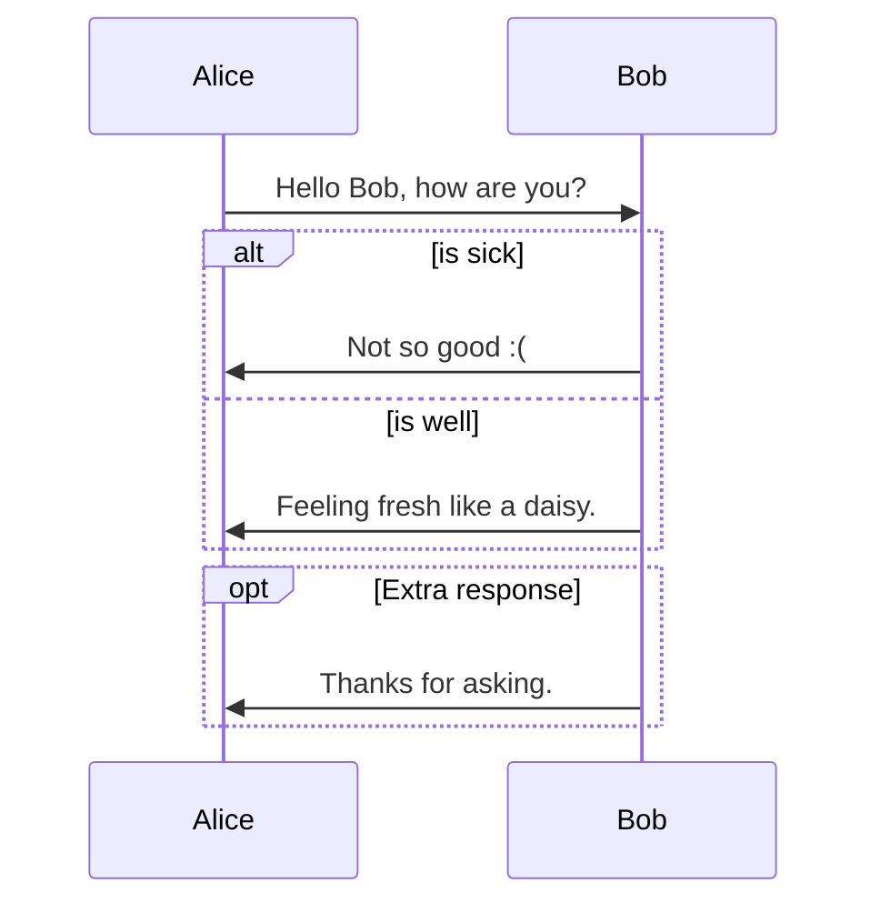
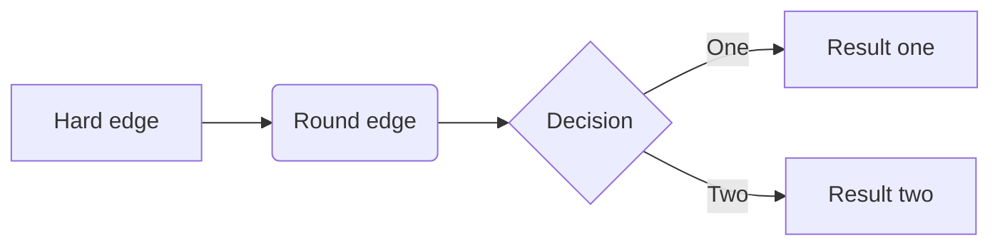

### Test

```mermaid
%% Example of sequence diagram
sequenceDiagram
Alice ->> Bob: Hello Bob, how are you?
alt is sick
Bob ->> Alice: Not so good :(
else is well
Bob ->> Alice: Feeling fresh like a daisy.
end
opt Extra response
Bob ->> Alice: Thanks for asking.
end
```

---

```mermaid
graph LR
A[Hard edge] --> B(Round edge)
B --> C{Decision}
C --> |One| D[Result one]
C --> |Two| E[Result two]
```

<iframe src="testHTML1.html" height=600></iframe>

