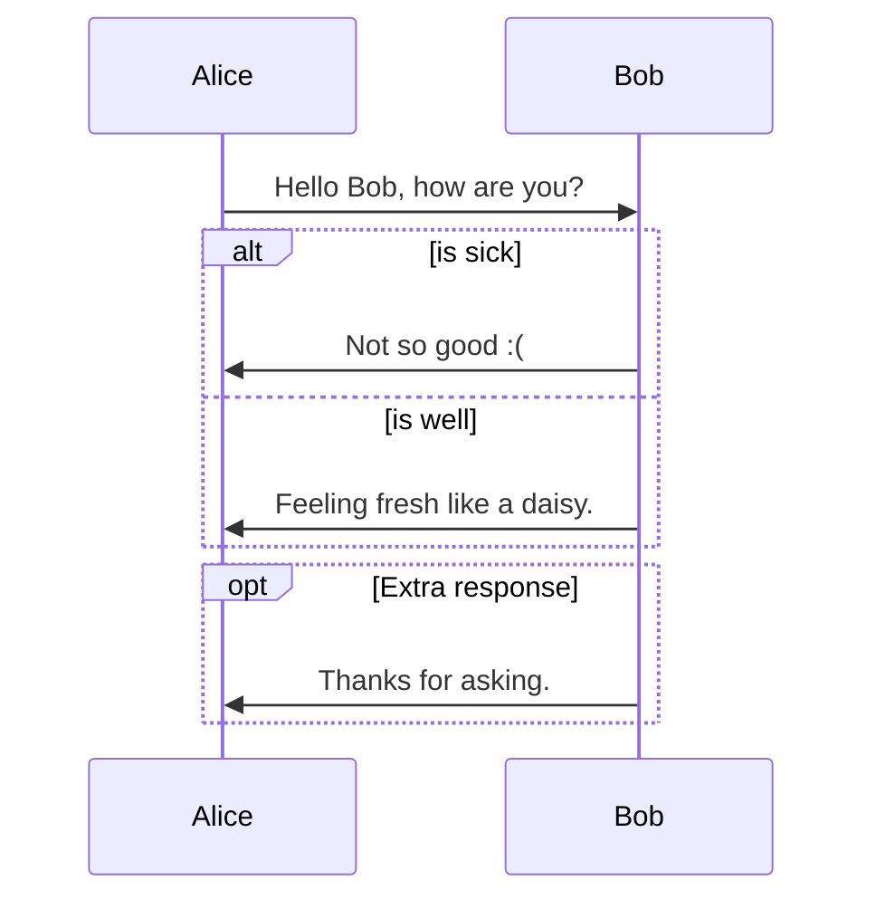
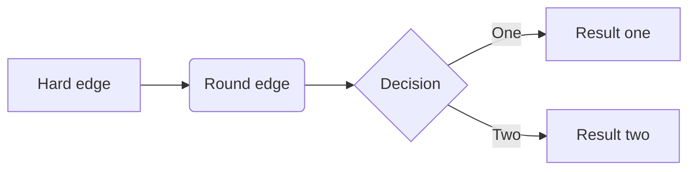
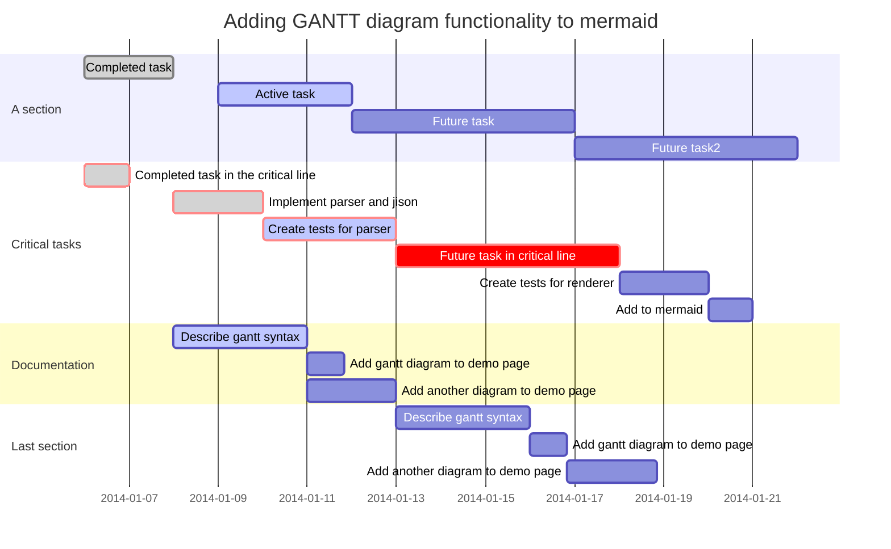
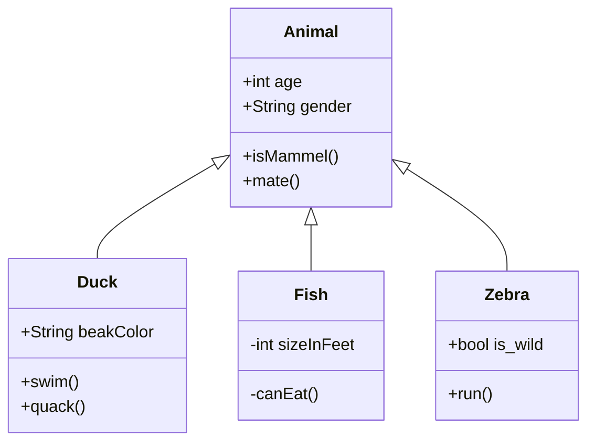
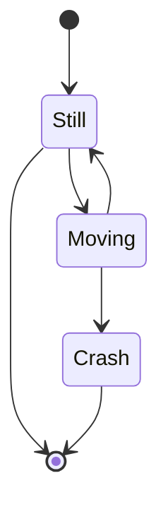
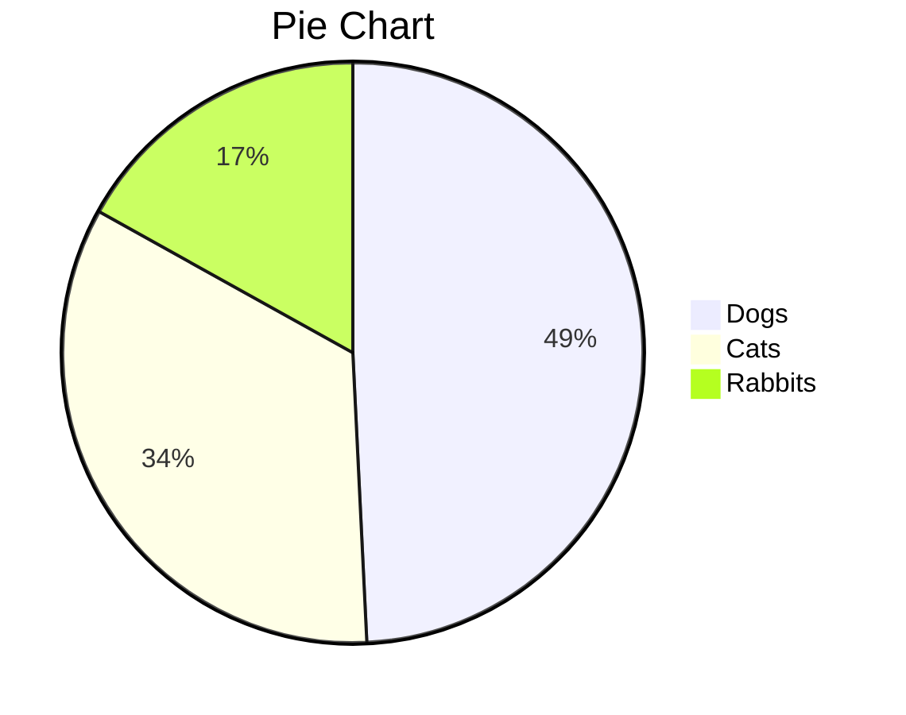
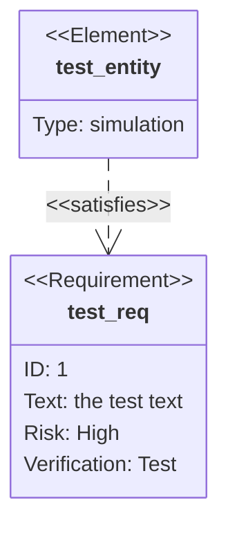
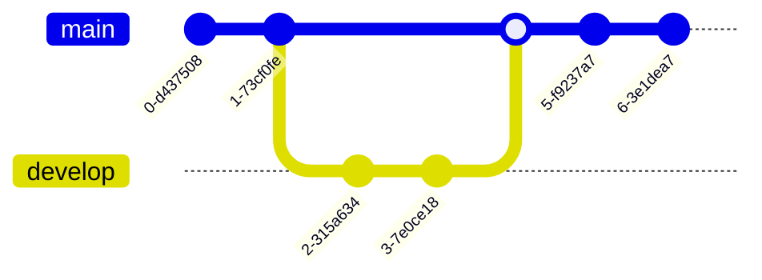

<h1 align="center">Typora</h1>


# 1	Draw Graphs

## 1.1	Sequence

### 1.1.1	Example 1

```sequence
Title: Here is a title
A -> B: Normal line
B --> C: Dashed line
C ->> D: Open arrow
D -->> A: Dased open arrow
```

### 1.1.2	Example 2

```sequence
# Exmample of a comment (can't be in the same line of codes)
# By listing the participants,
# you can change their order.
participant A
participant B
participant C
participant D

Note left of A: Note to the \n left of A.
Note right of D: Note to the \n right of D.
# Lower case is ok.
note over B: Note over B.
# Upper case is ok.
NOTE OVER B, D: Note over both B and D.
```

### 1.1.3	Sequence Syntax


### 1.1.4	Switch Style

To swich to hand-writing style, go to CSS file and add:

```css
:root {
    --sequence-theme: hand
}
/*
The default setting is "simple".
*/
```


## 1.2	Flowcharts

### 1.2.1	Demo 0

<font color=red>注: 箭头两侧不要加空格!!!</font>

```flow
st=>start: Start
op=>operation: Your Operation
cond=>condition: Yes or No?
e=>end

st->op->cond
cond(yes)->e
cond(no)->op
```

### 1.2.2	Demo 1

```flow
st=>start: Start:>http://www.google.com[blank]
e=>end:>http://www.google.com
op1=>operation: My Operation
sub1=>subroutine: My Subroutine
cond=>condition: Yes
or No?:>http://www.google.com
io=>inputoutput: catch something...
para=>parallel: parallel tasks

st->op1->cond
cond(yes)->io->e
cond(no)->para
para(path1, bottom)->sub1(right)->op1
para(path2, top)->op1
```

### 1.2.3	Demo 2

```flow
st=>start: Start|past:>http://www.google.com[blank]
e=>end: End|future:>http://www.google.com
op1=>operation: My Operation|past
op2=>operation: Stuff|current
sub1=>subroutine: My Subroutine|invalid
cond=>condition: Yes
or No?|approved:>http://www.google.com
c2=>condition: Good idea|rejected
io=>inputoutput: catch something...|future

st->op1(right)->cond
cond(yes, right)->c2
cond(no)->sub1(left)->op1
c2(yes)->io->e
c2(no)->op2->e
```

### 1.2.4	Demo 3

```flow
st=>start: Improve your
l10n process!
e=>end: Continue to have fun!:>https://youtu.be/YQryHo1iHb8[blank]
op1=>operation: Go to locize.com:>https://locize.com[blank]
sub1=>subroutine: Read the awesomeness
cond(align-next=no)=>condition: Interested to
getting started?
io=>inputoutput: Register:>https://www.locize.app/register[blank]
sub2=>subroutine: Read about improving
your localization workflow
or another source:>https://medium.com/@adrai/8-signs-you-should-improve-your-localization-process-3dc075d53998[blank]
op2=>operation: Login:>https://www.locize.app/login[blank]
cond2=>condition: valid password?
cond3=>condition: reset password?
op3=>operation: send email
sub3=>subroutine: Create a demo project
sub4=>subroutine: Start your real project
io2=>inputoutput: Subscribe

st->op1->sub1->cond
cond(yes)->io->op2->cond2
cond2(no)->cond3
cond3(no,bottom)->op2
cond3(yes)->op3
op3(right)->op2
cond2(yes)->sub3
sub3->sub4->io2->e
cond(no)->sub2(right)->op1

st@>op1({"stroke":"Red"})@>sub1({"stroke":"Red"})@>cond({"stroke":"Red"})@>io({"stroke":"Red"})@>op2({"stroke":"Red"})@>cond2({"stroke":"Red"})@>sub3({"stroke":"Red"})@>sub4({"stroke":"Red"})@>io2({"stroke":"Red"})@>e({"stroke":"Red","stroke-width":6,"arrow-end":"classic-wide-long"})
```

### 1.2.5	Demo 4

```flow
st=>start: Need something to be translated!:>https://www.localistars.com[blank]
e=>end: Be happy!:>https://youtu.be/e6Ede8hdU8c
cond=>condition: Are you a client
or a translator?
subc=>subroutine: Why should you choose a localistar?:>https://www.localistars.com/for-clients.html
subt=>subroutine: Why should you become a localistar?:>https://www.localistars.com/for-translators.html
op=>operation: Check out how it works!:>https://www.localistars.com/how-it-works.html
io=>inputoutput: Work together with your partner!:>https://www.localistars.app/login

st->cond
cond(no@client)->subc->op->io->e
cond(yes@translator)->subt->op->io->e
```


## 1.3	Mermaid

### 1.3.1	Sequence



### 1.3.2	Flowcharts



### 1.3.3	Gantt Charts



### 1.3.4	Class Diagrams



### 1.3.5	State Diagrams



### 1.3.6	Pie Charts



### 1.3.7	Requirement Diagram



### 1.3.8	Gitgraph Diagrams



### 1.3.9	Mermaid Settings

#### 1	Mermaid Options

You can change Mermaid options by adding Custom CSS, supported options include:

```css
:root {
    --mermaid-theme: default; /*or base, dark, forest, neutral, night */
    --mermaid-font-family: "trebuchet ms", verdana, arial, sans-serif;
    --mermaid-sequence-numbers: off; /* or "on", see https://mermaid-js.github.io/mermaid/#/sequenceDiagram?id=sequencenumbers*/
    --mermaid-flowchart-curve: linear /* or "basis", see https://github.com/typora/typora-issues/issues/1632*/;
    --mermaid--gantt-left-padding: 75; /* see https://github.com/typora/typora-issues/issues/1665*/
}
```

#### 2	Mermaid Theme


```CSS
:root {
    --mermaid-sequence-numbers: on;		/* Auto numbering */
    --mermaid-flowchart-curve: basis;	/* get other type of curves, such as "linear", "basis", "natural", "step" */
    --mermaid-gantt-left-padding: 75;	/* Gantt padding. or 200 if you like. */
}
```

#### 3	Auto Numbering


#### 4	Flowchart Curve


#### 5	Gantt Pading


#### 6	Inline Mermaid Config


## References

[Draw Diagrams With Markdown - Typora Support (typoraio.cn)](https://support.typoraio.cn/Draw-Diagrams-With-Markdown/)

[Mermaid Official Documentation](https://mermaid-js.github.io/mermaid/#/)

[Typora Mermaid Usage - CSDN (blog.csdn.net)](https://blog.csdn.net/sinat_29047129/article/details/104061103)


