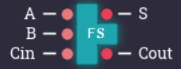
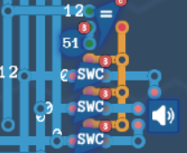

<h1 align="center">计算机搭建</h1>

$$
% 设置
\renewcommand{\d}{\displaystyle}
\newcommand{\aneg}[1]{\hspace{-0.75em}&#1&\hspace{-0.75em}\d}
\newcommand{\aneq}{\aneg{=}}
% 上述指令用于在使用 array 环境时调整等号左右间距
\newcommand{\noeq}{&\hspace{1.3em}}
% 上述指令用于 align 环境中, 类似与 &= 但不显示等号.

% 字符
\renewcommand{\i}{\mathrm{i}}
\renewcommand{\j}{\mathrm{j}}
\renewcommand{\k}{\mathrm{k}}
\newcommand{\e}{\mathrm{e}}
\newcommand{\o}{\mathrm{o}}
\newcommand{\ve}{\varepsilon}
\newcommand{\Beta}{\mathrm{B}}
\newcommand{\omicron}{\mathit{o}}
\newcommand{\Omicron}{\mathrm{O}}

% 简写与重定义
\newcommand{\bm}[1]{\boldsymbol{#1}}
\renewcommand{\cal}[1]{\mathcal{#1}}
\renewcommand{\scr}[1]{\mathscr{#1}}
\renewcommand{\frak}[1]{\mathfrak{#1}}
\renewcommand{\rm}[1]{\mathrm{#1}}
\newcommand{\bb}[1]{\mathbb{#1}}

% 数集
\newcommand{\D}{\mathbb{D}}
\newcommand{\E}{\mathbb{E}}
\newcommand{\F}{\mathbb{F}}
\newcommand{\J}{\mathbb{J}}
\newcommand{\K}{\mathbb{K}}
\renewcommand{\L}{\mathbb{L}}

% 上下标
\newcommand{\trans}{^\mathrm{T}}
\newcommand{\inv}{^{-1}}
\newcommand{\madj}[1]{^{\pqty{#1^*}}}	% m 重伴随矩阵
\newcommand{\adj}{^*}
\newcommand{\vector}[1]{\overrightarrow{#1}}
\newcommand{\wavy}[1]{\overset\sim#1}	% \tilde 或 \widetilde 不明显, 容易与 \bar 或 \overline 混淆

% 序列
\newcommand{\ccdots}{\cdot\cdots\cdot}
\newcommand{\oneton}{1,2,\cdots,n}
\newcommand{\oneto}[1]{1,2,\cdots,#1}

\newcommand{\ssto}[3]{#1_1 #3 #1_2 #3 \cdots #3 #1_{#2}}
\newcommand{\ssup}[3]{#1^1 #3 #1^2 #3 \cdots #3 #1^{#2}}
\newcommand{\soneto}[2]{\ssto{#1}{#2}{,}}
\newcommand{\splus}[2]{\ssto{#1}{#2}{+}}

% 括号
\newcommand{\aqty}[1]{\expval{#1}}
\newcommand{\pbqty}[1]{\left(#1\right]}
\newcommand{\bpqty}[1]{\left[#1\right)}
\newcommand{\floor}[1]{\left\lfloor#1\right\rfloor}
\newcommand{\ceil}[1]{\left\lceil#1\right\rceil}

% 矩阵宏简写
\newcommand{\bmatrix}[1]{\begin{bmatrix}#1\end{bmatrix}}
\newcommand{\Bmatrix}[1]{\begin{Bmatrix}#1\end{Bmatrix}}
\newcommand{\vmatrix}[1]{\begin{vmatrix}#1\end{vmatrix}}
\newcommand{\Vmatrix}[1]{\begin{Vmatrix}#1\end{Vmatrix}}

% 常用微分
\newcommand{\dx}{\dd{x}}
\newcommand{\dy}{\dd{y}}
\newcommand{\dz}{\dd{z}}
\newcommand{\dt}{\dd{t}}
\newcommand{\ds}{\dd{s}}
\newcommand{\dr}{\dd{r}}

% 一般的微分
% 如果只使用 \dd{x}\dd{y} 的话, 中间会有多余的间隔.
\newcommand{\df}{\dd}
\newcommand{\ddf}[2]{\,\mathrm{d}#1\mathrm{d}#2}	% 微分形式 differential form
\newcommand{\dddf}[3]{\,\mathrm{d}#1\mathrm{d}#2\mathrm{d}#3}

% 高阶微分
\newcommand{\dxdy}{\ddf{x}{y}}
\newcommand{\dydz}{\ddf{y}{z}}
\newcommand{\dzdx}{\ddf{z}{x}}
\newcommand{\dudv}{\ddf{u}{v}}
\newcommand{\drdt}{\ddf{r}{\theta}}
\newcommand{\dxdydz}{\dddf{x}{y}{z}}

% 矩阵的宏指令
\newcommand{\pmcmn}[3]{\begin{pmatrix}
	#1_{11} & #1_{12} & \cdots & #1_{1#3} \\
	#1_{21} & #1_{22} & \cdots & #1_{n#3} \\
	\vdots & \vdots && \vdots \\
	#1_{#2 1} & #1_{#2 2} & \cdots & #2_{n#3} \\
\end{pmatrix}}

\newcommand{\pmc}[1]{\pmcmn{#1}{n}{n}}
\newcommand{\pvcn}[2]{\begin{pmatrix}
	#1_1 \\ #1_2 \\ \vdots \\ #1_{#2}
\end{pmatrix}}

\newcommand{\pvc}[1]{\pvcn{#1}{n}}
\newcommand{\pto}{\overset{P}{\to}}

% 函数名
\renewcommand{\char}{\operatorname{char}}	% 由于已存在此命令, 不可使用 DeclareMathOperator
\renewcommand{\r}{\operatorname{r}}
\DeclareMathOperator{\st}{s.t.\,}	% 虽然不是函数名, 但用了这个指令就放这儿了.
\DeclareMathOperator{\diag}{diag}	% 不需要定义太多, 一个文件里用到什么定义什么,
\DeclareMathOperator{\Ker}{Ker}		% 毕竟特殊的函数名太多太多了.
\DeclareMathOperator{\Aut}{Aut}		% 便捷与效率的权衡.
\DeclareMathOperator{\Inn}{Inn}
\DeclareMathOperator{\GL}{GL}
\DeclareMathOperator{\SL}{SL}
\DeclareMathOperator{\stab}{stab}
\DeclareMathOperator{\orb}{orb}
\DeclareMathOperator{\lcm}{lcm}
\DeclareMathOperator{\Var}{Var}
\DeclareMathOperator{\Cov}{Cov}
\DeclareMathOperator{\Corr}{Corr}
\DeclareMathOperator{\rot}{rot}
\DeclareMathOperator{\sgn}{sgn}
\DeclareMathOperator{\Outer}{Outer}
\DeclareMathOperator{\Even}{Even}
\DeclareMathOperator{\Scalar}{Scalar}
\DeclareMathOperator{\Vector}{Vector}
\DeclareMathOperator{\arsh}{arsh}
\DeclareMathOperator{\arch}{arch}
\DeclareMathOperator{\arth}{arth}
\renewcommand{\Re}{\operatorname{Re}}	% 自带 \Re 的效果是 \mathrm{Re}, 前后无空格, 故重写
\renewcommand{\Im}{\operatorname{Im}}
\DeclareMathOperator{\Sa}{Sa}
\DeclareMathOperator{\Si}{Si}
\DeclareMathOperator{\avg}{avg}

% 运算符
% 可以用 \bigcap, \bigcup, \bigoplus, \bigotimes 替代
\newcommand{\capop}{\displaystyle\mathop\cap\limits}
\newcommand{\cupop}{\displaystyle\mathop\cup\limits}
\newcommand{\oplusop}{\mathop\oplus\limits}
\newcommand{\otimesop}{\mathop\otimes\limits}
\newcommand{\bigoplusop}{\mathop\bigoplus\limits}
\newcommand{\bigotimesop}{\mathop\bigotimes\limits}

% 积分
\newcommand{\dint}{\displaystyle\int}
\newcommand{\inti}{\dint_{-\infty}^{+\infty}}
\newcommand{\intoi}{\dint_0^{+\infty}}

\newcommand{\intl}{\displaystyle\int\limits}
\newcommand{\iintl}{\displaystyle\iint\limits}
\newcommand{\iiintl}{\displaystyle\iiint\limits}

\newcommand{\coiint}[1]{\d{\oiint\hspace{-1em}}_{#1}\;}
\newcommand{\coiiint}[1]{\d{\oiiint\hspace{-0.9em}}_{#1}\;}

% 求和
\newcommand{\dsum}{\displaystyle\sum}
\newcommand{\csum}[1]{\dsum_{#1=1}^\infty}
\newcommand{\nsum}{\csum{n}}
\newcommand{\ksum}{\csum{k}}
\newcommand{\nosum}{\dsum_{n=0}^\infty}
\newcommand{\insum}{\dsum_{i=1}^n}
\newcommand{\knsum}{\dsum_{k=1}^n}
\newcommand{\csuminf}[1]{\dsum_{#1=-\infty}^{+\infty}}
\newcommand{\nsuminf}{\csuminf{n}}

% 求积
\newcommand{\dprod}{\displaystyle\prod}
\newcommand{\nprod}{\dprod_{n=1}^\infty}
\newcommand{\noprod}{\dprod_{n=0}^\infty}
\newcommand{\inprod}{\dprod_{i=1}^n}

% 极限
\newcommand{\liml}{\lim\limits}
\newcommand{\ulim}{\overline\lim\limits_{n\to\infty}}
\newcommand{\dlim}{\underline\lim\limits_{n\to\infty}}
% 注意这里的 d 是 down, 而不是 displaystyle

\newcommand{\xlim}{\lim\limits_{x\to x_0}}
\newcommand{\nlim}{\lim\limits_{n\to\infty}}
\newcommand{\clim}[1]{\lim\limits_{#1\to\infty}}

% 并集
\newcommand{\incup}{\bigcup_{i=1}^n}
\newcommand{\ncup}{\bigcup_{n=1}^\infty}
\newcommand{\icup}{\bigcup_{i=1}^\infty}

% 交集
\newcommand{\incap}{\bigcap_{i=1}^n}
\newcommand{\ncap}{\bigcap_{n=1}^\infty}
\newcommand{\icap}{\bigcap_{i=1}^\infty}

% 差分
\newcommand{\DD}{\Delta}
\newcommand{\DV}[2]{\dfrac{\DD#1}{\DD#2}}
\newcommand{\nDV}[3]{\dfrac{\DD^{#1}#2}{\DD#3^{#1}}}

% 求导
\newcommand{\ddv}{\displaystyle\dv}
\newcommand{\dpdv}{\displaystyle\pdv}

% 最值 (返回参数); 暂时先这么凑合着用吧
\newcommand{\argmax}[1]{\underset{#1}{\operatorname{argmax}}}
\newcommand{\argmin}[1]{\underset{#1}{\operatorname{argmin}}}

% 缩写
\newcommand{\LRA}{\Leftrightarrow}
\newcommand{\RLA}{\Leftrightarrow}
\newcommand{\LA}{\Leftarrow}
\newcommand{\RA}{\Rightarrow}

\newcommand{\lra}{\leftrightarrow}
\newcommand{\rla}{\leftrightarrow}
\newcommand{\la}{\leftarrow}
\newcommand{\ra}{\rightarrow}

\newcommand{\QRLA}{\quad\RLA\quad}
\newcommand{\QRA}{\quad\RA\quad}
\newcommand{\LLRA}{\Longleftrightarrow}

\newcommand{\QNRA}{\quad\nRightarrow\quad}
\newcommand{\qnra}{\quad\nrightarrow\quad}

\newcommand{\wt}{\widetilde}

% 图形符号
\newcommand{\qed}{\quad\square}
\renewcommand{\parallel}{\mathrel{/\mskip-2.5mu/}}
\newcommand{\paralleleq}{\hspace{0.5em}{^{^{\parallel}}}\hspace{-1.04em}=}
\newcommand{\rt}{\matrm{Rt}\triangle}

% 分块矩阵
\newenvironment{mat}[1]{
	\begin{array}{#1}
}{
	\end{array}
}

\newenvironment{pmat}[1]{
	\left( \begin{array}{#1}
}{
	\end{array} \right)
}

\newenvironment{bmat}[1]{
	\left[ \begin{array}{#1}
}{
	\end{array} \right]
}

\newenvironment{Bmat}[1]{
	\left\{ \begin{array}{#1}
}{
	\end{array} \right\}
}

\newenvironment{vmat}[1]{
	\left\lvert \begin{array}{#1}
}{
	\end{array} \right\rvert
}

\newenvironment{Vmat}[1]{
	\left\lVert \begin{array}{#1}
}{
	\end{array} \right\rVert
}

% 积分变换
\newcommand{\ft}{\overset{\cal F}{\rla}}
\newcommand{\lt}{\overset{\cal L}{\rla}}
\newcommand{\bt}{\overset{\cal B}{\rla}}
\newcommand{\zt}{\overset{\cal Z}{\rla}}
\newcommand{\bzt}{\overset{\cal Z_B}{\rla}}
\newcommand{\lzt}{\overset{\cal Z_L}{\rla}}
\newcommand{\rzt}{\overset{\cal Z_R}{\rla}}
$$

[TOC]

## 0  前言

图灵完备（Turing Complete）这款游戏通过主线关卡的任务，引导玩家从逻辑门开始搭建电路，最终搭建出两种架构的可运行计算机，用自己设置的汇编代码实现条件语句、循环语句与函数，并在此基础上完成简单的编程。

这款游戏涉及到的知识有数字电路、计算机组成原理与汇编语言，不过即使没有这些前置知识也是可以玩的，因为游戏会提供知识卡片，较难的关卡也会有所提示。恰好这学期学了数字电路，便去买了这款游戏玩，感觉十分有趣，收获也颇丰。

我不打算展示每一关的解法，网上已经有人做了详细的攻略；在这里，我只想介绍一下使用到的元件、最终搭建的计算机及其汇编语言。一方面这是对游戏总结与知识的回顾，另一方面这份笔记或者说报告也算是一个知识的备忘录。

没有学过计算机组成原理，从零开始搭建的电路也没有系统性地预先设计，所以许多地方可能显得比较笨拙。不过我想，作为第一次尝试已经足够了——让我这个电脑小白了解到了许多知识，也在探索的过程中享受到了游戏的乐趣。


## 1  使用到的元件

### 1.1  常用逻辑电路

#### 1.1.1  基本元件

<h5>1  逻辑门</h5>

基本逻辑门有与门（And Gate）、或门（Or Gate）、非门（Not Gate）、与非门（Nand Gate）、或非门（Nor Gate）、异或门（XOR Gate）、同或门（XNOR Gate），其中由与非门或者或非门均可构造出所有其他的逻辑门。
$$
\xymatrix{
	AB
	\ar@{<->}[r]^-{输入取反}
	\ar@{<->}[d]_-{输出取反}
	\ar@{<.>}[dr]_<<<<<{对偶}
	&
	\overline{A + B}
	\ar@{<->}[d]^-{输出取反}
	\\
	\overline{AB}
	\ar@{<->}[r]_-{输入取反}
	\ar@{<.>}[ur]_>>>>{对偶}
	&
	A + B
} \hspace{3em} \xymatrix{
	A \oplus B = A \cdot \overline{B} + \overline{A} \cdot B
	\ar@/^/@{<->}[d]^{对偶}
	\ar@/_/@{<->}[d]_{反演}
	\\
	A \odot B = A \cdot B + \overline A \cdot \overline B
}
$$
在实现逻辑门功能的元件中，目前应用最广泛的是 TTL 电路（Transistor-Transistor Logic）与 CMOS 电路（Complementary Metal-Oxide Semiconductor，），其中 TTL 电路的输入引脚悬空则相当于高电平，而CMOS 电路的输入引脚悬空则相当于高阻态。

TTL 电路由双极性三体管组成，CMOS 电路由绝缘场效应管组成，它们都易于制造出 n 位与非门或 n 位或非门，并且一般来说，与非门的性能比或非门更好（速度更快），因此工程实践中一般将逻辑表达式化为最简与非式。

图灵完备这款游戏则采用了另一种做法，将 2 位与门、2 位或门、非门、2 位与非门、2 位或非门视为最基础的逻辑门，它们的延迟都记作 2；异或门、同或门由它们组成，故延迟为 6；3 位的与门、或门、与非门、或非门均由 2 位的逻辑门组成，延迟为 4。这样会导致一些功能的最简电路与 TTL 或 CMOS 电路的实现方案略有差异。


<h5>2  三态门</h5>

三态门（TSL，Three State Logic）又称为三态缓冲器，在这款游戏中则称为开关。当选通输入端为高电平时，输出等于输入；当选通输入端为低电平时，输出始终为高阻态。


一般来说，两个输出端不能直接相连，否则当输出不同时便会发生短路而烧毁电路。而使用三态门则可以避免这个问题，只需要保证输出端相连的三态门在每个时刻至多只有一个选通。利用这个性质可以实现数据选择器的功能，并且由于输入数量的任意性，由三态门组成的选择器一般比普通逻辑门组成的选择器的元件利用率要高。<u>因此三态门在总线传输中应用十分广泛。</u>

在上一小节中提到了逻辑门的延迟，理论上有延迟就有可能存在竞争与冒险现象。不过这款游戏做了简化，延迟量仅作为衡量电路的指标，而不会产生任何实际的影响，实际上所有门电路都可视为在一瞬间导通。当然在现实生活中，如果需要用三态门组成选择器，则需要考虑这一点，否则不仅可能产生毛刺现象，严重时还可能烧毁电路。


<h5>3  延时器</h5>

上一小节中说到，该游戏中逻辑门的延迟不会产生任何实际的影响，这也就意味着该游戏并没有做类似 Multisim 或 ModelSim 等软件的仿真，而只在电路发生变化或时钟脉冲到来时，才会更新所有电路的状态。并且更新电路时依据的不是上一个元件的状态，而需要追根溯源到最初的输入端。

这也就意味着，输出端不能连至自身的输入端，即循环依赖，否则理论上程序将陷入死循环。因此当出现循环依赖时，游戏便会报错且禁止运行，甚至无法保存该电路。不过游戏还是用其他方式支持了一类特殊的[循环依赖（白名单）](# 1  循环依赖白名单)，即或非门锁存器、与非门锁存器、与或锁存器，由此可以构造出一些[电平触发器](# 2  电平触发器).

即使如此，大部分触发器与时序逻辑电路仍然无法实现，因为涉及到其他类型的循环依赖。为了弥补这一点，游戏提供了一位延时器，即对于每一个时刻，延时器都会输出前一时刻的输入。因此在更新电路状态时，向前追溯到延时器的输出便可以停止了，从而将其输出连至自身输入时不会产生循环依赖。由此可以构造[边沿触发器](# 3  边沿触发器).


#### 1.1.2  电平触发

<h5>1  循环依赖白名单</h5>

该游戏的方形输入引脚表示通过延时器连至输出端，而圆形引脚表示不通过延时器。对于不包含延时器的电路，循环依赖会导致程序出现死循环，不过特殊的，游戏考虑并支持了以下三种循环依赖：

| 循环依赖白名单 |                        逻辑电路与说明                        |
| :------------: | :----------------------------------------------------------: |
|  或非门锁存器  |  |
|  与非门锁存器  |  |
|   与或锁存器   |  |


<h5>2  可实现的触发器</h5>

与非门锁存器即基本 RS 触发器，理论上可以与 D 触发器、JK 触发器、T 触发器相互转换。于是我们可以做出同步 RS 触发器、主从 RS 触发器与同步 D 触发器，如下表所示。

| 可实现的触发器 |                           逻辑电路                           |                            引脚图                            |
| :------------: | :----------------------------------------------------------: | :----------------------------------------------------------: |
|   同步 RSFF    |  |  |
|   主从 RSFF    |  |  |
|    同步 DFF    |  |  |


<h5>3  不可实现触发器</h5>

尽管如此，大部分触发器我们仍然无法实现（如下表所示），因为会涉及到上述锁存器之外的循环依赖，如边沿 D 触发器、同步 JK 触发器、主从 JK 触发器等。

| 不允许的触发器 |                           逻辑电路                           |
| :------------: | :----------------------------------------------------------: |
|      JKFF      |  |
|      TFF       |  |


#### 1.1.3  边沿触发

实际上，单个延时器的功能相当于边沿 D 触发器，其 CP 端始终连至全局的可调频率时钟脉冲。而 D 触发器可构造出 RS 触发器、JK 触发器、T 触发器，如下表所示：

| 边沿触发器 |                          逻辑电路图                          |                            引脚图                            |
| :--------: | :----------------------------------------------------------: | :----------------------------------------------------------: |
|  边沿 DFF  |  |  |
| 边沿 RSFF  |  |  |
| 边沿 JKFF  |  |  |
|  边沿 TFF  |  |  |
| 边沿 T'FF  |  |  |

需要注意的是，测试上述电路时，改变测试的输入信号后，一般要等待两个时刻才能传到输出，这是因为改变测试用的输入信号时不会立即影响延时器，而需等待一个时刻才能写入延时器，再过一个时刻才能输出。而在实际应用时，改变的输入则会立即写入延时器，因此可以实现边沿触发器的功能。

用上述边沿触发器只能搭建同步时序逻辑电路，不过这对于我们的计算机来说已经足够了——我们只需要实现数码寄存器、同步计数器、栈和脉冲发生器。理论上可以通过改变延时器的延时量，从而实现 2n 分频器。


#### 1.1.4  组合电路

<h5>1  译码器</h5>

在计算机硬件中，译码器最主要的应用是指令译码与寄存器寻址。

<h6>1.1  一位译码器</h6>


<h6>1.2  三位译码器</h6>

可利用一位译码器构成三位译码器，这里直接使用非门搭建。


<h6>1.3  六位译码器</h6>

这里利用三位译码器和八位开关实现六位译码器。相比于最简与非式电路，这样做增加了 2 延时，但是需要的逻辑门数量大大减少。


<h6>1.4  八位译码器</h6>

同理，为了简化电路，这里直接使用六位译码器和六十四位开关进行设计。


<h5>2  选择器</h5>

在计算机硬件中，选择器最主要的应用是实现存储器的读取操作。

<h6>1  一位选择器</h6>

使用开关比与非门更简：


<h6>2  三位选择器</h6>

这里利用译码器与开关实现三位选择器：


<h6>3  四位选择器</h6>

这里利用一位选择器和三位选择器实现四位选择器：


八位选择器类似可得（使用选择器或译码器），由于电路庞大，这里不再列出。


<h5>3  比较器</h5>

在计算机硬件中，比较器最主要的应用是实现程序跳转的判断。

<h6>3.1  判等器电路</h6>

为清晰起见，这里先给出 Verilog 代码：

```verilog
module if_eq(A, B, Y);
    input[7:0] A, B;
    output Y;
    
    assign Y = &(A ^ ~B);
endmodule
```

电路如下图所示：


<h6>3.2  无符号小于</h6>


<h6>3.3  有符号小于</h6>


有符号数的最高位即符号位，它不表示后七位是否乘上 -1，而表示是否加上 -128，如 `1111_1111` 表示 -1 而非 -127，这样做看似为负数的表示带来了困难，但实际上 -1 与该二进制数表示的无符号数 255 属于同一个模 256 等价类，这样做不仅便于理解与制造取反器、减法器、除法器等电路，还可以简化有符号小于的逻辑表达式。如果使用乘上 -1 的表示法，则电路图如下：


### 1.2  算术运算电路

#### 1.2.1  串行并行加法器

加法器有着诸多的应用，如实现计数器、乘法器、除法器等等。

<h5>1  全加器电路</h5>


<h5>2  串行加法器</h5>


<h5>3  并行加法器</h5>

由两片 4 位超前进位并行加法器串联可以实现一字节的加法器：


#### 1.2.2  取反器与减法器

<h5>1  一位全减器</h5>

全减器的设计与全减器是类似的。为了清晰起见，先给出 Verilog 代码

```verilog
module FS(A, B, Cin, S, Cout);
    input A, B, Cin;
    output S, Cout;
    wire temp;
    
    assign temp = B ^ Cin;
    assign S = A ^ temp;
    assign Cout = (~A & temp) | (B & Cin);
    // 优先级由高到低: ~ & |, 因此括号是不必要的;
endmodule
```

引脚图及电路图如下图所示：




<h5>2  八位取反器</h5>

易知取反加以记为负数。


<h5>3  八位减法器</h5>

由 $ A - B = A + (-B) $ 即得：


#### 1.2.3  移位器与乘法器

<h5>1  任意移位器</h5>

最直接的思路是罗列所有的情况后，使用开关选取输出（即八选一选择器）。


<h5>2  移位器另解</h5>

另一种思路是根据每一位的权重进行移位，这种思路将逻辑门的开支从 83 降到了 51，但是延时量从 8 增加到了 12。


<h5>3  四位乘法器</h5>

利用通用移位器与加法器可以简单地实现乘法器，不过元件利用率较低。


#### 1.2.4  加减器与除法器

<h5>1  除法器的思路</h5>

计算除法最简单的思路是用被除数反复减去除数，直到被除数小于除数为止，留下的便是余数，减去的次数即位商数。按照这个思路，如果要求在一个时钟脉冲内完成，则需要大量的逻辑门并且延时高；如果使用多个时钟脉冲，则需要大量的时钟刻。无论如何，运算速度很慢，并且对于不同的数据，运算时间差异较大。

另一种思路是使用并行的除法器，即后面两节中将要介绍的，在一个时钟脉冲内完成计算。虽然只需要一个时钟脉冲，但是电路庞大，一字节的除法器便需要上千个逻辑门，延时量也高达上百，无论是逻辑门数量，还是延时量，都与一个简易的 8 位计算机差不多了。

第一类思路主要是从软件（程序）上实现的，优化的思路是使用二分法；第二类思路主要是从硬件上实现的，优化的思路是并行改为串行；还有一类折中的思路，用若干时钟脉冲和较低的延时量实现除法器，这里不做介绍。


<h5>2  可控加减法器</h5>

为了实现不恢复余数的除法器，需要使用到可控加减法器，引脚图、电路图与电路说明如图所示：


自定义元件的引脚与形状是根据内部电路图自动生成的，这就是我如上排版的原因。为了使得下一小节的电路图看着更简便、更紧凑，我修改了很多遍可控加减法器的电路布局及其引脚分配，最终得到了下一小节中除法器的电路图，看着还是很舒服的。


<h5>3  一字节除法器</h5>

以无符号的八位并行除法器为例，电路图如下图所示：


其中加减法电路仍为串行，因此可以使用并行加减法电路进一步降低延时量。


### 1.3  时序逻辑电路

#### 1.3.1  数码寄存器

<h5>1  八位寄存器</h5>

延时器及 D 触发器，由 D 触发器可实现数码寄存器：


对于八位的情况，分别存储每一位即可：


<h5>2  改进寄存器</h5>

在八位寄存器的基础上，可增加始终读取端以方便使用，如下图所示：


<h5>3  存储四字节</h5>

思路一：始终读取数据，使用选择器选出需要的数据。这种思路虽然可以压缩空间，但是对于始终读取数据并不是一个好主意。如果将存储数据的不是寄存器，而是外部的输入输出，那么我们将无法延迟读取数据。


思路二：注意到寄存器在不读取数据时，输出为高阻态，于是可以只在输入端使用开关。这个思路虽然比思路一多用了一个逻辑门，但是可以进一步压缩空间，而且并非始终读取数据，通用性更强。


#### 1.3.2  加法计数器

<h5>1  用加法器搭建计数器</h5>

最简单的思路是用寄存器、加法器和数据选择器实现计数器及其置数功能：


<h5>2  用触发器搭建计数器</h5>

可用 JK 触发器实现四位二进制计数器 74161，其中 JK 触发器由 D 触发器（即延时器）搭建。


<h5>3  串联芯片八位计数器</h5>

由两片四位二进制计数器 74161 级联，可得到八位二进制计数器：


相比于由寄存器、加法器和数据选择器搭建的方案，这样做的好处是逻辑门数量少、延时量低。


#### 1.3.3  脉冲发生器

脉冲发生器用于实现程序指令的顺序读取。这里以周期为 16 的 8 位输出脉冲发生器为例，用四位数据选择器和四位二进制加法计数器 74161 实现，电路如下图所示：


实际上，这就实现了 8 位操作系统位宽、4 位控制存储器地址的程序指令顺序读取。


#### 1.3.4  压栈与弹栈

为了实现栈，首先需要存储空间，这里直接使用 256 字节的随机存储器（RAM），利用加减计数器和延时器（D 触发器）实现。其中 RAM 可由数据选择器实现。


## 2  计算机的硬件

### 2.1  计算机

#### 2.1.1  计算机的介绍

在第一小节中，我将介绍一般的计算机的硬件结构。

<h5>1  计算机的体系</h5>

<h6>1.1  冯诺依曼结构</h6>

“计算机之父” 约翰·冯·诺依曼在 1945 年的报告《First Draft of a Report on the EDVAC》中提出了冯诺依曼体系结构，其基本原则是：

1. 采用二进制逻辑，以简化计算机的设计；
2. 程序存储执行，以提高存储容量与运算速度；
3. 计算机由五个部分组成：运算器、控制器、存储器、输入设备、输出设备。

其中程序分为指令和数据，统一存储在控制存储器中，使用的时候依次读取，或指定一次读取的程序中哪一部分是指令、哪一部分是数据。

<h6>1.2  哈佛结构</h6>

哈佛结构是在冯诺依曼结构的基础上，将程序中的指令和数据分开存储，使用的时候分别读取，其结构复杂，但是有利于提高存储器带宽、数据吞吐率和架构稳定性。

中央处理器（CPU，Central Processing Unit）由运算器、控制器和输入输出设备组成。冯诺依曼结构计算机主要由 CPU 和程序存储器组成，哈佛结构的计算机则分为 CPU、程序存储器和数据存储器。


<h5>2  计算机的功能</h5>

<h6>2.1  取出指令</h6>

取指（IF，Instruction Fetch）即将一条指令从主存储器取到指令寄存器的过程。

具体来说，以程序计数器（PC，Programmer Counter）的输出作为主存储器的地址读取数据，当一条指令被取出之后，程序计数器中的数值将根据指令字长度自动递增。

<h6>2.2  指令译码</h6>

指令译码（ID，Instruction Decode）即取出指令后，通过指令译码器对指令进行拆分和解释，识别指令类型和操作数。

<h6>2.3  执行指令</h6>

执行指令阶段（EX，Execute），通过算术逻辑等单元具体实现指令的功能。

<h6>2.4  访存取数</h6>

访存取数阶段（MEM，Memory），即访问存储器、取出地址中的具体数据。指令译码后得到操作数在主存中的地址，从主存中读取该操作数用于运算。部分指令不需要访问主存，则可以跳过该阶段。

<h6>2.5  结果写回</h6>

结果写回阶段（WB，Write Back），一般在执行指令、对数据运算之后，需要将运行的数据结果写回存储器，一般为 CPU 的内部存储器中，以便被后续的指令快速地读取；有些指令的运行结果则写入程序计数器，以控制程序的运行流程。


<h5>3  计算机的组成</h5>

<h6>3.1  控制器</h6>

一般来说，控制器由程序状态寄存器、系统状态寄存器、程序计数器、指令寄存器、指令译码器等组成。控制器主要完成取出指令、指令译码与结果写回的功能。

具体来说，由程序计数器提供地址，从控制存储器中取出指令，并进行译码，从而调用运算器，最后将运算器的结果写回存储器。若写回 CPU 内部寄存器，则可用于后续计算；若写回程序计数器中，则得以控制程序流程。

<h6>3.2  运算器</h6>

一般来说，运算器由算术逻辑单元、中间寄存器、运算累加器、描数字寄存器、B 寄存器等组成。运算器主要完成执行指令和访存取数的功能。

具体来说，根据指令译码结果，从 CPU 内部存储器（高速缓冲存储器）中取出操作数，并进行相应的算术逻辑运算，如与、或、非、异或、同或、加、减、乘、除、取余、移位等。

<h6>3.3  存储器</h6>

存储器可以根据地址存储或读入数据，有多种分类方式：

1. 按存储介质：半导体存储器、磁表面存储器（如磁盘、磁带）；
2. 按存取方式：随机存储器、顺序存储器、半顺序存储器；
3. 内容可变性：只读存储器（ROM）、随机读写存储器（RAM）；
4. 信息易失性：易失性存储器、非易失性存储器；
5. 系统中位置：内部存储器、外部存储器；
6. 系统中作用：主存储器、高速缓冲存储器、辅助存储器、控制存储器。

<h6>3.4  适配器</h6>

适配器可将输入的各种类型的数据转为二进制数据，将输出的二进制数据转为十进制、字符串、图象、声音等其他类型数据。


#### 2.1.2  计算机的设计

<h5>1  完整电路图</h5>


<h5>2  总体的介绍</h5>

<h6>2.1  系统总线</h6>

1. 上方的若干条横向蓝线为控制总线（CB，Control Bus），用于从控制单元传输程序指令；
2. 中间的若干条竖向蓝线为数据总线（DB，Data Bus），用于向计算单元传输存储数据。
3. 右侧的若干条竖向蓝线为地址总线（AB，Address Bus），用于在指定 RAM 中读写数据。

<h6>2.2  控制器</h6>

1. 左上角为程序计数器（PC，Program Counter）；
2. 中上侧为指令译码器（ID，Instruction Decoder）；

<h6>2.3  运算器</h6>

中间偏右蓝色总线包围的部分均为运算器，其中：

1. 左上角为逻辑运算单元（Logic Unit）；
2. 右上角为算术运算单元（Arithmetic Unit）；
3. 左下角位无符号数值判断单元（Unsigned Condition Unit）；
4. 右下角为有符号数值判断单元（Signed Condition Unit）；

<h6>2.4  存储器</h6>

最右侧一列为存储器，从上往下依次为：

1. 256 B 快速存储器；
2. 64 KB 快速存储器；
3. 64 KB 控制台存储器；
4. 两个 256 B 的栈。

<h6>2.5  适配器</h6>

1. 中下方的红色元件为一字节输入输出设备；
2. 左侧上方为关卡显示屏，提供游戏可视化信息，本质上不属于该计算机；
3. 左侧下方为控制台的显示屏，实时显示控制台存储器中的内容；
4. 右下角为声输出设备。


#### 2.1.3  计算机的性能

<h5>1  架构分析</h5>

1. 该计算机为冯诺依曼体系（即指令与数据位于同一个存储器中）、LEG 架构；
2. CPU 的字长为 32 位，其中前 8 位为操作码，后 24 位为地址码；
3. 数据总线宽度：16 位用于运算器从存储器中取数，8 位用于写回数据；

<h5>2  开支分析</h5>

1. 最大延时量：568，理论上最大延时量直接影响了 CPU 工作频率的上限；
2. 逻辑门数量：3302019，绝大部分来自快速随机存储器；
3. CPI：即执行一条指令所需的平均时钟周期数，这里严格为 1，不过有些功能（如函数的返回、一字节乘法）需要两条指令才能完成；

<h5>3  存储性能</h5>

1. 高速缓冲存储器容量：6 字节，可直接寻址，且向运算器传输数据只需一个时钟周期；
2. 内部存储器的总容量：128.75 KB，可直接寻址，但向运算器传输数据需要两个时钟周期；
3. 存储器带宽：存储器的位宽均为 8 位，因此带宽在数值上等于 CPU 频率；

<h5>4  其他说明</h5>

1. CPU 工作频率可直接在仿真时设置，因此在这里没有参考价值；
2. 吞吐量、利用率、响应时间、CPU 执行时间等参数不便计算，故略；
3. 目前只支持定点运算（加减乘除取余等），不支持浮点操作；

可见，目前该计算机十分简陋，性能并不好，在[第四节](# 4  计算机的改进)中我将讨论可能的改进方向。


### 2.2  控制器

#### 2.2.1  宽指令程序

<h5>1  逻辑电路</h5>


<h5>2  电路说明</h5>

上图中的 PROGRAM 元件的介绍见 [2.4.1  控制存储器](# 2.4.1  控制存储器)，这里只介绍其它部分：

1. 左侧中间的元件是为 64 位程序计数器（PC），其输出作为地址在控制存储器读取程序数据，每个时钟周期内取出指令与数据，并使地址加一，从而实现程序流程的顺序执行；
2. 如果只有程序计数器和 8 位字长的控制存储器，那么我们只能实现 8 位的 CPU。这里在此基础上，通过译码器和寄存器，在 $ 4n + 1, 4n + 2, 4n + 3\ (n \in \N) $ 时刻存储数据，在 $ 4n\ (n \in \N^+) $ 同时输出四个字节的数据，从而得到字长为 32 位的宽指令；
3. 上述电路图仅做原理性说明，实际是图中的控制存储器已经集成了宽指令的功能，只需要将程序计数器的步长设置为 4，便可以从控制存储器右上方的四个引脚直接得到宽指令；
4. 最后得到的宽指令中，第一个字节为操作码，用于指定运算的类型；后三个字节均为地址码，其中前两个地址码一般用于指定前两个操作数的寄存器地址，第三个地址码一般用于指定运算器输出结果写回的寄存器地址。


#### 2.2.2  指令译码器

<h5>1  操作码译码</h5>

<h6>1  逻辑电路图</h6>


<h6>1.2  总线的说明</h6>

1. 图中最上方的一条横向蓝线为操作码的总线，经分线器拆成八个一位数据；
2. 图中左上角操作码下方的三条数据线，分别位参数一、参数二和参数三的地址码；
3. 图中左下角的五条竖线位数据总线，左边三条分别是从寄存器中读出的参数一、参数二和参数三。

<h6>1.3  前两位操作码</h6>

操作码中最高的两位，即 `[7:6]`，表示立即数。

1. 若操作码的第 7 位为 0，则使用寄存器中的数据，否则为立即数模式，利用左上角的开关将参数一改为指令中相应的地址码。最后的数据输出到第四条数据总线中。
2. 操作码的第 6 位同理，最后的数据输出到第五条数据总线中。
3. 参数三一般不支持立即数模式。

<h6>1.4  后六位操作码</h6>

操作码的中间三位，即 `[5:3]`，表示运算的类型；后三位，即 `[2:0]`，表示具体的运算

1. 若中间三位为 000，则为逻辑运算单元，后三位的说明见 [2.3.1  逻辑运算单元](# 2.3.1  逻辑运算单元)；
2. 若中间三位为 001，则为算术运算单元，后三位的说明见 [2.3.2  算术运算单元](# 2.3.2  算术运算单元)；
3. 若中间三位为 100，则为无符号条件判断单元，后三位的说明见 [2.3.3  条件判断单元](# 2.3.3  条件判断单元)；
4. 若中间三位为 101，则为有符号条件判断单元，后三位的说明见 [2.3.3  条件判断单元](# 2.3.3  条件判断单元)；
5. 若中间三位为 010，则为从存储器中读取数据，后三位的说明见 [2.4  存储器](# 2.4  存储器)；
6. 若中间三位为 110，则为向存储器中写入数据，后三位的说明见 [2.4  存储器](# 2.4  存储器)；
7. 中间三位为 011 和 111 的指令暂未设置，为空。


<h5>2  地址码译码</h5>

<h6>2.1  逻辑电路图</h6>


<h6>2.2  线路的说明</h6>

1. 最上方的四条横向蓝线为控制总线
   1. 第一条为操作码，用于指定指令的具体运算；
   2. 第二条和第三条为参数一和参数二，用于指定操作数一和操作数二；
   3. 第三条为参数三，用于指定结果写回的寄存器地址。
2. 上方的两条横向黄线分别为操作码第 7 位和第 6 位，高电平说明为立即数模式，禁用译码器。

<h6>2.3  地址码说明</h6>

目前只使用到了每个字节后三位的地址码：

1. 000 - 101 分别位六个一字节数码寄存器的地址；
2. 110 位程序计数器的地址；
3. 111 位输入输出设备的地址。

若增加使用前五位地址码，则可以增加 248 个一字节寄存器（高速缓冲寄存器）.


#### 2.2.3  计数器读写

<h5>1  逻辑电路</h5>


<h5>2  线路说明</h5>

1. 图中左侧六条竖线中，前两条、中间两条、后两条，分别为参数 1~3 地址码的译码结果后两位；
2. 左下方的三条横线中，上方为程序计数器的输出，中间为程序计数器的置数使能端，下方为程序计数器的置入数据；
3. 中间两个一位开关右侧的两条竖线用于控制寄存器的读写（这一部分未用到）；
4. 再右侧一条蓝线，为运算器结果数据写回的总线；
5. 最右侧三条蓝线，分别是用三个参数的地址码从寄存器或计数器或输入端读取的数值；
6. 右上角的两条横向黄线，上面一条为无符号条件判断的输出数据线，下面一条为有符号条件判断的输出数据线。


<h5>3  功能说明</h5>

1. 地址码的参数 1~3 可控制是否读入程序计数器的数据；
2. 如果操作码的中间三位表示无符号判断，并且相应的判断结果为真，则向计数器中写入地址码的参数三对应寄存器中的数值；
3. 如果操作码的中间三位表示有符号判断，并且相应的判断结果为真，则向计数器中写入地址码的参数三（是一个地址）。


### 2.3  运算器

#### 2.3.1  逻辑运算单元

<h5>1  逻辑电路</h5>


<h5>2  线路说明</h5>

1. 左侧的两条竖向蓝线为输入数据总线
   1. 第一条线为参数一，第二条线为参数二；
   2. 在普通模式下传输地址码对应寄存器中存储的值；
   3. 在[立即数](# 1.3  前两位操作码)模式下直接传输地址码的地址数据；
2. 中间的八条竖向黄线属于控制总线
   1. 具体来说，这八条线是操作码后三位的译码结果；
   2. 用于控制逻辑运算单元中选取哪一路运算结果作为输出；
3. 右侧的一条竖向蓝线为输出数据总线
   1. 任何时候，有且仅有一路数据输出到该总线中；
   2. 在该电路图之外，还有一个控制器，当且仅当操作码中间三位为 000（即逻辑运算单元）时，才会将该输出数据总线中的数据写回参数三对应地址的寄存器中。


<h5>3  功能说明</h5>

当操作码中间三位为 000 时，启用逻辑运算单元。操作码后三位及其功能分别为：

| 操作码后三位 | 功能                                 |
| ------------ | ------------------------------------ |
| 000          | 操作数一和操作数二**与**运算后输出   |
| 001          | 操作数一和操作数二**或**运算后输出   |
| 010          | 操作数一**取非**后输出               |
| 011          | 操作数一和操作数二**异或**运算后输出 |
| 100          | 操作数一和操作数二**与非**运算后输出 |
| 101          | 操作数一和操作数二**或非**运算后输出 |
| 110          | 直接输出操作数一（用于拷贝数据）     |
| 111          | 操作数一和操作数二**同或**运算后输出 |

其中逻辑门均为八位按位操作，异或、与非、或非、同或由与、或、非实现。


#### 2.3.2  算术运算单元

<h5>1  逻辑电路</h5>


<h5>2  线路说明</h5>

见[逻辑运算单元](# 2.3.1  逻辑运算单元)的线路说明，唯一不同的是，当且仅当操作码中间三位为 001 时，才会启用算术运算单元的输出。

<h5>3  功能说明</h5>

| 操作码后三位 | 功能                                 |
| ------------ | ------------------------------------ |
| 000          | 操作数一除以操作数二，得到**商数**   |
| 001          | 操作数一除以操作数二，得到**余数**   |
| 010          | 操作数一乘以操作数二，得**低四位**   |
| 011          | 操作数一乘以操作数二，得**高四位**   |
| 100          | 操作数一**加上**操作数二，不考虑进位 |
| 101          | 操作数一**减去**操作数二，不考虑进位 |
| 110          | 操作数一**左移**操作数二，低位补零   |
| 111          | 操作数一**右移**操作数二，高位补零   |


#### 2.3.3  条件判断单元

<h5>1  逻辑电路图</h5>


<h5>2  线路说明</h5>

1. 左侧两条蓝色竖线和中间两条蓝色竖线完全相同，均为输入数据总线
   1. 第一条线为参数一，第二条线为参数二；
   2. 在普通模式下传输地址码对应寄存器中存储的值；
   3. 在[立即数](# 1.3  前两位操作码)模式下直接传输地址码的地址数据；
2. 左边八条黄色竖线和右边八条黄色竖线完全相同，属于控制总线
   1. 具体来说，这八条线是操作码后三位的译码结果；
   2. 用于控制条件运算单元中选取哪一路运算结果作为输出；
3. 下侧两条黄色横线为输出数据总线
   1. 任何时候，有且仅有一路数据输出到该总线中；
   2. 当且仅当操作码中间三位为 100 时启用第一条黄线；
   3. 当且仅当操作码中间三位为 101 时启用第二条黄线；
4. 条件判断单元的数据写回及其功能见 [2.2.3  计数器读写](# 2.2.3  计数器读写).


<h5>3  无符号条件判断单元</h5>

| 后三位操作码 | 功能                                           |
| ------------ | ---------------------------------------------- |
| 000          | 当且仅当参数一**等于**参数二时输出 1           |
| 001          | 当且仅当参数一**不等于**参数二时输出 1         |
| 010          | 当且仅当参数一**无符号小于**参数二时输出 1     |
| 011          | 当且仅当参数一**无符号小于等于**参数二时输出 1 |
| 100          | 当且仅当参数一**无符号大于**参数二时输出 1     |
| 101          | 当且仅当参数一**无符号大于等于**参数二时输出 1 |
| 110          | **始终输出 1**                                 |
| 111          | **始终输出 0**                                 |


<h5>4  有符号条件判断单元</h5>

| 后三位操作码 | 功能                                           |
| ------------ | ---------------------------------------------- |
| 000          | 当且仅当参数一**等于**参数二时输出 1           |
| 001          | 当且仅当参数一**不等于**参数二时输出 1         |
| 010          | 当且仅当参数一**有符号小于**参数二时输出 1     |
| 011          | 当且仅当参数一**有符号小于等于**参数二时输出 1 |
| 100          | 当且仅当参数一**有符号大于**参数二时输出 1     |
| 101          | 当且仅当参数一**有符号大于等于**参数二时输出 1 |
| 110          | **始终输出 1**                                 |
| 111          | **始终输出 0**                                 |


### 2.4  存储器

#### 2.4.1  控制存储器


说明：

1. 图中的 PROGRAM 元件即为控制存储器（CU，Control Unit），用于存储程序，包括指令和数据。
2. 控制存储器本质上为数据选择器，通过左上角的引脚输入地址，作为控制端选择对应地址的数据作为输出。
3. 控制存储器一般为只读存储器（ROM，Read-Only Memory），这里的字长为 8 位，内存为 256 字节（实际上最大为 64 KB，但我只用到了 256 字节）。
4. 特殊的，在该游戏中，可以通过右上角的按钮编辑程序、添加汇编别名、监视各种存储器的状态等。


#### 2.4.2  高速缓存器

<h5>1  寄存器寻址</h5>


CPU 内部可由地址码直接寻址的寄存器称为高速缓存寄存器，具体说明见 [2  地址码译码](# 2  地址码译码)，这里寄存器寻址只用到了地址码后三位译码结果的低六位。


<h5>2  寄存器读写</h5>

<h6>2.1  逻辑电路图</h6>

以一号寄存器为例，其逻辑电路图如下图所示：


<h6>2.2  元件说明</h6>

中间的倒三角形元件为一字节寄存器

1. 左上角的引脚有效时，读取寄存器中保存的数据；
2. 左边中间的引脚有效时，向寄存器中写入数据；
3. 左下角的引脚为待写入的数据；
4. 右侧的引脚为读取数据时的输出端，不读取数据时为高阻态。

<h6>2.3  线路说明</h6>

1. 右侧三条蓝色竖线为数据总线，分别对应参数一、参数二和参数三；
2. 数据的读取
   1. 左侧的或门对应的三条线路，分别为三个参数的译码结果，即当某一参数的地址指向该寄存器时，启用寄存器的读取端；
   2. 上方三条黄色横线也是三个参数的译码结果，当读取端为高电平时，通过控制开关的使能端，向相应的数据总线传输数据。
3. 数据的写入
   1. 最下方的倒数第一条黄色横线表示参数一的译码结果，当从随机存储器中读取数据时，左侧的黄色竖线为高电平，向参数一的地址指向的寄存器中写入数据；
   2. 最下方的倒数第二条黄色横线表示参数三的译码结果，通过算术逻辑单元运算时，右侧的黄色竖线为高电平，向参数三的地址指向的寄存器中写入数据。


#### 2.4.3  随机存储器

<h5>1  单字节地址</h5>

<h6>1.1  逻辑电路图</h6>


<h6>1.2  总线说明</h6>

1. 左边四条蓝色竖线为控制总线：
   1. 第一条线为指令码；
   2. 第二、三条线分别为操作数一和操作数二（即参数一和参数二地址指向的寄存器中保存的数值；或者在立即数模式下，直接传输地址）；
   3. 第四条线为参数四，是一个地址，用于指定使用的随机存储器。
2. 右侧的蓝色竖线为输出数据总线。

<h6>1.3  元件说明</h6>

高速随机存储器（Fast RAM）的原理与 [2.4.1  控制存储器](# 2.4.1  控制存储器)的原理类似。

1. 元件性能
   1. 普通的随机存储器存储容量与逻辑门数量相等，但是延迟高，延迟量也等于逻辑门数量；
   2. 高速随机存储器使用十倍的逻辑门数量，可将延迟量降为 10；
   3. 高速随机存储器几乎是所有访存设备中读写速度最快的。
2. 元件功能
   1. 左上角第一个引脚高电平时，读取数据至输出端；
   2. 左上角第二个引脚高电平时，将输入数据保存至相应地址中；
   3. 左上角第三个引脚为八位的地址；
   4. 左上角第四个引脚为八位的输入数据；
   5. 右上角的引脚用于输出数据，当读取使能端为低电平时，输出引脚为高阻态。

<h6>1.4  功能说明</h6>

1. 操作码后六位
   1. 为 010 000 时，从高速随机存储器中读取地址为操作数二的数据，并将其写入操作数一指定的寄存器中；
   2. 为 110 000 时，向高速随机存储器写入操作数一指定的寄存器中保存的数据，地址由操作数二指定。
2. 操作数三：用于指定一字节地址高速随机存储器，图中的 RAM 对应于 0000 0000。理论上可以有 $ 2^8 = 256 $ 个 RAM，不过这样做并不方便，于是在下一小节中我们直接使用双字节地址。
3. 实际功能
   1. 增加存储空间，从而可以实现更多的功能；
   2. 便于实现数组（用一个寄存器保存 RAM 中数组的起始地址）。


<h5>2  双字节地址</h5>

<h6>2.1  逻辑电路</h6>


<h6>2.2  总线说明</h6>

同单字节地址，只不过这时操作数三不再是地址，而是该地址指定的寄存器中保存的数据。即我们不再手动指定 RAM 的编号，而是在一个 RAM 里通过两字节的地址直接读写数据，此时一个 RAM 的内存为 64 KB。

<h6>2.3  功能说明</h6>

1. 操作码后六位
   1. 为 010 001 时，从高速随机存储器中读取数据，并将其写入操作数一指定的寄存器中；
   2. 为 110 001 时，向高速随机存储器写入操作数一指定的寄存器中保存的数据；
2. 操作数一：用于指定高速缓冲寄存器的地址；
3. 操作数二和操作数三：用于指定高速随机存储器的地址。


<h5>3  控制台存储</h5>

<h6>3.1  逻辑电路</h6>


<h6>3.2  功能说明</h6>

1. 在结构上与上一小节中的高速随机存储器完全相同；
2. 只不过这里存储的数据是用于在控制台中显示的 ASCII 码数据。

<h6>3.3  操作码说明</h6>

1. 当操作码后六位为 010 010 时，从 RAM 中读取数据；
2. 当操作码后六位为 110 010 时，向 RAM 中写入数据。


<h5>4  压栈与弹栈</h5>

<h6>4.1  逻辑电路</h6>


<h6>4.2  总线说明</h6>

1. 左边四条蓝色竖线为控制总线：
   1. 第一条线为指令码；
   2. 后三条线分别为操作数 1~3（即参数 1~3 的地址指向的寄存器中保存的数值；或者在立即数模式下，直接传输地址）；
2. 右侧的蓝色竖线为输出数据总线。
3. 左下方的两条黄线用于在弹栈时控制寄存器的数据写入。

<h6>4.3 元件说明</h6>

栈的逻辑电路见 [1.3.4  压栈与弹栈](# 1.3.4  压栈与弹栈). 这里只介绍其引脚功能：

1. 左上角第一个引脚为高电平时，弹栈（POP），即将最新输入的数据输出，并删除该数据；
2. 左上角第二个引脚为高电平时，压栈（PUSH），即保存数据；
3. 左上角第三个引脚为数据的输入端；
4. 右侧的引脚为数据的输出引脚，当弹栈引脚为低电平时，输出引脚为高阻态。

<h6>4.4  功能说明</h6>

1. 操作码后六位
   1. 为 010 011 时，启用第一个栈（用于保存函数的地址）；
   2. 为 010 100 时，启用第二个栈（用于保存函数改写的寄存器中的原始数据）。
2. 操作数一
   1. 后两位为 01 时，为弹栈；
   2. 后两位为 10 时，为压栈；
3. 操作数二：即栈的输入数据。


### 2.5  适配器

#### 2.5.1  输入与输出

<h5>1  逻辑电路</h5>


<h5>2  电路说明</h5>

1. 线路与[高速缓冲寄存器](# 2.4.2  高速缓存器)几乎相同，这里不再重述；
2. 唯一不同的是，左上角多了一个一位开关，用于在不读取输入时关闭输入使能端。寄存器不需要这个元件，因为即使不需要，正常读取也无妨，但是输入端并非存储一字节，同一数据不能反复读取，而只能读取下一字节的数据；
3. 最下方的连个与门和开关，用于控制各个寄存器和输入输出设备的使能端；


#### 2.5.2  控制台设备

<h5>1  控制台介绍</h5>

1. 功能：控制台可将指定 RAM 中的二进制数据按 ASCII 码表译码后显示；
2. 存储器：见 [3  控制台存储](# 3  控制台存储)。

<h5>2  示例代码</h5>

见 [4  其他适配器](# 4  其他适配器)。

<h5>3  示例视频</h5>


#### 2.5.3  声输出设备

<h5>1  逻辑电路</h5>



<h5>2  线路说明</h5>

1. 左侧第一条蓝色竖线为控制总线中的操作码；
2. 左侧后三条蓝色竖线为数据总线，分别为操作数 1~3。

<h5>3  功能说明</h5>

1. 当操作码后六位为 110 011 时，启用声音设备；
2. 操作数一为声音设备的命令
   1. 为 0 时，表示无操作；
   2. 为 1 时，表示播放；
   3. 为 2 时，表示重置并播放；
   4. 为 3 时，表示停止播放；
3. 操作数二表示音符编号；
4. 操作数三表示音高偏移量。


## 3  计算机的指令

### 3.1  指令系统与汇编语言

#### 3.1.1  运算符的汇编别名

这里记操作数一为 $ A $，操作数二为 $ B $，操作数三为 $ C $

<h5>1  逻辑运算符</h5>

| 二进制数   | 汇编别名 | 功能说明                                 |
| ---------- | -------- | ---------------------------------------- |
| 00 000 000 | `and`    | $ A \operatorname\& B \to C $            |
| 00 000 001 | `or`     | $ A \mid B \to C $                       |
| 00 000 010 | `not`    | $ \overline A \to C $                    |
| 00 000 011 | `xor`    | $ A \oplus B \to C $                     |
| 00 000 100 | `nand`   | $ \overline{A \operatorname\& B} \to C $ |
| 00 000 101 | `nor`    | $ \overline{A \mid B} \to C $            |
| 00 000 110 | `cp`     | $ A \to C $                              |
| 00 000 111 | `xnor`   | $ A \odot B \to C $                      |

从下述例子中可见，只用与非门实现其他基本逻辑门，至多需要 5 个时钟脉冲和 2 个单位的存储空间。注意每一条指令都必须是四字节的。

```
# 用与非门实现其他逻辑运算
const A r0
const B r1
const temp1 r2

cp in _ A	# 从输入读取数据至 A, 其中 _ 表示 0
cp in _ B	# 从输入读取数据至 B
# 如果定义 to = 0, 那么上式可写为 cp in to A
# 看着更接近自然语言了, 但太多的汇编别名也不是好事

# and gate: 2 ticks, 1 temp
nand A B temp1
nand temp1 temp1 out

# or gate: 3 ticks, 2 temps
nand A A temp1
nand B B temp2
nand temp1 temp2 out

# not gate: 1 tick, 1 temp
nand A A out

# xor gate: 5 ticks, 2 temps
nand A A temp1
nand temp1 B temp2
nand B B temp1
nand temp1 A temp1
nand temp1 temp2 out

# nand gate: 1 tick, 1 temp
nand A B out

# nor gate: 4 ticks, 2 temps
nand A A temp1
nand B B temp2
nand A B temp1
nand temp1 temp1 out

# xnor gate: 5 ticks, 2 temps
nand A A temp1
nand B B temp2
nand temp1 temp2 temp1
nand A B temp2
nand temp1 temp2 out
```


<h5>2  算术运算符</h5>

| 二进制数   | 汇编别名 | 功能说明                          |
| ---------- | -------- | --------------------------------- |
| 00 001 000 | `div`    | $ A \operatorname/ B \to C $      |
| 00 001 001 | `mod`    | $ A \operatorname\% B \to C $     |
| 00 001 010 | `mul0`   | $ A \cp B \xrightarrow{[3:0]} C $ |
| 00 001 011 | `mul1`   | $ A \cp B \xrightarrow{[7:4]} C $ |
| 00 001 100 | `add`    | $ A + B \to C $                   |
| 00 001 101 | `sub`    | $ A - B \to C $                   |
| 00 001 110 | `shl`    | $ A << B \to C $                  |
| 00 001 111 | `shr`    | $ A >> B \to C $                  |

例子：

```
const A r0
const B r1
const temp r2

cp in _ A	# 从输入读取数据至 A
cp in _ B	# 从输入读取数据至 B

# 下二式等价
div+_i A 2 out
shr+_i A 1 out

# 下二式等价
mod+_i A 2 out
and+_i A 1 out

# 上式与下二式等价
shl+_i A 7 temp
shr+_i temp 7 out

# 第一式与后二式等价 (负数)
sub+i_ 256 A out
not A _ temp
add+_i temp 1 out
```


#### 3.1.2  条件判断汇编别名

<h5>1  无符号条件判断</h5>

| 二进制数   | 汇编别名 | 功能说明               |
| ---------- | -------- | ---------------------- |
| 00 100 000 | `if_eq`  | $ A = B $ 时程序跳转   |
| 00 100 001 | `if_ne`  | $ A \ne B $ 时程序跳转 |
| 00 100 010 | `if_lt`  | $ A < B $ 时程序跳转   |
| 00 100 011 | `if_le`  | $ A \le B $ 时程序跳转 |
| 00 100 100 | `if_gt`  | $ A > B $ 时程序跳转   |
| 00 100 101 | `if_ge`  | $ A \ge B $ 时程序跳转 |
| 00 100 110 | `gotoi`  | 程序始终跳转           |
| 00 100 111 | （无）   | 程序永不跳转           |

说明：无符号条件判断在跳转时，程序计数器的地址改写为参数三（是一个地址）。


<h5>2  有符号条件判断</h5>

| 二进制数   | 汇编别名 | 功能说明               |
| ---------- | -------- | ---------------------- |
| 00 101 000 | （无）   | $ A = B $ 时程序跳转   |
| 00 101 001 | （无）   | $ A \ne B $ 时程序跳转 |
| 00 101 010 | （无）   | $ A < B $ 时程序跳转   |
| 00 101 011 | （无）   | $ A \le B $ 时程序跳转 |
| 00 101 100 | （无）   | $ A > B $ 时程序跳转   |
| 00 101 101 | （无）   | $ A \ge B $ 时程序跳转 |
| 00 101 110 | `goto`   | 程序始终跳转           |
| 00 101 111 | （无）   | 程序永不跳转           |
| 00 001 000 | `signed` | 无实际含义             |

说明：

1. 有符号条件判断在跳转时，程序计数器的地址改写为操作数三，即参数三地址指向的寄存器中存储的数据。
2. 这里没有给有符号条件判断添加汇编别名，不过可以用无符号条件判断的汇编别名加上 `signed` 得到，如 `if_eq+signed r0 r1 label_1`。


#### 3.1.3  其他类型汇编别名

<h5>1  立即数模式</h5>

| 二进制数   | 汇编别名 | 功能说明                                                     |
| ---------- | -------- | ------------------------------------------------------------ |
| 00 000 000 | `_`      | 如果一条指令不需要使用某个参数，<br />则可使用该汇编别名作为占位符。 |
| 10 000 000 | `i_`     | 操作数一直接等于参数一，<br />而不是其指向寄存器中的值。     |
| 01 000 000 | `_i`     | 操作数二直接等于参数二，<br />而不是其指向寄存器中的值。     |
| 11 000 000 | `ii`     | 操作数一和操作数二均为立即数模式。                           |

例子：

```
cp+i_ 1 _ r0					# r0 = 1;
label test
	add r0 r0 r0				# r0 *= 2;
	sub+i_ 256 r0 r0			# r0 = 256 - r0, 即 r0 = -r0;
	if_ne+signed+_i r0 3 test	# 有符号数 r0 不等于 8 时, 重复上述循环
# end_test
```


<h5>2  地址码寻址</h5>

| 二进制数  | 汇编别名   | 功能说明    |
| --------- | ---------- | ----------- |
| 0000 0000 | `r0`       | 0 号寄存器  |
| 0000 0001 | `r1`       | 1 号寄存器  |
| 0000 0010 | `r2`       | 2 号寄存器  |
| 0000 0011 | `r3`       | 3 号寄存器  |
| 0000 0100 | `r4`       | 4 号寄存器  |
| 0000 0101 | `r5`       | 5 号寄存器  |
| 0000 0110 | `cnt`      | 程序计数器  |
| 0000 0111 | `in / out` | 输入 / 输出 |


<h5>3  其他存储器</h5>

| 二进制数   | 汇编别名 | 功能说明                           |
| ---------- | -------- | ---------------------------------- |
| 00 010 000 | `ram0`   | 256 B RAM                          |
| 00 010 001 | `ram1`   | 64 KB RAM                          |
| 00 010 011 | `stkfun` | 函数地址的栈                       |
| 00 010 100 | `stkpar` | 暂存数据的栈                       |
| 00 000 000 | `read`   | 不可单独使用；<br />用于读取数据。 |
| 00 100 000 | `write`  | 不可单独使用；<br />用于写入数据。 |
| 00 000 001 | `pop`    | 不可单独使用；<br />用于弹栈。     |
| 00 000 010 | `push`   | 不可单独使用；<br />用于压栈。     |

例 1：

```
const addr0 r0	# 低位地址
const addr1 r1	# 高位地址
const temp r2	# 暂时存储
const number 5	# 读取数量

label write_data						# 开始从输入读取数据，并写入内存
	write+ram1 in addr1 addr0			# 从输入读取数据并写入 ram1
	add+_i addr0 1 addr0				# 低位地址加一
	if_ne+_i addr0 number write_data	# 直到写入 5 个数据才结束循环
# end_write_data

cp+i_ 0 _ addr0							# 将地址重置为零
label read_data							# 开始从内存读取数据，并依次输出
	read+ram1 out addr1 addr0			# 从 ram1 读取数据并输出
	add+_i addr0 1 addr0				# 低位地址加一
	if_ne+_i addr0 number read_data		# 直到读取 5 个数据才结束循环
# end_read_data
```

例 2：

```
stkpar push in _	# 入栈 1
stkpar push in _	# 入栈 2
stkpar pop _ out	# 出栈 2
stkpar push in _	# 入栈 3
stkpar pop _ out	# 出栈 3
stkpar pop _ out	# 出栈 1
```


<h5>4  其他适配器</h5>

| 二进制数   | 汇编别名 | 功能说明         |
| ---------- | -------- | ---------------- |
| 00 010 010 | `cin`    | 从控制台读取数据 |
| 00 110 010 | `cout`   | 向控制台输出数据 |
| 00 110 011 | `sound`  | 控制声音设备     |

下述例子可以向控制台输出 Hello World 等信息，注意还需要预先定义 ASCII 码表，见。效果见 [3  示例视频](# 3  示例视频)。

```
const addr0 r0
const addr1 r1
const temp r2

cp+i_ 0 _ addr0
cout+i_ ch_H		addr1 addr0 add+_i addr0 1 addr0
cout+i_ ch_e		addr1 addr0 add+_i addr0 1 addr0
cout+i_ ch_l		addr1 addr0 add+_i addr0 1 addr0
cout+i_ ch_l		addr1 addr0 add+_i addr0 1 addr0
cout+i_ ch_o		addr1 addr0 add+_i addr0 1 addr0
cout+i_ ch_space	addr1 addr0 add+_i addr0 1 addr0
cout+i_ ch_w		addr1 addr0 add+_i addr0 1 addr0
cout+i_ ch_o		addr1 addr0 add+_i addr0 1 addr0
cout+i_ ch_r		addr1 addr0 add+_i addr0 1 addr0
cout+i_ ch_l		addr1 addr0 add+_i addr0 1 addr0
cout+i_ ch_d		addr1 addr0 add+_i addr0 1 addr0
cout+i_ ch_excla	addr1 addr0 add+_i addr0 1 addr0

cp+i_ 0 _ temp
label wait_1
	add+_i temp 1 temp
	if_ne+_i temp 10 wait_1
# end wait_1

label bs_chars_1
	sub+_i addr0 1 addr0
	cout+i_ 0 addr1 addr0
	if_ne+_i addr0 5 bs_chars_1
# end bs_chars_1

cp+i_ 80 _ addr0
cout+i_ ch_S		addr1 addr0 add+_i addr0 1 addr0
cout+i_ ch_l		addr1 addr0 add+_i addr0 1 addr0
cout+i_ ch_e		addr1 addr0 add+_i addr0 1 addr0
cout+i_ ch_e		addr1 addr0 add+_i addr0 1 addr0
cout+i_ ch_p		addr1 addr0 add+_i addr0 1 addr0
cout+i_ ch_C		addr1 addr0 add+_i addr0 1 addr0
cout+i_ ch_l		addr1 addr0 add+_i addr0 1 addr0
cout+i_ ch_o		addr1 addr0 add+_i addr0 1 addr0
cout+i_ ch_u		addr1 addr0 add+_i addr0 1 addr0
cout+i_ ch_d		addr1 addr0 add+_i addr0 1 addr0
cout+i_ ch_excla	addr1 addr0 add+_i addr0 1 addr0

cp+i_ 0 _ temp
label wait_2
	add+_i temp 1 temp
	if_ne+_i temp 10 wait_2
# end wait_2

label bs_chars_2
	sub+_i addr0 1 addr0
	cout+i_ 0 addr1 addr0
	if_ne+_i addr0 80 bs_chars_2
# end bs_chars_2

cp+i_ 5 _ addr0
label bs_chars_3
	sub+_i addr0 1 addr0
	cout+i_ 0 addr1 addr0
	if_ne+_i addr0 0 bs_chars_3
# end bs_chars_3

cp+i_ 0 _ temp
label wait_3
	add+i_ temp 1 temp
	if_ne+_i temp 10 wait_3
# end wait_3
```


### 3.2  流程控制与图灵完备

#### 3.2.1  跳转语句代码模板

我们已经可以通过控制器和运算器向寄存器中读取数据、进行运算并写入数据了，如果可以实现程序的跳转，则该计算机具有图灵完备性。不过准确来说，图灵机要求内存无限，而我们只能实现有限的内存，因此实际上实现的是有限下推自动机（Push-down Automata）。

程序计数器以输出数据为地址，使控制存储器顺序输出程序指令。该计算机提供了三种控制程序流程的方式：

<h5>1  直接写入计数器</h5>

```
# 法一
cp in _ cnt			# 直接将输入数据写入计数器
cp r0 _ cnt			# 直接将寄存器的数据写入计数器

# 法二
cpi label_a _ cnt	# 直接将 label_a 处的字节数写入计数器
# ... (假装这里有很多代码)
label label_a
```


<h5>2  无符号条件判断</h5>

```
# 法一: 判断后跳转
label label_1
# ... (假装这里有很多代码)
if_eq+_i r0 2 label_1

# 法二: 强制跳转
gotoi _ _ label_1
```


<h5>3  有符号条件判断</h5>

```
# 法一: 判断后跳转
label label_s
# ... (假装这里有很多代码)
if_eq+_i+signed r0 2 label_s

# 法二: 强制跳转
const addr r0
goto _ _ addr
```


#### 3.2.2  条件语句代码模板

<h5>1  说明</h5>

从硬件的角度来说，实际上只有 `if not` 的语句，当表达式成立时则跳过下一片段，不成立时则执行下一片段。该计算机的指令集中并没有 `if` 与 `switch` 等关键字，不过可以通过其他方式实现相同的功能。高级语言的事交给编译器吧，这里不作讨论。

另外，汇编代码中可以定义常量，在编译时将其替换为相应数值即可；定义变量，实际上就是为该变量分配内存，在书写时即把内存地址作为常量赋给变量名。为了便于使用，一般使用高速缓冲寄存器的地址；虽然 RAM 也是可以直接寻址的，但是运算前需要一个时钟脉冲将 RAM 中的数据读取至寄存器中，运算后还需要一个时钟脉冲将结果写回 RAM。


<h5>2  if 语句</h5>

由跳转语句实现 if 语句的功能：

```
if_ge+_i a 3 a_ge_3
	# if (a < 3)
	# do something here
	gotoi _ _ end_if_a
label a_ge_3
if_ge+_i a 10 a_ge_10
	# else if (a < 10)
	# do something here
	gotoi _ _ end_if_a
label a_ge_10
	# else, i.e. a >= 10
	# do something here
label end_if_a
```

上述语句相当于 C 语言中的：

```c
if (a < 3) {
    //
} else if (a < 10) {
    //
} else {
    //
}
```


<h5>3  switch 语句</h5>

为了清晰，可以使用下述结构的代码：

```
if_eq+_i a 0 a_eq_0
if_eq+_i a 1 a_eq_1
if_eq+_i a 2 a_eq_2
gotoi _ _ default

label a_eq_0
	# do something here
	gotoi _ _ end_switch
label a_eq_1
	# do something here
	gotoi _ _ end_switch
label a_eq_2
	# do something here
	gotoi _ _ end_switch
label default
	# do something here
label end_switch
```

上述代码相当于 C 语言中的：

```c
switch (a) {
    case 0: {
        //
    } break;
    case 1: {
        //
    } break;
    case 2: {
        //
    } break;
    default: {
        //
    }
}
```


#### 3.2.3  循环语句代码模板

<h5>1  break 与 continue</h5>

条件语句要求跳过某一程序片段，而循环语句要求重复执行某一程序片段。硬件上只能实现 `while (true) {}`，而依靠条件语句跳转出循环。

```
label a_loop
	# do something
	if_eq+_i a 0 a_loop
	if_eq+_i a 1 end_a_loop
label end_a_loop
```

上述代码相当于 C 语言中的：

```c
while (true) {
    // do something
    if (a == 0) continue;
    if (a == 1) break;
}
```


<h5>2  while 循环</h5>

```
label while_loop
	if_ne+_i a 1 end_while_loop		# 注意是 if_ne、end_while_loop
	# do something
label end_while_loop

label do_while_loop
	# do something
	if_eq+_i a 1 do_while_loop		# 注意是 if_eq、do_while_loop
label end_do_while_loop
```

上述代码相当于 C 语言中的：

```c
while (a == 1) {
    //
}

do {
    //
} while (a == 1);
```


<h5>3  for 循环</h5>

```
const n 5
const i r0
cp+i_ 0 _ i
label for_loop
	if_eq+_i i n end_for_loop
	# do something here
	add+_i i 1 i
	gotoi _ _ for_loop
label end_for_loop
```

上述代码相当于 C 语言中的：

```c
int n = 5;
for (int i = 0; i < n; ++i) {
    //
}
```


### 3.3  函数实现与代码实例

#### 3.3.1  函数调用与栈结构

<h5>1  函数的功能介绍</h5>

<h6>1.1  函数的预期功能</h6>

所谓函数，就是为了重复利用某段代码，以简化编程流程。与之前的循环语句不同，函数要求在程序中的任意一个地方都可以调用（call）这段代码，并且在调用结束后可以从函数结尾跳转回到（return）程序中原来的位置。

<h6>1.2  函数的具体做法</h6>

具体来说，可以将函数调用点处的地址存储起来，当函数调用结束后，再将其写入程序计数器中。但是函数的调用存在递归与嵌套的问题，用普通的寄存器无法实现地址的自动存储与取出。先调用的函数后返回，最后调用的函数最先返回，而栈的工作模式刚好满足这样的需求。


<h5>2  函数的实现思路</h5>

<h6>2.1  总体思路</h6>

为了实现函数的功能，需要完成两件事：

1. 函数的调用（call）
   1. 将程序计数器的值和指令长度相加；
   2. 将上述值压入栈顶；
   3. 令程序计数器跳转到函数入口处。
2. 函数的返回（return）
   1. 从栈顶弹出地址值；
   2. 将上述值写入程序计数器中。

注意为了实现函数的返回，应当返回调用函数的下一条指令，否则将陷入死循环中。

<h6>2.2 栈的实现</h6>

思路一：直接使用随机存储器，通过程序在软件上实现栈；

思路二：从硬件上实现栈，程序直接调用该功能（指令）即可。


<h5>3  函数的代码模板</h5>

<h6>3.1  纯软件思路</h6>

我们可以通过 RAM 从程序上实现栈，从而实现函数的功能：

```
const addr r0
const temp r1
# 初始状态默认为零

# begin main()
	# 调用函数
	add+_i cnt 8 temp
	gotoi _ _ function_1
	
	gotoi _ _ end_main
# end main()

# 函数定义
label function_1
write+ram0 temp addr 0		# 将 temp 压入栈
add+_i addr 1 addr			# 压栈后地址自增
# begin function_1()
	# do something here		# 函数主体
# end function_1()
sub+_i addr 1 addr			# 弹栈前地址自减
read+ram0 temp addr 0		# 弹出栈至 temp
goto _ _ temp				# 注意不是 gotoi

label end_main
```


<h6>3.2  软硬件结合</h6>

在 [1.3.4  压栈与弹栈](# 1.3.4  压栈与弹栈)中，我们在硬件上实现了栈结构；在 [4  压栈与弹栈](# 4  压栈与弹栈)中，我们将两个栈结构添加到了计算机硬件中。由此，我们可以直接利用栈结构更加便捷地实现函数，而无需花一个字节存储地址、手动指定栈的压入与弹出：

```
const temp r0

# begin main()
	# 调用函数
	add+_i cnt 8 temp
	gotoi _ _ function_1
	
	gotoi _ _ end_main
# end main()

# 函数定义
label function_1
stkfun push temp _			# 将 temp 压入栈
# begin function_1()
	# do something here		# 函数主体
# end function_1()
stkfun pop _ temp			# 弹出栈至 temp
goto _ _ temp				# 跳转至程序调用处

label end_main
```


<h6>3.3  纯硬件思路</h6>

在 3.2 的基础上，我们可以在硬件中直接实现 2.1 中函数调用的三个步骤和函数返回的两个步骤。这并不困难，不过需要增加电路和指令，这里略去。


#### 3.3.2  传入参数与返回值

<h5>1  函数传参的介绍</h5>

在 C 语言中，函数传参有三种方式：

<h6>1.1  值传递</h6>

值传递的方式，将实际参数的值拷贝至形式参数，函数在执行过程中使用形式参数，即使修改了形式参数，实际参数的值夜不会发生变化。

<h6>1.2  地址传递</h6>

地址传递的方式，将实际参数的存储地址传给形式参数，尽管函数在执行过程中，修改形式参数不会改变实际参数的存储地址，但是可以直接对存储地址上的数据进行操作，从而改变实际参数的值。

<h6>1.3  引用传递</h6>

引用传递的方式，直接使用实际参数进行运算，在函数内修改参数，也会直接影响到实际参数的值。


<h5>2  函数传参的实现</h5>

<h6>2.1  引用传递</h6>

最直接的方式是使用引用传递，即将要传递的参数固定放在某个寄存器中，函数在调用时直接使用该寄存器的值，而不进行任何其他的处理。不过仍要注意，函数调用过程中可能需要新的内存，需要确保函数不会改变无关的有用信息，因此一种处理方式是将函数可能改变的寄存器中的值，都预先拷贝到 RAM 中，或者压入栈中，待函数结束后，再从 RAM 或栈中取出数据。

<h6>2.2  值传递</h6>

值传递则是将函数可能改变的所有寄存器中的值（包括传入的参数）都预先压入栈中，于是虽然使用的形式参数的地址与原先实际参数的地址相同，但由于执行结束后将从栈中取出数据，覆盖原地址中的值，因此最终不会改变实际参数的值。

<h6>2.3  示例代码</h6>

这里以引用传递为例，实现两个数字的交换：

```
const A r0
const B r1
const temp r2

# begin main()
	cp in _ A			# 输入 A
	cp in _ B			# 输入 B
	
	add+_i cnt 8 temp	# 预处理, 以实现程序的返回
	gotoi _ _ swap		# 调用函数, 交换 A 和 B
	
	gotoi _ _ end_main	# 结束主函数
# end main()

label swap
stkfun push temp _	# 这两行代码用一行就够了,
stkpar push temp _	# 只是作为例子体现不同的思路.
# begin swap(A, B)
	cp A _ temp
	cp B _ A
	cp temp _ B
# end swap(A, B)
stkpar pop _ temp
stkfun pop _ temp
goto _ _ temp

label end_main
```


<h5>3  函数返回值实现</h5>

欲实现函数的返回值，只需要预先指定存储返回值的寄存器，并在函数结束前将需要返回的数据存入该寄存器即可。与传入的参数不同，函数的返回值不需要使用栈的结构。返回值使用固定的寄存器，因此只是暂时的，如果需要返回值，则可以将其拷贝到另一寄存器中。即高级语言中 `max(a, b)` 和 `c = max(a, b)` 的区别。

由于直接在硬件的层面操作，函数的返回值可以直接设置为多个，也可以返回数组的地址，只需要预先指定相应的寄存器即可。


#### 3.3.3  汇编语言代码实例

<h5>1  部分游戏关卡</h5>

<h6>1.1 汉诺塔</h6>

```
const disk_nr r0
const source r1
const dest r2
const spare r3
const temp r4
const switch 5
# not r5, though r5 = 5.
const delta 8

# begin main()
	# scan input
	cp in _ disk_nr
	cp in _ source
	cp in _ dest
	cp in _ spare
	
	# call function
	add+_i cnt delta temp
	gotoi _ _ fun_move
	
	# return
	gotoi _ _ end
# end main()

label fun_move
stkfun push temp _
# begin fun_move(, , , )
	if_ne+_i disk_nr 0 exe_subtasks
	# if (disk_nr == 0)
		# move disk to destination
		cp source _ out
		cp+i_ switch _ out
		cp dest _ out
		cp+i_ switch _ out
		gotoi _ _ end_move
	label exe_subtasks
	# else if (disk_nr != 0)
		# subtask 1
		# 1.1 push params (save)
		stkpar push disk_nr _
		stkpar push source _
		stkpar push dest _
		stkpar push spare _
		# 1.2 recursive call
		sub+_i disk_nr 1 disk_nr
		cp spare _ temp
		cp dest _ spare
		cp temp _ dest
		add+_i cnt delta temp
		gotoi _ _ fun_move
		# 1.3 pop params (read)
		stkpar pop _ spare
		stkpar pop _ dest
		stkpar pop _ source
		stkpar pop _ disk_nr
		
		# subtask 2
		# move disk to destination
		cp source _ out
		cp+i_ switch _ out
		cp dest _ out
		cp+i_ switch _ out
		
		# subtask 3
		# 3.1 push params (save)
		stkpar push disk_nr _
		stkpar push source _
		stkpar push dest _
		stkpar push spare _
		# 3.2 recursive call
		sub+_i disk_nr 1 disk_nr
		cp spare _ temp
		cp source _ spare
		cp temp _ source
		add+_i cnt delta temp
		gotoi _ _ fun_move
		# 3.3 pop params (read)
		stkpar pop _ spare
		stkpar pop _ dest
		stkpar pop _ source
		stkpar pop _ disk_nr
	label end_move
	# gotoi address saved in temp
	stkfun pop _ temp
	goto _ _ temp
# end fun_move(, , , )

label end
```


<h6>1.2  新品上市</h6>

```
const left 0
const move 1
const right 2
const skip 3
const interact 4
const laser 5

const conveyor 92
const obj r0
const num r1
const temp r2
const i r3

cp+i_ right _ out
cp+i_ move _ out
cp+i_ right _ out

label move4
	cp+i_ move _ out
	add+_i temp 1 temp
	if_lt+_i temp 4 move4

cp+i_ right _ out
cp+i_ move _ out
cp+i_ left _ out
cp+i_ move _ out

label input_fruit
	cp+i_ skip _ out
	cp in _ obj
	if_eq+_i obj conveyor input_fruit
	
	cp+i_ 0 _ i
	label check_fruit
		if_eq i num end_check_fruit
		read+ram0 temp i 0
		if_ne obj temp check_fruit
		
		cp+i_ right _ out
		cp+i_ interact _ out
		cp+i_ left _ out
		gotoi _ _ input_fruit
	label end_check_fruit
	
	write+ram0 obj num 0
	add+_i num 1 num
	gotoi _ _ input_fruit
label end_input_fruit
```


<h6>1.3  水世界</h6>

```
const width 16
const maxH 10
const V r0
const i r1
const j r2
const temp1 r3
const temp2 r4
const side r5

label read_all
	cp in _ temp1
	write+ram0 temp1 i 0
	add+_i i 1 i
	if_ne+_i i width read_all
label end_read_all

cp+i_ 0 _ i
label for_i # vertical
	cp+i_ 0 _ j
	cp+i_ 0 _ side
	label for_j # horizontal
		if_ne+_i side 0 left_side
		# if parity is even
			read+ram0 temp1 j 0
			if_lt temp1 i end_if_p
			# else it's not empty
			cp+i_ 1 _ side
			cp j _ temp1
			gotoi _ _ end_if_p
		label left_side
		# if parity is odd
			read+ram0 temp2 j 0
			if_lt temp2 i end_if_p
			sub j temp1 temp2
			sub+_i temp2 1 temp2
			add V temp2 V
			cp j _ temp1
		label end_if_p
		
		add+_i j 1 j
		if_gt+_i j width end_for_j
		gotoi _ _ for_j
	label end_for_j
	
	add+_i i 1 i
	if_gt+_i i maxH end_for_i
	gotoi _ _ for_i
label end_for_i

cp V _ out
```


<h5>2  通用代码</h5>

<h6>2.1  随机数</h6>

```
# 生成随机数
const seed r0
const temp1 r1
const temp2 r2

cp in _ seed
label dance
shr+_i seed 1 temp1
xor seed temp1 temp1
shl+_i temp1 1 temp2
xor temp1 temp2 temp2
shr+_i temp2 2 seed
xor temp2 seed seed
and+_i seed 0b11 out
gotoi _ _ dance
```


<h6>2.2  排序</h6>

```
const num r0
const i r1
const j r2
# inum = num
const jnum r3
const temp1 r4
const temp2 r5
# In order to compare, we have to
# define both temp1 and temp2.

# Code below can scan 256 bytes
# at most, until input is 0,
# which misunderstands the question.
# label scan_all
#	cp in _ temp1
#	if_eq+_i temp1 0 end_scan_all
#	write+ram0 temp1 num 0
#	add+_i num 1 num
#	gotoi _ _ scan_all
# label end_scan_all

cp+i_ 15 _ num
label scan_all
	write+ram0 in i 0
	add+_i i 1 i
	if_eq i num end_scan_all
	gotoi _ _ scan_all
label end_scan_all

cp+i_ 0 _ i
label for_i
# same as for (int i=1; i<n; ++i)
	add+_i i 1 i
	if_ge i num end_for_i
	
	cp+i_ 0 _ j
	sub num i jnum
	label for_j
	# for (int j=0; j<n-i; ++j)
	if_ge j jnum for_i
	# same as break and gotoi
		read+ram0 temp1 j 0
		add+_i j 1 j
		read+ram0 temp2 j 0
		if_le temp1 temp2 for_j
		# if (a[j] > a[j+1])
			write+ram0 temp1 j 0
			sub+_i j 1 j
			write+ram0 temp2 j 0
			add+_i j 1 j
		gotoi _ _ for_j
	# Continue for_i from for_j, so
	# it's needless to write it here.
label end_for_i

cp+i_ 0 _ i
label print_all
	read+ram0 out i 0
	add+_i i 1 i
	if_eq i num end_print_all
	gotoi _ _ print_all
label end_print_all
```


<h6>2.3  首字母大写</h6>

```
const isCapital r1
const letter r2
const delta 32
const space 32
cp+i_ 1 _ isCapital

label capitalize
	if_eq+_i isCapital 0 notCapital
		sub+_i in delta out
		cp+i_ 0 _ isCapital
	gotoi _ _ capitalize
	label notCapital
		cp in _ letter
		if_ne+_i letter space send
			cp+i_ 1 _ isCapital
		label send
		cp letter _ out
	gotoi _ _ capitalize
# end_capitalize
```


<h5>3  其他代码</h5>

<h6>3.1  ASCII 常量</h6>

```
const ch_nul = 0
const ch_soh = 1
const ch_stx = 2
const ch_etx = 3
const ch_eot = 4
const ch_enq = 5
const ch_ack = 6
const ch_bel = 7
const ch_bs = 8
const ch_tab = 9
const ch_lf = 10
const ch_vt = 11
const ch_ff = 12
const ch_ck = 13
const ch_so = 14
const ch_si = 15
const ch_dle = 16
const ch_dc1 = 17
const ch_dc2 = 18
const ch_dc3 = 19
const ch_dc4 = 20
const ch_nak = 21
const ch_syn = 22
const ch_etb = 23
const ch_can = 24
const ch_em = 25
const ch_sub = 26
const ch_esc 27
const ch_fs = 28
const ch_gs = 29
const ch_es = 30
const ch_us = 31
const ch_space = 32
const ch_excla = 33
const ch_dquote = 34
const ch_hash = 35
const ch_dollar = 36
const ch_percent = 37
const ch_and = 38
const ch_squote = 39
const ch_lpqty = 40
const ch_rpqty = 41
const ch_times = 42
const ch_plus = 43
const ch_comma = 44
const ch_minus = 45
const ch_dot = 46
const ch_slash = 47
const ch_0 = 48
const ch_1 = 49
const ch_2 = 50
const ch_3 = 51
const ch_4 = 52
const ch_5 = 53
const ch_6 = 54
const ch_7 = 55
const ch_8 = 56
const ch_9 = 57
const ch_colon = 58
const ch_semic = 59
const ch_lt = 60
const ch_eq = 61
const ch_gt = 62
const ch_quest = 63
const ch_at = 64
const ch_A = 65
const ch_B = 66
const ch_C = 67
const ch_D = 68
const ch_E = 69
const ch_F = 70
const ch_G = 71
const ch_H = 72
const ch_I = 73
const ch_J = 74
const ch_K = 75
const ch_L = 76
const ch_M = 77
const ch_N = 78
const ch_O = 79
const ch_P = 80
const ch_Q = 81
const ch_R = 82
const ch_S = 83
const ch_T = 84
const ch_U = 85
const ch_V = 86
const ch_W = 87
const ch_X = 88
const ch_Y = 89
const ch_Z = 90
const ch_lbqty = 91
const ch_bslash = 92
const ch_rbqty = 93
const ch_xor = 94
const ch__ = 95
const ch_grave = 96
const ch_a = 97
const ch_b = 98
const ch_c = 99
const ch_d = 100
const ch_e = 101
const ch_f = 102
const ch_g = 103
const ch_h = 104
const ch_i = 105
const ch_j = 106
const ch_k = 107
const ch_l = 108
const ch_m = 109
const ch_n = 110
const ch_o = 111
const ch_p = 112
const ch_q = 113
const ch_r = 114
const ch_s = 115
const ch_t = 116
const ch_u = 117
const ch_v = 118
const ch_w = 119
const ch_x = 120
const ch_y = 121
const ch_z = 122
const ch_lBqty = 123
const ch_vqty = 124
const ch_rBqty = 125
const ch_sim = 126
const ch_delta = 127
```


<h6>3.2  向控制台输出</h6>

目前可以通过 putchar 输出可打印字符、退格并删除字符、换行，不过其他一些控制符的功能暂未实现。

```
# putchar
const addr0 r0
const addr1 r1
const char r2
const temp r3
const temp2 r4
const delta 8

# begin main()
	cout+i_ ch_H		addr1 addr0 add+_i addr0 1 addr0
	cout+i_ ch_e		addr1 addr0 add+_i addr0 1 addr0
	cout+i_ ch_l		addr1 addr0 add+_i addr0 1 addr0
	cout+i_ ch_l		addr1 addr0 add+_i addr0 1 addr0
	cout+i_ ch_o		addr1 addr0 add+_i addr0 1 addr0
	cout+i_ ch_space	addr1 addr0 add+_i addr0 1 addr0
	cout+i_ ch_w		addr1 addr0 add+_i addr0 1 addr0
	cout+i_ ch_o		addr1 addr0 add+_i addr0 1 addr0
	cout+i_ ch_r		addr1 addr0 add+_i addr0 1 addr0
	cout+i_ ch_l		addr1 addr0 add+_i addr0 1 addr0
	cout+i_ ch_d		addr1 addr0 add+_i addr0 1 addr0
	cout+i_ ch_excla	addr1 addr0 add+_i addr0 1 addr0
		
	label bs6chars
		cp+i_ ch_bs _ char
		add+_i cnt delta temp
		gotoii _ _ putchar
		add+_i temp2 1 temp2
		if_ne+_i temp2 6 bs6chars
	# end bs5chars
	
	# cp+i_ ch_lf _ char
	# add+_i cnt delta temp
	# gotoii _ _ putchar
	
	cp+i_ 80 _ addr0
	
	cout+i_ ch_L		addr1 addr0 add+_i addr0 1 addr0
	cout+i_ ch_E		addr1 addr0 add+_i addr0 1 addr0
	cout+i_ ch_G		addr1 addr0 add+_i addr0 1 addr0
	cout+i_ ch_excla	addr1 addr0 add+_i addr0 1 addr0
	
	gotoi _ _ end_main
# end main()

label putchar
stkfun push temp _
# begin putchar()
	if_lt+_i char 32 is_null
	# if printable
		cout char addr1 addr0
		add+_i addr0 1 addr0
		gotoi _ _ end_if_char
	label is_null
	if_ne+_i char ch_nul is_bs
	# if NULL
		cout char addr1 addr0
		# address stay unchanged
		gotoi _ _ end_if_char
	label is_bs
	if_ne+_i char ch_bs is_tab
	# if backspace
		andi addr0 0b1111 temp
		if_eq+_i temp 0 end_if_char
		subi2 addr0 1 addr0
		cout+i_ ch_nul addr1 addr0
		# you can delete last line
		gotoi _ _ end_if_char
	label is_tab
	if_ne+_i char ch_tab is_lf
	# if tab
		add+_i addr0 4 addr0
		gotoi _ _ end_if_char
	label is_lf
	if_ne+_i char ch_lf end_if_char
	# if enter (new line)
		add+_i addr0 80 addr0
		andi addr0 0xC0 addr0
		gotoi _ _ end_if_char
	label end_if_char
# end putchar()
stkfun pop _ temp
goto _ _ temp

label end_main
```


## 4  计算机的改进

### 4.1  指令系统的改进

#### 4.1.1  指令系统概述

<h5>1  指令格式</h5>

<h6>1.1  指令结构</h6>

总的来说，指令 = 操作码（op） + 地址码（$ A_1, A_2, A_3 $），常见的有如下几种结构：

1. 三地址指令：$ A_1 \operatorname{op} A_2 \to A_3 $.
   1. 源操作数地址
   2. 终点操作数地址
   3. 结果地址
2. 二地址指令：$ A_1 \operatorname{op} A_2 \to A_1 $.
   1. 存储器-存储器（SS）型指令
   2. 寄存器-寄存器型（SS）型指令
   3. 寄存器-存储器（RS）型指令
3. 一地址指令：如 $ \rm{AC} \operatorname{op} A \to \rm{AC} $.
4. 零地址指令.

在本次实现的计算机中，主要使用三地址指令，少数运算使用二地址指令，没有一地址指令与零地址指令。

<h6>1.2  指令字长</h6>

指令字长是相对于机器字长而言的，如对于 32 位的 CPU，单字长指令即 32 位指令，半字长指令即 16 位指令，双字长指令即 64 位指令。

对于一个计算机的指令系统来说，如果各种指令字长相等，则称为等长指令字结构，否则则称为边长指令字结构。

本次实现的计算机为 32 位 CPU、单字长指令，即每条指令宽 32 位，前 8 位为操作码，后 24 位为三个参数的地址码。


<h5>2  寻址方式</h5>

<h6>2.1  指令的寻址</h6>

指令有两种寻址方式：顺序寻址和跳跃寻址。

1. 每个时钟脉冲，程序计数器的输出都会加一，以此为控制存储器的地址，可以实现程序指令的顺序寻址。
2. 通过将运算器的结果利用置数端写回程序计数器，可以实现程序指令的跳跃寻址。一般使用运算器中的条件判断单元实现跳跃寻址。

不定长指令系统的寻址方式则更加复杂，即使是顺序寻址，也需要根据指令的类型判断其长度，进而决定程序计数器输出的增加量。

<h6>2.2  操作数寻址</h6>

相比于指令寻址，操作数的寻址更加复杂，常用的寻址方式有：

1. 隐含寻址：如以累加寄存器 AC 作为第二操作数地址；
2. 立即寻址：值为立即数；
3. 直接寻址：值为地址；
4. 间接寻址：值为指示器地址，其中的值才为操作数地址；
5. 寄存器直接寻址：值为寄存器的编号；
6. 寄存器间接寻址：值为寄存器的编号，其中的值才为操作数地址；
7. 偏移寻址：相对寻址、基址寻址、变址寻址；
8. 段寻址；
9. 堆栈寻址。

在本次实现的计算机中，主要使用立即寻址、直接寻址、间接寻址、寄存器直接寻址、寄存器间接寻址与堆栈寻址。


#### 4.1.2  指令系统分类

<h5>1  复杂指令系统</h5>

<h6>1.1  复杂指令系统介绍</h6>

早起计算机的主频低、运算速度慢，为了在有限的时钟周期内完成尽可能多的功能，人们希望通过一条指令便可以实现更多的功能。例如由与非运算可以得到其他六种基本逻辑运算，但是至多需要五次运算，效率较低。而如果直接将各种逻辑运算都在硬件的层面实现了，使用时则只需一条指令，在一个时钟周期内即可实现。

由此便诞生了复杂指令集（CISC，Complex Instruction Set Computer），即把越来越多的复杂指令添加到系统中。在复杂指令集中，控制字的数量及时钟周期的数量对于每一条指令来说都可以是不同的，即变长指令系统。

<h6>1.2  复杂指令系统优点</h6>

1. 指令丰富，功能强大，相同数量的时钟周期内可以完成更多功能；
2. 指令众多，寻址方式灵活，有着较强的处理高级语言的能力；
3. 因此完成特定功能需要的指令数量少，可执行程序占用内存小。

<h6>1.3  复杂指令系统缺点</h6>

1. 指令利用率低，80% 的指令使用频率只占 20%，造成了硬件上的浪费；
2. 复杂的指令系统使计算机的结构复杂，既增加了设计的时间与成本，还容易产生设计失误；
3. 难以将 CISC 的全部硬件集成在个芯片上，阻碍了单片机的发展。


<h5>2  精简指令系统</h5>

<h6>2.1  精简指令系统介绍</h6>

随着 CPU 工作频率的提高，复杂指令系统中逻辑门的延时逐渐开始限制了工作频率的上限，使得执行操作速度变慢；同时复杂指令系统中大部分指令并不常用，倘若删去部分不常用指令，看似削弱了功能，但实际上却能简化结构、减少延时、提高运算速度，并且它们的功能也可以由多条常用指令实现。

由此动机，便诞生了精简指令集（RISC，Reduced Instruction Set Computer），指令长度较短、指令数量较少，但是运行速度较快、运行效率较高，复杂指令也可由若干精简指令合成。

<h6>2.2  精简指令系统优点</h6>

1. 指令数少、寻址方式少、指令格式少、指令长度相等、指令时钟周期相等，在硬件上易于实现；
2. 单个指令实现的功能相对简单，需要的逻辑门较少，延时低，从而可以实现更高的工作频率，运算速度较高；
3. 指令集精简，控制单元电路较少，从而使得全部硬件得以集成在一块芯片上；
4. 设计成本较低、可靠性较高，并且可以支持高级语言。

<h6>2.3  精简指令系统缺点</h6>

1. 编译后指令长度较长，内存需求较大；
2. 大寄存器组使寻址更加复杂，并降低了速度；
3. 硬件连线控制部灵活，不易发现和修改错误。


#### 4.1.3  典型指令功能

<h5>1  指令分类</h5>

<h6>1.1  数据运算与处理</h6>

1. 算术运算指令
   1. 二进制定点：加、减、乘、除、取余等；
   2. 浮点数：加、减、乘、除等；
   3. 十进制：加、减、乘、除等；
   4. 求反、求补、数值比较 。
2. 逻辑运算指令
   1. 与、或、非、与非、或非、异或、同或；
   2. 逻辑移位、循环移位、算术移位。
3. 字符串处理指令
   1. 字符串传送、字符串转换、字符串抽取；
   2. 字符串比较、字符串查找、字符串替换。

<h6>1.2  数据存储与传送</h6>

1. 指令分类
   1. 取数指令、存数指令（输入、输出指令）；
   2. 传送指令、成组传送指令、字节交换指令、清寄存器指令、堆栈操作指令等；
2. 指令功能
   1. 实现主存与寄存器之间、寄存器与寄存器之间的数据传送；
   2. 启动外围设备、检查其工作状态、实现信息传送。

<h6>1.3  程序控制</h6>

程序控制指令又称为转移指令：

1. 条件转移指令：进位标志、结果为零标志、结果为负标志、结果溢出标志、结果奇偶标志等；
2. 无条件转移指令；
3. 转子程序指令（call）；
4. 返回主程序指令（return）；
5. 中断返回指令。

<h6>1.5  其它指令</h6>

特权指令、状态寄存器置位、复位指令、测试指令、暂停指令、空操作指令等。


<h5>2  精简指令</h5>

<h6>2.1  精简指令特点</h6>

1. 只选取使用频率最高的一些简单指令，指令数量少；
2. 指令长度固定，指令格式种类少，寻址方式种类少；
3. 只有取数和存数指令访问存储器，其余指令的操作都在寄存器之间进行。

<h6>2.2  精简指令举例</h6>

1. 数据传送：传送、存数、取数、交换、清零、置一、入栈、出栈；
2. 算术运算：加法、减法、乘法、除法、绝对值、负、加一、减一；
3. 逻辑运算：与、或、非、异或、测试、比较、设置控制变量、逻辑移位、循环移位；
4. 控制传递：无条件转移、条件转移、转子、返回。


#### 4.1.4  指令系统改进

<h5>1  性能要求</h5>

对于一般的指令系统，需要尽可能满足以下四个要求：

1. 完备性：指令足够完成所有需要的功能；
2. 有效性：程序占据存储空间小、执行速度快；
3. 规整性：对称性、匀齐性、指令格式和数据格式的一致性；
4. 兼容性：向上兼容。


<h5>2  现状分析</h5>

目前实现的计算机在指令系统上具有以下特点：

1. 属于精简指令系统（RISC）
   1. 指令长度相等、格式相同、数量较少（并且可扩展）；
   2. 寻址方式较少，只有存数和取数可以访问存储器，其余指令操作在寄存器之间实现。
2. 指令类别
   1. 支持 8 种算术运算、8 种逻辑运算；
   2. 支持无符号条件转移、有符号条件转移；
   3. 支持数据传送（Cache）、存数与取数（RAM）、入栈与出栈（Stack）；
3. 数据类型：8 位无符号整型（char）、8 位地址、整型数组；
4. 实现方式
   1. 数据的传送实际上通过算术运算中的 $ A_1 \to A_3 $ 实现，存数与取数、入栈与出栈则是新的指令（不过也可以通过存数与取数、牺牲一字节的内存以实现入栈与出栈）；
   2. 通过 `ram0`、`ram1` 等指定存储器，通过操作码 `read+`、`write+` 可实现存储器的读写操作；
   3. 在汇编代码编辑器中，通过操作码 `+i_`、`+_i`、`+ii` 实现参数一与参数二的立即数模式；
   4. 无符号条件转移中包含无条件转移，通过操作码 `+signed` 可转为有符号条件转移（同样包含无条件转移）；
   5. 函数的调用与返回则是通过多条指令合成而得


<h5>3  改进方向</h5>

1. 数据类型：增加浮点型数据、双精度型数据等；
2. 运算指令：无需增加。不过目前有与、或、非、与非、或非、同或、异或，这其实是一种硬件上的浪费，可以考虑仅保留与、或、非、异或，其余指令通过它们合成而得，这样至多需要两个时钟脉冲和一个字节的存储空间；
3. 函数调用：目前函数的调用是通过多条指令保存计数器的值，加上 CPU 字长后压栈，执行完函数后的返回，则是通过指令先出栈再写入 PC。这种方式略显繁琐，可以将其集成在硬件中，即增加 call 与 ret 指令；
4. 数据传送：目前想要实现两个寄存器数据的交换，需要使用三个时钟脉冲和一字节内存，可以将其集成在硬件中，即增加 exc 指令；此外还可以增加成组拷贝数据的功能。

此外，没有必要实现多字节指令、变长指令等，以简化电路结构、便于设计、提高运行速度。


### 4.2  系统硬件的改进

#### 4.2.1  控制器的改进

<h5>1  存储空间</h5>

<h6>1.1  改进思路</h6>

目前使用的控制存储器地址只有 8 位，即最多只能存储 256 字节的程序，这是非常少的。可以增加至 16 位，于是有 65536 字节程序，对于大多数情况来说已经够用了。可以通过 4 片 74161 芯片级联得到 16 位二进制计数器，在内存中通过两个一字节寄存器读写程序计数器的计数数值，从而实现程序的跳转。

<h6>1.2  注意事项</h6>

由于数据的传送、写入与读取每次只有一字节，而程序计数器需要两字节，因此一种方式是固定使用两个寄存器用于程序计数器的读写。需要程序跳转时，将程序地址写入这两个寄存器（而不是直接由指令中的地址码决定），之后再通过条件判断决定是否跳转。

另一种思路是，将所需寄存器由一字节改为二字节，此时所有的运算器都需要相应改变，以适应二字节的运算。


<h5>2  指令长度</h5>

目前是 32 位的 CPU，可以通过 [2.4.1  控制存储器](# 2.4.1  控制存储器)中类似的思路，将控制存储器改为 64 位。在硬件上，只需要添加四个一位寄存器、将 2-4 译码器改为 3-8 译码器即可。

不过目前 32 位的 CPU 仍有 23 条指令与 248 个存储器地址未使用，因此无需使用 64 位，而可以考虑如何合理地分配剩余指令的功能。


<h5>3  指令译码</h5>

由于才开始没有系统地设计，指令译码的部分有些混乱。虽然能够实现所需功能，但是译码电路的排版并不美观，甚至出现了多种方式的译码，为后续功能的增加带来了一定的不便。译码方式有：

1. 直接对地址码的后 3 位使用 3-8 译码器译码，而不考虑前 5 位（因为暂未使用）。如果使用立即数模式，则不进行译码。
2. 始终进行算术运算、逻辑运算与两类条件判断，即对操作码的后三位进行译码，只不过仅在操作码中间三位为相应模式时，才启用对应的总线输出。
3. 对于存储器，由于只用到了一类指令中的几条，而大部分指令未曾使用，因此直接使用了数值比较器，判断指令是否使用了相应的存储器。对于只有少数存储器的情况下，这样是简便的，但如果增加其他的指令及其存储器，电路则会显得繁琐。

可以通过 3 位译码器实现 8 位译码器，输出 4 组 64 位译码结果，之后通过分线器连接相应地址的寄存器或相应的运算器。这样可以增加电路的易读性，便于设计和增加新的指令功能。


#### 4.2.2  运算器的改进

<h5>1  逻辑运算单元</h5>

如 4.1.3.4 所述，可以减去部分不常用指令（如与非、或非、同或），其功能改用其他指令合成而得。余下的指令可分配给其它功能使用。

非门常用于全部取反，异或常用于部分取反，同或常用于判断相等，与门和或门常用于提取字节，最常用的可能是与、或、非、异或。


<h5>2  算术运算单元</h5>

目前已实现一字节的加减乘除与逻辑移位，可以增加的功能有：算术移位、循环移位；取反、自增、自减可以直接通过加法与减法实现，而无需单独搭建。也可以直接参考集成算术逻辑单元 74181。

此外，目前的加减乘除未考虑进位（溢出），可以增加转移条件，包括进位标志、结果为零标志、结果为负标志、结果溢出标志、结果奇偶标志等。


<h5>3  条件判断单元</h5>

目前已实现无符号条件判断和有符号条件判断，但是后者不常用，可以考虑删去。如需实现有符号条件判断的功能，则可以通过逻辑运算和有符号条件判断的指令共同实现。

此外，可以考虑在一次判断中直接输出结果是否相等、是否小于、是否大于，从而减少对指令数量的需求。


#### 4.2.3  存储器的改进

<h5>1  高速缓存器</h5>

目前该计算机中使用了一字节地址码中的后三位，含有 6 个一字节的寄存器（高速缓冲寄存器），另有一个地址用于读写程序计数器，一个地址用于输入输出。在不改变计算机架构与指令系统的情况下，若使用剩余 5 个地址码，则高速缓存可以增加至 254 字节。


<h5>2  随机存储器</h5>

一条指令中第一个字节为操作码，用于指定读写的 RAM，第二个字节用于指定寄存器，后两个字节用于指定 RAM 的地址，因此一个 RAM 的内存上限为 64 KB。

这是直接寻址的方式，此外还可以采取段寻址的方式，进一步提高 CPU 的内存上限。例如增加一字节的段寄存器，可得到 16 MB 存储空间的直接寻址能力；增加二字节的段寄存器，可得到 4 GB 存储空间的直接寻址能力。不过坏处是，这样会导致一次读写数据需要多个时钟脉冲，运行速度较慢。


<h5>3  压栈与弹栈</h5>

目前的栈只有 256 字节的存储空间，一方面，可以用更多的逻辑门（而不会造成更大的延时量）来得到更大的存储空间；另一方面，可以在栈的数据溢出时发出警告，例如改变系统的状态寄存器中的值。


#### 4.2.4  适配器的改进

<h5>1  控制台</h5>

虽然目前控制台的存储器具有 64 KB 的存储空间，但是无法显示所有信息。可以通过偏移量的设置，实现页面滚动的效果。

<h5>2  键盘</h5>

目前可以向控制台输出数据，也可以从控制台读取数据（读取之前输出的数据）。可以通过输入设备逐字节输入数据，但是无法通过键盘直接交互。因此可以增加键盘设备，每当检测到按键事件时，向控制台输出相应字符。

具体来说，可以使用两个 2 字节的地址，一个地址（写入地址）用于指向控制台的最后一位数据之后，一方面用于 CPU 直接输出，一方面用于用户从键盘输入；另一个地址（读取地址）用于读取数据，即指向未读取的第一个地址。当用户按下回车键后，一方面根据控制台的宽度设置写入地址的偏移量，一方面通过读取地址逐位读取数据至寄存器中。


### 4.3  系统软件的改进

目前该计算机十分简陋，尽管可以实现可计算的程序，但编写程序只能使用汇编语言并转换为机器语言，十分繁琐。为了简化这一过程，可以使用软件。计算机软件一般分为系统程序和应用程序，其中系统程序又可分为以下几类：

1. 各种服务性程序，如诊断程序、排错程序、练习程序等；
2. 语言程序，如汇编程序、编译程序、解释程序等；
3. 操作系统；
4. 数据库管理系统。

为了更好地实现一些系统程序，可能还需要在硬件上做出相应的改进，例如增加新的常用指令、增大内部存储空间、增加交互设备及相关指令等。不过本次游戏的探索主要是硬件上的，在软件上暂时不打算深入了解。在分享中心可以看到，有人已经实现了在游戏中搭建的计算机上运行 Rust 程序。


## 5  后记

这个暑假里，我花了两天的时间（7.8、7.12）打通了图灵完备这款游戏，之后陆陆续续又花了十二天的时间（7.13 - 7.24）优化了部分关卡的解法、搭了一些游戏之外的电路、写下了这份笔记或者说报告。

1. 优化解法：在部分关卡寻找更少逻辑门或更低延时量的解法、为最后搭建的计算机添加存储器与输出设备、整理并使用加法简化汇编别名等；
2. 其他电路：六位与八位的译码器、四位选择器、超前进位并行加法器、全减器、可控加减法器、八位并行除法器、一些电平触发器、常用的边沿触发器、74161、16 位计数器等；
3. 书写报告：目录安排、电路截图与命名、查阅相关资料、编写示例代码与说明、书写报告正文。

本次 “计算机之旅” 中，大部分时间是在查阅资料和书写报告；而在游玩过程中，大部分时间在花在了电路排版上。可以参考[除法器](# 3  一字节除法器)、[小盒子](# 3  存储四字节)、[加法器](# 3  并行加法器)等电路，整整齐齐的看着十分舒适。

总的来说，我觉得暑假花这些时间玩游戏、写报告是很值得的，我也会推荐身边的朋友入手这款游戏。图灵完备游戏的作者通过关卡与任务引导我们搭建出计算机，在很短的时间内入门数字电路、计算机组成原理与汇编语言。尽管深度很浅，但却可以点燃玩家的兴趣。

还有什么比自主探索更有趣的呢？我喜欢数学，一方面是因为数学的定理优美、证明巧妙，另一方面是因为数学允许我自由探索——随意地摆弄那些公式，随意地探索新的世界。现在发现计算机与程序同样允许我们自由探索，并且创造属于自己的东西就如小时候搭积木一样容易入门。

也许玩这个游戏的过程不过是拾人牙慧——倘若没有任务与提示，一个人恐怕一辈子也想不出冯诺依曼架构。不过那也无妨，最重要的是探索，即使是走前人走过的路，我们也可以欣赏前人欣赏过的风景；站在巨人的肩膀上，我们可以见得更广，也可能走得更远。

我大概不会专门花时间去系统地学习计算机组成原理，不过这次游玩确实是一次不错的科普；激发兴趣后查阅资料了解的更多的知识，也是十分有益的。在此由衷地感谢游戏的开发者们为我们提供了这样的一个快速了解计算机架构的有趣方式。


