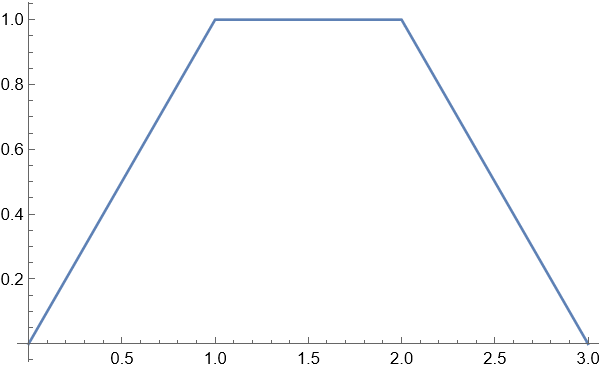

<h1 align="center">第二次翻转课堂草稿</h1>

$$
% 设置
\newcommand{\aneg}[1]{\hspace{-0.75em}&#1&\hspace{-0.75em}}
\newcommand{\aneq}{\aneg{=}}
% 上述指令用于在使用 array 环境时调整等号左右间距
\newcommand{\eqs}{\quad\;}
% 上述指令用于 align 环境中, &= 的换行对齐时调整第二行位置
\renewcommand{\d}{\displaystyle}

% 字符
\renewcommand{\i}{\mathrm{i}}
\renewcommand{\j}{\mathrm{j}}
\renewcommand{\k}{\mathrm{k}}
\newcommand{\e}{\textup{e}}
\newcommand{\ve}{\varepsilon}
\newcommand{\Beta}{\mathrm{B}}
\newcommand{\omicron}{\mathit{o}}
\newcommand{\Omicron}{\mathit{O}}

% 原本的定义为:
% \newcommand{\cal}[1]{\mathcal{#1}}
\newcommand{\bm}[1]{\boldsymbol{#1}}
\renewcommand{\cal}[1]{\mathcal#1}
\renewcommand{\scr}[1]{\mathscr#1}
\renewcommand{\frak}[1]{\mathfrak#1}
\newcommand{\bb}[1]{\mathbb#1}

% 数集
\newcommand{\D}{\mathbb{D}}
\newcommand{\E}{\mathbb{E}}
\newcommand{\F}{\mathbb{F}}
\newcommand{\J}{\mathbb{J}}
\newcommand{\K}{\mathbb{K}}
\renewcommand{\L}{\mathbb{L}}

% 上下标
\newcommand{\trans}{^\mathrm{T}}
\newcommand{\inv}{^{-1}}
\newcommand{\madj}[1]{^{\pqty{#1^*}}}	% m 重伴随矩阵
\newcommand{\adj}{^*}
\newcommand{\vector}[1]{\overrightarrow{#1}}
\newcommand{\wavy}[1]{\overset\sim#1}	% \tilde 或 \widetilde 不明显, 容易与 \bar 或 \overline 混淆

% 序列
\newcommand{\ccdots}{\cdot\cdots\cdot}
\newcommand{\oneton}{1,2,\cdots,n}
\newcommand{\oneto}[1]{1,2,\cdots,#1}

\newcommand{\ssto}[3]{#1_1 #3 #1_2 #3 \cdots #3 #1_{#2}}
\newcommand{\ssup}[3]{#1^1 #3 #1^2 #3 \cdots #3 #1^{#2}}
\newcommand{\soneto}[2]{\ssto{#1}{#2}{,}}
\newcommand{\splus}[2]{\ssto{#1}{#2}{+}}

% 括号
\newcommand{\aqty}[1]{\expval{#1}}
\newcommand{\pbqty}[1]{\left(#1\right]}
\newcommand{\bpqty}[1]{\left[#1\right)}
\newcommand{\floor}[1]{\left\lfloor#1\right\rfloor}
\newcommand{\ceil}[1]{\left\lceil#1\right\rceil}

% 矩阵宏简写
\newcommand{\bmatrix}[1]{\begin{bmatrix}#1\end{bmatrix}}
\newcommand{\Bmatrix}[1]{\begin{Bmatrix}#1\end{Bmatrix}}
\newcommand{\vmatrix}[1]{\begin{vmatrix}#1\end{vmatrix}}
\newcommand{\Vmatrix}[1]{\begin{Vmatrix}#1\end{Vmatrix}}

% 常用微分
\newcommand{\dx}{\dd{x}}
\newcommand{\dy}{\dd{y}}
\newcommand{\dz}{\dd{z}}
\newcommand{\dt}{\dd{t}}
\newcommand{\ds}{\dd{s}}
\newcommand{\dr}{\dd{r}}

% 一般的微分
% 如果只使用 \dd{x}\dd{y} 的话, 中间会有多余的间隔.
\newcommand{\df}{\dd}
\newcommand{\ddf}[2]{\,\mathrm{d}#1\mathrm{d}#2}	% 微分形式 differential form
\newcommand{\dddf}[3]{\,\mathrm{d}#1\mathrm{d}#2\mathrm{d}#3}

% 高阶微分
\newcommand{\dxdy}{\ddf{x}{y}}
\newcommand{\dydz}{\ddf{y}{z}}
\newcommand{\dzdx}{\ddf{z}{x}}
\newcommand{\dudv}{\ddf{u}{v}}
\newcommand{\drdt}{\ddf{r}{\theta}}
\newcommand{\dxdydz}{\dddf{x}{y}{z}}

% 矩阵的宏指令
\newcommand{\pmcmn}[3]{\begin{pmatrix}
	#1_{11} & #1_{12} & \cdots & #1_{1#3} \\
	#1_{21} & #1_{22} & \cdots & #1_{n#3} \\
	\vdots & \vdots && \vdots \\
	#1_{#2 1} & #1_{#2 2} & \cdots & #2_{n#3} \\
\end{pmatrix}}

\newcommand{\pmc}[1]{\pmcmn{#1}{n}{n}}
\newcommand{\pvcn}[2]{\begin{pmatrix}
	#1_1 \\ #1_2 \\ \vdots \\ #1_{#2}
\end{pmatrix}}

\newcommand{\pvc}[1]{\pvcn{#1}{n}}
\newcommand{\pto}{\overset{P}{\to}}

% 函数名
\renewcommand{\char}{\operatorname{char}}	% 由于已存在此命令, 不可使用 DeclareMathOperator
\renewcommand{\r}{\operatorname{r}}
\DeclareMathOperator{\st}{s.t.\,}	% 虽然不是函数名, 但用了这个指令就放这儿了.
\DeclareMathOperator{\diag}{diag}	% 不需要定义太多, 一个文件里用到什么定义什么,
\DeclareMathOperator{\Ker}{Ker}		% 毕竟特殊的函数名太多太多了.
\DeclareMathOperator{\Aut}{Aut}		% 便捷与效率的权衡.
\DeclareMathOperator{\Inn}{Inn}
\DeclareMathOperator{\GL}{GL}
\DeclareMathOperator{\SL}{SL}
\DeclareMathOperator{\stab}{stab}
\DeclareMathOperator{\orb}{orb}
\DeclareMathOperator{\lcm}{lcm}
\DeclareMathOperator{\Var}{Var}
\DeclareMathOperator{\Cov}{Cov}
\DeclareMathOperator{\Corr}{Corr}
\DeclareMathOperator{\rot}{rot}
\DeclareMathOperator{\sgn}{sgn}
\DeclareMathOperator{\Outer}{Outer}
\DeclareMathOperator{\Even}{Even}
\DeclareMathOperator{\Scalar}{Scalar}
\DeclareMathOperator{\Vector}{Vector}
\DeclareMathOperator{\arsh}{arsh}
\DeclareMathOperator{\arch}{arch}
\DeclareMathOperator{\arth}{arth}
\renewcommand{\Re}{\operatorname{Re}}	% 自带 \Re 的效果是 \mathrm{Re}, 前后无空格, 故重写
\renewcommand{\Im}{\operatorname{Im}}
\DeclareMathOperator{\Sa}{Sa}
\DeclareMathOperator{\Si}{Si}

% 运算符
% 可以用 \bigcap, \bigcup, \bigoplus, \bigotimes 替代
\newcommand{\capop}{\displaystyle\mathop\cap\limits}
\newcommand{\cupop}{\displaystyle\mathop\cup\limits}
\newcommand{\oplusop}{\mathop\oplus\limits}
\newcommand{\otimesop}{\mathop\otimes\limits}
\newcommand{\bigoplusop}{\mathop\bigoplus\limits}
\newcommand{\bigotimesop}{\mathop\bigotimes\limits}

% 积分
\newcommand{\dint}{\displaystyle\int}
\newcommand{\inti}{\dint_{-\infty}^{+\infty}}
\newcommand{\intoi}{\dint_0^{+\infty}}

\newcommand{\intl}{\displaystyle\int\limits}
\newcommand{\iintl}{\displaystyle\iint\limits}
\newcommand{\iiintl}{\displaystyle\iiint\limits}

% 求和
\newcommand{\dsum}{\displaystyle\sum}
\newcommand{\csum}[1]{\dsum_{#1=1}^\infty}
\newcommand{\nsum}{\csum{n}}
\newcommand{\ksum}{\csum{k}}
\newcommand{\nosum}{\dsum_{n=0}^\infty}
\newcommand{\insum}{\dsum_{i=1}^n}
\newcommand{\knsum}{\dsum_{k=1}^n}

% 求积
\newcommand{\dprod}{\displaystyle\prod}
\newcommand{\nprod}{\dprod_{n=1}^\infty}
\newcommand{\noprod}{\dprod_{n=0}^\infty}
\newcommand{\inprod}{\dprod_{i=1}^n}

% 极限
\newcommand{\liml}{\lim\limits}
\newcommand{\ulim}{\overline\lim\limits_{n\to\infty}}
\newcommand{\dlim}{\underline\lim\limits_{n\to\infty}}
% 注意这里的 d 是 down, 而不是 displaystyle

\newcommand{\xlim}{\lim\limits_{x\to x_0}}
\newcommand{\nlim}{\lim\limits_{n\to\infty}}
\newcommand{\clim}[1]{\lim\limits_{#1\to\infty}}

% 并集
\newcommand{\incup}{\bigcup_{i=1}^n}
\newcommand{\ncup}{\bigcup_{n=1}^\infty}
\newcommand{\icup}{\bigcup_{i=1}^\infty}

% 交集
\newcommand{\incap}{\bigcap_{i=1}^n}
\newcommand{\ncap}{\bigcap_{n=1}^\infty}
\newcommand{\icap}{\bigcap_{i=1}^\infty}

% 差分
\newcommand{\DD}{\Delta}
\newcommand{\DV}[2]{\dfrac{\DD#1}{\DD#2}}
\newcommand{\nDV}[3]{\dfrac{\DD^{#1}#2}{\DD#3^{#1}}}

% 求导
\newcommand{\ddv}{\displaystyle\dv}
\newcommand{\dpdv}{\displaystyle\pdv}

% 缩写
\newcommand{\LRA}{\Leftrightarrow}
\newcommand{\RLA}{\Leftrightarrow}
\newcommand{\LA}{\Leftarrow}
\newcommand{\RA}{\Rightarrow}

\newcommand{\lra}{\leftrightarrow}
\newcommand{\rla}{\leftrightarrow}
\newcommand{\la}{\leftarrow}
\newcommand{\ra}{\rightarrow}

\newcommand{\QRLA}{\quad\RLA\quad}
\newcommand{\QRA}{\quad\RA\quad}
\newcommand{\LLRA}{\Longleftrightarrow}

\newcommand{\QNRA}{\quad\nRightarrow\quad}
\newcommand{\qnra}{\quad\nrightarrow\quad}

\newcommand{\wt}{\widetilde}

% 图形符号
\newcommand{\qed}{\quad\square}
\renewcommand{\parallel}{\mathrel{/\mskip-2.5mu/}}
\newcommand{\paralleleq}{\hspace{0.5em}{^{^{\parallel}}}\hspace{-1.04em}=}
\newcommand{\rt}{\matrm{Rt}\triangle}

% 分块矩阵
\newenvironment{mat}[1]{
	\begin{array}{#1}
}{
	\end{array}
}

\newenvironment{pmat}[1]{
	\left( \begin{array}{#1}
}{
	\end{array} \right)
}

\newenvironment{bmat}[1]{
	\left[ \begin{array}{#1}
}{
	\end{array} \right]
}

\newenvironment{Bmat}[1]{
	\left\{ \begin{array}{#1}
}{
	\end{array} \right\}
}

\newenvironment{vmat}[1]{
	\left\lvert \begin{array}{#1}
}{
	\end{array} \right\rvert
}

\newenvironment{Vmat}[1]{
	\left\lVert \begin{array}{#1}
}{
	\end{array} \right\rVert
}
$$

#### 思考题

**（1） 如何求解两个信号的卷积？如何确定卷积运算的积分限？** 

1. 求解卷积: 通过定义, 利用性质, 使用软件.
2. 确定积分限: 使用图解法, 或利用示性函数.

**（2） 为什么可以利用激励信号和冲激响应的卷积运算求解系统的零状态响应？** 

见[证明](https://sleepcloudmx.github.io/Electronics/%E4%BF%A1%E5%8F%B7%E4%B8%8E%E7%BA%BF%E6%80%A7%E7%B3%BB%E7%BB%9F/ifsrc/2.4.2%20%E8%AE%A1%E7%AE%97%E9%9B%B6%E7%8A%B6%E6%80%81%E5%93%8D%E5%BA%94.html).

**（3） 如何用图解法求解卷积？** 

见教材.

**（4） 系统并联和级联时，如何计算总系统的冲激响应？** 

- 传输算子
  - 级联 $ H(p) = H_1(p) H_2(p) $.
  - 并联 $ H(p) = H_1(p) + H_2(p) $.
- 单位冲激响应
  - 级联 $ h(t) = h_1(t) * h_2(t) $.
  - 并联 $ h(t) = h_1(t) + h_2(t) $.
- 应用见练习（7）

**（5） 卷积运算有哪些重要性质？** 

见[笔记](https://sleepcloudmx.github.io/Electronics/%E4%BF%A1%E5%8F%B7%E4%B8%8E%E7%BA%BF%E6%80%A7%E7%B3%BB%E7%BB%9F/%E4%BF%A1%E5%8F%B7%E4%B8%8E%E7%BA%BF%E6%80%A7%E7%B3%BB%E7%BB%9F.html#241%E5%87%BD%E6%95%B0%E7%9A%84%E5%8D%B7%E7%A7%AF%E7%A7%AF%E5%88%86).

**（6） 利用MATLAB模拟例2.16~例子2.18的卷积运算过程（放到U盘中，课上演示）。**

2.16 和 2.18 的 [MATLAB 代码](https://sleepcloudmx.github.io/Electronics/%E4%BF%A1%E5%8F%B7%E4%B8%8E%E7%BA%BF%E6%80%A7%E7%B3%BB%E7%BB%9F/MATLAB%20%E4%BB%A3%E7%A0%81.html).

2.17 的 [Mathematica 代码](https://sleepcloudmx.github.io/Electronics/信号与线性系统/Mathematica 代码.html).


#### 练习题

以下每一题均提供过程与 mathematica 代码.

（1）C
$$
[f_1(t)*f_2(t)]' = f_1'(t) * f_2(t).
$$

```mathematica
D[Convolve[f1[x], f2[x], x, t], t]
```

（2）D
$$
\begin{align}
u(t) * u(t) &= \inti I_{x \ge 0, t - x \ge 0} \dx
= \int_0^t I_\Bqty{t \ge x \ge 0} \dx = t u(t),
\end{align}
$$
于是 $ u(t) * u(t-3) = (t-3) u(t - 3) $, 从而得到 D.

```mathematica
Convolve[UnitStep[x], UnitStep[x] - UnitStep[x - 3], x, t]
```

（3）B

由（2）中结论,
$$
(f_1*f_2)(5) = 7 - 6 + 1 - 5 + 2 = -1.
$$
另外, 不知道为什么, 下面这个代码如果把 t 换成 5, mathematica 就换算不成最简式了.

不过 Simplify 之后还是比较舒服的.

```mathematica
Convolve[
	UnitStep[x] - UnitStep[x - 2],
	UnitStep[x + 2] - 2 UnitStep[x - 2] + UnitStep[x - 4],
	x, t
] // Simplify
```

实际上, 函数的表达式为
$$
f_1(t) * f_2(t) = \begin{cases}
 t+2, & -2\leq t<0, \\
 2, & 0\leq t<2, \\
 6-2 t, & 2\leq t<4, \\
 t-6, & 4\leq t<6, \\
 0, & 其它.
\end{cases}
$$
（4）A
$$
u(t) * u(t) = \int_0^t \e^{-4t} I_\Bqty{t \ge x \ge 0} \dx
= \dfrac{1 - \e^{-4t}}{4} u(t).
$$

```mathematica
Convolve[E^(-4 x) UnitStep[x], UnitStep[x], x, t]
```

（5）
$$
\begin{align}
f(t) * \delta_T(t) &= \sum_{m = -\infty}^{+\infty} f(t - mT).
\end{align}
$$

1. 当 $ 0 < T < {\tau} $ 时, 有重叠, 可按重叠次数进一步划分.
2. 当 $ T = \tau $ 时, 恰好无重叠.
3. 当 $ T > \tau $ 时, 每个三角波之间都有间距.

绘图代码如下, 为了方便, 令 $ \tau = 2 $, 修改 $ m $ 的系数即可绘出不同情况的波形图.

```mathematica
Plot[Sum[HeavisideLambda[t - 2 m], {m, -10, 10, 1}], {t, -3, 3}]
```

（6）由（2）中结论,
$$
\begin{align}
f(t) &= u(t) - 2u(t - 1) + u(t - 2), \\
h(t) &= u(t) - u(t-1),
\\
g(t) &= % f(t) * h(t) =
-(t-3) u(t-3) + (t-2) u(t-2) - (t-1) u(t-1)-
\\
&\hspace{1.3em} 2 (t-1) u(t-1) - 2(t-2) u(t-2) + t u(t)
% 太乐了, 连答案的 LaTeX 代码都是 mathematica 帮我写的.
% 就是代码易读性多少还是有点低了
% 有一说一, 不仅代码易读性低, 渲染出来的式子易读性也低.
% 还好自己算了一遍, 不然可能都没注意到这恼人的括号.
% 已经重调过排版了. 恼恼, 怎么还没有化简, 评价是不如自己写
% 不过有一说一, Simplify 之后看着还是不错的.
% 还是不行, Simplify 的代码也不好看, 评价是不如自己写
\\
&= -(t-3) u(t-3) -(t-2) u(t-2) - 3(t-1) u(t-1) + tu(t)
\\
&= \begin{cases}
 t, & 0\leq t<1, \\
 3-2 t, & 1\leq t<2, \\
 t-3, & 2\leq t<3, \\
 0, & 其它.
\end{cases}
\end{align}
$$

```mathematica
Convolve[
	UnitStep[x] - 2 UnitStep[x - 1] + UnitStep[x - 2],
	UnitStep[x] - UnitStep[x - 1],
	x, t
] // Simplify
```

（7）
$$
\begin{align}
h_1(t) &= u(t) - u(t-1), \\
h_2(t) &= u(t-1) - u(t-2), \\
h(t) &= h_1(t) * h_1(t) + h_1(t) * h_2(t) \\
&= [u(t) - u(t-1)] * [u(t) - u(t-2)]
\\
&= tu(t) - (t-1)u(t-1) - (t-2)u(t-2) + (t-3)u(t-3)
\\
&= \begin{cases}
	t, & 0 \le t < 1, \\
	1, & 1 \le t < 2, \\
	3 - 4, & 2 \le t < 3, \\
	0, & 其它.
\end{cases}
\end{align}
$$

```mathematica
Convolve[
	UnitStep[x] - UnitStep[x - 1],
	UnitStep[x] - UnitStep[x - 2],
	x, t
] (* 不知道为什么, 写到 Plot 里面就画不出来图像, 这是什么 bug 吗... *)
Plot[%, {t, 0, 3}]
```



