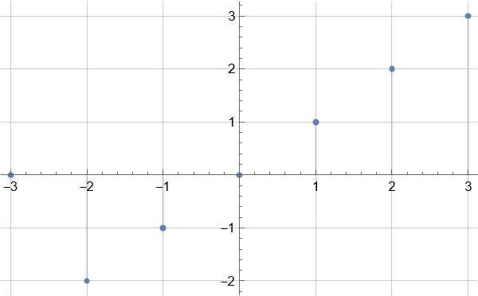
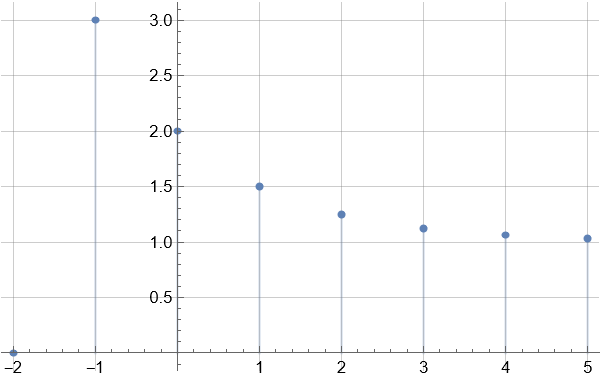
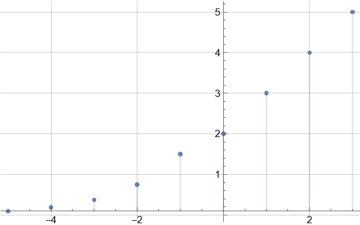
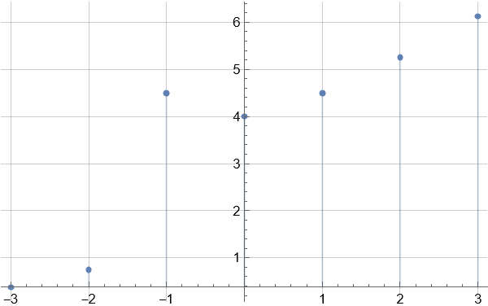
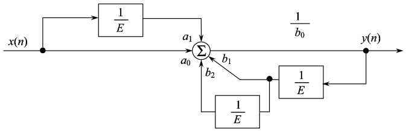

<h1 align="center">第五章作业</h1>

$$
% 设置
\newcommand{\aneg}[1]{\hspace{-0.75em}&#1&\hspace{-0.75em}}
\newcommand{\aneq}{\aneg{=}}
% 上述指令用于在使用 array 环境时调整等号左右间距
\newcommand{\noeq}{&\hspace{1.3em}}
% 上述指令用于 align 环境中, 类似与 &= 但不显示等号.
\renewcommand{\d}{\displaystyle}

% 字符
\renewcommand{\i}{\mathrm{i}}
\renewcommand{\j}{\mathrm{j}}
\renewcommand{\k}{\mathrm{k}}
\newcommand{\e}{\textup{e}}
\newcommand{\ve}{\varepsilon}
\newcommand{\Beta}{\mathrm{B}}
\newcommand{\omicron}{\mathit{o}}
\newcommand{\Omicron}{\mathrm{O}}

% 简写与重定义
\newcommand{\bm}[1]{\boldsymbol{#1}}
\renewcommand{\cal}[1]{\mathcal{#1}}
\renewcommand{\scr}[1]{\mathscr{#1}}
\renewcommand{\frak}[1]{\mathfrak{#1}}
\renewcommand{\rm}[1]{\mathrm{#1}}
\newcommand{\bb}[1]{\mathbb{#1}}

% 数集
\newcommand{\D}{\mathbb{D}}
\newcommand{\E}{\mathbb{E}}
\newcommand{\F}{\mathbb{F}}
\newcommand{\J}{\mathbb{J}}
\newcommand{\K}{\mathbb{K}}
\renewcommand{\L}{\mathbb{L}}

% 上下标
\newcommand{\trans}{^\mathrm{T}}
\newcommand{\inv}{^{-1}}
\newcommand{\madj}[1]{^{\pqty{#1^*}}}	% m 重伴随矩阵
\newcommand{\adj}{^*}
\newcommand{\vector}[1]{\overrightarrow{#1}}
\newcommand{\wavy}[1]{\overset\sim#1}	% \tilde 或 \widetilde 不明显, 容易与 \bar 或 \overline 混淆

% 序列
\newcommand{\ccdots}{\cdot\cdots\cdot}
\newcommand{\oneton}{1,2,\cdots,n}
\newcommand{\oneto}[1]{1,2,\cdots,#1}

\newcommand{\ssto}[3]{#1_1 #3 #1_2 #3 \cdots #3 #1_{#2}}
\newcommand{\ssup}[3]{#1^1 #3 #1^2 #3 \cdots #3 #1^{#2}}
\newcommand{\soneto}[2]{\ssto{#1}{#2}{,}}
\newcommand{\splus}[2]{\ssto{#1}{#2}{+}}

% 括号
\newcommand{\aqty}[1]{\expval{#1}}
\newcommand{\pbqty}[1]{\left(#1\right]}
\newcommand{\bpqty}[1]{\left[#1\right)}
\newcommand{\floor}[1]{\left\lfloor#1\right\rfloor}
\newcommand{\ceil}[1]{\left\lceil#1\right\rceil}

% 矩阵宏简写
\newcommand{\bmatrix}[1]{\begin{bmatrix}#1\end{bmatrix}}
\newcommand{\Bmatrix}[1]{\begin{Bmatrix}#1\end{Bmatrix}}
\newcommand{\vmatrix}[1]{\begin{vmatrix}#1\end{vmatrix}}
\newcommand{\Vmatrix}[1]{\begin{Vmatrix}#1\end{Vmatrix}}

% 常用微分
\newcommand{\dx}{\dd{x}}
\newcommand{\dy}{\dd{y}}
\newcommand{\dz}{\dd{z}}
\newcommand{\dt}{\dd{t}}
\newcommand{\ds}{\dd{s}}
\newcommand{\dr}{\dd{r}}

% 一般的微分
% 如果只使用 \dd{x}\dd{y} 的话, 中间会有多余的间隔.
\newcommand{\df}{\dd}
\newcommand{\ddf}[2]{\,\mathrm{d}#1\mathrm{d}#2}	% 微分形式 differential form
\newcommand{\dddf}[3]{\,\mathrm{d}#1\mathrm{d}#2\mathrm{d}#3}

% 高阶微分
\newcommand{\dxdy}{\ddf{x}{y}}
\newcommand{\dydz}{\ddf{y}{z}}
\newcommand{\dzdx}{\ddf{z}{x}}
\newcommand{\dudv}{\ddf{u}{v}}
\newcommand{\drdt}{\ddf{r}{\theta}}
\newcommand{\dxdydz}{\dddf{x}{y}{z}}

% 矩阵的宏指令
\newcommand{\pmcmn}[3]{\begin{pmatrix}
	#1_{11} & #1_{12} & \cdots & #1_{1#3} \\
	#1_{21} & #1_{22} & \cdots & #1_{n#3} \\
	\vdots & \vdots && \vdots \\
	#1_{#2 1} & #1_{#2 2} & \cdots & #2_{n#3} \\
\end{pmatrix}}

\newcommand{\pmc}[1]{\pmcmn{#1}{n}{n}}
\newcommand{\pvcn}[2]{\begin{pmatrix}
	#1_1 \\ #1_2 \\ \vdots \\ #1_{#2}
\end{pmatrix}}

\newcommand{\pvc}[1]{\pvcn{#1}{n}}
\newcommand{\pto}{\overset{P}{\to}}

% 函数名
\renewcommand{\char}{\operatorname{char}}	% 由于已存在此命令, 不可使用 DeclareMathOperator
\renewcommand{\r}{\operatorname{r}}
\DeclareMathOperator{\st}{s.t.\,}	% 虽然不是函数名, 但用了这个指令就放这儿了.
\DeclareMathOperator{\diag}{diag}	% 不需要定义太多, 一个文件里用到什么定义什么,
\DeclareMathOperator{\Ker}{Ker}		% 毕竟特殊的函数名太多太多了.
\DeclareMathOperator{\Aut}{Aut}		% 便捷与效率的权衡.
\DeclareMathOperator{\Inn}{Inn}
\DeclareMathOperator{\GL}{GL}
\DeclareMathOperator{\SL}{SL}
\DeclareMathOperator{\stab}{stab}
\DeclareMathOperator{\orb}{orb}
\DeclareMathOperator{\lcm}{lcm}
\DeclareMathOperator{\Var}{Var}
\DeclareMathOperator{\Cov}{Cov}
\DeclareMathOperator{\Corr}{Corr}
\DeclareMathOperator{\rot}{rot}
\DeclareMathOperator{\sgn}{sgn}
\DeclareMathOperator{\Outer}{Outer}
\DeclareMathOperator{\Even}{Even}
\DeclareMathOperator{\Scalar}{Scalar}
\DeclareMathOperator{\Vector}{Vector}
\DeclareMathOperator{\arsh}{arsh}
\DeclareMathOperator{\arch}{arch}
\DeclareMathOperator{\arth}{arth}
\renewcommand{\Re}{\operatorname{Re}}	% 自带 \Re 的效果是 \mathrm{Re}, 前后无空格, 故重写
\renewcommand{\Im}{\operatorname{Im}}
\DeclareMathOperator{\Sa}{Sa}
\DeclareMathOperator{\Si}{Si}

% 运算符
% 可以用 \bigcap, \bigcup, \bigoplus, \bigotimes 替代
\newcommand{\capop}{\displaystyle\mathop\cap\limits}
\newcommand{\cupop}{\displaystyle\mathop\cup\limits}
\newcommand{\oplusop}{\mathop\oplus\limits}
\newcommand{\otimesop}{\mathop\otimes\limits}
\newcommand{\bigoplusop}{\mathop\bigoplus\limits}
\newcommand{\bigotimesop}{\mathop\bigotimes\limits}

% 积分
\newcommand{\dint}{\displaystyle\int}
\newcommand{\inti}{\dint_{-\infty}^{+\infty}}
\newcommand{\intoi}{\dint_0^{+\infty}}

\newcommand{\intl}{\displaystyle\int\limits}
\newcommand{\iintl}{\displaystyle\iint\limits}
\newcommand{\iiintl}{\displaystyle\iiint\limits}

% 求和
\newcommand{\dsum}{\displaystyle\sum}
\newcommand{\csum}[1]{\dsum_{#1=1}^\infty}
\newcommand{\nsum}{\csum{n}}
\newcommand{\ksum}{\csum{k}}
\newcommand{\nosum}{\dsum_{n=0}^\infty}
\newcommand{\insum}{\dsum_{i=1}^n}
\newcommand{\knsum}{\dsum_{k=1}^n}
\newcommand{\csuminf}[1]{\dsum_{#1=-\infty}^{+\infty}}
\newcommand{\nsuminf}{\csuminf{n}}

% 求积
\newcommand{\dprod}{\displaystyle\prod}
\newcommand{\nprod}{\dprod_{n=1}^\infty}
\newcommand{\noprod}{\dprod_{n=0}^\infty}
\newcommand{\inprod}{\dprod_{i=1}^n}

% 极限
\newcommand{\liml}{\lim\limits}
\newcommand{\ulim}{\overline\lim\limits_{n\to\infty}}
\newcommand{\dlim}{\underline\lim\limits_{n\to\infty}}
% 注意这里的 d 是 down, 而不是 displaystyle

\newcommand{\xlim}{\lim\limits_{x\to x_0}}
\newcommand{\nlim}{\lim\limits_{n\to\infty}}
\newcommand{\clim}[1]{\lim\limits_{#1\to\infty}}

% 并集
\newcommand{\incup}{\bigcup_{i=1}^n}
\newcommand{\ncup}{\bigcup_{n=1}^\infty}
\newcommand{\icup}{\bigcup_{i=1}^\infty}

% 交集
\newcommand{\incap}{\bigcap_{i=1}^n}
\newcommand{\ncap}{\bigcap_{n=1}^\infty}
\newcommand{\icap}{\bigcap_{i=1}^\infty}

% 差分
\newcommand{\DD}{\Delta}
\newcommand{\DV}[2]{\dfrac{\DD#1}{\DD#2}}
\newcommand{\nDV}[3]{\dfrac{\DD^{#1}#2}{\DD#3^{#1}}}

% 求导
\newcommand{\ddv}{\displaystyle\dv}
\newcommand{\dpdv}{\displaystyle\pdv}

% 最值 (返回参数); 暂时先这么凑合着用吧
\newcommand{\argmax}[1]{\underset{#1}{\operatorname{argmax}}}
\newcommand{\argmin}[1]{\underset{#1}{\operatorname{argmin}}}

% 缩写
\newcommand{\LRA}{\Leftrightarrow}
\newcommand{\RLA}{\Leftrightarrow}
\newcommand{\LA}{\Leftarrow}
\newcommand{\RA}{\Rightarrow}

\newcommand{\lra}{\leftrightarrow}
\newcommand{\rla}{\leftrightarrow}
\newcommand{\la}{\leftarrow}
\newcommand{\ra}{\rightarrow}

\newcommand{\QRLA}{\quad\RLA\quad}
\newcommand{\QRA}{\quad\RA\quad}
\newcommand{\LLRA}{\Longleftrightarrow}

\newcommand{\QNRA}{\quad\nRightarrow\quad}
\newcommand{\qnra}{\quad\nrightarrow\quad}

\newcommand{\wt}{\widetilde}

% 图形符号
\newcommand{\qed}{\quad\square}
\renewcommand{\parallel}{\mathrel{/\mskip-2.5mu/}}
\newcommand{\paralleleq}{\hspace{0.5em}{^{^{\parallel}}}\hspace{-1.04em}=}
\newcommand{\rt}{\matrm{Rt}\triangle}

% 分块矩阵
\newenvironment{mat}[1]{
	\begin{array}{#1}
}{
	\end{array}
}

\newenvironment{pmat}[1]{
	\left( \begin{array}{#1}
}{
	\end{array} \right)
}

\newenvironment{bmat}[1]{
	\left[ \begin{array}{#1}
}{
	\end{array} \right]
}

\newenvironment{Bmat}[1]{
	\left\{ \begin{array}{#1}
}{
	\end{array} \right\}
}

\newenvironment{vmat}[1]{
	\left\lvert \begin{array}{#1}
}{
	\end{array} \right\rvert
}

\newenvironment{Vmat}[1]{
	\left\lVert \begin{array}{#1}
}{
	\end{array} \right\rVert
}

% 积分变换
\newcommand{\ft}{\overset{\cal F}{\rla}}
\newcommand{\lt}{\overset{\cal L}{\rla}}
\newcommand{\bt}{\overset{\cal B}{\rla}}
\newcommand{\zt}{\overset{\cal Z}{\rla}}
\newcommand{\bzt}{\overset{\cal Z_B}{\rla}}
\newcommand{\lzt}{\overset{\cal Z_L}{\rla}}
\newcommand{\rzt}{\overset{\cal Z_R}{\rla}}
$$

[TOC]

#### 5.1

1. $ x_1(n) = n \cdot u(n+2) $.

   

2. $ x_2(n) = (2^{-n} + 1) u(n+1) $.

   

3. $ x_3(n) = \begin{cases}
   	n+2, & n \ge 0, \\
   	3 \cdot 2^n, & n < 0.
   \end{cases} $ 

   

4. $ x_4(n) = x_2(n) + x_3(n) $.

   

**附**	绘图 mathematica 代码如下：

```mathematica
x1 = n UnitStep[n + 2];
x2 = (2^-n + 1) UnitStep[n + 1];
x3 = Which[n < 0, 3*2^n, n >= 0, n + 2];
x4 = x2 + x3;

DiscretePlot[x1, {n, -3, 3}, PlotRange -> All, GridLines -> Automatic]
DiscretePlot[x2, {n, -2, 5}, PlotRange -> All, GridLines -> Automatic]
DiscretePlot[x3, {n, -5, 3}, PlotRange -> All, GridLines -> Automatic]
DiscretePlot[x4, {n, -3, 3}, PlotRange -> All, GridLines -> Automatic]
```

---

#### 5.2

1. $ (n-1) \bqty{u(n-1) - u(n-5)} $.
2. $ u(n-3) - u(n-6) $.
3. $ (-1)^n u(n-1) $.
4. $ -u(n) + 2u(n-3) - u(n-6) $.

---

#### 5.3

1. 周期性，$ N = 14 $.
2. 非周期.

**备注**	对于 $ \sin(\omega n + \varphi) $ 或 $ \e^{\j\omega n} $，若 $ \dfrac{2\pi}{\omega} \in \Q $，则为周期序列，否则为非周期序列.

---

#### 5.4

$$
y(n) - \dfrac{1}{3} y(n-1) = x(n), \quad y(-1) = 0.
$$

1. 迭代得 $ y(0) = 1 $，齐次通解为 $ y(n) = \dfrac{C}{3^n} u(n) $，代入有 $ y_1(n) = h(n) = \dfrac{1}{3^n} u(n) $.

2. $ y_2(n) = x(n) * h(n) = \dfrac{3 - 3^{-n}}{2} u(n) $.

3. 输出信号为
   $$
    \begin{align}
   y_3(n) &= \dfrac{3 - 3^{-n}}{2} u(n) - \dfrac{3 - 3^{5-n}}{2} u(n-5)
   \\
   &= \dfrac{3 - 3^{-n}}{2} \bqty{u(n) - u(n-5)} + \dfrac{121}{3^n} u(n-5).
   \end{align} 
   $$

波形图略.

---

#### 5.5

1. $ y(n) - a y(n-1) + b y(n-2) = x(n) $.
2. 二阶差分方程（二阶系统）.

---

#### 5.6

1. $ y(n) - b_1 y(n-2) - b_2 y(n-2) = a_0 x(n) + a_1 x(n-1) $.
2. 二阶差分方程（二阶系统）.

---

#### 5.7



**备注**	不知道有什么便捷的工具可以绘制系统框图；上图直接截的标答.

---

#### 5.8

1. $ y(n) = 2^{-n} $.
2. $ y(n) = 2^{n+1} $.
3. $ y(n) = (-3)^{n-1} $.
4. $ y(n) = \dfrac{(-3)^{-n}}{3} = -(-3)^{-n-1} $.

---

#### 5.9

1. $ y(n) = 4 (-1)^n - 12 (-2)^n $.
2. $ y(n) = (2n + 1) (-1)^n $.
3. $ \cos\dfrac{n\pi}{2} + 2 \sin\dfrac{n\pi}{2} $。

---

#### 5.10

1. 特征根为 $ 2, 2, 3 $，设 $ y(n) = (a n + b) 2^n + c \cdot 3^n $，代入得

$$
\begin{cases}
	b + c = 0, \\
	2a + 2b + 3c = -1, \\
	8a + 4b + 9c = -3.
\end{cases} \QRA \begin{cases}
	a = -1, \\
	b = -1, \\
	c = 1.
\end{cases}
$$

于是 $ y(n) = 3^n - (n + 1) 2^n, n \ge 0 $.

2. 大概是题目打错了吧...这个计算量挺离谱的：

```mathematica
RSolveValue[{
	y[n] - 2 y[n - 1] + 26 y[n - 2] - 2 y[n - 3] + y[n - 4] == 0,
	y[0] == 0, y[1] == 1, y[2] == 2, y[3] == -3
}, y[n], n]
```

---

#### 5.11

1. 齐次通解为 $ y(n) = C (-2)^n $.
2. 设特解为 $ y_0(n) = a n +b $，代入得 $ a = \dfrac{1}{3}, b = -\dfrac{4}{9} $.
3. 于是全解为 $ y(n) = C (-2)^n + \dfrac{n}{3} - \dfrac{4}{9} $.
4. 代入初值，得 $ y(n) = \dfrac{13}{9} (-2)^n + \dfrac{n}{3} - \dfrac{4}{9} $.

---

#### 5.12

1. 齐次通解为 $ y(n) = (an + b) (-1)^n $.
2. 设特解为 $ y_0(n) = A \cdot 3^n $，代入得 $ A = \dfrac{9}{16} $.
3. 于是全解为 $ y(n) = (an + b) (-1)^n + \dfrac{9}{16} \cdot 3^n $.
4. 代入初值，得 $ y(n) = \pqty{-\dfrac{3}{4} n - \dfrac{9}{16}} (-1)^n + \dfrac{9}{16} \cdot 3^n $.

---

#### 5.13

1. 全解为 $ y(n) = a \cos\dfrac{n\pi}{2} + b\sin\dfrac{n\pi}{2} + A\sin n + B \cos n $.

   代入即可解得.

2. $ \frac{1}{8} \left(2 \lfloor n\rfloor ^2-2 \left((-1)^{\lfloor
      n\rfloor +n}+1\right) \lfloor n\rfloor +(-1)^{\lfloor n\rfloor
      +n}-5 (-1)^n-12\right) $.

   标答有误.

3. 


