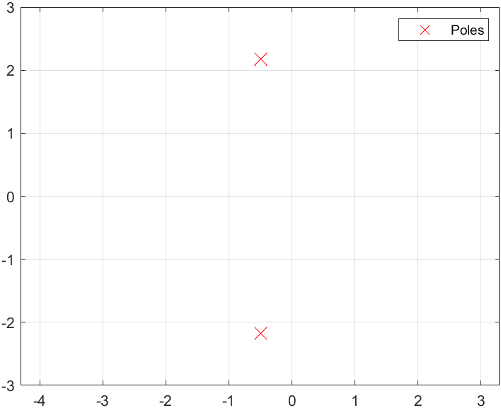

<h1 align="center">第四章</h1>

$$
% 设置
\newcommand{\aneg}[1]{\hspace{-0.75em}&#1&\hspace{-0.75em}}
\newcommand{\aneq}{\aneg{=}}
% 上述指令用于在使用 array 环境时调整等号左右间距
\newcommand{\noeq}{&\hspace{1.3em}}
% 上述指令用于 align 环境中, 类似与 &= 但不显示等号.
\renewcommand{\d}{\displaystyle}

% 字符
\renewcommand{\i}{\mathrm{i}}
\renewcommand{\j}{\mathrm{j}}
\renewcommand{\k}{\mathrm{k}}
\newcommand{\e}{\textup{e}}
\newcommand{\ve}{\varepsilon}
\newcommand{\Beta}{\mathrm{B}}
\newcommand{\omicron}{\mathit{o}}
\newcommand{\Omicron}{\mathrm{O}}

% 简写与重定义
\newcommand{\bm}[1]{\boldsymbol{#1}}
\renewcommand{\cal}[1]{\mathcal{#1}}
\renewcommand{\scr}[1]{\mathscr{#1}}
\renewcommand{\frak}[1]{\mathfrak{#1}}
\renewcommand{\rm}[1]{\mathrm{#1}}
\newcommand{\bb}[1]{\mathbb{#1}}

% 数集
\newcommand{\D}{\mathbb{D}}
\newcommand{\E}{\mathbb{E}}
\newcommand{\F}{\mathbb{F}}
\newcommand{\J}{\mathbb{J}}
\newcommand{\K}{\mathbb{K}}
\renewcommand{\L}{\mathbb{L}}

% 上下标
\newcommand{\trans}{^\mathrm{T}}
\newcommand{\inv}{^{-1}}
\newcommand{\madj}[1]{^{\pqty{#1^*}}}	% m 重伴随矩阵
\newcommand{\adj}{^*}
\newcommand{\vector}[1]{\overrightarrow{#1}}
\newcommand{\wavy}[1]{\overset\sim#1}	% \tilde 或 \widetilde 不明显, 容易与 \bar 或 \overline 混淆

% 序列
\newcommand{\ccdots}{\cdot\cdots\cdot}
\newcommand{\oneton}{1,2,\cdots,n}
\newcommand{\oneto}[1]{1,2,\cdots,#1}

\newcommand{\ssto}[3]{#1_1 #3 #1_2 #3 \cdots #3 #1_{#2}}
\newcommand{\ssup}[3]{#1^1 #3 #1^2 #3 \cdots #3 #1^{#2}}
\newcommand{\soneto}[2]{\ssto{#1}{#2}{,}}
\newcommand{\splus}[2]{\ssto{#1}{#2}{+}}

% 括号
\newcommand{\aqty}[1]{\expval{#1}}
\newcommand{\pbqty}[1]{\left(#1\right]}
\newcommand{\bpqty}[1]{\left[#1\right)}
\newcommand{\floor}[1]{\left\lfloor#1\right\rfloor}
\newcommand{\ceil}[1]{\left\lceil#1\right\rceil}

% 矩阵宏简写
\newcommand{\bmatrix}[1]{\begin{bmatrix}#1\end{bmatrix}}
\newcommand{\Bmatrix}[1]{\begin{Bmatrix}#1\end{Bmatrix}}
\newcommand{\vmatrix}[1]{\begin{vmatrix}#1\end{vmatrix}}
\newcommand{\Vmatrix}[1]{\begin{Vmatrix}#1\end{Vmatrix}}

% 常用微分
\newcommand{\dx}{\dd{x}}
\newcommand{\dy}{\dd{y}}
\newcommand{\dz}{\dd{z}}
\newcommand{\dt}{\dd{t}}
\newcommand{\ds}{\dd{s}}
\newcommand{\dr}{\dd{r}}

% 一般的微分
% 如果只使用 \dd{x}\dd{y} 的话, 中间会有多余的间隔.
\newcommand{\df}{\dd}
\newcommand{\ddf}[2]{\,\mathrm{d}#1\mathrm{d}#2}	% 微分形式 differential form
\newcommand{\dddf}[3]{\,\mathrm{d}#1\mathrm{d}#2\mathrm{d}#3}

% 高阶微分
\newcommand{\dxdy}{\ddf{x}{y}}
\newcommand{\dydz}{\ddf{y}{z}}
\newcommand{\dzdx}{\ddf{z}{x}}
\newcommand{\dudv}{\ddf{u}{v}}
\newcommand{\drdt}{\ddf{r}{\theta}}
\newcommand{\dxdydz}{\dddf{x}{y}{z}}

% 矩阵的宏指令
\newcommand{\pmcmn}[3]{\begin{pmatrix}
	#1_{11} & #1_{12} & \cdots & #1_{1#3} \\
	#1_{21} & #1_{22} & \cdots & #1_{n#3} \\
	\vdots & \vdots && \vdots \\
	#1_{#2 1} & #1_{#2 2} & \cdots & #2_{n#3} \\
\end{pmatrix}}

\newcommand{\pmc}[1]{\pmcmn{#1}{n}{n}}
\newcommand{\pvcn}[2]{\begin{pmatrix}
	#1_1 \\ #1_2 \\ \vdots \\ #1_{#2}
\end{pmatrix}}

\newcommand{\pvc}[1]{\pvcn{#1}{n}}
\newcommand{\pto}{\overset{P}{\to}}

% 函数名
\renewcommand{\char}{\operatorname{char}}	% 由于已存在此命令, 不可使用 DeclareMathOperator
\renewcommand{\r}{\operatorname{r}}
\DeclareMathOperator{\st}{s.t.\,}	% 虽然不是函数名, 但用了这个指令就放这儿了.
\DeclareMathOperator{\diag}{diag}	% 不需要定义太多, 一个文件里用到什么定义什么,
\DeclareMathOperator{\Ker}{Ker}		% 毕竟特殊的函数名太多太多了.
\DeclareMathOperator{\Aut}{Aut}		% 便捷与效率的权衡.
\DeclareMathOperator{\Inn}{Inn}
\DeclareMathOperator{\GL}{GL}
\DeclareMathOperator{\SL}{SL}
\DeclareMathOperator{\stab}{stab}
\DeclareMathOperator{\orb}{orb}
\DeclareMathOperator{\lcm}{lcm}
\DeclareMathOperator{\Var}{Var}
\DeclareMathOperator{\Cov}{Cov}
\DeclareMathOperator{\Corr}{Corr}
\DeclareMathOperator{\rot}{rot}
\DeclareMathOperator{\sgn}{sgn}
\DeclareMathOperator{\Outer}{Outer}
\DeclareMathOperator{\Even}{Even}
\DeclareMathOperator{\Scalar}{Scalar}
\DeclareMathOperator{\Vector}{Vector}
\DeclareMathOperator{\arsh}{arsh}
\DeclareMathOperator{\arch}{arch}
\DeclareMathOperator{\arth}{arth}
\renewcommand{\Re}{\operatorname{Re}}	% 自带 \Re 的效果是 \mathrm{Re}, 前后无空格, 故重写
\renewcommand{\Im}{\operatorname{Im}}
\DeclareMathOperator{\Sa}{Sa}
\DeclareMathOperator{\Si}{Si}

% 运算符
% 可以用 \bigcap, \bigcup, \bigoplus, \bigotimes 替代
\newcommand{\capop}{\displaystyle\mathop\cap\limits}
\newcommand{\cupop}{\displaystyle\mathop\cup\limits}
\newcommand{\oplusop}{\mathop\oplus\limits}
\newcommand{\otimesop}{\mathop\otimes\limits}
\newcommand{\bigoplusop}{\mathop\bigoplus\limits}
\newcommand{\bigotimesop}{\mathop\bigotimes\limits}

% 积分
\newcommand{\dint}{\displaystyle\int}
\newcommand{\inti}{\dint_{-\infty}^{+\infty}}
\newcommand{\intoi}{\dint_0^{+\infty}}

\newcommand{\intl}{\displaystyle\int\limits}
\newcommand{\iintl}{\displaystyle\iint\limits}
\newcommand{\iiintl}{\displaystyle\iiint\limits}

% 求和
\newcommand{\dsum}{\displaystyle\sum}
\newcommand{\csum}[1]{\dsum_{#1=1}^\infty}
\newcommand{\nsum}{\csum{n}}
\newcommand{\nsuminf}{\dsum_{n=-\infty}^{+\infty}}
\newcommand{\ksum}{\csum{k}}
\newcommand{\nosum}{\dsum_{n=0}^\infty}
\newcommand{\insum}{\dsum_{i=1}^n}
\newcommand{\knsum}{\dsum_{k=1}^n}

% 求积
\newcommand{\dprod}{\displaystyle\prod}
\newcommand{\nprod}{\dprod_{n=1}^\infty}
\newcommand{\noprod}{\dprod_{n=0}^\infty}
\newcommand{\inprod}{\dprod_{i=1}^n}

% 极限
\newcommand{\liml}{\lim\limits}
\newcommand{\ulim}{\overline\lim\limits_{n\to\infty}}
\newcommand{\dlim}{\underline\lim\limits_{n\to\infty}}
% 注意这里的 d 是 down, 而不是 displaystyle

\newcommand{\xlim}{\lim\limits_{x\to x_0}}
\newcommand{\nlim}{\lim\limits_{n\to\infty}}
\newcommand{\clim}[1]{\lim\limits_{#1\to\infty}}

% 并集
\newcommand{\incup}{\bigcup_{i=1}^n}
\newcommand{\ncup}{\bigcup_{n=1}^\infty}
\newcommand{\icup}{\bigcup_{i=1}^\infty}

% 交集
\newcommand{\incap}{\bigcap_{i=1}^n}
\newcommand{\ncap}{\bigcap_{n=1}^\infty}
\newcommand{\icap}{\bigcap_{i=1}^\infty}

% 差分
\newcommand{\DD}{\Delta}
\newcommand{\DV}[2]{\dfrac{\DD#1}{\DD#2}}
\newcommand{\nDV}[3]{\dfrac{\DD^{#1}#2}{\DD#3^{#1}}}

% 求导
\newcommand{\ddv}{\displaystyle\dv}
\newcommand{\dpdv}{\displaystyle\pdv}

% 最值 (返回参数); 暂时先这么凑合着用吧
\newcommand{\argmax}[1]{\underset{#1}{\operatorname{argmax}}}
\newcommand{\argmin}[1]{\underset{#1}{\operatorname{argmin}}}

% 缩写
\newcommand{\LRA}{\Leftrightarrow}
\newcommand{\RLA}{\Leftrightarrow}
\newcommand{\LA}{\Leftarrow}
\newcommand{\RA}{\Rightarrow}

\newcommand{\lra}{\leftrightarrow}
\newcommand{\rla}{\leftrightarrow}
\newcommand{\la}{\leftarrow}
\newcommand{\ra}{\rightarrow}

\newcommand{\QRLA}{\quad\RLA\quad}
\newcommand{\QRA}{\quad\RA\quad}
\newcommand{\LLRA}{\Longleftrightarrow}

\newcommand{\QNRA}{\quad\nRightarrow\quad}
\newcommand{\qnra}{\quad\nrightarrow\quad}

\newcommand{\wt}{\widetilde}

% 图形符号
\newcommand{\qed}{\quad\square}
\renewcommand{\parallel}{\mathrel{/\mskip-2.5mu/}}
\newcommand{\paralleleq}{\hspace{0.5em}{^{^{\parallel}}}\hspace{-1.04em}=}
\newcommand{\rt}{\matrm{Rt}\triangle}

% 分块矩阵
\newenvironment{mat}[1]{
	\begin{array}{#1}
}{
	\end{array}
}

\newenvironment{pmat}[1]{
	\left( \begin{array}{#1}
}{
	\end{array} \right)
}

\newenvironment{bmat}[1]{
	\left[ \begin{array}{#1}
}{
	\end{array} \right]
}

\newenvironment{Bmat}[1]{
	\left\{ \begin{array}{#1}
}{
	\end{array} \right\}
}

\newenvironment{vmat}[1]{
	\left\lvert \begin{array}{#1}
}{
	\end{array} \right\rvert
}

\newenvironment{Vmat}[1]{
	\left\lVert \begin{array}{#1}
}{
	\end{array} \right\rVert
}

% 积分变换
\newcommand{\ft}{\overset{\cal F}{\rla}}
\newcommand{\lt}{\overset{\cal L}{\rla}}
\newcommand{\bt}{\overset{\cal B}{\rla}}
$$

[TOC]

#### 4.1

1. $ 1 - \e^{-\alpha t} \lt \dfrac{1}{s} - \dfrac{1}{s + \alpha} = \dfrac{\alpha}{s (s + \alpha)} $.

2. $ t \e^{-2t} \lt \dfrac{1}{(s + 2)^2} $.

3. $ \bqty{1 - \cos(\alpha t)} \e^{-\beta t} \lt \dfrac{1}{s + \beta} - \dfrac{s + \beta}{(s + \beta)^2 + \alpha^2} $.

4. $ 2 \delta(t) - 3\e^{-7t} \lt 2 - \dfrac{3}{s + 7} $.

5. $ \e^{-\alpha t} \sinh(\beta t) \lt \dfrac{\beta}{(s + \alpha)^2 - \beta^2} $.

6. $ \dfrac{\e^{-\alpha t} - \e^{-\beta t}}{\beta - \alpha} \lt \dfrac{1}{(s + \alpha) (s + \beta)} $.

7. $ \e^{-(t + a)} \cos(\omega t) \lt \dfrac{(s + 1) \e^{-a}}{(s + 1)^2 + \omega^2} $.

8. 为了利用时移性质，先将函数拆开：

   $ t \e^{-(t - 2)} u(t - 1) = \pqty{(t-1) \e^{-(t-1)} + \e^{-(t-1)}} \e \cdot u(t-1) \lt \dfrac{s + 2}{(s + 1)^2} \e^{-(s - 1)} $.

9. $ \e^{-a t} f\pqty{\dfrac{t}{a}} \lt a F(as + a^2) $.

10. 注：频域卷积难以求解，可利用频域微分性质.

    $ t^2 \cos(2t) \lt (-1)^2 \ddv[2]{s} \dfrac{s}{s^2 + 4} = \dfrac{2s^3 - 24 s}{(s^2 + 4)^3} $.

11. 法一：频域积分

    $ \dfrac{1 - \e^{-\alpha t}}{t} \lt \dint_s^{+\infty} \pqty{\dfrac{1}{s} - \dfrac{1}{s + \alpha}} \ds = \eval{\ln\dfrac{s}{s + \alpha}}_s^{+\infty} = \ln \pqty{1 + \dfrac{a}{s}} $.

    法二：幂级数展开
    $$
    \begin{align}
    \dfrac{1 - \e^{-\alpha t}}{t}
    &= \alpha - \dfrac{\alpha^2 t}{2} + \cdots +
    (-1)^{n+1} \dfrac{\alpha^n t^{n-1}}{n!}
    \\
    &\lt \dfrac{\alpha}{s} - \dfrac{\alpha^2}{2 s^2} + \cdots +
    (-1)^{n+1} \dfrac{\alpha^n}{n s^n}
    \\
    &= \ln\pqty{1 + \dfrac{a}{s}}.
    \end{align}
    $$
    备注：使用幂级数展开法时，需要验证展开系数是否满足条件.

12. 与第 11 题相同，

    $ \dfrac{\e^{-3t} - \e^{-5t}}{t} \lt \dint_s^{+\infty} \pqty{\dfrac{1}{s + 3} - \dfrac{1}{s + 5}} \ds = \ln \dfrac{s + 5}{s + 3} $.

13. $ \dfrac{4}{2s + 3} \lt 2 \e^{-\tfrac{3}{2} t} $.

14. $ \dfrac{4}{s (2s + 3)} = \dfrac{4}{3s} - \dfrac{4}{3} \dfrac{1}{s + \cfrac{3}{2}} \lt \dfrac{4}{3} \pqty{1 - \e^{-\tfrac{3}{2}t}} $.

15. $ \dfrac{1}{s (s^2 + 5)} = \dfrac{1}{5s} - \dfrac{1}{5} \dfrac{s}{s^2 + 5} \lt \dfrac{1 - \cos(\sqrt 5 t)}{5} $.

16. $ \dfrac{3s}{(s + 4) (s + 2)} = \dfrac{6}{s + 4} - \dfrac{3}{s + 2} \lt 6 \e^{-4t} - 3 \e^{-2t} $.

17. $ \dfrac{1}{s^2 + 1} + 1 \lt \sin t + \delta(t) $.

18. $ \dfrac{1 - RC s}{s (1 + RC s)} = \dfrac{1}{s} - \dfrac{2}{s + \cfrac{1}{RC}} \lt 1 - 2 \e^{-\tfrac{t}{RC}} $.

19. $ \dfrac{4s + 5}{s^2 + 5s + 6} = \dfrac{7}{s + 3} - \dfrac{3}{s + 2} \lt 7 \e^{-3t} - 3 \e^{-2t} $.

20. 思路一：频域微分性质

    由 $ \cos(\sqrt 3 t) u(t) \lt \dfrac{s}{s^2 + 3} $，有 $ t \cos(\sqrt 3 t) u(t) \lt \dfrac{s^2 - 3}{(s^2 + 3)^2} $，于是
    $$
    \begin{align}
    \dfrac{1}{(s^2 + 3)^2}
    &= \dfrac{1}{6} \pqty{
    	\dfrac{1}{s^2 + 3} - \dfrac{s^2 - 3}{(s^2 + 3)^2}
    } \\
    &\lt \dfrac{\sin(\sqrt 3 t)}{6 \sqrt 3} - \dfrac{t \cos(\sqrt 3 t)}{6}.
    \end{align}
    $$
    思路二：时域卷积性质
    $$
    \begin{align}
    \dfrac{1}{(s^2 + 3)^2}
    &\lt \dfrac{1}{3} \sin(\sqrt 3 t)  u(t) * \sin(\sqrt 3 t) u(t)
    \\
    &= \dfrac{
    	\sin(\sqrt 3 t) - \sqrt 3 t \cos(\sqrt 3 t)
    }{6\sqrt 3}.
    \end{align}
    $$

21. 利用极限法与特值代入法，计算量不大：
    $$
    \begin{align}
    \noeq \dfrac{s}{(s + a) \bqty{(s + \alpha)^2 + \beta^2}}
    \\
    &= \dfrac{-a}{(a - \alpha)^2 + \beta^2} \pqty{
    	\dfrac{1}{s + a} -
    	\dfrac{s + \alpha}{(s + \alpha)^2 + \beta^2} -
    	\dfrac{\alpha^2 + \beta^2 - a \alpha}{a \beta}
    	\dfrac{\beta}{(s + \alpha)^2 + \beta^2}
    } \\
    &\lt \dfrac{-a}{(a - \alpha)^2 + \beta^2} \pqty{
    	\e^{-a t} - \pqty{
    		\cos(\beta t) +
    		\dfrac{\alpha^2 + \beta^2 - a \alpha}{a \beta} \sin(\beta t)
    	} \e^{-\alpha t}
    }.
    \end{align}
    $$

22. $ \ln \dfrac{s}{s + 9} \lt \dfrac{\e^{-9 t} - 1}{t} $.

**备注**	

- 具体思路参考拉普拉斯变换的性质、拉普拉斯逆变换的求解的笔记.

- 更严谨而完整的，应该给出拉氏变换的收敛域. 注意有些结果看似不同，但在收敛域交定义域内确是相同的. 本题没有这样的例子.

- 第 9 题应说明 $ a > 0 $.

- 第 11 题不能对两项分别求拉普拉斯变换，因为拉氏变换并不存在. 实际上，有
  $$
  \begin{align}
  \dfrac{u(t)}{(t+a)^n} &\lt \begin{cases}
  	s^{n-1} \e^{as} \dint_{-\infty}^{-as} \dfrac{\e^x \dx}{(-x)^n},
  	& a > 0, n \in \R,
  	\\
  	s^{n-1} \e^{as} \Gamma(1-n, as),
  	& a \in \R, n < 1,
  	\\
  	不存在, & a \le 0, n \ge 1.
  \end{cases}
  \end{align}
  $$
  其中上式不能用幂级数展开法求解，因为不满足条件.（11 题则满足条件）

  右式的积分为柯西主值积分. 由上，特殊的，有

  - 当 $ n \in \N $ 时，有 $ t^n u(t) \lt \dfrac{n!}{s^{n+1}} $.
  - 当 $ a > 0 $ 时，有 $ \dfrac{u(t)}{t+a} \lt -\e^{as} \operatorname{Ei}(-as) $.

- 诸如第 20 题的结论，可直接参考笔记. 了解思路后，使用时查表即可. 这里也直接列出吧：

  |           象函数 $ F(s) $           |                       原函数 $ f(t) $                        | 说明               |
  | :---------------------------------: | :----------------------------------------------------------: | ------------------ |
  |  $ \dfrac{1}{(s^2 + \omega^2)^2} $  | $ \dfrac{\sin(\omega t) - \omega t \cos(\omega t)}{2\omega^3} $ | $ \omega \in \C $. |
  |  $ \dfrac{s}{(s^2 + \omega^2)^2} $  |             $ \dfrac{t\sin(\omega t)}{2\omega} $             | $ \omega \in \C $. |
  | $ \dfrac{s^2}{(s^2 + \omega^2)^2} $ | $ \dfrac{\sin(\omega t) + \omega t \cos(\omega t)}{2\omega} $ | $ \omega \in \C $. |
  | $ \dfrac{s^3}{(s^2 + \omega^2)^2} $ |   $ \cos(\omega t) - \dfrac{\omega t}{2} \sin(\omega t) $    | $ \omega \in \C $. |
  |  $ \dfrac{1}{(s^2 + \omega^2)^3} $  | $ \d \frac{\left(3-t^2 \omega ^2\right) \sin (t \omega )-3 t \omega  \cos (t \omega )}{8 \omega ^5} $ | $ \omega \in \C $. |
  |  $ \dfrac{s}{(s^2 + \omega^2)^3} $  | $ \d\frac{t (\sin (t \omega )-t \omega  \cos (t \omega ))}{8 \omega ^3} $ | $ \omega \in \C $. |
  
- 第 20 题中利用到的卷积的结论，也罗列如下：

  - 角频率不同

  $$
  \begin{align}
  \sin(a t) u(t) * \sin(b t) u(t)
  &= \dfrac{a \sin(bt) - b \sin(at)}{a^2 - b^2} u(t),
  \\
  \sin(a t) u(t) * \cos(b t) u(t)
  &= \dfrac{a \cos(bt) - a \cos(at)}{a^2 - b^2} u(t),
  \\
  \cos(a t) u(t) * \cos(b t) u(t)
  &= \dfrac{a \sin(a t) - b \sin(b t)}{a^2 - b^2} u(t).
  \end{align}
  $$

  - 角频率相同

  $$
  \begin{align}
  \sin(\omega t) u(t) * \sin(\omega t) u(t)
  &= \dfrac{\sin(\omega t) - \omega t \cos(\omega t)}{2\omega} u(t),
  \\
  \sin(\omega t) u(t) * \cos(\omega t) u(t)
  &= \dfrac{t \sin(\omega t)}{2} u(t),
  \\
  \cos(\omega t) u(t) * \cos(\omega t) u(t)
  &= \dfrac{\sin(\omega t) + \omega t \cos(\omega t)}{2\omega} u(t).
  \end{align}
  $$

- 第 21 题的答案中，右中括号的位置错了.

- 第 22 题，一般的，有 $ \dfrac{\e^{-\alpha t} - \e^{-\beta t}}{t} \lt \ln \dfrac{s + \beta}{s + \alpha} $，其中 $ \alpha, \beta \in \C $.

---

#### 4.2

1. $ \e^{-t} u(t - 2) = \e^{-2} \cdot \e^{-(t - 2)} u(t - 2) \lt \dfrac{\e^{-2 (s + 1)}}{s + 1} $.

2. $ \e^{-(t - 2)} u(t - 2) \lt \dfrac{\e^{-2s}}{s + 1} $.

3. $ \e^{-(t - 2)} u(t) = \e^2 \cdot \e^{-t} u(t) \lt \dfrac{\e^2}{s + 1} $.

4. 先考虑
   $$
   \begin{align}
   \sin(2t + 2) &= \sin 2t \cos 2 + \cos 2t \sin 2
   \\
   &\lt \dfrac{2 \cos 2 + s \sin 2}{s^2 + 4},
   \end{align}
   $$
   于是 $ \sin(2t) u(t - 1) \lt \dfrac{2 \cos 2 + s \sin 2}{s^2 + 4} \e^{-s} $.

5. 拆分后求解：

$$
\begin{align}
\noeq (t-1) \bqty{u(t - 1) - u(t - 2)}
\\
&= (t - 1) u(t - 1) - (t - 2) u(t - 2) - u(t - 2)
\\
&\lt \dfrac{
	\e^{-s} - (s + 1) \e^{-2s}
}{s^2}.
\end{align}
$$

---

#### 4.3

1. 拆分后求解：

$$
\begin{align}
t u(2t - 1) &= \pqty{t - \dfrac{1}{2}} u(2t - 1) + \dfrac{u(2t - 1)}{2}
\\
&\lt \dfrac{s +2}{s^2} \e^{-\tfrac{s}{2}}.
\end{align}
$$

2. $ u\pqty{\dfrac{t}{2} - 1} = u(t - 2) \lt \dfrac{\e^{-2s}}{s} $.
3. 直接利用定义（也可以使用性质）

$$
\begin{align}
\noeq \sin(\pi t) \bqty{u(t) - u(t - 1)}
\\
&\lt \dint_0^1 \sin(\pi t) \e^{-st} \dt
\\
&= \eval{
	\dfrac{
		-s \sin(\pi t) - \pi \cos(\pi t)
	}{s^2 + \pi^2} \e^{-st}
}_0^1 \\
&= \dfrac{(1 + \e^{-s}) \pi}{\pi^2 + s^2}.
\end{align}
$$

4. 拆开：

$$
\begin{align}
\sin\pqty{2t - \dfrac{\pi}{4}} u(t)
&= \dfrac{\sqrt 2}{2} \sin(2t) u(t) - \dfrac{\sqrt 2}{2} \cos(2t) u(t)
\\
&\lt \dfrac{\sqrt 2}{2} \dfrac{2 - s}{s^2 + 4}.
\end{align}
$$

5. 法一：由 $ \e^{-t} \sin(t) u(t) \lt \dfrac{1}{(s + 1)^2 + 1} $ 和时域微分性质，
   $$
   \ddv[2]{t} \pqty{
   	\e^{-t} \sin(t) u(t)
   } \lt \dfrac{s^2}{(s + 1)^2 + 1}.
   $$
   法二：直接求导，没法一快，但计算量也不大.

6. 先求 $ \cal L\bqty{\Sa(t)} $.

   ​	法一：频域积分
   $$
   \begin{align}
   \Sa(t) \lt 
   \int_s^{+\infty} \dfrac{\ds}{s^2 + 1}
   = \dfrac{\pi}{2} - \arctan(s).
   \end{align}
   $$
   ​	法二：幂级数展开
   $$
   \begin{align}
   \Sa(t) &= 1 - \dfrac{t^2}{3!} + \cdots + (-1)^n \dfrac{t^{2n}}{(2n+1)!}
   \\
   &\lt \dfrac{1}{s} - \dfrac{1}{3s^3} + \cdots + \dfrac{(-1)^n}{(2n+1) s^{2n+1}}
   \\
   &= %\xcancel{
   	\arctan\pqty{\dfrac{1}{s}} = \arccot(s)
   %}
   \\
   % &= \dfrac{\pi}{2} - \arctan(s).
   \end{align}
   $$
   ​	法三：利用 $ \Sa(t) u(t) \ft \dfrac{\pi}{2} - \j \arth(\omega) $，于是 $ \Sa(t) \lt \dfrac{\pi}{2} - \arctan(s) $.

   之后由尺度性质即有 $ \dfrac{\sin(at)}{t} = \dfrac{\pi}{2} - \arctan\pqty{\dfrac{s}{a}} $.

7. 由 4.1 题第 22 问的备注中的结论，$ \dfrac{\e^{-3t} - \e^{-5t}}{t} \lt \ln\dfrac{s + 5}{s + 3} $.

**备注**	第六问中用三种方法得到的结果看似不同，但在收敛域与定义域的交集内是相同的.

---

#### 4.4

1. $ f(0_+) = \clim s s F(s) = 1, f(\infty) = \liml_{s\to0} s F(s) = 0 $.
2. $ f(0_+) = 1, f(\infty) = 0 $.
3. $ f(0_+) = 0, f(\infty) = \dfrac{1}{2} $.
4. $ f(0_+) = 0, f(\infty) = 0 $.
5. $ f(0_+) = 2, f(\infty) $ 不存在.
6. $ f(0_+) = 0, f(\infty) $ 不存在.

**备注**	

- 终值定理要求极点在左半平面，因此第五题<span style="color: red">不能使用</span>终值定理.（或者是否可以用某种方式为所有发散的级数定义极限？似乎是一个在理论上有趣、在数学上有意义、在应用中有价值的问题）
- 对于初值定理，如果非真分式，则应<span style="color: red">化为真分式后再使用</span>定理.
- 注意 $ \delta(0_-) = \delta(0_+) = 0 $.

---

#### 4.5

1. 法一（直接卷积）
   $$
   \begin{align}
   y_\text{zs}(t) &= t u(t) - (t - 2) u(t - 2) - \dfrac{1 - \e^{-2t}}{2} u(t) + \dfrac{1 - \e^{-2(t-2)}}{2} u(t-2)
   \\
   &= \pqty{
   	t + \dfrac{\e^{-2t} - 1}{2}
   } u(t) + \pqty{
   	\dfrac{5 - \e^{-2(t-2)}}{2} - t
   } u(t-2)
   \end{align}
   $$
   法二（拉普拉斯变换）

   - $ H(s) = \dfrac{1}{s} - \dfrac{1}{s + 2} $.
   - $ F(s) = \dfrac{1 - \e^{-2s}}{s} $.
   - $ Y_\text{zs}(s) = \dfrac{2 (1 - \e^{-2s})}{s^2 (s + 2)} $.

   从而部分分式展开求得逆变换.

2. $ Y_\text{zs}(s) = \dfrac{2}{s^3} $,

   $ F(s) = \dfrac{s+2}{s^2} $.

   $ f(t) = (1 + 2t) u(t) $.

**备注**

- 第一问答案有误，已由计算机验证：

```mathematica
Convolve[
	(1 - E^(-2 t)) UnitStep[t],
	UnitStep[t] - UnitStep[t - 2],
	t, x
] // TrigToExp
```

---

#### 4.6

1. $ F(s) = \dfrac{1}{s + 1} $.
2. $ Y_\text{zs}(s) = \dfrac{1}{s + 1} - \dfrac{2}{s + 2} + \dfrac{3}{s + 3} $.
3. $ H(s) = 2 + \dfrac{2}{s + 2} - \dfrac{6}{s + 3} $.
4. 后续思路一：
   1. $ h(t) = 2 \delta(t) + \pqty{2\e^{-2t} - 6\e^{-3t}} u(t) $.
   2. $ g(t) = h^{(-1)}(t) = (1 - \e^{-2t} + 2\e^{-3t}) u(t) $.
5. 后续思路二：
   1. $ U(s) = \dfrac{1}{s} $.
   2. $ G(s)= \dfrac{1}{s} - \dfrac{1}{s + 2} + \dfrac{2}{s + 3} $.
   3. $ g(t) = (1 - \e^{-2t} + 2\e^{-3t}) u(t) $.

---

#### 4.7

1. $ s Y(s) - 1 + 2 Y(s) = F(s) = \dfrac{1}{s} $.
2. $ Y(s) = \dfrac{s + 1}{s (s + 2)} = \dfrac{1}{2s} + \dfrac{1}{2 (s + 2)} $.
3. $ y(t) = \dfrac{1 + \e^{-2t}}{2} u(t) $.

---

#### 4.8

0. $ H(s) = \dfrac{2s + 2}{(s + 2) (s + 1)} = \dfrac{2}{s + 2} $.

   $ h(t) = 2 \e^{-2t} u(t) $.

1. $ Y_\text{zs}(s) = \pqty{\dfrac{1}{s} - \dfrac{1}{s + 2}} \e^{-2s} $.

   $ y_\text{zs}(t) = \pqty{1 - \e^{-2(t - 2)}} u(t - 2) $.

2. $ Y_\text{zs}(s) = \dfrac{2}{s + 1} - \dfrac{2}{s + 2} $.

   $ y_\text{zs}(t) = 2 (\e^{-t} - \e^{-2t}) u(t) $.

3. $ Y_\text{zs}(s) = \dfrac{2}{s^2 (s + 2)} = \dfrac{1}{2 (s + 2)} + \dfrac{1}{s^2} - \dfrac{1}{2s} $.

   $ y_\text{zs}(t) = \bqty{t + \dfrac{\e^{-2t} - 1}{2}} u(t) $.

**备注**	以上三题直接卷积其实来的更快. 因为这里每题单独算的话，二者计算量差不多. 但是单位冲激响应只需要计算一次，而用拉氏变换的话需要为每个信号计算拉氏变换. 对于 $ f(t) = t^n u(t) $，使用卷积的计算量也更小，因为可以直接使用不完全伽马函数的结论.（需要注意大部分情况下是恰好相反的）

---

#### 4.9

1. $ h(t) = 2 \e^{-2t} $.
2. $ H(s) = \dfrac{2}{s + 2} $.
3. $ R(s) = \dfrac{1}{s} - \dfrac{1}{s + 2} - \dfrac{1}{(s + 2)^2} $.
4. $ E(s) = \dfrac{1}{s} - \dfrac{1}{2 (s + 2)} $.
5. $ e(t) = \pqty{1 - \dfrac{1}{2} \e^{-2t}} u(t) $.

---

#### 4.10

1. $ I(s) = \dfrac{E}{s} \pqty{R + sL \parallel \dfrac{1}{sC}}\inv = \dfrac{E}{s} \dfrac{s^2 LC + 1}{RLC s^2 + L s + R} $.
2. $ \d i(t) = E \left(\frac{L \left(\exp \left(t \left(-\frac{\sqrt{-L \left(4 C R^2-L\right)}}{2 C L R}-\frac{1}{2 C R}\right)\right)-\exp \left(t \left(\frac{\sqrt{-L \left(4 C R^2-L\right)}}{2 C L R}-\frac{1}{2 C R}\right)\right)\right)}{R \sqrt{-L \left(4 C R^2-L\right)}}+\frac{1}{R}\right) $.

**备注**	不给出数值写着怪麻烦的，因此本题由 mathematica 求解.

---

#### 4.11

1. 如下：
   $$
   \begin{align}
   H(s) &= \dfrac{
     \pqty{
       \cfrac{1}{R_0} + sC + \cfrac{1}{sL}
     }\inv
   }{
     R + \pqty{
       \cfrac{1}{R_0} + sC + \cfrac{1}{sL}
     }\inv
   } = \dfrac{1}{RC} \dfrac{s}{
     s^2 + \cfrac{R + R_0}{R R_0 C} s + \cfrac{1}{LC}
   }, \\
   h(t) &= \frac{\left(\cosh \left(\frac{t (R+{}{R_0})}{2 C R
      {}{R_0}}\right)-\sinh \left(\frac{t (R+{}{R_0})}{2 C R
      {}{R_0}}\right)\right) \left(\sqrt{L \left(L
      (R+{}{R_0})^2-4 C R^2 {}{R_0}^2\right)} \cosh \left(\frac{t
      \sqrt{L \left(L (R+{}{R_0})^2-4 C R^2 {}{R_0}^2\right)}}{2
      C L R {}{R_0}}\right)-L (R+{}{R_0}) \sinh \left(\frac{t
      \sqrt{L \left(L (R+{}{R_0})^2-4 C R^2 {}{R_0}^2\right)}}{2
      C L R {}{R_0}}\right)\right)}{C R \sqrt{L \left(L
      (R+{}{R_0})^2-4 C R^2 {}{R_0}^2\right)}}
   \end{align}
   $$

2. 如下：

```mathematica
H = Apart[((
    Subscript[R, 1] + Subscript[R, 2] + 1/(s Subscript[C, 2]))/(
    Subscript[R, 1] Subscript[R, 2] s Subscript[C, 1]) + 1/(
    Subscript[R, 2] Subscript[C, 2] s) + 1)^-1, s
]
H // TeXForm

h = InverseLaplaceTransform[H, s, t]
h // TeXForm
```

---

#### 4.12

1. $ u_\text{C}(0_-) = \dfrac{E}{2} $.
2. $ I(s) = \dfrac{E}{2L} \dfrac{1}{s^2 + \cfrac{1}{LC}} $.
3. $ i(t) = \dfrac{E}{2} \sqrt{\dfrac{C}{L}} \sin\pqty{\dfrac{t}{\sqrt{LC}}} u(t) $.

---

#### 4.13

1. $ e(t) = E (1 - \dfrac{t}{T}) u(t) + \dfrac{Et}{T} u(t - T) $.
2. $ E(s) = \dfrac{E}{s} - \dfrac{E}{T s^2} + \dfrac{s+1}{s^2} E \e^{-sT} $.
3. $ H(s) = \dfrac{s}{2(s + 20)} $.
4. $ \d v_2(t) = \frac{E}{2} \left(e^{-20 (t-T)} u
      (t-T)+\left(\frac{1}{20}-\frac{1}{20} e^{-20 (t-T)}\right)
      u (t-T)-\frac{\frac{1}{20}-\frac{e^{-20 t}}{20}}{T}+e^{-20
      t}\right) $.

---

#### 4.14

1. 由 $ \pqty{
   	V_1 - (s + 1) V_2 - s V_2
   } \dfrac{1}{s} = (s + 1) V_2 $，得 $ H(s) = \dfrac{k}{s^2 + (3 - k) s + 1} $.
2. $ h(t) = \dfrac{4}{\sqrt 3} \e^{-\tfrac{t}{2}} \sin\dfrac{\sqrt3}{2} t u(t) $.

**备注**	相比于前几题，这题是真的善良（各种意义上）.

---

#### 4.15

1. $ F_\text a(s) = \dfrac{1 - \e^{-\tfrac{T}{2}s}}{s\pqty{1 - \e^{-sT}}} = \dfrac{1}{s \pqty{1 + \e^{-\tfrac{sT}{2}}}} $.
2. $ F_\text b(s) = \dfrac{\omega}{s^2 + \omega^2} \dfrac{1 + \e^{-\tfrac{sT}{2}}}{1 - \e^{-\tfrac{sT}{2}}}, \omega = \dfrac{2\pi}{T} $.

**备注**	周期函数可直接使用结论；周期函数与其他函数相乘，可以从定义与性质出发.

---

#### 4.16

1. 思路一
   $$
   f(t) \delta_{T_\text s}(t)
   = f(t) \nsuminf \delta(t - n T_\text s)
   \lt \dfrac{F(s)}{2\pi\j} * \nosum \e^{-s \cdot n T_\text s}.
   $$
   思路二
   $$
   \begin{align}
   f(t) \delta_{T_\text s}(t)
   &= \nsuminf f(nT_\text s) \delta(t - n T_\text s)
   \lt \nosum f(n T_\text s) \e^{-s \cdot n T_\text s}.
   \end{align}
   $$
   思路三
   $$
   f(t) \delta_{T_\text s}(t)
   = f(t) \nsuminf \dfrac{\e^{-\j n \omega_\text s t}}{T_\text s}
   \lt \dfrac{F(s)}{2\pi\j \cdot T_\text s} *
   \nosum \dfrac{1}{s + \j n \omega_\text s}.
   $$
   思路四
   $$
   f(t) \delta_{T_\text s}(t)
   \lt \dfrac{F(s)}{2\pi\j} * \cal L\bqty{\delta_{T_\text s}(t)}
   = \dfrac{F(s)}{2\pi\j} * \dfrac{1}{1 - \e^{-st}}.
   $$
   以上四种形式是等价的.

2. $ F_\text s(s) = \dfrac{1}{1 - \e^{-(s + a) T}} $.

---

#### 4.17

1. $ H_3(s) = \dfrac{1}{s} $.

   $ H(s) = \dfrac{1}{s} + \dfrac{1}{s + 1} - \dfrac{1}{s + 2} $.

   $ h(t) = \pqty{1 + \e^{-t} - \e^{-2t}} u(t) $.

2. 法一（直接卷积）：$ y_\text{zs}(t) = \pqty{t + \dfrac{1}{2} - \e^{-t} + \dfrac{\e^{-2t}}{2}} u(t) $.

   法二（拉氏变换）：

   $ Y_\text{zs}(s) = \dfrac{1}{s^2} + \dfrac{1}{2s} - \dfrac{1}{s + 1} + \dfrac{1}{2 (s + 2)} $.

   $ y_\text{zs}(t) = \pqty{t + \dfrac{1}{2} - \e^{-t} + \dfrac{\e^{-2t}}{t}} u(t) $.

---

#### 4.18

1. $ H(s) = (1 + H_1(s)) H_2(s) = \dfrac{1 - \e^{-2s}}{s} $。

   $ h(t) = u(t) - u(t - 2) $.

2. 法一（直接卷积）：$ y_\text{zs}(t) = \dfrac{t^2}{2} u(t) - \dfrac{(t - 2)^2}{2} u(t - 2) $.

   法二（拉氏变换）：

   $ Y_\text{zs}(t) = \dfrac{1 - \e^{-2s}}{s^3} $.

   $ y_\text{zs}(t) = \dfrac{t^2}{2} u(t) - \dfrac{(t - 2)^2}{2} u(t - 2) $.

---

#### 4.19

$$
\begin{array}{crcl}
(1) & H(s) \aneq \dfrac{C_1}{C_1 + C_2} \dfrac{s + \cfrac{1}{R C_1}}{s + \cfrac{1}{R (C_1 + C_2)}},
\\
& h(t) \aneq \dfrac{C_1}{C_1 + C_2} \bqty{
	\delta(t) + \dfrac{C_2}{R C_1 (C_1  +C_2)} \e^{
		-\tfrac{t}{R (C_1 + C_2)}
	} u(t)
}. \\
(2) & H(s) \aneq \dfrac{L_2}{L_1 + L_2}
\dfrac{s}{s + \cfrac{R}{L_1 + L_2}},
\\
& h(t) \aneq \dfrac{L_2}{L_1 + L_2} \bqty{
	\delta(t) - \dfrac{R}{L_1 + L_2} \e^{
		-\tfrac{R}{L_1 + L_2}
	} u(t)
}. \\
(3) & H(s) \aneq \dfrac{s}{10s^2 + s + 10}, \\
& h(t) \aneq \d\frac{e^{-t/20} \left(\sqrt{399} \cos \left(\frac{\sqrt{399}
   t}{20}\right)-\sin \left(\frac{\sqrt{399}
   t}{20}\right)\right)}{10 \sqrt{399}}.
\\
(4) & H(s) \aneq \dfrac{0.1 s}{s + 1},
\\
& h(t) \aneq 0.1 \bqty{
	\delta(t) - \e^{-t} u(t)
}.
\end{array}
$$

**备注**	第四问很重要 :star:，应当认为<u>右侧为开路电压</u>，这是合理且默认的条件，否则缺少条件而无法计算. 具体有如下思路：

1. 直接从耦合电感的公式出发.
2. 采用并联电感的互感消去法.
3. 使用空心变压器的等效公式.（T 形电路）.

**附**	MATLAB 绘制图像的函数编写如下，上述问题给出特值后调用即可.

```matlab
function plotpzd(a, b, showCircle)
% Plot the zeros-poles distribution map
% Variable a is a denominator coefficient vector,
% and b is a nominator coefficient vector.

ps = roots(a);          % roots of denominator polynomial
zs = roots(b);          % roots of nominator polynomial
legStr = [];            % legend string

if (~isempty(zs))
    plot(real(zs), imag(zs), 'o');  hold on;
    legStr = [legStr; 'Zeros'];
end
if (~isempty(ps))
    plot(real(ps), imag(ps), 'rx', 'markersize', 12);
    legStr = [legStr; 'Poles'];
end
if(~exist('showCircle','var'))
    showCircle = false;
end
if (showCircle)
    rectangle('position', [-1, -1, 2, 2], 'curvature', [1,1], 'LineStyle', ':')
end

xmin = floor(min([real(ps); real(zs)]));
xmax = ceil(max([real(ps); real(zs)]));
ymin = floor(min([imag(ps); imag(zs)]));
ymax = ceil(max([imag(ps); imag(zs)]));
axis([xmin xmax ymin ymax]), axis equal;
legend(legStr), grid on;

% set(gca,'YAxisLocation','origin');
% set(gca,'XAxisLocation','origin');

end
```

---

#### 4.20

1. $ H(s) = \dfrac{5}{s^2 + s + 5} $.
2. 



3. $ \d h(t) = \frac{10 e^{-t/2} \sin \left(\frac{\sqrt{19}
      t}{2}\right)}{\sqrt{19}} $.

   $ \d g(t) = 1 - \frac{e^{-t/2} \left(\sin \left(\frac{\sqrt{19}
      t}{2}\right)+\sqrt{19} \cos \left(\frac{\sqrt{19}
      t}{2}\right)\right)}{\sqrt{19}} $.

---

#### 4.21


