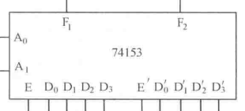

<h1 align="center">数字电路</h1>

$$
% 设置
\newcommand{\aneg}[1]{\hspace{-0.75em}&#1&\hspace{-0.75em}}
\newcommand{\aneq}{\aneg{=}}
% 上述指令用于在使用 array 环境时调整等号左右间距
\newcommand{\eqs}{\quad\;}
% 上述指令用于 align 环境中, &= 的换行对齐时调整第二行位置
\renewcommand{\d}{\displaystyle}

% 字符
\renewcommand{\i}{\mathrm{i}}
\renewcommand{\j}{\mathrm{j}}
\renewcommand{\k}{\mathrm{k}}
\newcommand{\e}{\textup{e}}
\newcommand{\ve}{\varepsilon}
\newcommand{\Beta}{\mathit{B}}
\newcommand{\omicron}{\mathit{o}}
\newcommand{\Omicron}{\mathit{O}}

% 原本的定义为:
% \newcommand{\cal}[1]{\mathcal{#1}}
\newcommand{\bm}[1]{\boldsymbol{#1}}
\renewcommand{\cal}[1]{\mathcal#1}
\renewcommand{\scr}[1]{\mathscr#1}
\renewcommand{\frak}[1]{\mathfrak#1}
\newcommand{\bb}[1]{\mathbb#1}

% 数集
\newcommand{\D}{\mathbb{D}}
\newcommand{\E}{\mathbb{E}}
\newcommand{\F}{\mathbb{F}}
\newcommand{\J}{\mathbb{J}}
\newcommand{\K}{\mathbb{K}}
\renewcommand{\L}{\mathbb{L}}

% 上下标
\newcommand{\trans}{^\mathrm{T}}
\newcommand{\inv}{^{-1}}
\newcommand{\madj}[1]{^{\pqty{#1^*}}}	% m 重伴随矩阵
\newcommand{\adj}{^*}
\newcommand{\vector}[1]{\overrightarrow{#1}}
\newcommand{\wavy}[1]{\overset\sim#1}	% \tilde 或 \widetilde 不明显, 容易与 \bar 或 \overline 混淆

% 序列
\newcommand{\ccdots}{\cdot\cdots\cdot}
\newcommand{\oneton}{1,2,\cdots,n}
\newcommand{\oneto}[1]{1,2,\cdots,#1}

\newcommand{\ssto}[3]{#1_1 #3 #1_2 #3 \cdots #3 #1_{#2}}
\newcommand{\ssup}[3]{#1^1 #3 #1^2 #3 \cdots #3 #1^{#2}}
\newcommand{\soneto}[2]{\ssto{#1}{#2}{,}}
\newcommand{\splus}[2]{\ssto{#1}{#2}{+}}

% 括号
\newcommand{\aqty}[1]{\expval{#1}}
\newcommand{\pbqty}[1]{\left(#1\right]}
\newcommand{\bpqty}[1]{\left[#1\right)}
\newcommand{\floor}[1]{\left\lfloor#1\right\rfloor}
\newcommand{\ceil}[1]{\left\lceil#1\right\rceil}

% 矩阵宏简写
\newcommand{\bmatrix}[1]{\begin{bmatrix}#1\end{bmatrix}}
\newcommand{\Bmatrix}[1]{\begin{Bmatrix}#1\end{Bmatrix}}
\newcommand{\vmatrix}[1]{\begin{vmatrix}#1\end{vmatrix}}
\newcommand{\Vmatrix}[1]{\begin{Vmatrix}#1\end{Vmatrix}}

% 常用微分
\newcommand{\dx}{\dd{x}}
\newcommand{\dy}{\dd{y}}
\newcommand{\dz}{\dd{z}}
\newcommand{\dt}{\dd{t}}
\newcommand{\ds}{\dd{s}}
\newcommand{\dr}{\dd{r}}

% 一般的微分
% 如果只使用 \dd{x}\dd{y} 的话, 中间会有多余的间隔.
\newcommand{\df}{\dd}
\newcommand{\ddf}[2]{\,\mathrm{d}#1\mathrm{d}#2}	% 微分形式 differential form
\newcommand{\dddf}[3]{\,\mathrm{d}#1\mathrm{d}#2\mathrm{d}#3}

% 高阶微分
\newcommand{\dxdy}{\ddf{x}{y}}
\newcommand{\dydz}{\ddf{y}{z}}
\newcommand{\dzdx}{\ddf{z}{x}}
\newcommand{\dudv}{\ddf{u}{v}}
\newcommand{\drdt}{\ddf{r}{\theta}}
\newcommand{\dxdydz}{\dddf{x}{y}{z}}

% 矩阵的宏指令
\newcommand{\pmcmn}[3]{\begin{pmatrix}
	#1_{11} & #1_{12} & \cdots & #1_{1#3} \\
	#1_{21} & #1_{22} & \cdots & #1_{n#3} \\
	\vdots & \vdots && \vdots \\
	#1_{#2 1} & #1_{#2 2} & \cdots & #2_{n#3} \\
\end{pmatrix}}

\newcommand{\pmc}[1]{\pmcmn{#1}{n}{n}}
\newcommand{\pvcn}[2]{\begin{pmatrix}
	#1_1 \\ #1_2 \\ \vdots \\ #1_{#2}
\end{pmatrix}}

\newcommand{\pvc}[1]{\pvcn{#1}{n}}
\newcommand{\pto}{\overset{P}{\to}}

% 函数名
\renewcommand{\char}{\operatorname{char}}	% 由于已存在此命令, 不可使用 DeclareMathOperator
\renewcommand{\r}{\operatorname{r}}
\DeclareMathOperator{\st}{s.t.\,}	% 虽然不是函数名, 但用了这个指令就放这儿了.
\DeclareMathOperator{\diag}{diag}	% 不需要定义太多, 一个文件里用到什么定义什么,
\DeclareMathOperator{\Ker}{Ker}		% 毕竟特殊的函数名太多太多了.
\DeclareMathOperator{\Aut}{Aut}		% 便捷与效率的权衡.
\DeclareMathOperator{\Inn}{Inn}
\DeclareMathOperator{\GL}{GL}
\DeclareMathOperator{\SL}{SL}
\DeclareMathOperator{\stab}{stab}
\DeclareMathOperator{\orb}{orb}
\DeclareMathOperator{\lcm}{lcm}
\DeclareMathOperator{\Var}{Var}
\DeclareMathOperator{\Cov}{Cov}
\DeclareMathOperator{\Corr}{Corr}
\DeclareMathOperator{\rot}{rot}
\DeclareMathOperator{\sgn}{sgn}
\DeclareMathOperator{\Outer}{Outer}
\DeclareMathOperator{\Even}{Even}
\DeclareMathOperator{\Scalar}{Scalar}
\DeclareMathOperator{\Vector}{Vector}
\DeclareMathOperator{\arsh}{arsh}
\DeclareMathOperator{\arch}{arch}
\DeclareMathOperator{\arth}{arth}
\renewcommand{\Re}{\operatorname{Re}}	% 自带 \Re 的效果是 \mathrm{Re}, 前后无空格, 故重写
\renewcommand{\Im}{\operatorname{Im}}

% 运算符
% 可以用 \bigcap, \bigcup, \bigoplus, \bigotimes 替代
\newcommand{\capop}{\displaystyle\mathop\cap\limits}
\newcommand{\cupop}{\displaystyle\mathop\cup\limits}
\newcommand{\oplusop}{\mathop\oplus\limits}
\newcommand{\otimesop}{\mathop\otimes\limits}
\newcommand{\bigoplusop}{\mathop\bigoplus\limits}
\newcommand{\bigotimesop}{\mathop\bigotimes\limits}

% 积分
\newcommand{\dint}{\displaystyle\int}
\newcommand{\inti}{\dint_{-\infty}^{+\infty}}
\newcommand{\intoi}{\dint_0^{+\infty}}

\newcommand{\intl}{\displaystyle\int\limits}
\newcommand{\iintl}{\displaystyle\iint\limits}
\newcommand{\iiintl}{\displaystyle\iiint\limits}

% 求和
\newcommand{\dsum}{\displaystyle\sum}
\newcommand{\csum}[1]{\dsum_{#1=1}^\infty}
\newcommand{\nsum}{\csum{n}}
\newcommand{\ksum}{\csum{k}}
\newcommand{\nosum}{\dsum_{n=0}^\infty}
\newcommand{\insum}{\dsum_{i=1}^n}
\newcommand{\knsum}{\dsum_{k=1}^n}

% 求积
\newcommand{\dprod}{\displaystyle\prod}
\newcommand{\nprod}{\dprod_{n=1}^\infty}
\newcommand{\noprod}{\dprod_{n=0}^\infty}
\newcommand{\inprod}{\dprod_{i=1}^n}

% 极限
\newcommand{\liml}{\lim\limits}
\newcommand{\ulim}{\overline\lim\limits_{n\to\infty}}
\newcommand{\dlim}{\underline\lim\limits_{n\to\infty}}
% 注意这里的 d 是 down, 而不是 displaystyle

\newcommand{\xlim}{\lim\limits_{x\to x_0}}
\newcommand{\nlim}{\lim\limits_{n\to\infty}}
\newcommand{\clim}[1]{\lim\limits_{#1\to\infty}}

% 并集
\newcommand{\incup}{\bigcup_{i=1}^n}
\newcommand{\nocup}{\bigcup_{n=1}^\infty}
\newcommand{\iocup}{\bigcup_{i=1}^\infty}

% 交集
\newcommand{\incap}{\bigcap_{i=1}^n}
\newcommand{\nocap}{\bigcap_{n=1}^\infty}
\newcommand{\iocap}{\bigcap_{i=1}^\infty}

% 差分
\newcommand{\DD}{\Delta}
\newcommand{\DV}[2]{\dfrac{\DD#1}{\DD#2}}
\newcommand{\nDV}[3]{\dfrac{\DD^{#1}#2}{\DD#3^{#1}}}

% 求导
\newcommand{\ddv}{\displaystyle\dv}
\newcommand{\dpdv}{\displaystyle\pdv}

% 缩写
\newcommand{\LRA}{\Leftrightarrow}
\newcommand{\RLA}{\Leftrightarrow}
\newcommand{\LA}{\Leftarrow}
\newcommand{\RA}{\Rightarrow}

\newcommand{\lra}{\leftrightarrow}
\newcommand{\rla}{\leftrightarrow}
\newcommand{\la}{\leftarrow}
\newcommand{\ra}{\rightarrow}

\newcommand{\QRLA}{\quad\RLA\quad}
\newcommand{\QRA}{\quad\RA\quad}
\newcommand{\LLRA}{\Longleftrightarrow}

\newcommand{\QNRA}{\quad\nRightarrow\quad}
\newcommand{\qnra}{\quad\nrightarrow\quad}

\newcommand{\wt}{\widetilde}

% 图形符号
\newcommand{\qed}{\quad\square}
\renewcommand{\parallel}{\mathrel{/\mskip-2.5mu/}}
\newcommand{\paralleleq}{\hspace{0.5em}{^{^{\parallel}}}\hspace{-1.04em}=}
\newcommand{\rt}{\matrm{Rt}\triangle}

% 分块矩阵
\newenvironment{mat}[1]{
	\begin{array}{#1}
}{
	\end{array}
}

\newenvironment{pmat}[1]{
	\left( \begin{array}{#1}
}{
	\end{array} \right)
}

\newenvironment{bmat}[1]{
	\left[ \begin{array}{#1}
}{
	\end{array} \right]
}

\newenvironment{Bmat}[1]{
	\left\{ \begin{array}{#1}
}{
	\end{array} \right\}
}

\newenvironment{vmat}[1]{
	\left\lvert \begin{array}{#1}
}{
	\end{array} \right\rvert
}

\newenvironment{Vmat}[1]{
	\left\lVert \begin{array}{#1}
}{
	\end{array} \right\rVert
}
$$

[TOC]

## 第 1 章  数码与码制

### 1.1  进制的表示

十进制数字正常表示, 其它进制数字的每一位用十进制数字表示, 并且加上括号后再右下角用十进制数字写出其进制.

如八进制 (32)~8~ = 26, 一百进制 (3, 14, 15)~100~ = 31415.

特殊的, 对于十六进制, 记 A~F 分别对应十进制的 10~15, 如 (5A)~16~ = 90.

### 1.2  进制的转换

#### 1.2.1 其它进制转十进制

$$
N = (k_n \cdots k_1 k_0.k_{-1} \cdots k_{-m})_p
= \sum_{i = -m}^n k_i p^i.
$$

#### 1.2.2  十进制转其它进制

若 $ N = (k_n \cdots k_1 k_0.k_{-1} \cdots k_{-m})_p $, 则
$$
\forall i \in \Z \colon
k_i \equiv \floor{N p^{-i}} \mod p.
$$
实际计算时, 可分别求解整数部分与小数部分, 每次对 $ Np^{-i} $ 乘上 $ p\inv $ (求整数部分) 或 $p$ (求小数部分.

#### 1.2.3  任意进制相互转换

- 欲将 $ p_1 $ 进制转换为 $ p_2 $ 进制, 可先将 $ p_1 $ 进制转换为十进制, 然后转换为 $ p_2 $ 进制.
- 特殊的, 十六进制转换为二进制, 可对每一位单独转换;
- 二进制转换为十六进制, 可先将每四位二进制看成一个整体.
- [在线进制转换器 | 菜鸟工具 (runoob.com)](https://c.runoob.com/front-end/58/)

### 1.3  二进制运算

二进制的加减乘除与十进制类似.

二进制负数的补码等于其反码加一.

计算 $ \pm N_1 \pm N_2 $, 先对 $ \pm N_1 $ 和 $ \pm N_2 $ 求补码 (注意数位), 原码相加后舍去最高进位, 再求一次补码即得 $ \pm N_1 \pm N_2 $ 的原码.

### 1.4  常用的编码

- 二–十进制代码 (BCD 代码)
  - 恒权代码
    - 8421 码.
    - 2421 码.
    - 5211 码.
  - 非恒权代码
    - 余 3 码.
    - 余 3 循环码.
- 格雷码 (循环码)
- ASCII 码.

## 第 2 章  逻辑代数基础

实际上, 概统里的事件运算属于可测空间 $ (\Omega, \cal F) $ 里的 $ \sigma $ 代数 ($ \sigma $ 域) (详见随机过程笔记). 布尔代数是事件运算的特例, 实际上, 当 $ \Omega = \Bqty{a} $ 时, $ \cal F $ 就退化为了布尔代数.

因此概统里的事件运算公式, 对于布尔代数也都成立. 数电书上列举的公式, 其实对于事件运算也都适用.

不过布尔代数也具有一些特殊的性质, 比如 $ \sigma $ 代数里的交集与并集, 只能构成交换幺半群, 但是布尔代数里的逻辑和与逻辑或却能构成交换环 (实际上是一个域).

---

- 异或 $ A \oplus B = A\overline B + \overline A B $.
- 同或 $ A \odot B = A \cdot B + \overline A \cdot \overline B $.
- 关系 $ \overline{A \oplus B} = A \odot B $.

常用公式

- 分配律 $ A + BC = (A + B) (A + C) $.
- 吸收律
  - $ A + AB = A $.
  - $ A + A'B = A + B $.

- 吸收律
  - $ A(A+B) = A $.
  - $ A(A'+B) = AB $.

- 交叉互换律 $ AB + A'C = (A+C)(A'+B) = AB + A'C + BC $.

基本定理

- 代入定理
- 反演定理
- 对偶定理

## 第 3 章  组合逻辑电路

### 3.1  组合逻辑电路的简介

- 数字电路

  - 按功能特点分类

    - 组合逻辑电路
    - 时序逻辑电路

  - 按集成度分类

    - 小规模集成电路 (SSI, small scale integrated circuits)

    - 中规模集成电路 (MSI, medium scale integrated circuits)

    - 大规模集成电路 (LSI, large scale integrated circuits)

    - 超大规模集成电路 (VLSI, very large scale integrated circuites)

- 计算机管理教学 (CMI, computer managed instruction)
- 计算机辅助教学 (CAI, computer assisted instruction)

### 3.2  组合逻辑电路的分析与设计

#### 3.2.1  SSI 组合逻辑电路的分析

**步骤**

1. 电路图 -> 表达式.
2. 化简表达式.
3. 列出真值表.
4. 分析、确定功能.

#### 3.2.2  SSI 组合逻辑电路的设计

**步骤**

1. 明确功能, 确定变量个数.
2. 列真值表.
3. 写函数表达式.
4. 化简并画出逻辑图.

### 3.3  组合逻辑电路中的竞争与冒险

#### 3.3.1  产生的原因

由于延时而产生竞争, 如果可能产生错误, 则称该竞争为冒险.

若某种输入导致运算中含有 $ A + \overline A $ 和 $ A \overline A $, 则会产生冒险.

#### 3.3.2  消除的方法

1. 改变表达式的形式.
2. 增加冗余项 (如果有相切的则用圈连接起来).
3. 引入封锁脉冲或选通脉冲.
4. 在输出端并接滤波电容: 在消除毛刺的情况下, 电容要尽可能小.

### 3.4  组合逻辑集成电路

#### 3.4.1  编码器

信息 -> 二进制 (输入多)

- 普通编码器

  - 二进制编码器
    - 以 8-3 为例 $ \begin{cases}
      	Y_2 = I_4 + I_5 + I_6 + I_7, \\
      	Y_1 = I_2 + I_3 + I_6 + I_7, \\
      	Y_0 = I_1 + I_3 + I_5 + I_7.
      \end{cases} $ 
  - 十进制编码器 (二-十进制有限编码器)
    - 即 10-4 编码器
    - 含标志位 GS: 有输入即为 1.
- 优先编码器

  - 以 4-2 编码器为例 $ \begin{cases}
    	Y_1 = I_3 + \overline{I}_3 I_2 = I_3 + I_2, \\
    	Y_0 = I_3 + \overline{I}_3 \overline{I}_2 I_1 = I_3 + \overline{I}_2 I_1.
    \end{cases} $ 
- 集成电路编码器

  - 8-3 线优先编码器 **74148** 
    - 输入端: I'~7~, ..., I'~0~.
    - 输出端: A'~2~, A'~1~, A'~0~, <u>输出反码</u>.
    - 选通使能端: I'~S~, 又称为控制端, 有效时正常工作.
    - 扩展端: E', 正常工作且<u>有输入</u>时输出有效 (0).
    - 选通输出端: S', 正常工作且<u>无输入</u>时为输出有效 (0).
  - 8-3 线优先编码器 CD4532
    - I~7~, ..., I~0~, GS, Y~2~, Y~1~, Y~0~, EI, EO.
    - 输入使能端 EI = 0, 输出恒为零.
    - EI = 1, 无输入, 则 EO = 1.
    - EI = 1, 有输入, 则 GS = 1, EO = 0.
  - 两片 74148 或 CD4532 实现 16-4
  - 优先编码器 74HC148 (8-3)
    - I~7~, ..., I~0~, Y'~ES~, Y'~2~, Y'~1~, Y'~0~, S', Y'~S~.
    - 选通输入端 S' = 1, 所有输出端被封锁在高电平. (如 Y'~0~ = 1)
    - S' = 0, 无输入, 则 Y'~S~ = 0.
    - S' = 0, 有输入, 则 Y'~EX~ = 0, Y'~S~ = 1.
  - 优先编码器 74HC147 (10-4)
    - I'~9~, ..., I'~0~, Y'~3~, ..., Y'~0~.
- 注意: <u>使能端即使不用, 也要接地.</u>

#### 3.4.2  译码器

二进制 -> 信息 (输入少)

- 二进制译码器

  - 3-8 线译码器 **74138** 

    - 输入端: A'~2~, A'~1~, A'~0~.
    - 输出端: F'~0~, ..., F'~7~.
    - 输入控制端: S~1~, S'~2~, S'~3~. (即 100 时工作)

  - 74LS139 双二线四线译码器 (低电平有效)

  - 1/2 74LS139

    - E', A~0~, A~1~, Y'~0~, ..., Y'~3~.
    - E' = 1, 所有输出端被封锁在高电平.
    - E' = 0, 正常输出 (注意低电平有效)

  - 74LS138 (3-8) (低电平有效) :star: 

    - E~3~, E'~2~, E'~1~, A~0~, A~1~, A~2~, Y'~0~, ..., Y'~7~.

      注意 E~3~ 没有非号.

    - 只有 E~3~, E~1~, E~1~ 为 1, 1, 0 时才正常输出.

  - 74LS138 的应用

    - 扩展 (5 线 - 32 线): 利用使能端.
    - 实现三变量的 **逻辑函数**.
    - 数据分配器

- 十进制译码器 (二–十进制译码器)

  - 输入: A~3~, ..., A~0~, 为二进制数.

  - 输出: F~0~, ..., F~9~, 译为十进制.

- 显示译码器 (代码转化器)

  - 分类
    - 数码重迭式
    - 点阵式
    - 分段式: 七段显示器
      - 共阴: 译码器输出高电平有效
      - 共阳: 译码器输出低电平有效
  - 七段共阳显示器 **74LS47**
    - 试灯输入 LT' = 0 (有效), 则译码器输出均为低电平 (亮灯).
    - 灭灯输入 BI' = 0 (有效), 则译码器输出均为高电平 (灭灯).
    - 灭零输入 RBI' = 0 (有效), 则 0 不显示.
    - 灭零输出 RBO': 当 RBI' = 0 且数字为 0 时, RBO' = 0.
  - 七段共阴显示器 CD4511
    - 输出: a, b, c, d, e, f, g.
    - 输入: A~3~, ..., A~0~.
    - 控制端 LT', BL', LE
    - 若 LT' = 0, 则都亮.
    - 若 LT' = 1, BL = 0, 则灭灯.
    - 若 LT' = BL' = LE' = 1, 则为锁存.
    - 若 LT' = 1, BL' = 1, LE = 0, 则为正常状态.

#### 3.4.3  数据分配器

- 介绍
  - 数据分配器 (DEMUX)
    - 又称为多路分配器或多路调节器.
    - 单输入, 多输出.

  - 数据选择器 (MUX)
    - 又称为多路开关.
    - 多输入, 单输出.

- 数据分配器
  - 用 3-8 线译码器 74138 构成 8 路数据分配.
  - 令 S~1~ = 1, S~2~ = S~3~ = D 即输入端, 于是可用 A~2~, A~1~, A~0~ 实现<u>原码输出</u>.
  - 令 S~1~ = D 即输入端, S~2~ = S~3~ = 1, 于是可用 A~2~, A~1~, A~0~ 实现<u>反码输出</u>.

#### 3.4.4  数据选择器

**集成数据选择器**

- 双四选一 **74153**
  - 控制端 E' = 0 (有效) 时正常工作.
- 八选一 74HC151
  - I~0~, ..., I~7~, A~2~, A~1~, A~0~, EN, L, L'
  - L 和 L' 为输出端, A~i~ 为控制端, EN 为使能端.
  - 若 EN = 1, 则输出恒为零.
  - 若 EN = 0, 则正常输出.
- 74LS153 双四选一: 共用使能端
- 应用
  - 实现 **逻辑函数** (通过 151 或 153)
    - 法一, 若 A 和 B 作为控制端, 则将逻辑函数表示为 A'B' () + A'B () + ...
    - 法二: 利用卡诺图 (注意顺序)
  - 扩展: 四选一 -> 十六选一
    - 法一: 四个四选一, 输出四线, 再加一个四选一.
    - 法二: 四个四选一, 利用对使能端的控制实现只有一个输出.
  - 并行输入 -> 串行输出

#### 3.4.5  数值比较器

- 1 位二进制比较器
  - A, B, F~A>B~, F~A=B~, F~A<B~.
  - 输出
    - F~A>B~ = AB'.
    - F~A=B~ = A'B.
    - F~A<B~ = A'B' + AB.
  - 结果的互斥性
    - F~A=B~ = (F~A>B~ + F~A<B~)'.
    - 其余同理.
- 2 位二进制比较器
  - A = A~1~A~0~, B = B~1~B~0~.
  - F~A>B~ = (A~1~>B~1~) + (A~1~=B~1~) (A~0~>B~0~).
  - F~A=B~ = (A~1~=B~1~) (A~0~=B~0~).
  - F~A<B~ = (A~1~<B~1~) + (A~1~=B~1~) (A~0~<B~0~).
- 集成载值比较器
  - 4 位数值比较器 **74LS85** 
    - A = A~3~A~2~A~1~A~0~.
    - B = B~3~B~2~B~1~B~0~.
    - 级间输入: I~A>B~, I~A=B~, I~A<B~.
  - 74LS85 的扩展 (比较 2^n^ 位数字)
    - 串联: 需要 2^n-2^ 个芯片, 需要 2^n-2^ 个单位时间.
    - 并联: 需要的芯片数更多, 但是需要的时间更短.

#### 3.4.6  算术运算电路

- 一位加法器

  - 半加器 HA

    - 两个输入端: A, B.

    - 两个输出端: 和端 S, 进位端 C.

    - S = A'B + AB' = A $ \oplus $ B.

    - C = AB.

      

  - 全加器 FA

    - 三个输入端: A~i~, B~i~, C~i-1~.

    - 两个输出端: S~i~, C~i~.

    - 实现思路 1 和 2 (略去下标)

      - S~i~ = A'B'C + A'BC' + AB'C' + ABC = A $ \oplus $ B $ \oplus $ C.

        注: 只有输入奇数个 1, 才会输出 1, 于是可用全加器判断奇偶.

      - C~i~ = AB + BC + AC = (A $ \oplus $ B) C + AB.

        注: 只有输入超过一个 1, 才会输出 1.

    - 实现思路 3: 利用两个半加器.
    
      

- 多位加法器

  - 串行加法器 (慢)
  - 并行加法器
    - 串行进位 (慢)
    - 超前进位: 由递推式逐项展开.

- 集成 4 位超前进位加法器 74LS283

  - 8 位二进制数相加: 两个芯片的串行.
  - 8421 BCD 码 -> 余 3 码. (即各位 + 3)

- 减法器

  - 理论基础

    - 记 A 是一个正的二进制数, 如 10010
    - 原码
      - [+A]~原~ = 0A (如 010010)
      - [-A]~原~ = 1A (如 110010)

    - 补码
      - [+A]~补~ = [+A]~原~ (如 010010)
      - [-A]~补~ = [-(2^n^ - A)]~原~ (如 101110)

    - 反码
      - [+A]~反~ = [+A]~原~ (如 010010)
      - [-A]~反~ = [-A']~原~ (如 101101)

    - 关系
      - [-A]~原~ = 2^n^ + A
      - [-A]~反~ = [-(2^n^ - 1 - A)]~原~
      - [-A]~补~ = [-A]~反~ + 1

  - 欲计算 ±A ± B, 确定所需位数之后,

    将 A 与 B 取为补码后相加, 舍去过高的进位,

    结果再次取为补码.

- 算术逻辑单元 ALU

- 集成算术逻辑单元

#### 3.4.7  可编程逻辑电路

- PLD (Programmable Logic Device) 的结构

$$
\xymatrix{
	\ar[r]^-{输入信号} &
	\boxed{输入电路} \ar[r]^-{互补输入} &
	\boxed{与门阵列} \ar[r]^-{乘积项} &
	\boxed{或门阵列} \ar[r]^-{和项} &
	\boxed{输出电路} \ar[r]^-{输出函数} \ar@{-}[d] &
	\\
	&
	\ar[u] &
	\ar@{-}[l] &
	\ar@{-}[l]_-{反馈输入} &
	\ar@{-}[l] &
}
$$

- PLD 的表示方式

  - 连接方式

    - 实心点 (不可编程)
    - 叉点 (可以编程)
    - 无点 (未相连)

  - 基本门电路的表示方式

    

  - 编程技术: 二极管 + 熔丝工艺.

- PLD 的分类

  - 低密度 PLD (LD)
    - PROM: 可编程只读存储器 (programmable read-only memory).
      - 与阵列固定, 或阵列可编程.
    - PLA: 可编程逻辑阵列 (programmable logic array).
      - 与或阵列可编程.
    - PAL: 可编程阵列逻辑 (programmable array logic)
      - 与阵列可编程, 或阵列固定.
    - GAL: 通用阵列逻辑 (general array logic)
      - 与阵列可编程, 或阵列固定.
  - 高密度 PLD (HD)
    - EPLD
    - CPLD
    - FPGA

- 组合逻辑电路的 PLD 实现 (以全加器为例)

## 第 4 章  触发器

### 4.1  基本触发器

#### 4.1.1  RS 触发器

#### 4.1.2  D 触发器

#### 4.1.3  JK 触发器

#### 4.1.4  T 触发器

### 4.2  TTL 集成触发器

### 4.3  MOS 集成触发器

### 4.4  触发器的相互转换

## 第 5 章  时序逻辑电路

### 5.1  时序逻辑电路的表示方法

- 结构: 存储电路 (+ 组合电路).
- 概念
  - 现态 Q^n^.
  - 次态 Q^n+1^.
- 分类
  - 按触发方式
    - 同步时序电路: 所有触发器公用一个时钟信号.
    - 异步时序电路: 不再公用一个时钟信号 (有的触发器的时钟信号是另一个触发器的输出).
  - 另一种分类方式
    - 米里型: 输出状态与输入和现态有关.
    - 莫尔型: 输出状态仅与现态有关; 输入可以影响现态.
- 记号
  - 组合电路的输入信号为 X / I, 输出信号为 F / O,
  - 存储电路的输入信号为 Z / E, 输出信号为 Q / S.
- 时序逻辑电路的表示方法
  - 逻辑表达式
    - 输出方程: F(t~n~) = W[X(t~n~), Q(t~n~)].
    - 状态方程: Q(t~n+1~) = G[Z(t~n~), Q(t~n~)].
    - 驱动方程 (激励方程): Z(t~n~) = H[X(t~n~), Q(t~n~)].
  - 功能表
  - 状态表
  - 状态图
  - 波形图

### 5.2  时序逻辑电路的分析方法

1. 求解五大方程

   1. **时钟方程**: 对于异步时序电路, 列出 CP 的输入信号.
   2. **驱动方程**: 即触发器输入信号的逻辑表达式.
   3. **特性方程**: 即触发器的输入输出方程.
   4. 驱动方程 $+$ 特性方程 $ \ra $ **状态方程**.
   5. 输入信号 $+$ 状态方程 $ \ra $ **输出方程**.

2. 绘制直观图表

   1. 一般的，对于米里型

      1. 功能表（A Q~1~ Q~0~ | Q~1~^n+1^ Q~0~^n+1^ Z）
      2. **状态转换表**（<u>Q~1~ Q~0~ \ A</u> | 0 | 1 | Z）
      3. **状态转换图**（节点：Q~1~ Q~0~，路径：A / Z）
      4. （时序波形图）

   2. 特殊的，对于莫尔型

      1. 功能表（A Q~1~ Q~0~ | Q~1~^n+1^ Q~0~^n+1^ Z）
      2. **状态转换表**（<u>Q~1~ Q~0~ \ A</u> | 0 | 1 | Z）
      3. **状态转换图**（节点：Q~1~ Q~0~ / Z，路径：A）
      4. （时序波形图）

   3. 特殊的，如果无输入与输出，仅列写状态表

      1. **状态表**（Q~3~ Q~2~ Q~1~）
      2. 循环的起始点用箭头连接

   4. 如果触发器数量较多，可不列写 Q 的表达式，而利用口诀.

      这里以无输入与输出为例，若有输入与输出，可直接在表格中添加.

      1. **状态转换真值表**（$ Q_3 Q_2 Q_1 \mid J_3 K_3 \mid J_2 K_2 \mid J_1 K_1 \mid\mid Q_3^{n+1} | Q_2^{n+1} | Q_1^{n+1} $）
      2. **状态转换图**（节点：$ Q_3 Q_2 Q_1 $，路径：无）

3. 说明逻辑功能

---

- 计数器
  - 需要检查是否*无挂起*（*自启动*）
  - 有挂起的解决方式
    - 置初始值
    - 修正电路
  - 举例
    - 同步六进制计数器（教材例 1）
    - 异步五进制计数器（教材例 2；视频 3 例 2）
    - 异步六进制计数器（视频 3 例 1）
    - 异步七进制计数器（视频 3 例 3）
- 序列检测器
  - 1111 序列检测器（教材例 2；视频例 1）

---

异步时序逻辑电路的分析

- 无反馈线（从异步部分到时序部分）：先分析同步，再分析异步
- 有反馈线：一步一步分析.

### 5.3  寄存器

#### 5.3.1  数码寄存器

- 工作方式
  - 双拍: 接受两个脉冲, 先清零, 后接收数码.
  - 单拍: 只需一个接受脉冲即可, 优于双拍.
- 集成数码寄存器又称为 N 位 D 触发器.
- 并行输入 - 并行输出.
- 常用芯片
  - 74HC374：边沿触发 8 位（并行/并行）
  - 74HC373：电平触发 8 位（并行/并行）

#### 5.3.2  锁存器

- 一位 D 锁存器
  - CP = 1 时, 为基本 RS 触发器.
  - CP ↓, 则为锁存.

#### 5.3.3  移位寄存器

- 功能
  - 串行 - 并行
  - 并行 - 串行
- 4 位双向移位寄存器 74194

| $ \overline{R_d} $ | $S_1$ | $ S_0 $ | 工作状态 |
| :----------------: | :---: | :-----: | :------: |
|         0          |   X   |    X    |   清零   |
|         1          |   0   |    0    |   保持   |
|         1          |   0   |    1    |   右移   |
|         1          |   1   |    0    |   左移   |
|         1          |   1   |    1    |   送数   |

并行 - 串行数据转换.

### 5.4  计数器

应用: 时钟脉冲计数、定时、分频、产生节拍脉冲、数字运算.

#### 5.4.1  计数器的分类

- 按触发方式
  - 同步计数器
  - 异步触发器
- 按计数容量
  - n 位二进制计数器: 2^n^ 个状态.
  - n 位十进制计数器: 10^n^ 个有效循环状态.
  - n 位任意进制计数器
- 按数的增减分类
  - 加法计数器
  - 减法计数器
  - 可逆计数器: 可加可减.
    - 双时钟加/减计数器
    - 单时钟加/减计数器

#### 5.4.2  二进制计数器

- 4 位同步二进制加法计数器 **74161** (中规模集成计数器)
  - **清零**: $ \overline{C_r} = 0 $, 则输出 Q~3~Q~2~Q~1~Q~0~ = 0000.
  
  - **预置数** (送数): $ \overline{L_D} = 0 $, 则 <u>CP 脉冲上升沿</u>时 Q~3~Q~2~Q~1~Q~0~ = D~3~D~2~D~1~D~0~.
  
    注意清零是立刻清零，预置数要等到下一个脉冲.
  
  - **计数**: P = T = 1 时计数;
    
    - 到 1111 时, 进位输出 Q~CC~ = 1,
    - 再输入一个计数脉冲后, 返回 0000 状态, Q~CC~ = 0.
    
  - **保持**
    - P = 0, T = 1 时保持工作状态, 进位输出状态不变;
    - P = 1, T = 0 时保持工作状态, 进位输出 Q~CC~ = 0.
  
- 应用
  - 两片 74161 连接成 8 位<u>同步</u>二进制加法器.
  - 两片 74161 连接成 8 位<u>异步</u>二进制加法器.

#### 5.4.3  十进制计数器

- 8421 编码十进制计数器
  - TTL 型: 74160
  - MOS 型: CD40160
- 二–五–十进制异步加法器
  - 74290.

#### 5.4.4  可逆计数器

- 4 位同步二进制加/减计数器
  - 单时钟结构: 74191, 74169, CD4516
  - 双时钟结构: 74193, CD40193
- 同步十进制加/减计数器
  - 单时钟结构
    - 74190
      - 0 加 1 减
      - 0 允许，1 不允许（即保持）
    - 74168, CD4510
  - 双时钟结构: 74192, CD40192

#### 5.4.5  任意进制计数器

- **乘数法**: NM 进制计数器可由 N 进制计数器和 M 进制计数器组成.
- **复位法**: M (M > N) 位计数器输入 N 个计数脉冲后归零.
  - 思路一: 利用清零端.
  - 思路二: 利用预置数.
- **置数法**: 即跳过某一段长为 M - N 的序列.
  - 置最小数.
  - 置最大数.
  - 置中间数.

#### 5.4.6  移位寄存器型计数器

- 环形计数器
- 扭环形计数器 (约翰逊计数器)
- 注: 最好选择相邻状态只有一个变量不同的循环, 这样不会产生竞争冒险现象.

### 5.5  顺序脉冲发生器

顺序脉冲发生器 (节拍脉冲发生器)
- 组成: 计数器 (+ 译码器)
- 消除干扰脉冲 (竞争–冒险现象导致的尖脉冲)
  - 将选通脉冲或封锁脉冲加在控制输入端
  - 选用扭环形计数器, 使得循环中相邻状态只有一个变量不同.
  - 选用环形计数器.

### 5.6  时序逻辑电路设计

设计步骤

1. 画出状态转换图或状态转换表.
2. 状态化简.
3. 状态分配.
4. 确定触发器类型, 求出驱动方程和输出方程.
5. 画出逻辑图.
6. 检查电路是否能自启动

## 第 9 章  数模转换和模数转换

9.1  数模转换器 DAC

9.1.1  二进制权电阻 DAC

- 电阻的值域范围太宽, 不易于集成, 且对精度的要求高.

9.1.2  R-2R 倒 T 型电阻网络 DAC

9.1.3  DAC 的主要技术指标

- $ 分辨率 = \dfrac{\text{最小输出电压}}{\text{满刻度输出电压}} = \dfrac{1}{2^n - 1} $.
- 转换误差
  - 输出满刻度 FSR 的百分数.
  - 最低有效位 LSB 的倍数.

- 建立时间.

9.1.4  集成 DAC

电流输出型 8 位 D/A 转换电路 DAC0832.

9.1.5  D/A 转换器应用

9.2  数模转换器 ADC

9.2.1  基本概念

- 采样、保持
  - 采样定理: 采样频率应大于模拟信号最高频率分量的两倍.
  - 三种采样–保持电路.
  - 性能指标: 采集时间, 保持电压下降速率.
- 量化、编码

9.2.2  并行比较 ADC

- 转换速度快.
- n > 4 时电路复杂.

9.2.3  反馈比较 ADC

- 计数型 ADC: 速度慢.
- 逐次逼近型 ADC: 速度较快、抗干扰特性较差.

9.2.4  双积分型 ADC

模拟电压 → 时间间隔 → 数字量.

- 抗干扰能力强.
- 工作性能稳定.
- 工作速度低.
- 只能用于变化缓慢的电压.

9.2.5  主要技术指标

- 转换速度
- 分解度: 若 n 位 ADC 满量程输入模拟电压为 $ U $, 则分解度为 $ U/2^n $.
- 量化误差.
- 精度.
- 输入模拟电压范围.

## 第 10 章  数字系统分析与设计

10.1  数字系统

- 数据处理器
  - 包含若干子系统, 如计数器、寄存器、译码器等.
  - 包含组合逻辑电路和时序逻辑电路.
- 控制器: 管理数据处理器的子系统.
- (输入设备、输出设备)

10.2  寄存器传送语言

1. 传送语句 P: B ← A
2. 并列传送语句 P~1~: A ← B, P~2~: C ← D
3. 总线传送语句
4. 输入/输出线线端传送语句
5. 存储器传送语句
6. 条件语句
7. 算术微操作语句
8. 逻辑微操作语句
9. 移位微操作

10.3  简易计算机

10.3.1  基本结构

- 主机
  - 中央处理器 (CPU)
    - 运算器 (算术逻辑单元)
    - 控制器
  - 存储器
- 外部设备: 输入/输出设备

## A  附录

### A.1  组合逻辑电路芯片

|     功能     |         分类          | 芯片型号 |                            引脚图                            |
| :----------: | :-------------------: | :------: | :----------------------------------------------------------: |
|    编码器    |   8-3 线优先编码器    |  74148   |  |
|    译码器    |  3-8 线二进制译码器   |  74138   |  |
|  数据选择器  |       双四选一        |  74153   |  |
|              |        八选一         |  74151   |  |
|  数值比较器  |   4 位 CMOS 比较器    | MC14585  |  |
|              |    4 位 TTL 比较器    |   7485   |  |
| 算术运算电路 |        加法器         |  半加器  |  |
|              |                       |  全加器  |  |
|              |  4 位超前进位加法器   | 74LS283  |   |
|              |   算术逻辑运算单元    |  74181   |  |
| 奇偶校验电路 | 8 位奇偶发生器/校验器 |  74180   |  |

### A.2  时序逻辑电路芯片

|  功能  |          分类          |  型号   |                            引脚图                            |
| :----: | :--------------------: | :-----: | :----------------------------------------------------------: |
| 寄存器 |     4 位数码寄存器     | 74LS175 |                                                              |
|        |     8 位 D 锁存器      | 74LS373 |  |
|        |   4 位双向移位寄存器   |  74194  |  |
| 计数器 |  4 位同步二进制计数器  |  74161  |  |
|        |      十进制计数器      |  74160  |                                                              |
|        |      十进制计数器      | CD40160 |  |
|        | 二-五-十进制异步计数器 |  74290  |                                                              |
|        |       可逆计数器       |  74190  |  |

