- 编码器
  - 8-3 线优先编码器 **74148**
  - 8-3 线优先编码器 CD4532
  - 8-3 线优先编码器 74HC148
  - 10-4 线优先编码器 74HC147
- 译码器
  - 二进制译码器
    - 3-8 线译码器 **74138**
    - 双 2-4 线译码器 74LS139
    - 3-8 线译码器 74LS138
  - 十进制译码器
    - CMOS 二–十进制译码器 CD4028
  - 显示译码器
    - 七段共阳显示器
      - **74LS47**
      - 7447
    - 七段共阴显示器
      - CD4511
      - 7448
- 数据分配器
- 数据选择器
  - 双四选一 **74153**
  - 八选一 **74151**
  - 八选一 74HC151
  - 双四选一 74LS153
- 4 位数值比较器
  - 74LS85
  - MC14585

- 算术运算电路
  - 4 位超前进位加法器 74LS283
  - 算术逻辑运算单元 74181
- 寄存器
  - 数码寄存器：74LS175
  - 锁存器：74LS373
  - 4 位双向移位寄存器：74LS194

- 计数器
  - 4 位同步二进制加法计数器：**74161**
  - 10 进制计数器：**74160**、**CD40160**
  - 

#### 组合逻辑电路的芯片

|     功能     |         分类          | 芯片型号 |                            引脚图                            |
| :----------: | :-------------------: | :------: | :----------------------------------------------------------: |
|    编码器    |   8-3 线优先编码器    |  74148   | 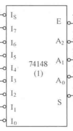 |
|    译码器    |  3-8 线二进制译码器   |  74138   | 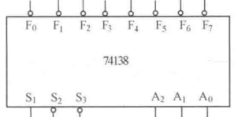 |
|  数据选择器  |       双四选一        |  74153   | 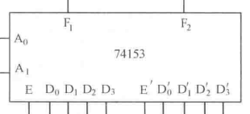 |
|              |        八选一         |  74151   | 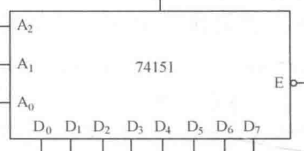 |
|  数值比较器  |   4 位 CMOS 比较器    | MC14585  | 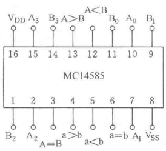 |
|              |    4 位 TTL 比较器    |   7485   |  |
| 算术运算电路 |        加法器         |  半加器  | 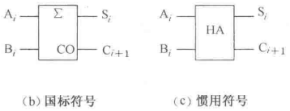 |
|              |                       |  全加器  | 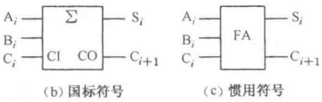 |
|              |  4 位超前进位加法器   | 74LS283  | 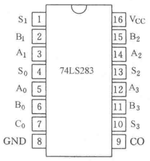 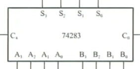 |
|              |   算术逻辑运算单元    |  74181   | 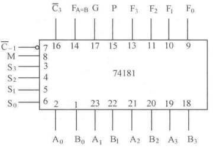 |
| 奇偶校验电路 | 8 位奇偶发生器/校验器 |  74180   | 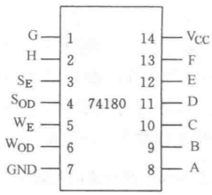 |

时序逻辑电路的芯片

|  功能  |          分类          |  型号   |                            引脚图                            |
| :----: | :--------------------: | :-----: | :----------------------------------------------------------: |
| 寄存器 |     4 位数码寄存器     | 74LS175 |                                                              |
|        |     8 位 D 锁存器      | 74LS373 | 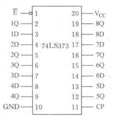 |
|        |   4 位双向移位寄存器   |  74194  | 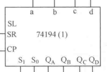 |
| 计数器 |  4 位同步二进制计数器  |  74161  | 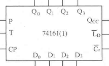 |
|        |      十进制计数器      |  74160  |                                                              |
|        |      十进制计数器      | CD40160 | 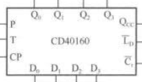 |
|        | 二-五-十进制异步计数器 |  74290  |                                                              |
|        |       可逆计数器       |  74190  | 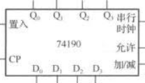 |
|        |                        |         |                                                              |

