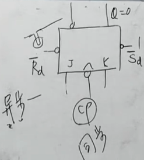

## 第 5 章  半导体存储电路

### 5.3  触发器

电路图、功能表 (真值表)、特性方程 (输出方程)、状态图、激励表

#### 5.3.1 RS 触发器

触发器 (Flip-Flop), RSFF

##### 1  基本 RSFF

- 由与非门构成 (0 低电平有效).
- R (reset): 使 Q = 0 的端子.
- S (set): 使 Q = 1 的端子.
- R = S = 0 时为异常状态.

##### 2  同步 RSFF

- CP = 0 时状态不会改变. (clock pulse)

- CP = 1 时, 高电平有效.

  

- 由同步 RSFF 计数器构成的计数式电路, 存在空翻现象.

  

##### 3  主从 RSFF

- 写出逻辑函数, 得到特征方程与约束条件

  

- 主从 RSFF 的电路

  - <u>上升沿</u>将信号送到第一个同步 RSFF 输出端.

  - <u>**下降沿**</u>将信号送到第二个同步 RSFF 输出端.

    

- 主从 RSFF 构成计数式电路, 不会出现空翻现象.

  

#### 5.3.2  主从 JKFF

下述电路图不重要, 主要看真值表.

记忆方式

- 00 不变
- 11 翻转
- 01, 10 同 J

特性方程: $ Q^{n + 1} = J \overline {Q^n} + \overline K Q^n $.

状态图

激励表 :crescent_moon: 

#### 5.3.3  边沿 FF

##### 1  边沿 JKFF

注意图形的 CP 端:

- 没有三角有圆圈, 说明是主从 FF.
- 有三角说明是边沿触发器, 
  - 有圆圈说明是后沿 (下降沿)
  - 没圆圈说明是前沿 (上升沿)

##### 2  边沿 DFF

Q^n+1^ = D.

状态图

激励表

应用: 计数器

增加一个控制端

#### 5.3.4  TFF

将 JK 触发器的 J, K 两端连在一起作为 T 输入端.

可控计数式触发器.

TFF 即 $ Q^{n + 1} = T \oplus Q^n $,

T'FF 指每次脉冲都会翻转, 即 $ Q^{n + 1} = \overline{Q^n} $.

#### 5.3.5  可设初态

- R'~d~ 和 S'~d~ 的优先级更高. (异步)
- CP (同步)

---

### 5.4  总结

描述方式:

- 电路图
- 功能表 (真值表, 特性表)
- 特性方程
- 驱动表 (激励表)
- 状态图 (状态转换图)

---

- RS 触发器	
  - 基本 RSFF
    - $ Q^{n + 1} = S + \overline{R} Q^n, RS = 0 $.
    - R 有效则 Q 置 0, S 有效则 Q 置 1,
    - 均无效则 Q 不变, 均有效则为工作不正常.
  - 同步 RSFF
    - CP 为 1, 则同 RSFF.
    - CP 为 0, 则 Q 不变.
    - 存在空翻现象, 不可作为计数器.
  - 主从 RSFF
    - <u>上升沿</u>将信号送到第一个同步 RSFF 输出端.
    - <u>**下降沿**</u>将信号送到第二个同步 RSFF 输出端.
    - 可作为计数器, 但是要求信号脉冲过程中输入不变.
- JK 触发器
  - 主从 JKFF
    - 图形符号: 没有三角, 有圆圈.
    - 00 不变, 11 翻转, 其余同 J.
    - $ Q^{n + 1} = J \overline {Q^n} + \overline K Q^n $.
    - 激励表:
  - 边沿 JKFF (有三角)
    - 有圆圈说明时后沿.
    - 没圆圈说明时前沿.
- D 触发器
  - 同步 DFF: $ Q^{n + 1} = D $.
  - 边沿 DFF

- F 触发器
  - TFF: $ Q^{n + 1} = T \oplus Q^n $.
  - T'FF: $ Q^{n + 1} = \overline{Q^n} $.

---

描述方式:

- 电路图
- 功能表 (真值表, 特性表)
- 特性方程
- 驱动表 (激励表)
- 状态图 (状态转换图)

5.1  RS 触发器

RSFF, Reset-Set Flip-Flop.

5.1.1  基本 RSFF

**说明**

- R 有效时 Q 为 0.
- S 有效时 Q 为 1.
- 以低电平有效为例.

**特性表**

| $ \overline{R} $ | $ \overline S $ | $ Q^{n+1} $ | $ \overline{Q^{n+1}} $ |
| :--------------: | :-------------: | :---------: | :--------------------: |
|        0         |        0        |    不定     |          不定          |
|        0         |        1        |      0      |           1            |
|        1         |        0        |      1      |           0            |
|        1         |        1        |  $ {Q^n} $  |   $ \overline{Q^n} $   |

**特性方程**	$ Q^{n + 1} = S + \overline{R} Q^n $, 约束方程为 $ \overline{R} + \overline{S} = 1 $.

**驱动表**	

| Q^n^→Q^n+1^ | S' R' |
| :---------: | :---: |
|     0 0     |  1 X  |
|     0 1     |  0 1  |
|     1 0     |  1 0  |
|     1 1     |  X 1  |

5.1.2  同步 RSFF

**说明**

- 高电平有效, 在 CP = 1 时正常工作. (CP, Clock Pulse)
- 欲由同步 RSFF 计数器构成的计数式电路, 存在空翻现象, 因此无法构成计数式电路.

**特性表**

| $ \mathrm{CP} $ |   $R$   |   $S$   | $ Q^{n+1} $ |
| :-------------: | :-----: | :-----: | :---------: |
|        0        | $ \cp $ | $ \cp $ |   $ Q^n $   |
|        1        |    0    |    0    |    $Q^n$    |
|        1        |    0    |    1    |      1      |
|        1        |    1    |    0    |      0      |
|        1        |    1    |    1    |    不定     |

**特性方程**	当 CP = 1 时, $ Q^{n + 1} = S + \overline{R} Q^n $, 约束方程为 $ RS = 0 $.

**驱动表**	在 CP = 1 时,

| Q^n^→Q^n+1^ | S R  |
| :---------: | :--: |
|     0 0     | 0 X  |
|     0 1     | 1 0  |
|     1 0     | 0 1  |
|     1 1     | X 0  |

**状态转换图**

**时序波形图**

5.1.3  主从 RSFF

**说明**

- <u>上升沿</u>将信号送到第一个同步 RSFF 输出端.
- <u>**下降沿**</u>将信号送到第二个同步 RSFF 输出端.
- 主从 RSFF 构成计数式电路, 不会出现空翻现象.