<h1 align="center">模拟电路</h1>

$$
% 设置
\newcommand{\aneg}[1]{\hspace{-0.75em}&#1&\hspace{-0.75em}}
\newcommand{\aneq}{\aneg{=}}
% 上述指令用于在使用 array 环境时调整等号左右间距
\newcommand{\eqs}{\quad\;}
% 上述指令用于 align 环境中, &= 的换行对齐时调整第二行位置
\renewcommand{\d}{\displaystyle}

% 字符
\renewcommand{\i}{\mathrm{i}}
\renewcommand{\j}{\mathrm{j}}
\newcommand{\o}{\mathrm{o}}
\newcommand{\e}{\textup{e}}
\newcommand{\ve}{\varepsilon}
\newcommand{\Beta}{\mathit{B}}
\newcommand{\omicron}{\mathit{o}}
\newcommand{\Omicron}{\mathit{O}}

% 数集
\newcommand{\D}{\mathbb{D}}
\newcommand{\E}{\mathbb{E}}
\newcommand{\F}{\mathbb{F}}
\newcommand{\J}{\mathbb{J}}
\newcommand{\K}{\mathbb{K}}
\renewcommand{\L}{\mathbb{L}}

% 上下标
\newcommand{\trans}{^\mathrm{T}}
\newcommand{\inv}{^{-1}}
\newcommand{\adj}[1]{^{\pqty{#1^*}}}
\newcommand{\vector}[1]{\overrightarrow{#1}}

% 序列
\newcommand{\ccdots}{\cdot\cdots\cdot}
\newcommand{\oneton}{1,2,\cdots,n}
\newcommand{\oneto}[1]{1,2,\cdots,#1}

\newcommand{\ssto}[3]{#1_1 #3 #1_2 #3 \cdots #3 #1_{#2}}
\newcommand{\ssup}[3]{#1^1 #3 #1^2 #3 \cdots #3 #1^{#2}}
\newcommand{\soneto}[2]{\ssto{#1}{#2}{,}}
\newcommand{\splus}[2]{\ssto{#1}{#2}{+}}

% 括号
\newcommand{\aqty}[1]{\expval{#1}}
\newcommand{\pbqty}[1]{\left(#1\right]}
\newcommand{\bpqty}[1]{\left[#1\right)}
\newcommand{\floor}[1]{\left\lfloor#1\right\rfloor}
\newcommand{\ceil}[1]{\left\lceil#1\right\rceil}

% 矩阵宏简写
\newcommand{\bmatrix}[1]{\begin{bmatrix}#1\end{bmatrix}}
\newcommand{\Bmatrix}[1]{\begin{Bmatrix}#1\end{Bmatrix}}
\newcommand{\vmatrix}[1]{\begin{vmatrix}#1\end{vmatrix}}
\newcommand{\Vmatrix}[1]{\begin{Vmatrix}#1\end{Vmatrix}}

% 常用微分
\newcommand{\dx}{\dd{x}}
\newcommand{\dy}{\dd{y}}
\newcommand{\dz}{\dd{z}}
\newcommand{\dt}{\dd{t}}
\newcommand{\ds}{\dd{s}}
\newcommand{\dr}{\dd{r}}

% 一般的微分
% 如果只使用 \dd{x}\dd{y} 的话, 中间会有多余的间隔.
\newcommand{\df}{\dd}
\newcommand{\ddf}[2]{\,\mathrm{d}#1\mathrm{d}#2}	% 微分形式 differential form
\newcommand{\dddf}[3]{\,\mathrm{d}#1\mathrm{d}#2\mathrm{d}#3}

% 高阶微分
\newcommand{\dxdy}{\ddf{x}{y}}
\newcommand{\dydz}{\ddf{y}{z}}
\newcommand{\dzdx}{\ddf{z}{x}}
\newcommand{\dudv}{\ddf{u}{v}}
\newcommand{\drdt}{\ddf{r}{\theta}}
\newcommand{\dxdydz}{\dddf{x}{y}{z}}

% 矩阵的宏指令
\newcommand{\pmcmn}[3]{\begin{pmatrix}
	#1_{11} & #1_{12} & \cdots & #1_{1#3} \\
	#1_{21} & #1_{22} & \cdots & #1_{n#3} \\
	\vdots & \vdots && \vdots \\
	#1_{#2 1} & #1_{#2 2} & \cdots & #2_{n#3} \\
\end{pmatrix}}

\newcommand{\pmc}[1]{\pmcmn{#1}{n}{n}}
\newcommand{\pvcn}[2]{\begin{pmatrix}
	#1_1 \\ #1_2 \\ \vdots \\ #1_{#2}
\end{pmatrix}}

\newcommand{\pvc}[1]{\pvcn{#1}{n}}
\newcommand{\pto}{\overset{P}{\to}}

% 函数名
\renewcommand{\char}{\operatorname{char}}	% 由于已存在此命令, 不可使用 DeclareMathOperator
\renewcommand{\r}{\operatorname{r}}
\DeclareMathOperator{\st}{s.t.\,}	% 虽然不是函数名, 但用了这个指令就放这儿了.
\DeclareMathOperator{\diag}{diag}	% 不需要定义太多, 一个文件里用到什么定义什么,
\DeclareMathOperator{\Ker}{Ker}		% 毕竟特殊的函数名太多太多了.
\DeclareMathOperator{\Aut}{Aut}		% 便捷与效率的权衡.
\DeclareMathOperator{\Inn}{Inn}
\DeclareMathOperator{\GL}{GL}
\DeclareMathOperator{\SL}{SL}
\DeclareMathOperator{\stab}{stab}
\DeclareMathOperator{\orb}{orb}
\DeclareMathOperator{\lcm}{lcm}
\DeclareMathOperator{\Var}{Var}
\DeclareMathOperator{\Cov}{Cov}
\DeclareMathOperator{\Corr}{Corr}
\DeclareMathOperator{\rot}{rot}
\DeclareMathOperator{\sgn}{sgn}

\def\arsh{\ensuremath{\operatorname{arsh}}}
\def\arch{\ensuremath{\operatorname{arch}}}
\def\arth{\ensuremath{\operatorname{arth}}}

% 运算符
% 可以用 \bigcap, \bigcup, \bigoplus, \bigotimes 替代
\newcommand{\capop}{\displaystyle\mathop\cap\limits}
\newcommand{\cupop}{\displaystyle\mathop\cup\limits}
\newcommand{\oplusop}{\mathop\oplus\limits}
\newcommand{\otimesop}{\mathop\otimes\limits}
\newcommand{\bigoplusop}{\mathop\bigoplus\limits}
\newcommand{\bigotimesop}{\mathop\bigotimes\limits}

% 积分
\newcommand{\dint}{\displaystyle\int}
\newcommand{\inti}{\dint_{-\infty}^{+\infty}}
\newcommand{\intoi}{\dint_0^{+\infty}}

\newcommand{\intl}{\displaystyle\int\limits}
\newcommand{\iintl}{\displaystyle\iint\limits}
\newcommand{\iiintl}{\displaystyle\iiint\limits}

% 求和
\newcommand{\dsum}{\displaystyle\sum}
\newcommand{\csum}[1]{\dsum_{#1=1}^\infty}
\newcommand{\nsum}{\csum{n}}
\newcommand{\ksum}{\csum{k}}
\newcommand{\nosum}{\dsum_{n=0}^\infty}
\newcommand{\insum}{\dsum_{i=1}^n}
\newcommand{\knsum}{\dsum_{k=1}^n}

% 求积
\newcommand{\dprod}{\displaystyle\prod}
\newcommand{\nprod}{\dprod_{n=1}^\infty}
\newcommand{\noprod}{\dprod_{n=0}^\infty}
\newcommand{\inprod}{\dprod_{i=1}^n}

% 极限
\newcommand{\liml}{\lim\limits}
\newcommand{\ulim}{\overline\lim\limits_{n\to\infty}}
\newcommand{\dlim}{\underline\lim\limits_{n\to\infty}}
% 注意这里的 d 是 down, 而不是 displaystyle

\newcommand{\xlim}{\lim\limits_{x\to x_0}}
\newcommand{\nlim}{\lim\limits_{n\to\infty}}
\newcommand{\clim}[1]{\lim\limits_{#1\to\infty}}

% 差分
\newcommand{\DD}{\Delta}
\newcommand{\DV}[2]{\dfrac{\DD#1}{\DD#2}}
\newcommand{\nDV}[3]{\dfrac{\DD^{#1}#2}{\DD#3^{#1}}}

% 求导
\newcommand{\ddv}{\displaystyle\dv}
\newcommand{\dpdv}{\displaystyle\pdv}

% 缩写
\newcommand{\bm}[1]{\boldsymbol{#1}}
\newcommand{\LRA}{\Leftrightarrow}
\newcommand{\RLA}{\Leftrightarrow}
\newcommand{\LA}{\Leftarrow}
\newcommand{\RA}{\Rightarrow}

\newcommand{\lra}{\leftrightarrow}
\newcommand{\rla}{\leftrightarrow}
\newcommand{\la}{\leftarrow}
\newcommand{\ra}{\rightarrow}

\newcommand{\QRLA}{\quad\RLA\quad}
\newcommand{\QRA}{\quad\RA\quad}
\newcommand{\LLRA}{\Longleftrightarrow}

\newcommand{\QNRA}{\quad\nRightarrow\quad}
\newcommand{\qnra}{\quad\nrightarrow\quad}

% 图形符号
\newcommand{\qed}{\quad\square}
\renewcommand{\parallel}{\mathrel{/\mskip-2.5mu/}}
\newcommand{\paralleleq}{\hspace{0.5em}{^{^{\parallel}}}\hspace{-1.04em}=}
\newcommand{\rt}{\matrm{Rt}\triangle}
$$

[TOC]

## 第 1 章	常用半导体器件

    

        
<b>PN 结电流方程推导</b>

        <iframe src="ifsrc\PN 结电流方程推导.html" height=600></iframe>
    

- **二极管**

  - 本征半导体 **载流子浓度**: $ n_i = p_i = K_i T^{\tfrac{3}{2}} \e^{-\tfrac{E_\text{GO}}{2kT}} $, 其中 $ k = 8.63 \times 10^{-5} \text{ eV/K} $ 为玻尔兹曼常数，$ E_{\text{GO}} $ 为热力学零度时破坏共价键所需能量，又称禁带宽度.
  - 三价 P (如硼) 五价 N (如磷).
  - 二极管的参数
    - **二极管电流** $ i = I_\text S \pqty{\e^{\tfrac{qu}{kT}} - 1} = I_\text S \pqty{\e^\tfrac{u}{U_\text{T}} - 1} $.
    - $I_\text{S}$ 为反向饱和电流 ($ I_\text{R} $ 为反向电流).
    - **动态电阻** $ \dfrac{1}{r_\text d} \approx \dfrac{I_\text{S}}{U_\text{T}} \e^{\tfrac{u}{U_\text{T}}} \approx \dfrac{I_\text{D}}{U_\text{T}} $, 其中常温下 $ U_\text{T} = 26\ \mathrm{mV} $.
    - 正向开启电压 $ U_\text{on} $.
    - 正向导通电压 $ U_\text{D} $. (可变)
  - 稳压管的参数
    - 温度系数 $ \alpha = \DV{U_\text{Z}}{T} $ 先减后增.
    - 稳定电压 $ U_\text{Z} $.
  - 温度升高 10℃, 反向饱和电流 $I_\text{S}$ 增大约一倍.
  - 加正向电压, 空间电荷区变宽.

- **晶体管**

  - 参数

    - 最大集电极电流 $ I_\text{CM} = \eval{\dfrac{P_\text{CM}}{u_\text{ce}}}_{u_\text{ce} = 1\ \mathrm{V}} $.
    - 极间反向击穿电压 $ U_\text{(BR) CBO},\, U_\text{(BR) CEO},\, U_\text{(BR) EBO} $.
    - 穿透电流 $ I_\text{CEO} $ 小, 温稳.
    - 极间饱和电压 $ U_\text{CEO} $.
    - 饱和管压降 $ U_\text{CES} $.

  - 温度的影响

    - 温度 ↑ 少子 ↑ 漂移 ↑ $ I_\text{CBO} $ ↑ $ I_\text{CEO} $ ↑.
    - 温度 ↑ $u_\text{BE}$ ↓ (令 $i_\text{B}$ 不变), 即相同 $u_\text{BE}$, $i_\text{B}$ ↑.
    - 温度 ↑ β ↑

  - | 材料 | 开启电压 | 导通电压  | 反向饱和电流         |
    | ---- | -------- | --------- | -------------------- |
    | 硅   | 0.5 V    | 0.5-0.8 V | < 1 $\mu\mathrm{A}$  |
    | 锗   | 0.1 V    | 0.1-0.3 V | 数十 $\mu\mathrm{A}$ |

  - 放大时晶体管的判断

    - 基极 b 始终是中间大小.
    - $ U_\text{C} $ 大, NPN; $ U_\text{C} $ 小, PNP.

## 第 2 章	基本放大电路

- 性能指标
  - 非线性失真系数 $ D = \sqrt{
    	\pqty{\dfrac{A_2}{A_1}}^2 + \pqty{\dfrac{A_3}{A_1}}^2 + \cdots
    } $.
  - 最大不失真输出电压 $ U_\text{opp} = 2\sqrt{2} U_\text{om} $.
  - 效率 $ \eta = \dfrac{P_\text{om}}{P_{_\text{V}}} $.
- 晶体管 h 参数等效模型的简化
  - $ r_\text{be} \approx r_\text{bb'} + (1 + \beta) r_\text{b'e'} = r_\text{bb'} + (1 + \beta) \dfrac{U_\text{T}}{I_\text{EQ}} = r_\text{bb'} + \dfrac{U_\text{T}}{I_\text{BQ}} $.
  - 注意这里的 $r_\text{be}$ 与第四章中 π 参数等效模型中的不同, 后者是前者的 $ 1 + \beta $ 倍.
- 放大电路的 $R_\i$ 与 $R_\text{s}$ 无关, $R_\text{o}$ 与 $R_\text{L}$ 无关.

**h 参数等效模型**

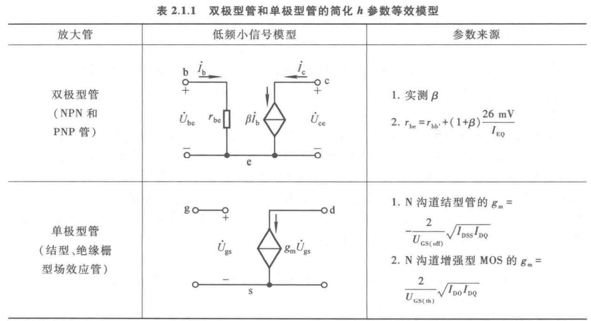

**晶体管基本放大电路**

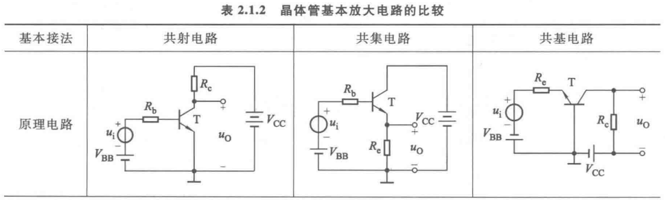

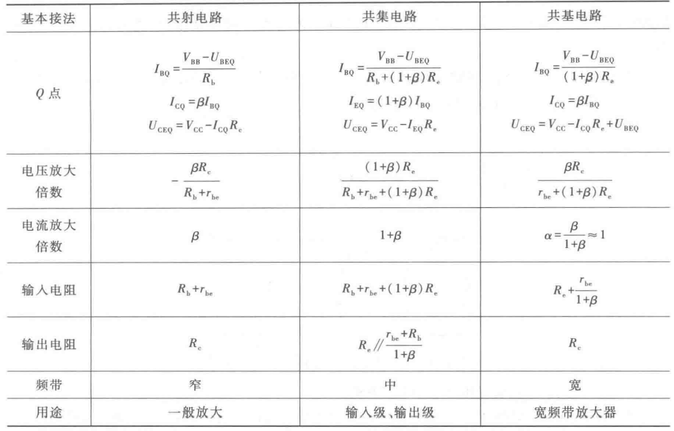

**阻容耦合晶体管基本放大电路**

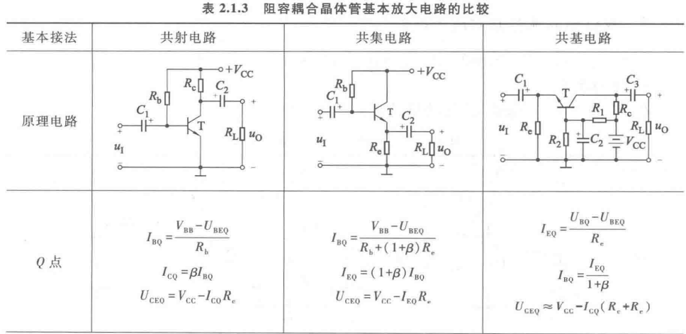

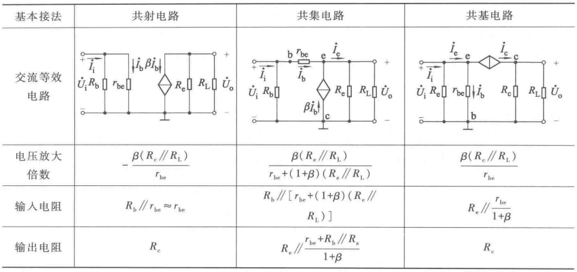

**场效应管基本放大电路**

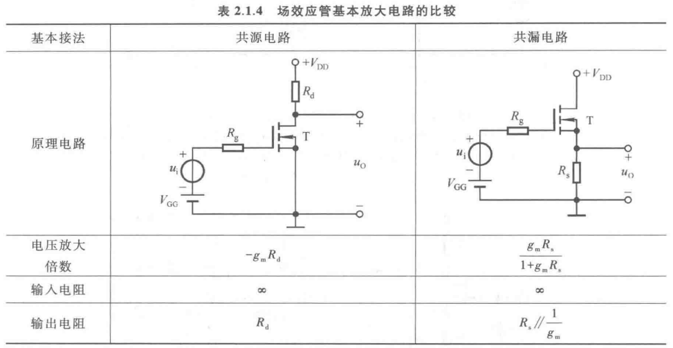

---

使用基本放大电路空载情况下动态参数的数量级:

| 接法 | $ \vqty{\dot{A}_u} $ | $ A_\i $      | $ R_\i $                                                 | $ R_\text o $                                             |
| ---- | -------------------- | ------------- | -------------------------------------------------------- | --------------------------------------------------------- |
| 共射 | > 100                | $ \beta $     | 0.1 - 10 kΩ                                              | 0.1 - 10 kΩ                                               |
| 共集 | < 1                  | $ 1 + \beta $ | 10 - 100 kΩ                      | 10 - 100 Ω |
| 共基 | > 100                | $ \alpha $    | 10 - 30 Ω | 0.1 - 10 kΩ                                               |
| 共源 | 1~100                |               | > 1 MΩ                                                   | 0.1 - 10 kΩ                                               |
| 共漏 | < 1                  |               | > 1 MΩ                                                   | 0.1 - 10 kΩ                                               |

注意

- 如果第二级的输入电阻较小, 则会使第一级的电压放大倍数变小, 所以为得到较大的电压放大倍数, 第二级也不能采用共基电路.

  e.g. 若输入级为共集-共基接法, 则无法~~增大输入电阻~~, 只能展宽频带.

---

如果第一级管是 NPN 型, 则复合管是 NPN 型.
如果第一级管时 PNP 型, 则复合管是 PNP 型.

## 第 3 章	集成运算放大电路

### 3.1	多级放大电路

| 耦合方式                   | 优点                                                         | 缺点                                                         |
| :------------------------- | ------------------------------------------------------------ | ------------------------------------------------------------ |
| 直接耦合                   | 1. 低频特性好. 2. 没有大电容, 易于集成.                 | 1. 零点漂移现象. 2. 静态工作点分析麻烦. |
| 阻容耦合                   | 1. 静态工作点分析简单.                                       | 1. 低频特性差. 2. 不易于集成.                           |
| 变压器耦合                 | 1. 静态工作点分析简单. 2. 可以实现阻抗变换. $ R'_L = n^2 R_L = \pqty{\dfrac{I_2}{I_1}}^2 R_L $. | 1. 低频特性差. 2. 不易于集成.                           |
| 光电耦合 (达林顿结构) | 1. 抗干扰能力强. 2. 适用于远距离信号传输.               | 1. 不易于集成.                                               |

- 直接耦合的思路 (设置合适静态工作点的方法)

  - 增加 $ R_{\text e2} $ (会降低放大倍数)

  - 使用二极管 (正向, 压降较小)

  - 使用稳压管 (反向, 压降较大)

  - NPN 与 PNP 型管混合使用.

- 光电耦合的传输比 $ \mathrm{CTR} = \eval{\DV{i_{\text{C}}}{i_\text{D}}}_{U_{\text{CE}}} $ 一般只有 $0.1 \sim 1.5$.

- 动态分析

  - 电压放大倍数: $ \dot{A}_u = \dprod_{j = 1}^N \dot{A}_{uj} $.
  - 输入电阻: $ R_i = R_{i1} $.
  - 输出电阻: $ R_o = R_{iN} $.

  注意:

  - 当共集放大电路作为输入级时, 输入电阻与电路第二级的输入电阻有关.
  - 当共集放大电路作为输出级时, 输出电阻与倒数第二级的输出电阻有关.

### 3.2	集成运放

$$
\xymatrix{
	\boxed{输入级} \ar[r] & \boxed{中间级} \ar[r] & \boxed{输出级} \\
	& \boxed{偏置电路} \ar[ul] \ar[u] \ar[ur] & \\
}
$$

| 组成部分 | 输入级 (前置级)                                      | 中间级 (主放大级) | 输出级 (功率级)                                          | 偏置电路                       |
| -------- | ---------------------------------------------------- | ----------------- | -------------------------------------------------------- | ------------------------------ |
| 采用电路 | [差分放大电路](# 3.3.2	长尾式差分放大电路)        | 共射放大电路      | [准互补输出级](# 准互补电路)                             | [多路电流源](# 多路电流源电路) |
| 性能要求 | $R_\text i$ 大, $A_\text d$ 大, $K_{\text{CMR}}$ 大. | 放大能力强        | $R_\text o$ 小, $U_\text{om}$ 大 (幅值接近电源电压) | 温度稳定性好                   |

- 注意: 即使分立元件组成和集成运放内部完全相同的电路, 由于光速的限制, <u>高频性能也较差</u>.

### 3.3	单元电路

#### 3.3.1	抑制温度漂移

零点漂移现象又称温度漂移.

- 引入直流负反馈 $R_e$.
- 采用温度补偿 (热敏元件).
- 差分 (差动) 放大电路.

差分放大电路的概念

- 共模信号: $ u_\text{Ic} = \dfrac{u_\text{I1} + u_\text{I2}}{2} $.
- 差模信号: $ u_\text{Id} = u_\text{I1} - u_\text{I2} $.
- 共模放大倍数: $ A_\text{c} = \DV{u_\text{Oc}}{u_\text{Ic}} $.
- 差模放大倍数: $ A_\text{d} = \DV{u_\text{Od}}{u_\text{Id}} $.
- 共模抑制比: $ K_\text{CMR} = \vqty{\dfrac{A_\text d}{A_\text c}} $.

#### 3.3.2	长尾式差分放大电路

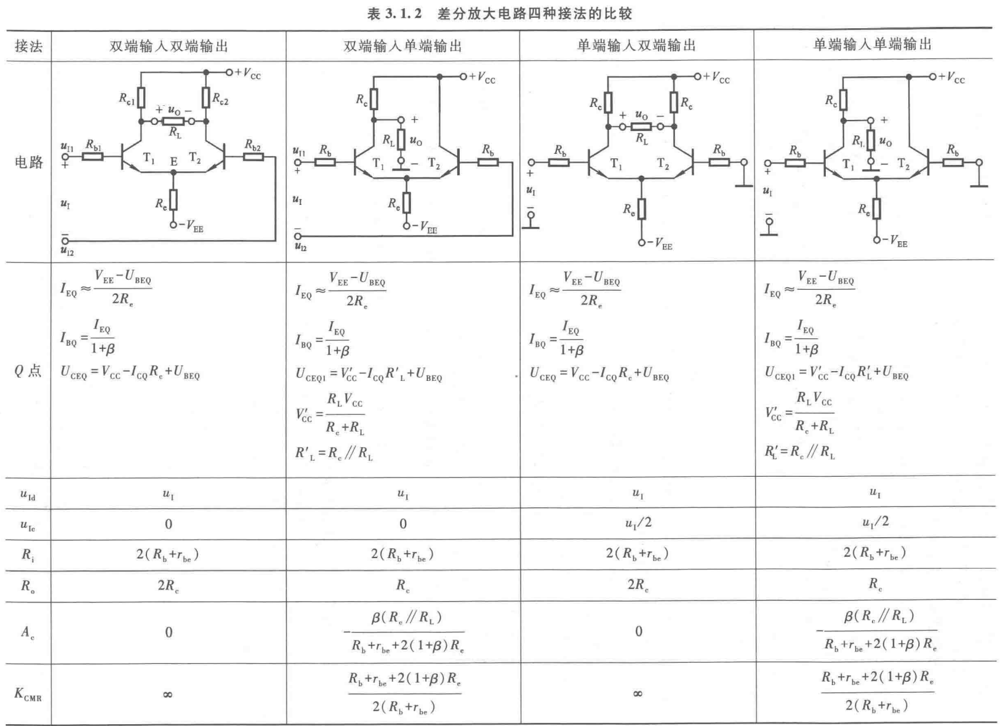

- 共同点

  - 静态工作点电流: $ I_{\text{EQ}} \approx \dfrac{
    	V_{\text{EE}} - U_{\text{BEQ}}
    }{2 R_\text e} $.
  - 差模信号: $ u_{\text{Id}} = u_\text{I} $.
  - 输入电阻: $ R_\text{i} = 2 (R_\text{b} + r_{\text{be}}) $.

- 双端输入

  - 共模信号: $ u_{\text{Ic}} = 0 $.

- 单端输入

  - 共模信号: $ u_{\text{Ic}} = \dfrac{u_{\text{I}}}{2} $.

- 双端输出

  - 静态工作点: $ U_{\text{CEQ}} \approx V_{\text{CC}} - I_{\text{CQ}} R_{\text{e}} + U_{\text{BEQ}} $.
  - 输出电阻: $ R_\text{o} = 2R_\text{c} $.
  - 差模放大倍数: $ A_\text{d} = -\beta \dfrac{R_\text{c} \parallel \cfrac{R_\text{L}}{2}}{R_\text{b} + r_{\text{be}}} $.
  - 共模放大倍数: $ A_\text{c} = 0 $.
  - 共模抑制比: $ K_\text{CMR} = +\infty $.
  - 输出电压: $ \Delta u_\text{o} = A_\text d \Delta u_\text I $.

- 单端输出

  - 静态工作点: $ U_{\text{CEQ}} \approx V'_{\text{CC}} - I_{\text{CQ}} R'_\text{L} + U_{\text{BEQ}} $.

    其中 $ V'_{\text{CC}} = \dfrac{R_\text{L} V_\text{CC}}{R_{\text{L}} + R_{\text{c}}} $, $ R'_\text{L} = R_\text{c} \parallel R_\text{L} $.

  - 输出电阻: $ R_\text{o} = R_\text{c} $.

  - 差模放大倍数: $ A_\text{d} = -\dfrac{\beta}{2} \dfrac{R_\text{c} \parallel R_\text{L}}{R_\text{b} + r_{\text{be}}} $.

  - 共模放大倍数: $ A_\text{d} = -\beta \dfrac{R_\text{c} \parallel R_\text{L}}{R_\text{b} + r_{\text{be}} + 2(1 + \beta) R_\text{e}} $.

  - 共模抑制比: $ K_\text{CMR} = \dfrac{
    	R_\text b + r_\text{be} + 2(1 + \beta) R_\text e
    }{
    	R_\text c \parallel R_\text L
    } $.

  - 输出电压: $ \Delta u_\text o = A_\text d \Delta u_\text I + A_\text c \dfrac{\Delta u_\text I}{2} $.

  注意: 如果单端输出采用有源负载, 即将 $R_\text e$ 替换为恒流源, 则等效电阻无穷大, 共模放大倍数也为零, 即 $ A_\text d = 0,\, K_\text{CMR} = +\infty $.

- 改进

  - 恒流源: 对共模信号等效为无穷大电阻.
  - 调零电位器: 输入差模信号为零时输出电压为零.
  - 场效应管: 增大输入电阻.

#### 3.3.3	电流源电路

- **基本电流源电路**

  - 镜像电流源

    - $ I_\text{R} = \dfrac{V_\text{CC} - U_{\text{BE}}}{R} $.
    - $ I_\text{C} = \dfrac{\beta}{\beta + 2} I_\text{R} $.

  - 比例电流源

    - $ I_\text{R} \approx \dfrac{V_\text{CC} - U_{\text{BE0}}}{R + R_\text{e0}} $.
    - $ I_\text{C1}
      \approx
      \dfrac{R_\text{e0}}{R_\text{e1}} I_\text R +
      \dfrac{U_\text{T}}{R_\text{e1}}
      \ln\dfrac{I_\text{R}}{I_\text{C1}}
      \approx
      \dfrac{R_\text{e0}}{R_\text{e1}} I_\text R $.

    注:

    - 利用 $ I_\text{E} \approx I_\text{S} \e^{\tfrac{U_\text{BE}}{U_\text{T}}} $ 进行推导.
    - $R_{e1}$ 较大时方可忽略第二项.

  - 微电流源

    - $ I_\text{E1} \approx \dfrac{U_\text{BE0} - U_\text{BE1}}{R_\text{e}} $.
    - $ I_\text{R} \approx \dfrac{V_\text{CC} - U_{\text{BE0}}}{R} $.
    - $ I_\text{C1} \approx \dfrac{U_\text{T}}{R_\text{e}} \ln\dfrac{I_\text{R}}{I_\text{C1}} $.

- **改进型电流源电路**

  - 加射极输出器的镜像电流源: $ I_{\text{C1}} = \dfrac{I_\text{R}}{1 + \cfrac{2}{(1+\beta)\beta}} $. (实际电力路中可加电阻 $R_{\text{e2}}$)
  - 威尔逊电流源: $ I_\text{C2} = \pqty{1 - \dfrac{2}{\beta^2 + 2\beta + 2}} I_\text{R} $.

- ##### 多路电流源电路

  - 基于比例电流源: $ I_\text{E0} R_\text{e0} \approx I_\text{E1} R_\text{e1} \approx I_\text{E2} R_\text{e2} \approx \cdots $.
  - 基于多电极管: $ \dfrac{I_\text{C0}}{S_0} = \dfrac{I_\text{C1}}{S_1} = \dfrac{I_\text{C2}}{S_2} = \cdots $.
  - 基于 MOS 管: $ \dfrac{I_\text{D0}}{S_0} = \dfrac{I_\text{D1}}{S_1} = \dfrac{I_\text{D2}}{S_2} = \cdots $.

- 以电流源为**有源负载**的放大电路

  为了提高电压放大倍数, 可以增大集电极电阻 $R_\text c$ (或漏极电阻 $R_\text d$), 但同时也需要提高电源电压. 于是可以使用电流源电路取代 $R_\text c$ (或 $R_\text d$), 在电压不变的情况下获得合适的静态电流, 且有很大的等效输出电阻.

  注意: 有源负载电路中要考虑 $ h_{22} = \dfrac{1}{r_\text{ce}} $.

  - 有源负载共射放大电路
    - $ I_\text{CQ1} = I_\text{C2} - I_\text{L} = \dfrac{\beta}{\beta + 2} I_\text{R} - \dfrac{U_\text{CEQ}}{R_\text{L}} $.
    - $ \dot{A}_u = -\beta_1 \dfrac{r_\text{ce1} \parallel r_\text{ce2} \parallel R_\text{L}}{R_\text b + r_{\text{be1}}} $.

  - 有源负载差分放大电路

#### 3.3.4	直接耦合互补输出级

- **基本电路**

  - 最大幅值: $ \pm (V_\text{CC} - \vqty{U_\text{CES}}) $.
  - 交越失真: 由 $ U_\text{on} > 0 $ 引起.

- **消除交越失真**

  - 使用二极管电路: $ U_\text{B1B2} = U_\text{D1} + U_\text{D2} $.
  - 使用 $U_\text{BE}$ 倍增电路: $ U_{\text{B1B2}} \approx \pqty{1 + \dfrac{R_3}{R_4}} U_\text{BE} $. (还可以温度补偿)

- ##### 准互补电路

  即输出管为同一类型管的电路, 常作为*功率放大电路* (OCL 电路), 是<u>电压跟随电路</u>.

  在消除交越失真的基础上, 可以使用复合管:

  - T~1~: NPN, T~2~: NPN.
  - T~3~: PNP, T~4~: NPN.

  实际应用时, $R_1$ 常用电流源取代 (即内阻为无穷大)

- **CMOS 互补输出级**

### 3.4	集成运放电路

**读图方法**

1. 找出基准电流, 分析偏置电路.
2. 简化电路, 将多路电流用电流源取代.
3. 读放大电路, 通常为[三级](# 3.2	集成运放).
4. 定量分析电路的性能特点.

**集成运放电路实例**

- 双极型集成运放电路: F007 (通用型集成运放).
- 单极型集成运放: C14573.
- 双极型与单极型混合结构集成运放
  - Bi-MOS (晶体管 - MOS 管混合)
  - Bi-CMOS (晶体管 - CMOS 管混合)
  - Bi-FET (晶体管 - 结型场效应管混合): LF153.

注意

- 通用型集成运放含有 PN 结, 存在很多结电容和分布电容, 因此高频特性很差, 仅适合放大低频信号.

### 3.5	性能指标与低频等效电路

#### 3.5.1	主要性能指标

| 指标                 | 符号                     | 物理意义                                                     | F007 典型数值 |
| -------------------- | ------------------------ | ------------------------------------------------------------ | ------------- |
| 开环差模增益         | $ A_\text{od} $          | $ 20 \lg \vqty{\dfrac{u_\text{O}}{u_\text{P} - u_\text{N}}} $ | > 94 dB       |
| 共模抑制比           | $ K_\text{CMR} $         | $ 20\lg\vqty{\dfrac{A_\text{d}}{A_\text{c}}} $               | > 80 dB       |
| 差模输入电阻         | $ r_\text{id} $          | 对差模电压信号源 的输入电阻                             | > 2 MΩ        |
| 输入失调电压         | $ U_\text{IO} $          | 使输出电压为零 的输入补偿电压  | < 2 mV        |
| $ U_\text{IO} $ 温漂 | $ \ddv{U_\text{IO}}{T} $ | $ U_\text{IO} $ 的温度系数                                   | < 20 μV / ℃   |
| 输入失调电流         | $ I_\text{IO} $          | $ \vqty{I_\text{B1} - I_\text{B2}} $                         |               |
| $ I_\text{IO} $ 温漂 | $ \ddv{I_\text{IO}}{T} $ | $ I_\text{IO} $ 的温度系数                                   |               |
| 输入偏置电流         | $ I_\text{IB} $          | $ \dfrac{I_\text{B1} + I_\text{B2}}{2} $                     |               |
| 最大共模输入电压     | $ U_\text{Icmax} $       | 能正常放大的 最大共模信号      | ±13 V         |
| 最大差模输入电压     | $ U_\text{Idmax} $       | 输入级不损坏 最大差模信号      | ±30 V         |
| -3 dB 带宽频率       | $ f_\text{H} $           | 上限截止频率                                                 | 7 Hz          |
| 单位增益带宽         | $ f_\text{C} $           | 使差模增益为 0 dB 的频率                                |               |
| 转换速率             | $ \mathrm{SR} $          | $ \vqty{\ddv{u_\text{o}}{t}}_\max $                          |               |

#### 3.5.2	低频等效电路

### 3.6	种类与选择

#### 3.6.1	集成运放的发展概况

**四代产品**

1. 分立元件放大电路的设计思想, 采用集成数字电路的工艺.

   如: μA709, F003, 5G23 等.

2. 采用有源负载, 提高开环增益, 属于通用型运放.

   如: μA741, LM324, F007, F324, 5G24.

3. 输入级采用超 β 管 (高达 1000 - 5000), 且考虑热效应, 增大共模抑制比和输入电阻.

   如: AD508, MC1556, F1556, F030.

4. 采用斩波稳零和动态稳零技术, 无需调零.

   如 HA2900, SN62088, 5G7650.

#### 3.6.2	集成运放的种类

<h5>1	按工作原理分类</h5>

1. 电压放大型
2. 电流放大型
3. 跨导放大型 (电压 -> 电流)
4. 互阻放大型 (电流 -> 电压)

<h5>2	按可控性分类</h5>

1. 可变增益运放.
2. 选通控制运放.

<h5>3	按性能指标分类</h5>

| 类型     | 性能特点                                                     | 用途                                          |
| -------- | ------------------------------------------------------------ | --------------------------------------------- |
| 高阻型   | 高输入电阻, $ r_{\text{id}} > 10^9\ \Omega $.                | 作测量放大器                                  |
| 高速型   | 单位增益带宽和转换速率高 | 数模和模数转换器, 视频放大器, 锁相环电路 |
| 低功耗型 | 工作电源低, 静态功耗低                                       | 空间技术, 遥感遥测电路                        |
| 高精度型 | 低失调, 低温漂, 低噪声, 高增益, 共模抑制比高            | 微弱信号的测量与运算, 高精度仪器         |
| 高压型   | 输出高压                                                     | 需高电压驱动的负载                            |
| 大功率型 | 输出大功率, 大电流                                           | 功率放大器, 需大电流驱动的负载           |

#### 3.6.3	集成运放的选择

1. 信号源
2. 负载
3. 精度
4. 环境

### 3.7	集成运放的使用

#### 3.7.1	使用时必做的工作

1. 集成运放的外引线 (管脚)
2. 参数测量
3. 调零和设置偏置电压
4. 消除自激振荡: 增加去耦电容, 即使用一个大容量和一个小容量的电容并联在电源正负极.

#### 3.7.2	保护措施

1. 输入保护
2. 输出保护
3. 电源端保护

## 第 4 章	放大电路的频率响应

### 4.1	频率响应

- **滤波电路**

  - **高通电路** (RC 取 R)
    - 下限截止频率: $ f_\text L = \dfrac{1}{2\pi \tau} = \dfrac{1}{2\pi RC} $.
    - 电压放大倍数: $ \dot{A}_u = \dfrac{R}{\cfrac{1}{\j\omega C} + R} = \dfrac{\j\cfrac{f}{f_\text L}}{1 + \j\cfrac{f}{f_\text L}} %= \dfrac{1}{1 + \cfrac{f_\text L}{\j f}} $.
    - 幅频特性: $ \vqty{\dot{A}_u} = \dfrac{\cfrac{f}{f_\text L}}{\sqrt{1 + \pqty{\cfrac{f}{f_\text L}}^2}} $.
    - 相频特性: $ \varphi = 90^\circ - \arctan\dfrac{f}{f_\text L} $.
  - **低通电路** (RC 取 C)
    - 上限截止频率: $ f_\text H = \dfrac{1}{2\pi \tau} = \dfrac{1}{2\pi RC} $.
    - 电压放大倍数: $ \dot{A}_u = \dfrac{\cfrac{1}{\j\omega C}}{\cfrac{1}{\j\omega C} + R} = \dfrac{1}{1 + \j\cfrac{f}{f_\text H}} $.
    - 幅频特性: $ \vqty{\dot{A}_u} = \dfrac{1}{\sqrt{1 + \pqty{\cfrac{f}{f_\text{L}}}^2}} $.
    - 相频特性: $ \varphi = -\arctan\dfrac{f}{f_\text L} $.

- **波特图**

  - 基础概念
    - 以 $ f \text- 20\lg\vqty{\dot{A}_\text{u}} $ 为坐标轴, 但常将横轴伸缩变换为 $ \lg f $.
    - 纵轴单位是分贝 ($ \mathrm{dB} $).
    - 为简单起见, 常将曲线折线化.
  - 误差分析:
    - 当 $ f = f_\text{L}\ (f_\text{H}) $ 时, 增益的误差量级是 $ -3\ \mathrm{dB} $.
    - 当 $ f = 0.1 f_\text{L}\ (10 f_\text{H}) $ 时, 相位误差的数值均约为 $ \pm 5.71^\circ $.
    - 多级放大电路的折线化波特图误差分析, 需要结合其频率响应分析.
  - 读图方法:
    - 低频段的拐点对应耦合电容或旁路电容, 高频段的拐点对应极间电容.
    - 如果高频段有 $n$ 个拐点, 每个拐点的斜率为 $ -20k_i\ \mathrm{dB} $, 则有 $ N = \insum k_i - \dfrac{n(n-1)}{2} $ 个极间电容, 为 $N$ 级放大电路. 低频段同理.
    - 注意: 从图中读出 $ \dot{A}_\text{u} $ 时, 不确定正负时要加上 $\color{red}\pm$; 不能只看拐点数, 还要看斜率.

### 4.2	晶体管的高频等效模型

- 晶体管的 **混合 π 模型**

  

  

  - 混合 π 模型对晶体管完整结构简化
    - 由于集电区电阻 $r_\text c$ 和发射区电阻 $r_\text e$ 很小, 在等效的混合 π 模型中忽略, 电阻与电压下标中的 $\text e'$ 也都写为 $ \text e $.
    - 由于发射极与集电极无直接的 PN 结, 所以不考它们的虑极间电容.
  - 简化的混合 π 模型的进一步简化
    - 由于一般有 $ r_\text{ce} \gg R_\text{L} $, $ r_\text{b'c} \gg X_{C\mu} $, 所以忽略这两个电阻.
    - 简化的混合 π 模型, 是在简化的 h 参数模型的基础上, 考虑发射结电阻, 发射结电容和集电结电容.

  $$
  \begin{align}
  	\dot{I}_{C_\mu} &= \dfrac{\dot{U}_\text{b'e} - \dot{U}_\text{ce}}{X_{C_\mu}}, \quad
  	{\color{green}
  		\dot{K} := \dfrac{\dot{U}_\text{ce}}{\dot{U}_\text{b'e}}
  	} {\color{blue}
  		= -g_\text m R'_\text L
  	} \\
  	X_{C'_\mu} &= \dfrac{\dot{U}_{b'e}}{\dot{I}_{C_\mu}}
  	= \dfrac{X_{C_\mu}}{1 - \dot{K}} \QRA
  	{\color{green}
  		C'_\mu = (1 - \dot{K}) C_\mu
  	} {\color{blue}
  		\approx \pqty{1 + \vqty{\dot{K}}} C_\mu
  	} \\
  	X_{C''_\mu} &= \dfrac{\dot{U}_\text{ce}}{\dot{I}_{C\mu}}
  	= \dfrac{\dot{K} X_{C\mu}}{1 - \dot{K}} \QRA
  	{\color{green}
  		C''_\mu = \dfrac{\dot{K} - 1}{\dot{K}} C_\mu
  	} {\color{blue}
  		\approx \pqty{1 + \vqty{\dot{K}}\inv} C_\mu
  	} \\
  	\color{green} r_\text{b'e} & {\color{green}
  		:= \dfrac{\dot{U}_\text{b'e}}{\dot{I}_\text b}
  	} = \dfrac{\dot{I}_\text e}{\dot{I}_\text b} \cdot r_\text d
  	{\color{blue}
  		\approx (1 + \beta_0) \dfrac{U_\text T}{I_\text{EQ}}
  		= \dfrac{U_\text T}{I_\text{BQ}}
  	}, \quad
  	\color{green} r_\text{be} = r_\text{bb'} + r_\text{b'e}
  	\\
  	\color{green} g_\text m & {\color{green}
  		:= \dfrac{\dot{I}_\text c}{\dot{U}_\text{b'e}}
  	} = \dfrac{\beta_0 \dot{I}_\text b}{\dot{I}_\text b r_\text{b'e}}
  	{\color{blueviolet}
  		= \dfrac{\beta_0}{r_\text{b'e}}
  	} {\color{blue}
  		= \dfrac{I_\text{CQ}}{U_\text T}
  	} \quad (\textbf{跨导系数})
  \end{align}
  $$

- 晶体管 **电流放大倍数** 的频率响应
  $$
  \begin{align}
  \dot\beta &= \eval{
  	\dfrac{\dot{I}_\text c}{\dot{I}_\text b}
  }_{U_\text{CE}}
  = \dfrac{\dot{I}_\text c}{
  	\dot{I}_\mathrm{r_{b'e}} + \dot{I}_\mathrm{C'_\pi}
  } = \dfrac{\dot{I}_\text c}{
  	\dot{U}_\text{b'e} \pqty{
  		\cfrac{1}{r_\text{b'e}} + \j\omega C'_\pi
  	}
  } \\
  &= \dfrac{g_\text m}{
  	\cfrac{1}{r_\text{b'e}} + \j\omega C'_\pi
  } = \dfrac{\beta_0}{
  	1 + \j\omega r_\text{b'e} C'_\pi
  } = \color{blue} \dfrac{\beta_0}{
  	1 + \j\cfrac{f}{f_\beta}
  } \\
  f_\beta &= \dfrac{1}{
  	2\pi r_\text{b'e} {\color{red} C'_\pi}
  } = \dfrac{1}{
  	2\pi r_\text{b'e} (C_\pi + C'_\mu)
  } = \color{blue} \dfrac{1}{
  	2\pi r_\text{b'e} (C_\pi + C_\mu)
  } \\
  \dot\alpha &= \dfrac{\dot\beta}{1 + \dot\beta}
  = \dfrac{ \cfrac{\beta_0}{1 + \beta_0} }{
  	1 + \j\cfrac{f}{(1 + \beta_0) f_\beta}
  } = {\color{blue}
  	\dfrac{\alpha_0}{1 + \j \cfrac{f}{f_\alpha}}
  } \\
  f_\alpha &= {\color{blue} (1 + \beta_0) f_\beta }
  \quad (\textbf{共基截止频率} 远大于 \textbf{共射截止频率})
  \\
  f_\text{T} &= \eval{f}_{\dot\beta = 1}
  = f_\beta \sqrt{\beta_0^2 - 1}
  \approx {\color{blue} \beta_0 f_\beta }
  \quad (\textbf{特征频率})
  \end{align}
  $$
  注意:

  - 晶体管为共基接法且发射极开路时 c-b 间的结电容记为 $ C_\text{ob} $ 和基区电阻 $r_\text{bb'}$ 都可以从半导体手册中查得, 且 $ \color{blue} C_\mu \approx C_\text{ob} $.

  - 上式中标红的 $C'_\pi$ 是跨导 $g_\text{m} = 0$ 时的值, 切不可由最左边的等式求出 $C'_\pi$, 而应该这样计算:

    1. $ \color{brown} C_\pi = \color{} \dfrac{1}{2\pi r_\text{b'e} f_\beta} - C_\mu $.
    2. $ \color{brown} C'_\pi = C_\pi + (1 + g_\text{m} R'_\text{L}) C_\mu $.
    3. $ C''_\pi = C_\pi + \pqty{1 + \dfrac{1}{g_\text{m} R'_\text{L}}} C_\mu \approx C_\pi + C_\mu $.

    由于 $ X_{C''_\pi} $ 一般远大于输出电阻并联负载电阻, 故可忽略不计, 无需计算第三式.

- 场效应管的高频等效模型

### 4.4	单管共射放大电路的频率响应

| 频段 |    极间电容 分布电容    |    耦合电容 旁路电容    |                    频段电压 放大倍数                    |                    上下限的 截止频率                    |
| :--: | :--------------------------: | :--------------------------: | :----------------------------------------------------------: | :----------------------------------------------------------: |
| 中频 |             开路             |             短路             | $ \dot{A}_\text{usm} = -\dfrac{\dot{U}_\text{b'e}}{\dot{U}_\text{s}} g_\text{m} R'_\text{L} % \dfrac{\dot{U}_\text o}{\dot{U}_\text{s}} $ |                        $ \backslash $                        |
| 低频 |             开路             | 考虑 | $ \dot{A}_\text{usl} = \dfrac{\j\cfrac{f}{f_\text{L}} \dot{A}_\text{usm}}{1 + \j\cfrac{f}{f_\text{L}}} $ | $ f_\text{L} = \dfrac{1}{2\pi \tau_{_\text L}} % \dfrac{1}{2\pi R'_\text L C} $ |
| 高频 | 考虑 |             短路             | $ \dot{A}_\text{ush} = \dfrac{\dot{A}_\text{usm}}{1 + \j\cfrac{f}{f_\text{H}}} $ | $ f_\text{H} = \dfrac{1}{2\pi \tau_{_\text{H}}} % \dfrac{1}{2\pi RC'_\pi} $ |

注意: 共射放大电路的电压放大倍数在中频段时相位角为 $ -180^\circ $.

- **频率响应的性能**

  - 频率响应的改善
    - 降低下限频率 $ f_\text{L} $, 即增大 $ \tau_{_\text{L}} = R_{\text{L}} C_\text{L} $, 或直接采用直接耦合方式.
    - 增大上限频率 $ f_\text{H} $, 即降低 $ \tau_{_\text{H}} = R_\text{H} C_\text{H} $.
  - 放大电路的定性分析
    - 耦合电容与旁路电容越多, 低频特性越差.
    - 放大电路的级数越多, 极间电容越多, 高频特性越差.
    - 共基电路的上限频率高, 频带宽.
  - **带宽增益积**: $ \vqty{\dot{A}_\text{usm} f_\text{bw}} \approx \vqty{\dot{A}_\text{usm} f_\text{H}} \approx \dfrac{1}{2\pi (r_{_\text{bb'}} + R_\text{s}) C_\mu} $.

### 4.5	多级放大电路的频率响应

- $ \dot{A}_\text{u} = \dfrac{\dot{A}_\text{um}}{
  	\bqty{
  		\dprod_{i=1}^m \pqty{
  			1 + \dfrac{f_{\text{L} i}}{\j f}
  		}
  	} \bqty{
  		\dprod_{j=1}^n \pqty{
  			1 + \j \dfrac{f}{f_{\text{H} j}}
  		}
  	}
  } $.
- 下限截止频率
  - 若有一个下限频率 $f_{\text{L}i}$ 远大于其它下限截止频率, 则整体的下限频率近似为 $f_{\text{L}i}$.
  - 若各级下限频率相差不大, 则有 $ f_\text{L} \approx 1.1 \sqrt{\dsum_{i=1}^n f_{\text{L} i}^2} $.
  - 整体的下限截止频率比任何一级下限截止频率都要高.
- 上限截止频率
  - 若有一个上限频率 $f_{\text{H}i}$ 远大于其它上限截止频率, 则整体的上限频率近似为 $f_{\text{H}i}$.
  - 若各级下限频率相差不大, 则有 $ \dfrac{1}{f_\text{H}} \approx 1.1 \sqrt{\dsum_{i=1}^n \dfrac{1}{f_{\text{H} i}^2}} $.
  - 整体的上限截止频率比任何一级上限截止频率都要低.
- e.g. 对于各级具有相同频率特性的三级放大电路, $ f_\text{H} \approx 0.52 f_\text{H1} $, $ f_\text{L} \approx f_\text{L1} $.

### 4.6	阶跃响应

- 电压的时域分析:
  - 上升: $ u_\text{b'e} = U_\text{I} \pqty{1 - \e^{-\tfrac{t}{R_\i C'_\pi}}} $.
  - 下降: $ u_\text{O} = U_\text{Om} \e^{-\tfrac{t}{R'_\text L C}} \approx U_\text{Om} \pqty{1 - \dfrac{t}{R'_L C}} $.
- 电压失真相关指标
  - 上升时间: 从 $10\%$ 上升到 $ 90\% $ 所需的时间, 即 $ t_r \approx 2.2 RC'_\pi \approx \dfrac{0.35}{f_\text{H}} $.
  - 超调量: $ U_\text{Om} - U'_\text{Om} \approx U_\text{Om} \dfrac{t_p}{R'_\text{L} C} $.
  - 倾斜率: 在指定时间 $t_p$ 内, $ \delta = \dfrac{U_\text{Om} - U'_\text{Om}}{U_\text{Om}} \times 100\% = \dfrac{t_p}{RC} \times 100\% = 2\pi f_\text{L} t_p \times 100\% $.

## 第 5 章	放大电路中的反馈

### 5.1	反馈的概念与判断

- 正反馈 / 负反馈
  - 瞬时极性法.
  - 如果从同相输入端输入正向电压, 反向输入端输入反向电压, 那么从集成运放的输出端
    引回到反相输入端的电路必然构成负反馈电路,
    引回到同相输入端的电路必然构成正反馈电路.
- 直流反馈 / 交流反馈
- 局部反馈 / 整体反馈

### 5.2	负反馈放大电路的四种基本组态

- 分类

  - 输入电压源
    - 电压串联
    - 电流串联
  - 输入电流源
    - 电压并联
    - 电流并联

- 判断

  - 电压 / 电流负反馈:

    - 令输出电压为零 (短路), 若反馈量随之为零, 则为电压负反馈, 反之则为电流负反馈.

    - 令输出电流为零 (开路), 若反馈量随之为零, 则为电流负反馈, 反之则为电压负反馈.

  - 串联 / 并联负反馈:

    - 若反馈信号为电压量, 与输入电压求差而获得净输入电压, 则为串联负反馈.
    - 若反馈信号为电流量, 与输入电流求差而获得净输入电流, 则为并联负反馈.

    注意: 电流负反馈电路的输出电流不一定是负载电流.

- 注意

  - 如果电路能引入电压串联负反馈, 则一定不能引入电流串联负反馈.
    如果电路能引入电压并联负反馈, 则一定不能引入电流并联负反馈.
  - 电压负反馈稳定输出电压, 当负载电阻变化时, 输出电流也会发生变化.
    电流负反馈稳定输出电流, 当负载电阻变化时, 输出电压也会发生变化.
  - 反馈电压不是反馈电阻上的电压, 而是输出信号在反馈电阻上形成的电压.
    反馈电流不是反馈电阻上的电流, 而是输出信号流经反馈电阻产生的电流.

### 5.3	负反馈放大电路的方块图与一般表达式

注意: 负反馈放大电路的基本放大电路是在断开反馈且考虑了反馈网络的负载效应的情况下所构成的放大电路.

| 名称         | 表达式                                               | 名称         | 表达式                                                       |
| ------------ | ---------------------------------------------------- | ------------ | ------------------------------------------------------------ |
| 输入量       | $ \dot{X}_\i $                                       | 输出量       | $ \dot{X}_\o $                                               |
| 反馈量       | $ \dot{X}_\text f $                                  | 净输入量     | $ \dot{X}'_\i = \dot{X}_\i - \dot{X}_\text f $               |
| 开环放大倍数 | $ \dot{A} = \dfrac{\dot{X}_\o}{\dot{X}'_\i} $        | 反馈系数     | $ \dot{F} = \dfrac{\dot{X}_\text f}{\dot{X}_\o} $            |
| 闭环放大倍数 | $ \dot{A}_\text f = \dfrac{\dot{X}_\o}{\dot{X}_\i} $ | 环路放大倍数 | $ \dot{A}\dot{F} = \dfrac{\dot{X}_\text{f}}{\dot{X}'_\text{i}} $ |

- 其中环路放大倍数的量纲始终为 1.

- 反馈量 $ \dot{X}_\text f = \dot{A} \dot{F} \dot{X}'_\i $.

  注: 在求反馈量时, 应让输入量为零.

- 闭环放大倍数

  - 还可写为 $ \dot{A}_\text f = \dfrac{\dot{A}}{1 + \dot{A} \dot{F}} $.

  - 在中频段, 有 $ A_\text f = \dfrac{A}{1 + AF} $.

  - 若 $ 1 + \dot{A} \dot{F} = 0 $, 则会产生 **自激振荡**.

  - 若 **反馈深度** $ 1 + A F \gg 1 $, 则称引入了 **深度负反馈**,

    此时有 $ A_\text f \approx \dfrac{1}{F} $, 或 $ \dot{A}_\text f \approx \dfrac{\dot{X}_\o}{\dot{X}_\text f} $, 且 $ \dot{X}_\i \approx \dot{X}_\text f $.

  - 注: 集成运放组成的负反馈放大电路都可认为是*深度负反馈*.

- 反馈系数仅取决于反馈网络, 而与放大电路的~~输入输出特性~~及~~负载电阻~~无关.

### 5.4	深度负反馈放大电路放大倍数的分析

**计算步骤**

1. 判断反馈组态.
2. 分离反馈网络
3. 求解反馈系数.
4. 求解放大倍数.
5. 电压放大倍数.

注: 若输入输出同相, 则放大倍数为正, 可利用这点省去方向的判断.

| 反馈组态   | 电压串联                                                   | 电压并联                                                     | 电流串联                                                     | 电流并联                                                     |
| ---------- | ---------------------------------------------------------- | ------------------------------------------------------------ | ------------------------------------------------------------ | ------------------------------------------------------------ |
| 深度负反馈 | $ \dot{A}_\text{uf} \approx \dfrac{1}{\dot{F}_\text{uu}} $ | $ \dot{A}_\text{usf} \approx \dfrac{1}{R_\text{s} \dot{F}_\text{iu}} $ | $ \dot{A}_\text{uf} \approx \dfrac{R'_\text L}{\dot{F}_\text{ui}} $ | $ \dot{A}_\text{usf} \approx \dfrac{R'_\text L}{R_\text s \dot F_\text{ii}} $ |

- **理想运放**
  - 性能指标
    - 无穷: 开环差模增益 $A_\text{od}$, 差模输入电阻 $r_\text{id}$, 共模抑制比 $K_\text{CMR}$, 上限频率 $f_\text{H}$.
    - 为零: 输出电阻 $r_\text{od}$, 失调电压 $U_\text{IO}$ 和失调电流 $ I_\text{IO} $ 及其温漂, 内部噪声.
  - 在线性区 (引入负反馈) 的特点
    - **虚短**: $ u_\text P = u_\text N $.
    - **虚断**: $ i_\text P = i_\text N = 0 $.
  - 在非线性区 (未引入负反馈) 的特点
    - 当 $ u_\text P > u_\text N $ 时, $ u_\text O = + U_\text{OM} $.
    - 当 $ u_\text{P} < u_\text{N} $ 时, $ u_\text{O} = - U_\text{OM} $.

### 5.5	负反馈对放大电路性能的影响

- 直流负反馈

  - 稳定静态工作点
  - 抑制温度漂移

- 交流负反馈

  - 放大倍数

    - 降低放大倍数 $ A_\text f = \dfrac{A}{1 + AF} $.
    - 稳定放大倍数 $ \dfrac{\dd{A}_\text f}{A_\text f} = \dfrac{1}{1 + AF} \dfrac{\dd{A}}{A} $.
  
  - 输入电阻
  
    - 串联负反馈增大 $ R_\text{if} = (1 + AF) R_\i $. (增大净输入电压)
    - 并联负反馈减小 $ R_\text{if} = \dfrac{R_\i}{1 + AF} $. (增大净输入电流)
  
  - 输出电阻
  
    - 电压负反馈减小 $ R_\text{of} = \dfrac{R_\o}{1 + AF} $. (恒压源特性)
    - 电流负反馈增大 $ R_\text{of} = (1 + AF) R_\o $. (恒流源特性)
  
  - 展宽频带
  
    - 上限截止频率 $ f_\text{Hf} = (1 + A_\text m F) f_\text{H} $.
    - 下限截止频率 $ f_\text{Lf} = \dfrac{f_\text L}{1 + A_\text m F} $.
  
    注: 将 $ \dot{A}_\text{hf} = \dfrac{\dot{A}_\text h}{1 + \dot{A}_\text h \dot{F}_\text f} $ 代入 $ \dot{A}_\text h = \dfrac{\dot{A}_\text m}{1 + \j\cfrac{f}{f_\text H}} $ 即得上限频率, 下限频率同理.
  
    注意: 以上是闭环放大倍数的截止频率, 不一定是电压放大倍数的截止频率, 且要求波特图中只有单个拐点.
  
  - 减小电源内部的非线性失真 $ X_\o'' = \dfrac{X_\o'}{1 + AF} $.
  

### 5.6	负反馈放大电路的稳定性

- **自激振荡** 的平衡条件: $ \dot{A} \dot{F} = -1 $.

  - 只有三级及以上的放大电路才可能产生自激振荡.
  - 记使 $ \varphi_{_A} + \varphi_{_F} = -180^\circ $ 的频率为 $ f_0 $, 使 $ 20\lg\vqty{\dot A \dot F} = 0 $ 的频率为 $f_c$.
  - 若存在 $f_0$ 且当 $ f = f_0 $ 时, $ \vqty{AF} > 1 $, 则闭环后必然产生自激振荡.

- 不产生自激振荡的条件:

  - 不存在 $f_0$.

  - 存在 $f_0$, 但 $ f_0 > f_c $.

- **稳定裕度**

  - **幅值裕度** $ G_\text m = {20 \lg\vqty{\dot A \dot F}}_{f = f_0} $, 稳定时 $ G_\text m < 0 $, 一般以 $ G_\text m \le -10\ \mathrm{dB} $ 为宜.
  - **相位裕度** $ \varphi_\text m = 180^\circ - \vqty{\varphi_{_A} + \varphi_{_F}}_{f = f_c} $, 稳定时 $ \varphi_\text m > 0 $, 一般以 $ \varphi_\text m > 45^\circ $ 为宜.

- **消除自激振荡**

  - **滞后补偿** (降低 $f_c$)

    - **电容滞后补偿**

      - 即两级电路之间用电容 $C$ 连至地.
      - 缺点: 使带宽大大变窄.

    - **RC 滞后补偿**

      - 即两级电路之间用 $R$ 和 $C$ 串联接地.

    - **密勒效应补偿**

      接在一级放大电路的输入端和输出端:

      - 电容补偿.
        - 等效输入电容为 $ C' = (1 - \dot{A}_u) C $.

      - $RC$ 补偿.
      
      注: 使用密勒效应可以获得更大的等效电容, 因此更容易消振.
  
  - **超前补偿** (提高 $f_0$)
  
    - 即在反馈回路中并联电容.
    - 补偿后对带宽的影响最小.
  
  注: 若某一级反馈最弱, 则电压放大倍数可能最大, $ C'_\pi $ 可能最大, 上限截止频率可能最低, 可以在该级采取补偿措施.

### 5.7	放大电路中其它形式的反馈

- 放大电路中的正反馈
  用于提高输入电阻或输出电阻.

  - 电压 - 电流转换电路
    - 一般电路
    - 霍兰德电流源电路
    
      当 $ \dfrac{R_2}{R_1} = \dfrac{R_3}{R} $ 时, 有
    
      - $ i_\text O = - \dfrac{u_\text I}{R} $.
      - $ R_\text o = \infty $.
  - 自举电路

    - 特征: 通过引入正反馈, 使输入端动态电位升高.
    - 作用: 提高输入电阻, 改善跟随特性.
  
- 运算放大电路
  - 电压反馈运算放大电路 (VFA), 电压模电路.
  - 电流反馈运算放大电路 (CFA), 电流模电路.

## 第 6 章	信号的运算和处理

### 6.1	基本运算电路

#### 6.1.1	概念与分析方法

利用集成运放构成运算电路, 以电压为输入输出量, 且均为深度负反馈.
分析时利用虚短和虚断.

**分析方法**

- 计算放大倍数
  - 节点 KCL.
  - 叠加定理 (如反相求和运算电路).
  - 节点电压法 (如同相求和运算电路).
  - 频域分析法.
- 计算共模信号
  - 由于集成运放同相端与反相端电位相等, 所以集成运放的共模信号即输入端电位.

注: 电阻一般取几十至几百千欧.

#### 6.1.2	比例运算电路

突然想到, 如果把恒压源输出端接地会怎么样?

- **反相比例运算电路** (反相端输入正电压)
  - 基本电路
    电压并联负反馈电路. 
    - $ u_\text{O} = - \dfrac{R_\text f}{R} u_\text I $.
    - $ R_\text o = 0 $, 故电路带负载后运算关系不变.
    - $ R_\i = R $.
  - T 形网络反相比例运算电路
    - 反馈系数变小, 为保证足够的反馈深度, 应选用开环增益更大的继承运放.
- **同相比例运算电路** (同相端输入正电压)
  - 输入电阻高
  - 输出电阻低
  - 有共模输入, 应选用高共模抑制比的继承运放.
- **差分比例运算电路**
- **电压跟随器**
  - 反馈电阻可为为零.
  - 无论输入电压接在同向端还是反向端, 均有同相的电压跟随.
  - 输出最大电压可能出现的故障: 反馈电阻开路, 接成正反馈.

#### 6.1.3	加减运算电路

- **求和运算电路**

  - **反相求和运算电路**

    $ u_\text{O} = -R_\text{f} \pqty{
    	\dfrac{u_{11}}{R_1} + \dfrac{u_{12}}{R_2} + \dfrac{u_{13}}{R_3}
    } $ 

    - 利用反相比例运算电路和叠加原理.
    - 不同输入端的等效输入电阻不同.

  - **同相求和运算电路**

    $ \begin{align}
    u_\text{O} &= \pqty{
    	1 + \dfrac{R_\text f}{R}
    } \cdot u_\text{P}
    = \pqty{
    	1 + \dfrac{R_\text f}{R}
    } \dfrac{
    	\cfrac{u_{11}}{R_1} + \cfrac{u_{12}}{R_2} + \cfrac{u_{13}}{R_3}
    }{
    	R_1 \parallel R_2 \parallel R_3 \parallel R_4
    } \\
    &= \dfrac{R_\text f R_\text P}{R_\text N} \pqty{
    	\dfrac{u_{11}}{R_1} + \dfrac{u_{12}}{R_2} + \dfrac{u_{13}}{R_3}
    } \xlongequal{R_\text f = R_\text P}
    R_\text{f} \pqty{
    	\dfrac{u_{11}}{R_1} + \dfrac{u_{12}}{R_2} + \dfrac{u_{13}}{R_3}
    }
    \end{align} $ 

    - 法一: 由节点电压法求出 $u_\text P$ 后, 利用同相比例运算电路的公式.
    - 法二: 利用叠加原理求出 $u_\text P$ 后, 利用同相比例运算电路的公式.

- **加减运算电路**

  - 利用反相与同相求和运算电路.
  - 为增大输入电阻, 有时可以采取两级电路.

#### 6.1.4	积分与微分运算电路

- **积分运算电路**

  - **反相积分运算电路**

    - 应用
      - 阶跃信号 -> 一次函数
      - 方波 -> 三角波
      - 正弦波 -> 余弦波
    - 备注
      - 为防止低频信号增益过大, 常在电容上并联一个电阻加以限制.
      - 要保障电容电压未饱和, 即 $\tau = RC$ 足够大.
      - 若 $\tau$ 过小, 则为低通滤波电路.
    - 注意: 欲使正弦电压移相 $+90^\circ$, 应采用 (反相) 积分运算电路, 而不是 (反相) 微分运算电路.

  - **同相积分运算电路** $ %p288 $

    $ u_\text{O} - u_\text{O}(t_1) = \dfrac{1}{RC} \dint_{t_1}^{t_2} u_1 \dt $.

    

- **微分运算电路**

  - **基本微分运算电路**
    - 对于阶跃信号或脉冲式大幅值干扰, 都会使得放大管进入饱和或截止状态, 出现阻塞现象.
    - 由于反馈网路为滞后环节, 易于产生自激振荡.
  - **实用型微分运算电路**
    - 在反馈电阻两端并联两个稳压二极管, 以限制电压幅值;
      再并联一个小容量电容, 用于补偿相位, 提高电路的稳定性.
  - **逆函数型微分运算电路**
    - 将积分运算电路作为负反馈回路.

- **PID 调节器**

  $ u_\text{O} = -\pqty{
  	\dfrac{R_2}{R_1} + \dfrac{C_1}{C_2}
  } u_1 - R_2 C_1 \ddv{u_1}{t} -
  \dfrac{1}{R_1}{C_2} \dint u_1 \dt $.

  

#### 6.1.5	对数与指数运算电路

- **对数运算电路**
  - 二极管对数运算电路
    - $ u_{_\text O} \approx -U_\text T \ln \dfrac{u_{_\text I}}{I_\text S R} $.
  - 晶体管对数运算电路
    - $ u_{_\text O} \approx -U_\text T \ln \dfrac{u_{_\text I}}{I_\text S R} $.
  - 集成对数运算电路
    - $ u_{_\text{O}} \approx -\pqty{1 + \dfrac{R_2}{R_5}} U_\text{T} \ln\dfrac{u_{_\text{I}}}{I_\text{R} R_3} $.
    - 可使 $R_5$ 为正温度系数的热敏电阻.
- **指数运算电路**
  - 二极管指数运算电路
  - 晶体管指数运算电路
  - 集成指数运算电路

#### 6.1.6	乘法与除法运算电路

1. 对数运算;
2. 加减运算;
3. 指数运算.

#### 6.1.7	性能指标与运算误差

1. 开环差模增益 $ A_\text{od} $ 与差模输入电阻 $ r_\text{id} $.
2. 

#### 6.1.8	基本运算电路总结

    
    

- 图 a 和图 b 中 $ R' = R \parallel R_\text f $.

### 6.2	模拟乘法器

$ u_\text O = k u_\text{X} u_\text{Y} $, 其中乘积系数 $k$ 又称为*乘积增益* 或*标尺因子*, 多为 $ \pm 0.1\ \mathrm{V\inv} $.

#### 6.2.2	变跨导型电路

1. 差分放大电路 ->
2. 可控恒流源差分放大电路 (二象限模拟乘法器) ->
3. 四象限变跨导型模拟乘法器

注: 可用双端输入单端输出的电压跟随器将其转换成单端输出.

#### 6.2.3	性能指标

| 参数名称                   | 单位               | 典型值  | 测试条件                                 |
| -------------------------- | ------------------ | ------- | ---------------------------------------- |
| 输入失调电流 $I_\text{IO}$ | $ \mathrm{\mu A} $ | $ 0.2 $ | $ u_\text X= u_\text Y = 0\ \mathrm{V} $ |
| 输入偏置电流               |                    |         |                                          |
| 输出不平衡电流             |                    |         |                                          |
| 输出精度                   |                    |         |                                          |
| $ -3\ \text{dB} $ 增益带宽 |                    |         |                                          |
| 满功率响应                 |                    |         |                                          |
| 上升速度                   |                    |         |                                          |
| 输入电阻                   |                    |         |                                          |

#### 6.2.4	模拟乘法器组成运算电路

- **乘方运算电路**

  - 串联: 2 个模拟乘法器可以组成 3 次方或 4 次方运算电路.

    注意: 串联的模拟乘法器一般不超过 3 个, 因为此时运算的误差较大.

  - $N$ 次幂运算电路:

    - 对数运算 $ u_\text{O1} = k_1 \ln u_1 $.

    - 模拟乘法 $ u_\text{O2} = k_1 k_2 N \ln u_2 $.

    - 指数运算 $ u_\text{O} = k_3 u_1^{k_1 k_2 N} $.

      选取 $ k_1 = 10,\, k_2 = 0.1\ \text{V}\inv $ 即可.

- **除法运算电路**

  - 将模拟乘法器置于集成运放的负反馈通路中,
    一个输入端在运放器输入端, 另一个输入端在反馈通路
  - 注意: 为保证虚短, 当 $k$ 的符号确定时, $ u_\text{I2} $ 的符号是唯一的.

- **开方运算电路**

  - 将乘方运算电路作为负反馈通路.
  - 注意: 当模拟乘法器选定后 $k$ 的极性就是唯一的了.
  - 为了防止运放工作到截止区或饱和区后无法恢复, 即出现闭锁现象, 常在输出回路串联一个二极管.

### 6.3	有源滤波电路

#### 6.3.1	基础知识

- 滤波电路的分类

  - 按滤波范围

    - **低通滤波器** (LPF)
    - **高通滤波器** (HPF)
    - **带通滤波器** (BPF)
    - **带阻滤波器** (BEF)
    - **全通滤波器** (APF)

  - 按电路组成

    - **无源滤波电路**: 电阻, 电容, 电感.

      注: 无源滤波器的通频带放大倍数与截止频率随负载变化而变化, 因此需要有源滤波器.

    - **有源滤波电路**: 双极型管, 单极型管, 集成运放.

      注: 有源滤波电路不适于高电压大电流的负载 (不适用于直流电源), 只适用于信号处理.

- 有源滤波的传递函数 $ A_u(s) = \dfrac{U_\text o(s)}{U_\text i(s)} $ 分母中多项式的次数称为滤波器的 **阶数**.

  电路中 RC 环节越多, 阶数越高, 曲线斜率绝对值越大,  过渡带越窄. :star: 

- **品质因数** (**截止特性系数**) $ Q := \dfrac{
  	\vqty{\dot{A}_u}_{f = f_0}
  }{
  	\vqty{\dot{A}_{u\text p}}
  } $. :star: 

#### 6.3.2	低通滤波器

- **同相输入低通滤波器**
  - 一阶低通滤波电路
  - 简单二阶低通滤波电路
  - 压控电压源二阶低通滤波电路
- **反相输入低通滤波器**
  - 一阶低通滤波电路
  - 二阶低通滤波电路
    (**无限增益多路反馈滤波电路**)
- 多个低通滤波电路串联, 可得到高阶低通滤波器 (如十一阶)
- 有源低通滤波器的类型
  - **巴特沃斯**: 无峰值.
  - **切比雪夫**: 有峰值, 在 $f = f_0$ 附近的截止特性最好, 曲线的衰减斜率最陡.
  - **贝塞尔**: 无峰值, 过渡特性最好.

#### 6.3.3	其它滤波电路

- **高通滤波电路**
  - 低通滤波电路中电阻换为电容, 电容换为电阻.
  - 压控电压源二阶高通滤波电路
  - 无限增益多路反馈高通滤波电路
- **带通滤波电路**
  - 低通与高通滤波器串联.
  - 压控电压源二阶带通滤波电路
- **带阻滤波电路**
  - 低通滤波器和高通滤波器的输出电压求和.
  - 双 T 网络有源带阻滤波电路
- **全通滤波电路**
  - 对不同频率的信号有相同的电压放大倍数,
    可通过不同的相移来检测信号的频率.

#### 6.3.4	开关电容滤波器

- 开关电容电路的组成

  - 受时钟脉冲信号控制的模拟开关.
  - 电容器.
  - 运算放大电路.

- 基本开关电容单元

  - 两个始终脉冲 $\phi$ 和 $\bar\phi$ 互补.

  - 当时钟脉冲的频率 $f_c$ 足够高时, 有

    $ \begin{align}
    i &= \dfrac{\Delta Q}{T_c} = \dfrac{C}{T_c} (u_1 - u_2)
    \\
    R &= \dfrac{u_1 - u_2}{i} = \dfrac{T_c}{C}
    \end{align} $ 

  - 解决了集成运放不能直接制作大电阻的问题.

- 开关电容滤波电路

  - 用基本开关电容单元替换大电阻.
  - 时钟频率稳定, 电容量之比准确, 滤波器截止频率稳定.

#### 6.3.5	状态变量型有源滤波器

- 积分电路在状态变量型滤波器中的应用
  - 将积分电路作为负反馈通路, 即可实现高通滤波器.
  - 利用积分电路实现多阶滤波器 (低通或高通).
- **集成状态变量型滤波电路**

### 6.4	电子信息系统预处理的放大电路

#### 6.4.1	仪表放大器

集成仪表放大器, 也称为*精密放大器*.

- 特点
  - 小信号, 因此需要高差模放大倍数.
  - 信号源内阻变化, 因此需要高输入内阻.
  - 共模信号大, 因此需要高共模抑制比.

#### 6.4.2	电荷放大器

$ 被测物理量 \xrightarrow{电容性传感器} 电荷量 \xrightarrow{积分运算电路} 电压量 $.

#### 6.4.3	隔离放大器

- 光电耦合式
- 变压器耦合式
- 电容耦合式

#### 6.4.4	干扰和噪声及其抑制

- 干扰 (外在的)
  - 来源: 高压电网, 电焊机, 无线电发射装置, 雷电等.
  - 措施: 加金属屏蔽罩, 加无源滤波与有源滤波器.
- 噪声 (内在的)
  - 分类:
    - 热噪声: 电子无序的热运动.
    - 散弹 (dàn) 噪声: 单位时间内通过 PN 结的载流子数目的随机变化.
    - 闪烁噪声 (1/f 噪声): 集中在低频段且与频率成反比的噪声.
  - 噪声系数
    - $ N_f = \dfrac{P_\text{si} / P_\text{ni}}{P_\text{so} / P_\text{no}} $.
    - $ N_f(\mathrm{dB}) = 10 \lg N_f = 20\lg \dfrac{U_\text{si} / U_\text{ni}}{U_\text{so} / U_\text{no}} $.
  - 措施
    - 选用金属膜电阻, 且避免使用大阻值电阻.
    - 提高采用频率, 提出异常数据, 计算平均值.
    - 选用低噪声集成运放.
    - 加有源滤波电路.

---

**总结**

- 基本运算电路
  - 比例
    - 反相比例
      - 基本电路
      - T 形网络
    - 同相比例
    - 差分比例
    - 电压跟随器
  - 求和
    - 反相求和
    - 同相求和
    - 加减运算
  - 积分
    - 反相积分
      - 基本电路
      - 并联电阻
    - 同相积分
  - 微分
    - 基本电路
    - 实用型
    - 逆函数型
  - PID 调节器
  - 对数
    - 二极管
    - 晶体管
    - 集成
  - 指数
    - 二极管
    - 晶体管
    - 集成
  - 乘除
    - 对数 -> 加减 -> 指数
- 模拟乘法器
  - 乘方
  - 除法
  - 开方

## 第 7 章	波形的发生和信号的转换

### 7.1	正弦波振荡电路

#### 7.1.1	基本概念

- **起振条件**
  
  - $ \vqty{\dot A \dot F} \ge 1 $.
  - $ f_0 < f_c $.
  
- **平衡条件**
  
  - $ \dot{X}_\o = \dot{A} \dot{X}'_\i = \dot{A} \dot{X}_\text f = \dot{A} \dot{F} \dot{X}_\o $, 即
  
    $ \dot{A} \dot{F} = 1 \QRLA
    \begin{cases}
    	\vqty{\dot A \dot F} = 1, \\
    	\varphi_{_A} + \varphi_{_F} = 2n\pi, & n \in \Z.
    \end{cases} $
  
  - 当 $ \varphi_{_A} = 0 $ 时, 平衡条件要求 $ \varphi_{_F} = 0 $. (同余意义上)
  
- 正弦波振荡电路的 **组成**:
  1. 放大电路.
  2. 选频网络.
  3. 正反馈网络.
  4. 稳幅环节.
  
- 正弦波振荡电路的 **分类**:
  1. RC 正弦波振荡电路: 振荡频率 < 1 MHz.
  2. LC 正弦波振荡电路: 振荡频率 > 1 MHz.
  3. 石英晶体正弦波振荡电路: 振荡频率十分稳定.
  
- **判断方法**

  1. 是否存在放大电路、选频网络、正反馈网络和稳幅环节.
  2. 是否有合适的静态工作点，动态信号能否输入、输出和放大.
  3. 利用瞬时极性法判断是否满足相位条件.
  4. 判断是否满足幅值条件.

#### 7.1.2	RC 正弦波振荡电路

- **RC 串并联** 选频网络
  - $ \dot{F} = \dfrac{1}{3 + \j\pqty{\omega RC - \cfrac{1}{\omega RC}}} = \dfrac{1}{3 + \j\pqty{\cfrac{f}{f_0} - \cfrac{f_0}{f}}} $.
  - 当 $ f = f_0 $ 时, $ \dot{A} = \dfrac{1}{\dot{F}} = 3 $, 即需要匹配一个 $ \dot{A}_u \ge 3 $ 的放大电路.
  - 为了减小放大电路的影响, $R_\i$ 应尽可能大, $R_\o$ 应尽可能小.
- **RC 桥式** 正弦波振荡电路
  - 以同相比例运算电路构成, $ \dot{A}_u = 1 + \dfrac{R_\text f}{R_1} \ge 3 $, 即 $ R_\text f \ge 2 R_1 $.
  - 为稳定输出电压, 可以加入非线性环节:
    - 选用 $R_1$ 为正温度系数的热敏电阻.
    - 选用 $R_\text f$ 为负温度系数的热敏电阻.
    - 在 $R_\text f$ 回路串联两个并联的二极管.
- **振荡频率可调** 的 RC 桥式正弦波振荡电路

#### 7.1.3	LC 正弦波振荡电路

- 注意: 不能用通用性集成运放作放大电路, 因其上限截止频率太低.
- **LC 谐振回路**
  - 即 C 并 RL.

  - $ \omega_0 = \dfrac{1}{\sqrt{1 + Q^{-2}} \cdot \sqrt{LC}} \approx \dfrac{1}{\sqrt{LC}} $.
  - 谐振频率 $ f_0 \approx \dfrac{1}{2\pi \sqrt{LC}} $.

  - 并联谐振品质因数 $ Q = \dfrac{\omega_0 L}{R} \approx \dfrac{1}{R} \sqrt{\dfrac{L}{C}} $.
  - 在谐振频率下, $ Z_0 \approx Q X_L \approx Q X_C $.
- **选频放大网络**
  - LC 并联网络作为共射放大电路的集电极负载
  - $ \dot{A}_u = -\beta\dfrac{Z}{r_\text{be}} $.

1. **变压器反馈式振荡电路**

   - 起振条件 $ \beta \gt \dfrac{r_\text{be} R' C}{M} $.
   - 优缺点
     - 优点: 易于产生振荡, 波形较好.
     - 缺点: 耦合不紧密, 损耗较大, 稳定性不高.

2. **电感反馈式振荡电路** (**电感三点式电路**)

   - 起振条件 $ \beta \gt \dfrac{L_1 + M}{L_2 + M} \cdot \dfrac{r_\text{be}}{R''_L} $.
   - 优缺点
     - 优点: 耦合紧密, 振幅大, 最高振荡频率高.
     - 缺点: 输出电压波形中常含有高次谐波.

3. **电容反馈式振荡电路** (**电容三点式电路**)

   - 起振条件 $ \beta \gt \dfrac{C_2}{C_1} \cdot \dfrac{r_\text{be}}{R'_L} $.

   - 优缺点

     - 在电感反馈式振荡电路的基础上:
     - 优点: 输出电压波形好.
     - 缺点: 难以调节振荡频率.

   - 稳定振荡频率:

     在电感所在支路串联一个小容量电容 $C$, 使得 $ \dfrac{1}{C_1} + \dfrac{1}{C_2} + \dfrac{1}{C} \approx \dfrac{1}{C} $, 于是 $C_1$ 和 $C_2$ 只起分压作用, 此时 $ f_0 \approx \dfrac{1}{2\pi \sqrt{LC}} $.

4. 提高振荡频率:

   采用共基放大电路.

#### 7.1.4	石英晶体正弦波振荡电路

- **石英晶体谐振器**

  - 等效为 $C_0$ 并联 $LCR$.

    - $ C_0 \gg C $.
    - 理想条件下 $R = 0$.

  - 谐振

    - 串联谐振 $ f_s = \dfrac{1}{2\pi \sqrt{LC}} $.
    - 并联谐振 $ f_p = \dfrac{1}{2\pi \sqrt{L \cfrac{CC_0}{C + C_0}}} = f_s \sqrt{1 + \cfrac{C}{C_0}} \approx f_s $.

  - 选频特性

    - 只有当 $ f_s < f < f_p $ 时, 才表现为感性.

    

- **石英晶体正弦波振荡电路**

  - 并联型
  - 串联型

### 7.2	电压比较器

#### 7.2.1	基本概念

- 电压传输特性

  - 阈值电压 (转折电压) $ U_\text{T} $.

  - 高低电平 $ U_\text{OH},\, U_\text{OL} $.
  - 跃变方向.

- 理想运放的特点

  - 一般为开环或只引入正反馈.
  - $ u_\text{O} = \begin{cases}
    	+U_\text{OM}, & u_\text{P} > u_\text{N}, \\
    	-U_\text{OM}, & u_\text{P} < u_\text{P}.
    \end{cases} $ 
  - $ i_\text{P} = i_\text{N} = 0 $.

- 电压比较器的种类

  - 单限比较器: 灵敏度高.
  - 滞回比较器: 抗干扰能力强.
  - 窗口比较器
  - 三态比较器

- 电压比较器的应用

  - 报警电路.
  - 波形变换.

#### 7.2.2	单限比较器

- 过零比较器
  - 保护输入级: 加二极管限幅电路.
  - 调整高低电平
    - 法一: 输出级加稳压管
      - $ U_\text{OH} = +(U_{\text Z_1} + U_\text D) $.
      - $ U_\text{OL} = -(U_{\text Z_2} + U_\text D) $.
    - 法二: 将稳压管加在负反馈通路中
      - 保护了输入级.
      - 提高了输出电压的变化速度.
- 一般单限比较器
  - 参考加法电路, 外加参考电压 $ U_\text{REF} $.
  - $ U_\text{T} = -\dfrac{R_{_\text{REF}}}{R_{_\text{I}}} U_\text{REF} $.

#### 7.2.3	滞回比较器

- 回差电压 $ \Delta U = 2 U_\text{T} $.
- 为平移曲线, 可以将正反馈电阻 $R_1$ 由接地改为接参考电压 $ U_\text{REF} $.
- 优点
  - 抗干扰能力强.
  - 电压转换速度快.

#### 7.2.4	窗口比较器

#### 7.2.5	集成电压比较器

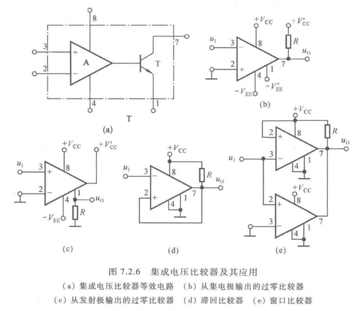

### 7.3	非正弦波发生电路

#### 7.3.1	矩形波发生电路

- 基本电路 $ T = 2R_3 C \ln\pqty{1 + \dfrac{2R_1}{R_2}} $.
- 占空比可调电路
  - $ T  =(R_\text w + 2R_3) C \ln\pqty{1 + \dfrac{2R_1}{R_2}} $.
  - 占空比 $ q = \dfrac{T_1}{T} = \dfrac{R_\text{w1} + R_3}{R_\text w + 2R_3} $.

#### 7.3.2	三角波发生电路

- 阈值电压 $ \pm U_\text T = \pm \dfrac{R_1}{R_2} U_\text Z $.
- 振荡周期 $ T = \dfrac{4R_1R_3C}{R_2} $.

#### 7.3.3	锯齿波发生电路

- 振荡周期 $ T = \dfrac{2R_1 (2R_3 + R_\text w) C}{R_2} $.
- 占空比 $ \dfrac{T_1}{T} = \dfrac{R_3}{2R_3 + R_\text w} $.

#### 7.3.4	波形变换电路

- 三角波 -> 锯齿波

  

- 三角波 -> 方波

- 三角波 -> 正弦波

  - 滤波法
    - 利用傅里叶展开式, 低通滤波电路滤去高频信号.
    - 当三角波的最高频率超过其最低频率的三倍时, 便无法使用该方法.
  - 折线法
    - 正弦波分为若干部分, 每一部分用折线替代.
    - 不受输入电压频率范围的影响, 易于集成化.

#### 7.3.5	函数发生器

$$
\xymatrix{
	\boxed{\begin{array}{c}方波信号 \\ 发生电路\end{array}} \ar[r] \ar[ddrr] &
	\boxed{\begin{array}{c}方波变 \\ 三角波电路\end{array}} \ar[r] \ar[dr] &
	\boxed{\begin{array}{c}三角波变 \\ 正弦波电路\end{array}} \ar[r] &
	正弦波 \\
	&& \boxed{缓冲电路} \ar[r] & 三角波 \\
	&& \boxed{缓冲电路} \ar[r] & 矩形波
}
$$

### 7.4	利用集成运放实现的信号转换电路

#### 7.4.1	电压 - 电流转换电路

- 电压 -> 电流
  - 要求 $ R_1 = R_2 = R_3 = R_4 = R $.
  - $ i_\text{O} = \dfrac{u_\text{I}}{R_\text{o}} $.
- 电流 -> 电压
  - 要求 $ R_\i $ 可忽略不计.
  - $ u_\text{O} = -i_\text{S} R_\text{f} $.

#### 7.4.2	精密整流电路

- **整流**

  - 交流 -> 直流.
  - 仅改变输入电压的相位, 而不改变形状.

- 二极管的一般半波整流电路

  - 不能对微弱信号整流.

- 半波精密整流电路

- 绝对值电路: 半波整流 + 反相比例

  以下为两种绝对值电路.

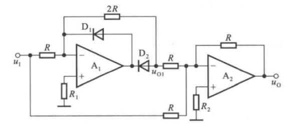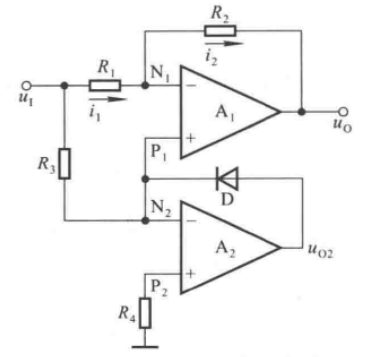

#### 7.4.3	电压 - 频率转换电路

**电压 - 频率转换电路** (VFC) 又称为 **电压控制振荡电路** (VCO).
$$
\xymatrix{
	\boxed{传感器} \ar[r] &
	\boxed{预处理电路} \ar[r]^{直流电压} &
	\boxed{压控振荡器} \ar[r] &
	\boxed{计数显示}
}
$$

- 由集成运放构成的电压 - 频率转换电路
  - 电荷平衡式电压-频率转换电路
    - $ T \approx \dfrac{2R_1R_2}{R_3} \cdot \dfrac{U_\text Z}{u_\text{I}} $.
    - 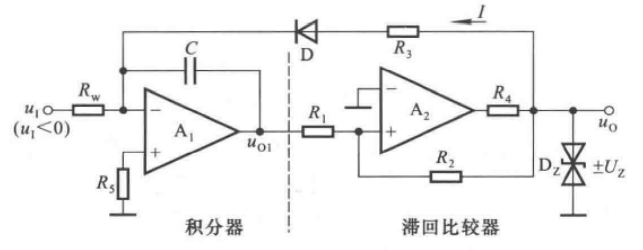
  - 复位式电压-频率转换电路
    - $ T \approx R_1 C \cdot \dfrac{U_\text{REF}}{u_\text{I}} $.
    - 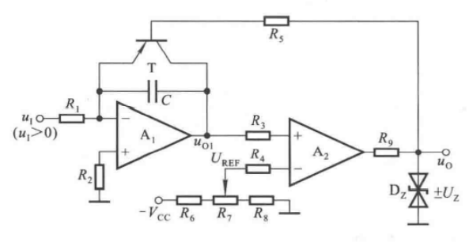
- 集成电压-频率转换电路
  - 电荷平衡式
  - 多谐振荡器式

---

**集成运放基本应用电路的特征及其描述方法**

| 电路类型         | 电路特征                                       | 描述方法     | 主要参数                                               |
| ---------------- | ---------------------------------------------- | ------------ | ------------------------------------------------------ |
| 运算电路         | 引入深度电压负反馈                             | 运算关系式   |                                                        |
| 有源滤波电路     | 引入深度电压负反馈                             | 幅频特性     | $ \dot{A}_\text{up},\, \dot{A}_\text{u},\, f_p,\, Q. $ |
| 电压比较器       | 大多数为开环或 仅引入正反馈               | 电压传输特性 | $ U_\text{OL},\, U_\text{OH},\, U_\text{T} $           |
| 正弦波振荡电路   | 放大电路、选频网络、 正反馈网络、稳幅环节 | 波形         | 周期 (频率), 振幅                                      |
| 非正弦波发生电路 | 滞回比较器、积分运算电路、 RC 延迟环节    | 波形         | 周期 (频率), 振幅                                      |

