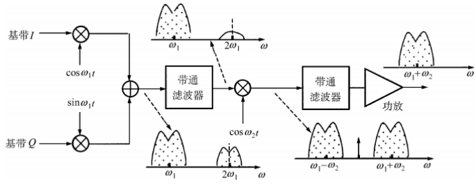

<h1 align="center">电路设计</h1>

$$
% 设置
\renewcommand{\d}{\displaystyle}
\newcommand{\aneg}[1]{\hspace{-0.75em}&#1&\hspace{-0.75em}\d}
\newcommand{\aneq}{\aneg{=}}
% 上述指令用于在使用 array 环境时调整等号左右间距
\newcommand{\noeq}{&\hspace{1.3em}}
% 上述指令用于 align 环境中, 类似与 &= 但不显示等号.

% 字符
\renewcommand{\i}{\mathrm{i}}
\renewcommand{\j}{\mathrm{j}}
\renewcommand{\k}{\mathrm{k}}
\newcommand{\e}{\mathrm{e}}
\newcommand{\o}{\mathrm{o}}
\newcommand{\ve}{\varepsilon}
\newcommand{\Beta}{\mathrm{B}}
\newcommand{\omicron}{\mathit{o}}
\newcommand{\Omicron}{\mathrm{O}}

% 简写与重定义
\newcommand{\bm}[1]{\boldsymbol{#1}}
\renewcommand{\cal}[1]{\mathcal{#1}}
\renewcommand{\scr}[1]{\mathscr{#1}}
\renewcommand{\frak}[1]{\mathfrak{#1}}
\renewcommand{\rm}[1]{\mathrm{#1}}
\newcommand{\bb}[1]{\mathbb{#1}}

% 数集
\newcommand{\D}{\mathbb{D}}
\newcommand{\E}{\mathbb{E}}
\newcommand{\F}{\mathbb{F}}
\newcommand{\J}{\mathbb{J}}
\newcommand{\K}{\mathbb{K}}
\renewcommand{\L}{\mathbb{L}}

% 上下标
\newcommand{\trans}{^\mathrm{T}}
\newcommand{\inv}{^{-1}}
\newcommand{\madj}[1]{^{\pqty{#1^*}}}	% m 重伴随矩阵
\newcommand{\adj}{^*}
\newcommand{\vector}[1]{\overrightarrow{#1}}
\newcommand{\wavy}[1]{\overset\sim#1}	% \tilde 或 \widetilde 不明显, 容易与 \bar 或 \overline 混淆

% 序列
\newcommand{\ccdots}{\cdot\cdots\cdot}
\newcommand{\oneton}{1,2,\cdots,n}
\newcommand{\oneto}[1]{1,2,\cdots,#1}

\newcommand{\ssto}[3]{#1_1 #3 #1_2 #3 \cdots #3 #1_{#2}}
\newcommand{\ssup}[3]{#1^1 #3 #1^2 #3 \cdots #3 #1^{#2}}
\newcommand{\soneto}[2]{\ssto{#1}{#2}{,}}
\newcommand{\splus}[2]{\ssto{#1}{#2}{+}}

% 括号
\newcommand{\aqty}[1]{\expval{#1}}
\newcommand{\pbqty}[1]{\left(#1\right]}
\newcommand{\bpqty}[1]{\left[#1\right)}
\newcommand{\floor}[1]{\left\lfloor#1\right\rfloor}
\newcommand{\ceil}[1]{\left\lceil#1\right\rceil}

% 矩阵宏简写
\newcommand{\bmatrix}[1]{\begin{bmatrix}#1\end{bmatrix}}
\newcommand{\Bmatrix}[1]{\begin{Bmatrix}#1\end{Bmatrix}}
\newcommand{\vmatrix}[1]{\begin{vmatrix}#1\end{vmatrix}}
\newcommand{\Vmatrix}[1]{\begin{Vmatrix}#1\end{Vmatrix}}

% 常用微分
\newcommand{\dx}{\dd{x}}
\newcommand{\dy}{\dd{y}}
\newcommand{\dz}{\dd{z}}
\newcommand{\dt}{\dd{t}}
\newcommand{\ds}{\dd{s}}
\newcommand{\dr}{\dd{r}}

% 一般的微分
% 如果只使用 \dd{x}\dd{y} 的话, 中间会有多余的间隔.
\newcommand{\df}{\dd}
\newcommand{\ddf}[2]{\,\mathrm{d}#1\mathrm{d}#2}	% 微分形式 differential form
\newcommand{\dddf}[3]{\,\mathrm{d}#1\mathrm{d}#2\mathrm{d}#3}

% 高阶微分
\newcommand{\dxdy}{\ddf{x}{y}}
\newcommand{\dydz}{\ddf{y}{z}}
\newcommand{\dzdx}{\ddf{z}{x}}
\newcommand{\dudv}{\ddf{u}{v}}
\newcommand{\drdt}{\ddf{r}{\theta}}
\newcommand{\dxdydz}{\dddf{x}{y}{z}}

% 矩阵的宏指令
\newcommand{\pmcmn}[3]{\begin{pmatrix}
	#1_{11} & #1_{12} & \cdots & #1_{1#3} \\
	#1_{21} & #1_{22} & \cdots & #1_{n#3} \\
	\vdots & \vdots && \vdots \\
	#1_{#2 1} & #1_{#2 2} & \cdots & #2_{n#3} \\
\end{pmatrix}}

\newcommand{\pmc}[1]{\pmcmn{#1}{n}{n}}
\newcommand{\pvcn}[2]{\begin{pmatrix}
	#1_1 \\ #1_2 \\ \vdots \\ #1_{#2}
\end{pmatrix}}

\newcommand{\pvc}[1]{\pvcn{#1}{n}}
\newcommand{\pto}{\overset{P}{\to}}

% 函数名
\renewcommand{\char}{\operatorname{char}}	% 由于已存在此命令, 不可使用 DeclareMathOperator
\renewcommand{\r}{\operatorname{r}}
\DeclareMathOperator{\st}{s.t.\,}	% 虽然不是函数名, 但用了这个指令就放这儿了.
\DeclareMathOperator{\diag}{diag}	% 不需要定义太多, 一个文件里用到什么定义什么,
\DeclareMathOperator{\Ker}{Ker}		% 毕竟特殊的函数名太多太多了.
\DeclareMathOperator{\Aut}{Aut}		% 便捷与效率的权衡.
\DeclareMathOperator{\Inn}{Inn}
\DeclareMathOperator{\GL}{GL}
\DeclareMathOperator{\SL}{SL}
\DeclareMathOperator{\stab}{stab}
\DeclareMathOperator{\orb}{orb}
\DeclareMathOperator{\lcm}{lcm}
\DeclareMathOperator{\Var}{Var}
\DeclareMathOperator{\Cov}{Cov}
\DeclareMathOperator{\Corr}{Corr}
\DeclareMathOperator{\rot}{rot}
\DeclareMathOperator{\sgn}{sgn}
\DeclareMathOperator{\Outer}{Outer}
\DeclareMathOperator{\Even}{Even}
\DeclareMathOperator{\Scalar}{Scalar}
\DeclareMathOperator{\Vector}{Vector}
\DeclareMathOperator{\arsh}{arsh}
\DeclareMathOperator{\arch}{arch}
\DeclareMathOperator{\arth}{arth}
\renewcommand{\Re}{\operatorname{Re}}	% 自带 \Re 的效果是 \mathrm{Re}, 前后无空格, 故重写
\renewcommand{\Im}{\operatorname{Im}}
\DeclareMathOperator{\Sa}{Sa}
\DeclareMathOperator{\Si}{Si}
\DeclareMathOperator{\avg}{avg}

% 运算符
% 可以用 \bigcap, \bigcup, \bigoplus, \bigotimes 替代
\newcommand{\capop}{\displaystyle\mathop\cap\limits}
\newcommand{\cupop}{\displaystyle\mathop\cup\limits}
\newcommand{\oplusop}{\mathop\oplus\limits}
\newcommand{\otimesop}{\mathop\otimes\limits}
\newcommand{\bigoplusop}{\mathop\bigoplus\limits}
\newcommand{\bigotimesop}{\mathop\bigotimes\limits}

% 积分
\newcommand{\dint}{\displaystyle\int}
\newcommand{\inti}{\dint_{-\infty}^{+\infty}}
\newcommand{\intoi}{\dint_0^{+\infty}}

\newcommand{\intl}{\displaystyle\int\limits}
\newcommand{\iintl}{\displaystyle\iint\limits}
\newcommand{\iiintl}{\displaystyle\iiint\limits}

\newcommand{\coiint}[1]{\d{\oiint\hspace{-1em}}_{#1}\;}
\newcommand{\coiiint}[1]{\d{\oiiint\hspace{-0.9em}}_{#1}\;}

% 求和
\newcommand{\dsum}{\displaystyle\sum}
\newcommand{\csum}[1]{\dsum_{#1=1}^\infty}
\newcommand{\nsum}{\csum{n}}
\newcommand{\ksum}{\csum{k}}
\newcommand{\nosum}{\dsum_{n=0}^\infty}
\newcommand{\insum}{\dsum_{i=1}^n}
\newcommand{\knsum}{\dsum_{k=1}^n}
\newcommand{\csuminf}[1]{\dsum_{#1=-\infty}^{+\infty}}
\newcommand{\nsuminf}{\csuminf{n}}

% 求积
\newcommand{\dprod}{\displaystyle\prod}
\newcommand{\nprod}{\dprod_{n=1}^\infty}
\newcommand{\noprod}{\dprod_{n=0}^\infty}
\newcommand{\inprod}{\dprod_{i=1}^n}

% 极限
\newcommand{\liml}{\lim\limits}
\newcommand{\ulim}{\overline\lim\limits_{n\to\infty}}
\newcommand{\dlim}{\underline\lim\limits_{n\to\infty}}
% 注意这里的 d 是 down, 而不是 displaystyle

\newcommand{\xlim}{\lim\limits_{x\to x_0}}
\newcommand{\nlim}{\lim\limits_{n\to\infty}}
\newcommand{\clim}[1]{\lim\limits_{#1\to\infty}}

% 并集
\newcommand{\incup}{\bigcup_{i=1}^n}
\newcommand{\ncup}{\bigcup_{n=1}^\infty}
\newcommand{\icup}{\bigcup_{i=1}^\infty}

% 交集
\newcommand{\incap}{\bigcap_{i=1}^n}
\newcommand{\ncap}{\bigcap_{n=1}^\infty}
\newcommand{\icap}{\bigcap_{i=1}^\infty}

% 差分
\newcommand{\DD}{\Delta}
\newcommand{\DV}[2]{\dfrac{\DD#1}{\DD#2}}
\newcommand{\nDV}[3]{\dfrac{\DD^{#1}#2}{\DD#3^{#1}}}

% 求导
\newcommand{\ddv}{\displaystyle\dv}
\newcommand{\dpdv}{\displaystyle\pdv}

% 最值 (返回参数); 暂时先这么凑合着用吧
\newcommand{\argmax}[1]{\underset{#1}{\operatorname{argmax}}}
\newcommand{\argmin}[1]{\underset{#1}{\operatorname{argmin}}}

% 缩写
\newcommand{\LRA}{\Leftrightarrow}
\newcommand{\RLA}{\Leftrightarrow}
\newcommand{\LA}{\Leftarrow}
\newcommand{\RA}{\Rightarrow}

\newcommand{\lra}{\leftrightarrow}
\newcommand{\rla}{\leftrightarrow}
\newcommand{\la}{\leftarrow}
\newcommand{\ra}{\rightarrow}

\newcommand{\QRLA}{\quad\RLA\quad}
\newcommand{\QRA}{\quad\RA\quad}
\newcommand{\LLRA}{\Longleftrightarrow}

\newcommand{\QNRA}{\quad\nRightarrow\quad}
\newcommand{\qnra}{\quad\nrightarrow\quad}

\newcommand{\wt}{\widetilde}

% 图形符号
\newcommand{\qed}{\quad\square}
\renewcommand{\parallel}{\mathrel{/\mskip-2.5mu/}}
\newcommand{\paralleleq}{\hspace{0.5em}{^{^{\parallel}}}\hspace{-1.04em}=}
\newcommand{\rt}{\matrm{Rt}\triangle}

% 分块矩阵
\newenvironment{mat}[1]{
	\begin{array}{#1}
}{
	\end{array}
}

\newenvironment{pmat}[1]{
	\left( \begin{array}{#1}
}{
	\end{array} \right)
}

\newenvironment{bmat}[1]{
	\left[ \begin{array}{#1}
}{
	\end{array} \right]
}

\newenvironment{Bmat}[1]{
	\left\{ \begin{array}{#1}
}{
	\end{array} \right\}
}

\newenvironment{vmat}[1]{
	\left\lvert \begin{array}{#1}
}{
	\end{array} \right\rvert
}

\newenvironment{Vmat}[1]{
	\left\lVert \begin{array}{#1}
}{
	\end{array} \right\rVert
}

% 积分变换
\newcommand{\ft}{\overset{\cal F}{\rla}}
\newcommand{\lt}{\overset{\cal L}{\rla}}
\newcommand{\bt}{\overset{\cal B}{\rla}}
\newcommand{\zt}{\overset{\cal Z}{\rla}}
\newcommand{\bzt}{\overset{\cal Z_B}{\rla}}
\newcommand{\lzt}{\overset{\cal Z_L}{\rla}}
\newcommand{\rzt}{\overset{\cal Z_R}{\rla}}
$$

[TOC]

## 第 4 章  发射、接收机结构

### 4.1  概述

#### 4.1.1  发射机

- 基本组成：振荡器 -> 调制器 -> 上变频 -> 高频功率放大 -> 带通滤波器.
- 完成功能：信号调制、频谱搬移、功率放大、滤波.
- 主要指标：频谱、功率、效率.

#### 4.1.2  接收机

- 基本组成：带通滤波器 -> 低噪声放大器 -> 解调器.
- 完成功能：选出有用信号、小信号放大、信号解调.
- 主要指标：灵敏度、选择性.

#### 4.1.3  关键问题

1. 调制解调方案：干扰性能好、频带利用率高、功率有效性好.
2. 发射机
   1. 高效率、不失真的功率放大器.
   2. 对相邻信道的干扰小.
3. 接收机
   1. 选出有用信号、抑制干扰.
   2. 灵敏度、线性动态范围.
4. 天线转换器的损耗小、隔离度高.

### 4.2  接收机方案

#### 4.2.1  超外差式接收机

##### 1  基本结构方案

- 基本结构
  - 高频小信号放大器：低噪声放大器（LNA）
  - 带通滤波器 BPF~1~
    - 选择频带（band），消除镜像干扰（寄生通道干扰）
    - 增益不宜过大（否则经变频器后容易失真）
    - 在 LNA 前：滤除带外信号，减少互调失真.
    - 在 LNA 后：降低系统噪声系数.
  - 下变频器（关键部件）
    - 接收频率为 $ \omega_\rm{RF} $ 的射频信号.（Radio Frequency）
    - 与本振频率 $ \omega_\text{LO} $ 相乘.（Local Oscillation）
    - 降为频率固定的中频信号 $ \omega_\text{IF} = \vqty{\omega_\text{RF} - \omega_\text{LO}} $.（Intermediate Frequency）
    - 存在镜像干扰频率：$ \omega_\text{im} = \omega_\text{LO} + \omega_{\text{IF}} $.（Image Frequency）
  - BPF~2~：中频滤波器，用于选择信道（channel）
  - 中频放大：使镜像频率远离有用信号.
- 方案原因
  - 中频比载频的频率低，易于滤波.
  - 总增益分散到了高频、中频、基带三个频段上，更加稳定.
  - 在较低的固定中频上易于解调、A / D 转换.

##### 2  中频选择

- 中频的性能
  - 高中频：镜像频率远离有用信号，有利于一直镜像频率干扰，提高灵敏度.（干扰性）
  - 低中频：有利于抑制相邻信道的干扰信号，选择信道，提供稳定的高增益.（选择性）
- 中频的选择
  - 根据对抑制镜像通道的要求：$ f_\text{IF} \ge \dfrac{\rm{BW_{60dB}}}{4} = \dfrac{1}{4} \rm{BW_{3dB}} \cdot K_{\rm{60dB}} $.
  - 根据对中频干扰的抑制要求：$ f_\text{RF} - f_\text{IF} \ge \dfrac{1}{2} \rm{BW_{3dB}} \cdot K_\rm{80 dB} $.
  - 根据中频滤波器的可实现性
  - 根据抑制寄生通道干扰要求

##### 3  二次变频方案

- I 中频采用高重品质，提高镜像频率抗拒比.
- II 中频采用低中频值，抑制相邻信道的干扰.（增益高）

#### 4.2.2  直接下变频方案

- 直接下变频（零中频方案）
- 优点
  - 消除了镜像频率干扰.
  - 接收机的射频部分增益不高，易于满足线性动态范围.
  - 无需考虑与放大器的匹配问题.
  - 无需用专用的中频滤波器选择信道.
- 缺点
  - 本振泄露
  - 低噪声放大器偶次谐波失真干扰
  - 直流偏差
  - 噪声

#### 4.2.3  镜频抑制接受方案

- Hartley 结构
- Weaver 结构

#### 4.2.4  数字中频方案

- 可以避免 I/Q 两路的不一致.
- 对 A/D 转换器的要求较高.

### 4.3  发射机方案

#### 4.3.1  直接变换法

- 思路：调制和上变频合二为一.
- 缺点：强信号牵引本振频率，本振频率不稳定.
- 改进：令本振频率与调制的载频相同.

#### 4.3.2  两步变换法

- 思路：先在低中频调制，再将其搬移到发射的载频上.
- 优点：本振频率稳定.
- 缺点：对滤波器的要求高.

### 4.4  收发信机的性能指标

#### 4.4.1  发信机技术指标

- 平均载频功率
- 发信载频包络
- 射频功率控制
- 射频输出频谱
- 杂散辐射
- 互调衰减
- 相位误差
- 频率精度

#### 4.4.2  接收机技术指标

- 灵敏度
- 阻塞和杂散响应抑制
- 互调响应抑制
- 邻道干扰抑制
- 杂散辐射

#### 4.4.3  系统指标分配与计算

- 增益的计算
  - 滤波器的插入损耗 $ L = \dfrac{1}{G_\text P} $.
- 噪声系数的计算
  - $ N_内 = k (F - 1) T_0 B $.
  - $ N_\text{out} = G_\text P(N_\text{i} + N_内) $.
- 三阶互调截点输入功率 $ \rm{IIP_3} $.

## 第 5 章  低噪声放大器

### 5.1  低噪声放大器的介绍

#### 5.1.1  低噪声放大器的特点

低噪声放大器 (LNA) 的特点

- 位于接收机的最前端, 因此
  - 噪声越小越好.
  - 要求有适当的稳定增益.

- 接受的信号很微弱且变化.

- 通过传输线直接与天线或天线滤波器相连.

- 应具有选频功能，抑制带外和镜像频率的干扰.

#### 5.1.2  低噪声放大器的指标

- 低功耗

  - 低电源电压

  - 低偏置电流 (静态电流)：会导致晶体管的跨导减小

- 工作频率 (取决于晶体管的特征频率 $ f_{_\text T} $)
  $$
  f_{_\text T} = \dfrac{g_\text m}{
  	2\pi (C_\pi + C_\mu)
  } \approx \dfrac{g_\text m}{2\pi C_\pi}.
  $$

  - 注：特征频率为使 $ \vqty{\beta} = \dfrac{I_\text c}{I_\text b} $ 下降为 1 时的频率.
  - 减小偏置电流会减小 $ g_\text m = \dfrac{I_\text{CQ}}{U_\text{BEQ}} $，从而降低 $ f_{_\text T} $.
  - 增大晶体管的面积，会增加极间电容 $ C_\pi $，从而降低 $ f_{_\text T} $.

- 噪声系数

  - 噪声系数的公式

    - 线性网络
      $$
      F = 1 + \dfrac{
      	\overline{
      		(V_\text n + I_\text n R_\text S)^2
      	}
      }{
      	4kTBR_\text S
      },
      $$

    - 共射组态的单管双极型晶体管:
      $$
      \begin{align}
      F &= 1 + \dfrac{r_\text{bb'}}{R_\text S} +
      \dfrac{1}{2g_\text m R_\text S} +
      \dfrac{g_\text m R_\text S}{2\beta}
      \\
      &\approx 1 + \dfrac{r_\text{bb'}}{R_\text S} +
      \dfrac{1}{2g_\text m R_\text S},
      \end{align}
      $$

    - <u>单管共源 MOS 场效应管</u> (一般用这个)
      $$
      F = 1 + \dfrac{\gamma}{R_\text S g_\text m},
      $$

  - 噪声系数的特点

    - $ F $ 与工作点有关.

    - 增大晶体管的面积可以减小基区体电阻 $ r_\text{bb'} $，从而降低噪声 $F$.

      但这样也会增大极间电容 $ C_\pi $，从而降低特征频率 $ f_{_\text T} $.

    - $ F $ 与信号源内阻 $ R_\text{S} $ 有关.

- 增益 (略)

  - 增益需要适中

    - 增益过大，会使得下级混频器的输入太大，产生失真.
    - 增益过小，无法抑制后面各级的噪声对系统的影响.

  - 增益的影响因素

    - 跨导 $ g_\text m $，而跨导由工作点的电流决定.
    - 负载阻抗小，增益难以做高，因此可采用两级放大.

  - LNA 的负载有两种形式

    - 采用调谐的 LC 回路作为负载.

    - 后接集中选频滤波器, 此时输入输出阻抗一般都为 $ 50\Omega $.

      此时 LNA 需要注意阻抗匹配.

- 自动增益控制 (略)

  - 改变放大器的工作点.
  - 改变放大器的负反馈量.
  - 改变放大器谐振回路的 Q 值.

- 输入阻抗匹配

  - 放大器与源的匹配方式

    - 噪声匹配: 噪声系数最小.
    - 共轭匹配: 获得最大传输功率与最小反射损耗.
    - 一般采用共轭匹配, 并力求以上两种匹配接近.

  - 匹配网络的选择

    - 纯电阻网络
      - 适合于宽带放大.
      - 消耗功率.
      - 增加噪声.
    - 无损耗的电抗网络
      - 不会增加噪声.
      - 只适合窄带放大.

  - 四种匹配方式 (略)

    

- 线性范围 (略)

  - 度量指标

    - 三阶互调截点 $ \mathrm{IIP_3} = \sqrt{\dfrac{4}{3} \vqty{\dfrac{a_1}{a_3}}} $.
    - 增益 1 dB 压缩点.

  - 线性范围的影响因素

    - 器件种类与性能

      场效应管具有平方律特性, 因此线性比双极型好 (指数函数关系).

    - 电路结构

      增加负反馈、单管放大改为差分放大，可改善线性.

    - 阻抗匹配网络.

- 隔离度和稳定性 (略)

  - 不稳定的引起因素
    - 反向传输：极间电容与寄生餐宿的影响; 应该较少 (即隔离性能增加).
  - 稳定性的改进措施
    - 中和法：用中和电容抵消引起的反向传输.
    - 失配法：采用共射共基 (共源共栅) 组合连接.

### 5.2  晶体管高频等效电路

#### 5.2.1  晶体管高频参数与描述模型

- 晶体管高频参数

  - 截止频率 $ f_\beta $：电流放大系数下降为 $ \dfrac{\beta_0}{\sqrt 2} $ 时的频率.
  - 特征频率 $ f_{_\text T} $：使 $ \vqty{\beta} $ 下降为 1 时的频率.
  - 最大频率 $ f_\max $：使晶体管功率增益 $ G_\text p = 1 $ 时的频率.
  - $ f_\max > f_\text T > f_\beta $.

- 描述晶体管的两种模型

  - 物理等效电路模型.

  - 网络参数表示的网络模型.

#### 5.2.2  双极型晶体管共射小信号等效电路

- 物理模型

  - 输入电压：$ v_\text{BE} = V_\text{BEQ} + v_\text s $.
  - 输出电流：$ i_\text C = I_\text S \e^{\tfrac{q}{kT} v_{_\text{BE}}}
    = I_\text{CQ} \e^{\tfrac{q}{kT} v_\text s} $.

- 混合 π 模型

  - 适用条件：信号幅度 $ V_\text{Sm} \ll V_\text T \approx 26\mathrm{mV} $，此时为线性.
  - 注意事项：交流小信号等效电路，参数与静态工作点有关.
  - 交流通路：仅做偏置用的直流电阻可不画.
  - [模拟电路.pdf (sleepcloudmx.github.io)](https://sleepcloudmx.github.io/Electronics/模拟电路/模拟电路.pdf)

- Y 参数 (导纳参数)

  

  - $ \dot{I}_\text b = y_\text{ie} \dot V_\text b + y_\text{re} \dot{V}_\text c $.
  - $ \dot I_\text c = y_\text{fe} \dot V_\text b + y_\rm{oe} \dot V_\text c $.

#### 5.2.3  场效应管小信号模型

略.

### 5.3  低噪声放大器设计

#### 5.3.1  利用 Y 参数进行设计

##### 1  单调谐回路谐振放大器

- 低噪声放大器一般思路

  - 组成部分：晶体管、偏置、输入匹配、负载
  - 改善选择性：多级级联

- 原理电路图

  

- Y 参数等效电路图

  

- 电路方程

  - $ \dot{I}_\text i = y_\text{ie} \dot V_\i + y_\text{re} \dot{V}_\text c $.
  - $ \dot I_\text c = y_\text{fe} \dot V_\i + y_\rm{oe} \dot V_\text c \approx - \dot V_\text c Y'_\text L $.

- 性能指标

  - 电压增益：$ \dot{A}_\text V = \dfrac{\dot V_\text c}{\dot V_\text i} = -\dfrac{y_\text{fe}}{y_\text{oe} + Y'_\text L} $.（分子为复数）
  - 谐振增益与通频带乘积为常数
    - 通频带：$ \rm{BW_{3dB}} = \dfrac{f_0}{Q_\text L} $.
    - 谐振增益：$ \dot A_{\text V0} = -\dfrac{f_0 y_\text{fe}}{\omega_0 C_\sum \rm{BW_{3dB}}} $.
  - 选择性
    - 20dB 带宽：$ \rm{BW_{0.1}} = \sqrt{10^2 - 1} \dfrac{\omega_0}{Q_\text L} $.
    - 矩形系数：$ K_{0.1} \approx 9.96 \gg 1 $.
  - 输入导纳：$ Y_\i = y_\text{ie} - \dfrac{y_\text{re} y_\text{fe}}{y_\text{oe} + Y_\text{L}'} $.
  - 输出导纳：$ Y_\o = y_\text{oe} - \dfrac{y_\text{re} y_\text{fe}}{Y_\text{S} + y_\text{ie}} $.

##### 2  多级谐振放大器的级联

- 增益：倍乘.

- 通频带：减小.

- 选择性：有所改善.

##### 3  双调谐回路谐振放大器

- 带宽更大：$ \rm{BW_{3dB}} = \sqrt 2 \dfrac{f_0}{Q_\text L} $.
- 矩形系数更小：$ K_{0.1} = \sqrt[4]{10^2 - 1} $.

##### 4  谐振放大器的稳定性

- 稳定系数：$ S = \dfrac{
  	\vqty{Y_\text s + y_\text{ie}} \cdot
  	\vqty{y_\text{oe} + Y'_\text{L}}
  }{
  	\vqty{y_\text{fe}} \cdot \vqty{y_\text{re}}
  } $.
  - 如果 $ S = 1 $，则可能产生自激振荡.
  - 如果 $ S \gg 1 $，则不会产生自激振荡.
- 电压增益
  - $ A_\text{V0} = \sqrt{\dfrac{2\vqty{y_\text{fe}}}{S \omega_0 C_\text{re}}} $.
  - 取 $ S = 5 $，$ (A_\rm{V0})_S = \sqrt{\dfrac{\vqty{y_\text{fe}}}{2.5 \omega_0 C_\rm{re}}} $ 称为稳定电压增益.

##### 5  谐振放大器的单向化

- 中和法
- 失配法

#### 5.3.2  利用混合 π 参数设计

#### 5.3.3  利用 S 参数设计

## 第 6 章  混频器

### 6.1  混频器的介绍

#### 6.1.1  混频器的原理

- 混频器

  - 发射机：上混频（已调制的中频 → 射频）

  - 接收机：下混频（放大后的射频 → 中频）

    > 本章以接收机的下混频为例.

- 基本原理

  - 本振信号：$ v_\text{LO}(t) = V_\text{LO} \cos(\omega_\text{LO} t) $.
  - 射频信号：$ v_\text{RF}(t) = V_\rm{RF} \cos(\omega_\rm{RF} t) $.
  - 二者相乘：$ \dfrac{V_\rm{LO} V_\rm{RF}}{2} \bqty{\cos(\omega_\rm{RF} - \omega_\rm{LO})t + \cos(\omega_\rm{RF} + \omega_\rm{LO})t} $.
  - 中频信号：$ v_\rm{IF} = \dfrac{V_\rm{LO} V_\rm{RF}}{2} \cos(\omega_\rm{RF} - \omega_\rm{LO})t $.

- 混频器的端口：射频口、本振口、中频口.

#### 6.1.2  频谱搬移方法

- 乘法器 + 滤波器
  - 三极管 Gilbert 模拟乘法器.
  - 二极管环形乘法器.
- 非线性器件 + 滤波器
  - 说明
    - 非线性器件工作在线性时变状态，以减少组合频率分量.
    - 射频输入为小信号，本振输入为大信号.
  - 常用非线性器件
    - 双极型晶体管（BJT）
    - 二极管：无需偏置、功耗低、开关速度快.
    - 场效应管（FET）：平方律特性，无用频率少.

#### 6.1.3  混频器的指标

- 增益
  - $ G_\text P = \dfrac{P_\rm{IF}}{P_\rm{RF}} = \dfrac{V_\rm{IF}^2 / R_\rm L}{V_\rm{RF}^2 / R_\rm S} = A_\rm V^2 \dfrac{R_\rm S}{R_\rm L} $.
  - 有源混频器（$ G_\text P < 1 $，混频损耗）
    - 二极管 + 可变电阻区的场效应管.
    - 线性范围大、速度快.
  - 无源混频器（$ G_\text P >1 $）
    - 场效应管 + 双极型晶体管.
    - 可以降低混频以后各级噪声的影响.
- 噪声
  - 双边（DSB）噪声系数：超外差式接收机.
  - 单边（SSB）噪声系数：零中频方案接收机.
  - 单边噪声系数 = 双边噪声系数 + 3 dB.
- 失真与干扰
  - 干扰哨声：$ f_\text{IF} \pm F $ 的组合频率，在无外接干扰信号时也会产生哨叫声.
  - 寄生通道干扰：$ f_\rm{IF} $ 的组合频率
    - 中频干扰：$ f_\text m = f_\text{IF} $.
    - 镜像频率干扰：$ f_\text m = f_\rm{LO} - f_\rm{IF} $.
    - 最近的干扰：$ f_\text m = \dfrac{f_\rm{Rf} + f_\rm{LO}}{2} $.
  - 互调失真：产生中频失真.
- 线性指标
  - 1 dB 压缩点.
  - 三阶互调截点.
  - 线性动态范围：1 dB 压缩点与基底噪声之比.
- 口间隔离
- 阻抗匹配
  - RF、IF、LO 口分别需要匹配.
  - 每个口对另外两个口力求短路.

### 6.2  有源混频器电路

#### 6.2.1  单管跨导型混频器

- 输入信号
  - 射频小信号：$ v_\text{RF}(t) = V_\rm{RF} \cos(\omega_\rm{RF} t) $.
  - 本振大信号：$ v_\text{LO}(t) = V_\text{LO} \cos(\omega_\text{LO} t) $.
- 输出分析
  - 输入电压：$ v_\rm{GS}(t) = -V_\rm{GG} + v_\rm{LO}(t) + v_\rm{RF}(t) $.
  - 时变偏置：$ V_\rm{GSQ}(t) = - V_\rm{GG} + v_\rm{LO}(t) $.
  - 漏极信号：$ i_\text D \approx I_\rm{D0}(t) + g_\text m(t) v_\rm{RF}(t) $.
  - 中频电流：$ i_\rm{IF}(t) = \dfrac{1}{2} g_\text{m1} V_\rm{RF}(t) \cos(\omega_\rm{RF} - \cos_\rm{LO})t $.
  - 变频跨导：$ g_\rm{fc} = \dfrac{1}{2} g_\text{m1} $.
  - 变频增益：$ A_\rm{V} = \dfrac{1}{2} g_\rm{m1} R_\rm L = g_\rm{fc} R_\rm L $.

#### 6.2.2  单平衡混频器

##### 1  单平衡混频器的分析

- 输出
  - 输出电流：$ i = i_\text C \tanh\dfrac{q v_\rm{LO}(t)}{2kT} \approx (I_\rm{CQ_1} + g_\rm{m1} v_\rm{RF}) S_2(\omega_\rm{LO} t) $
  - 中频电流：$ i_\rm{IF} = \dfrac{2}{\pi} g_\rm{m1} V_\rm{RF} \cos(\omega_\rm{RF} - \omega_\rm{LO})t $.
  - 电压增益：$ A_\rm V = \dfrac{2}{\pi} g_\rm{m1} R_\rm L $.
- 缺点：中频输出口与本振口隔离不好.

#### 6.2.3  吉尔伯特双平衡混频器

##### 1  吉尔伯特单元电路

又称为双平衡模拟乘法器单元电路.

输出电流：

- $ i_1 - i_2 = i_5 \tanh\dfrac{qv_2}{2kT} $.
- $ i_4 - i_3 = i_6 \tanh\dfrac{qv_2}{2kT} $.
- $ i = (i_5 - i_6) \tanh\dfrac{qv_2}{2kT} = I_0 \tanh\dfrac{qv_1}{2kT} \cdot \tanh\dfrac{qv_2}{2kT} $.

##### 2  输入均为较小信号

$ v_1, v_2 $ 均为小信号，即 $ V_\text{1m}, V_\rm{2m} \le 26\ \rm{mV} $.

- $ i = \dfrac{I_0 q^2}{4 k^2 T^2} v_1 v_2 $.
- 动态范围小，系数与 $T$ 有关，因此不常用.

##### 3  输入一大一小信号

$ v_1 $ 为小信号，$ v_2 $ 为大信号，即 $ V_\rm{1m} \le 26\ \rm{mV}, V_\rm{2m} \ge 100\ \rm{mV} $.

- 基础电路
  - $ i = \dfrac{I_0 q}{2kT} v_1 \cdot S_2(\omega_2 t) = g_\rm m v_1 S_2(\omega_2 t) $.
  - 中频幅度：$ I_1 = \dfrac{2}{\pi} g_\rm m V_\rm{1m} $，与大信号幅度无关.
  - 一般使用这种状态，但线性范围很小.
- 改进电路
  - 增加反馈电阻 $ R_\rm{E1} $.
  - $ i_5 - i_6 = 2 i_\e \approx \dfrac{2v_1}{R_\text{E1}} $.
  - $ i \approx \dfrac{2v_1}{R_\rm{E1}} \tanh\dfrac{qv_2}{2kT} $.
  - 最大线性范围：$ -\dfrac{I_0}{4} \le \dfrac{v_1}{R_\rm{E1}} \le \dfrac{I_0}{4} $.
  - 混频时一般不加反馈电阻，因为会增加噪声系数.

##### 4  输入均为较大信号

$ v_1, v_2 $ 均为大信号，即 $ V_\rm{1m}, V_\rm{2m} \ge 100\ \rm{mV} $.

- $ i = I_0 S_2(\omega_1 t) \cdot S_2(\omega_2 t) $.
- 输出电流与输入信号的幅度无关.

### 6.3  无源混频器电路

#### 6.3.1  二极管混频

##### 1  线性时变状态二极管

- 二极管电压
  - $ v_\rm D(t) = v_\rm{LO}(t) + v_\rm{RF}(t) $.
  - 本振信号 $ v_\rm{LO}(t) $ 为大信号.
  - 射频信号 $ v_\rm{RF}(t) $ 为小信号.
- 二极管等效
  - $ i_\rm{D}(t) = g_\rm D (V_D(t) - V_\rm B) $.
  - 近似认为跨导 $ g_\rm D $ 为常数.
  - 若势垒电压 $ V_\rm B $ 不可忽略，可添加正向偏置电压抵消.
- 二极管电流
  - $ i_\rm D(t) = g_\rm D \cdot S_1(\omega_\rm{LO} t) \bqty{v_\rm{LO}(t) + v_\rm{RF}(t)} $.
  - 小信号线性放大：$ i_\rm D(t) = I_0(t) + g(t) v_\rm{RF}(t) $.
  - 静态工作点：$ I_0(t) = g_\rm D \cdot S_1(\omega_\rm{LO}t) v_\rm{LO}(t) $.
  - 时变跨导：$ g(t) = g_\rm D \cdot S_1(\omega_\rm{LO} t) = \d\eval{\pdv{i_\rm D}{v_\rm D}}_{V_\rm D = v_\rm{LO}} $.
- 二极管混频
  - 基波分量：$ g_1(t) = \dfrac{2}{\pi} g_\rm D \cdot \cos(\omega_\rm{LO} t) $.
  - 中频电流：$ i_\rm{IF}(t) = \dfrac{g_\rm D}{\pi} V_\rm{RF} \cos(\omega_\rm{IF}t) $.
  - 单二极管混频器的变频跨导：$ g_\rm{fc} = \dfrac{g_\rm{D}}{\pi} $.
- 缺点：含有较多组合频率分量，口间隔离效果差.

##### 2  二极管双平衡混频器

- 等效电路
  - $ i_\rm{D_1} - i_\rm{D_2} = \dfrac{2 v_\rm{RF}(t)}{2 R_\rm L + R_\rm D} S_1(\omega_\rm{LO}t) $.
  - $ i_\rm{D_3} - i_\rm{D_4} = \dfrac{-2 v_\rm{RF}(t)}{2 R_\rm L + R_\rm D} S_1(\omega_\rm{LO}t + \pi) $.
- 中频输出
  - 输出电流：$ i = \dfrac{2 v_\rm{RF}(t)}{2 R_\rm L + R_\rm D} S_2(\omega_\rm{LO}t) $.
  - 中频电流：
- 射频输入
- 隔离特性
- 变频损耗

6.3.2  无源场效应管混频器

## 第 10 章  高频功率放大器

### 10.1  高频功率放大器的介绍

#### 10.1.1  高频功率放大器的特点

- 特点

  - 处于发射机末级.
  - 大功率，高效率，负载阻值固定.
  - 不能干扰相邻信道与本接收机.

- 比较

  - 小信号放大器：强调小信号的增益.
  - 功率放大器：输出大功率，天线阻值确定.

- 工作特点：低电压，大电流，减小负载电阻.

  - 晶体管输出功率 $ P = U^2/R = I^2 R $.
  - 输出功率不变，降低耐压，于是负载电阻变小，电流变大.

- 基本组成单元：晶体管、偏置电路、扼流圈、阻抗变换网络、负载.

#### 10.1.2  大电流工作引入的问题

- 晶体管的芯片面积增大，从而增大了极间电容，于是降低了功率增益和工作频率.

- 电路中的寄生参数影响极大.

- 输入输出阻抗数值很小，且为复数，阻抗匹配困难.

- 由于电流大，小电阻也会消耗较多功率. 于是不宜选用高 Q 值的电路.

#### 10.1.3  高频功率放大器的指标

- 功率
  - 移动通信的袖珍机：0.3 - 0.6 W.
  - 基站：10 - 100 W.
- 效率：
  - 集电极效率：$ \eta_{_\text C} = \dfrac{P_\rm{out}}{P_\rm{dc}} $.
  - 功率增加效率：$ \eta_{_\rm{PAE}} = \dfrac{P_\rm{out} - P_\rm{in}}{P_\rm{dc}} = \pqty{1 - \dfrac{1}{G_\text P}} \eta_{_\text C} $.
- 杂散输出与噪声
- 线性与非线性
  - 线性放大器：最高效率只有 $ 50\% $.
  - 非线性放大器：产生组合干扰频率；频谱再生作用.

#### 10.1.4  高频功率放大器的分类

- 按晶体管的导通角分类
  - A 类：$ 2\theta = 360^\circ $.
  - B 类：$ 2\theta = 180^\circ $.
  - C 类：$ 2\theta < 180^\circ $.
- 按晶体管等效电路分类
  - 晶体管等效为受控电流源：ABC 属于同一类.
  - 晶体管等效为开关：DE 属于同一类.
- A 类放大器：理想效率为 50%.
- B 类放大器：理想效率为 π/4 ≈ 79%.
- C 类放大器：在 60° - 70° 效率最高.

### 10.2  A、B 类功率放大器

#### 10.2.1  A 类放大器

- 为输出最大功率
  - $ V_\rm{DD} = \dfrac{1}{2} V_\rm{DSmax} $，即最大漏源极电压的一半.
  - $ I_\rm{DQ} = \dfrac{1}{2} I_\rm{Dmax} $，即最大漏极电流的一半.
  - 最佳负载电阻：$ R_\rm{opt} = \dfrac{2V_\rm{DD}}{I_\rm{Dmax}} $.
- 最大功率与效率
  - 最大输出功率：$ P_\rm{omax} = \dfrac{1}{2} I_\rm{sm} V_\rm{om} = \dfrac{1}{4} I_\rm{Dmax} V_\rm{DD} $.
  - 最大集电极效率：$ \eta_\text c = \dfrac{P_\rm{omax}}{P_\rm{dc}} = 50\% $.
  - 为了保持良好的线性，一般使效率降到 $ 30\% \sim 40\% $.

#### 10.2.2  B 类放大器

- B 类推挽放大器
  - 输入信号反相，两管轮流导通.
  - 半波合成正弦波，仍为线性放大器.
- 总输出功率
  - 负载电阻：$ R'_\text L = n^2 R_\text L $.
  - 半波电流幅度：$ I_\text m = \dfrac{V_\rm{DD}}{n^2 R_\text L} $.
  - 总输出功率：$ P_\rm{out} = \dfrac{V_\rm{DD}^2}{2 n^2 R_\rm{L}} $.
- 集电极效率
  - 平均电流：$ I_\rm{DD (\avg)} = \dfrac{2 V_\rm{DD}}{\pi n^2 R_\rm L} $.
  - 集电极效率：$ \eta_\text c = \dfrac{\pi}{4} \approx 79\% $.

#### 10.2.3  AB 类放大器

- 目的：减少交越失真.
- 措施：无信号时设置一个较小的静态偏置电流 $ I_\rm{CQ} $.
- 说明：当负载为电阻，且带宽足够宽时，A、B、AB 类放大器都属于宽带放大器.

10.3  C 类功率放大器

10.3.1  电路组成与特点

10.3.2  动态负载线

10.3.3  输出功率与效率

10.3.4  倍频与调制特性

10.3.5  馈电线路