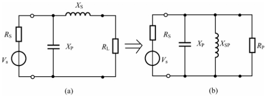

<h1 align="center">作业</h1>

$$
% 设置
\renewcommand{\d}{\displaystyle}
\newcommand{\aneg}[1]{\hspace{-0.75em}&#1&\hspace{-0.75em}\d}
\newcommand{\aneq}{\aneg{=}}
% 上述指令用于在使用 array 环境时调整等号左右间距
\newcommand{\noeq}{&\hspace{1.3em}}
% 上述指令用于 align 环境中, 类似与 &= 但不显示等号.

% 字符
\renewcommand{\i}{\mathrm{i}}
\renewcommand{\j}{\mathrm{j}}
\renewcommand{\k}{\mathrm{k}}
\newcommand{\e}{\mathrm{e}}
\newcommand{\o}{\mathrm{o}}
\newcommand{\ve}{\varepsilon}
\newcommand{\Beta}{\mathrm{B}}
\newcommand{\omicron}{\mathit{o}}
\newcommand{\Omicron}{\mathrm{O}}

% 简写与重定义
\newcommand{\bm}[1]{\boldsymbol{#1}}
\renewcommand{\cal}[1]{\mathcal{#1}}
\renewcommand{\scr}[1]{\mathscr{#1}}
\renewcommand{\frak}[1]{\mathfrak{#1}}
\renewcommand{\rm}[1]{\mathrm{#1}}
\newcommand{\bb}[1]{\mathbb{#1}}

% 数集
\newcommand{\D}{\mathbb{D}}
\newcommand{\E}{\mathbb{E}}
\newcommand{\F}{\mathbb{F}}
\newcommand{\J}{\mathbb{J}}
\newcommand{\K}{\mathbb{K}}
\renewcommand{\L}{\mathbb{L}}

% 上下标
\newcommand{\trans}{^\mathrm{T}}
\newcommand{\inv}{^{-1}}
\newcommand{\madj}[1]{^{\pqty{#1^*}}}	% m 重伴随矩阵
\newcommand{\adj}{^*}
\newcommand{\vector}[1]{\overrightarrow{#1}}
\newcommand{\wavy}[1]{\overset\sim#1}	% \tilde 或 \widetilde 不明显, 容易与 \bar 或 \overline 混淆

% 序列
\newcommand{\ccdots}{\cdot\cdots\cdot}
\newcommand{\oneton}{1,2,\cdots,n}
\newcommand{\oneto}[1]{1,2,\cdots,#1}

\newcommand{\ssto}[3]{#1_1 #3 #1_2 #3 \cdots #3 #1_{#2}}
\newcommand{\ssup}[3]{#1^1 #3 #1^2 #3 \cdots #3 #1^{#2}}
\newcommand{\soneto}[2]{\ssto{#1}{#2}{,}}
\newcommand{\splus}[2]{\ssto{#1}{#2}{+}}

% 括号
\newcommand{\aqty}[1]{\expval{#1}}
\newcommand{\pbqty}[1]{\left(#1\right]}
\newcommand{\bpqty}[1]{\left[#1\right)}
\newcommand{\floor}[1]{\left\lfloor#1\right\rfloor}
\newcommand{\ceil}[1]{\left\lceil#1\right\rceil}

% 矩阵宏简写
\newcommand{\bmatrix}[1]{\begin{bmatrix}#1\end{bmatrix}}
\newcommand{\Bmatrix}[1]{\begin{Bmatrix}#1\end{Bmatrix}}
\newcommand{\vmatrix}[1]{\begin{vmatrix}#1\end{vmatrix}}
\newcommand{\Vmatrix}[1]{\begin{Vmatrix}#1\end{Vmatrix}}

% 常用微分
\newcommand{\dx}{\dd{x}}
\newcommand{\dy}{\dd{y}}
\newcommand{\dz}{\dd{z}}
\newcommand{\dt}{\dd{t}}
\newcommand{\ds}{\dd{s}}
\newcommand{\dr}{\dd{r}}

% 一般的微分
% 如果只使用 \dd{x}\dd{y} 的话, 中间会有多余的间隔.
\newcommand{\df}{\dd}
\newcommand{\ddf}[2]{\,\mathrm{d}#1\mathrm{d}#2}	% 微分形式 differential form
\newcommand{\dddf}[3]{\,\mathrm{d}#1\mathrm{d}#2\mathrm{d}#3}

% 高阶微分
\newcommand{\dxdy}{\ddf{x}{y}}
\newcommand{\dydz}{\ddf{y}{z}}
\newcommand{\dzdx}{\ddf{z}{x}}
\newcommand{\dudv}{\ddf{u}{v}}
\newcommand{\drdt}{\ddf{r}{\theta}}
\newcommand{\dxdydz}{\dddf{x}{y}{z}}

% 矩阵的宏指令
\newcommand{\pmcmn}[3]{\begin{pmatrix}
	#1_{11} & #1_{12} & \cdots & #1_{1#3} \\
	#1_{21} & #1_{22} & \cdots & #1_{n#3} \\
	\vdots & \vdots && \vdots \\
	#1_{#2 1} & #1_{#2 2} & \cdots & #2_{n#3} \\
\end{pmatrix}}

\newcommand{\pmc}[1]{\pmcmn{#1}{n}{n}}
\newcommand{\pvcn}[2]{\begin{pmatrix}
	#1_1 \\ #1_2 \\ \vdots \\ #1_{#2}
\end{pmatrix}}

\newcommand{\pvc}[1]{\pvcn{#1}{n}}
\newcommand{\pto}{\overset{P}{\to}}

% 函数名
\renewcommand{\char}{\operatorname{char}}	% 由于已存在此命令, 不可使用 DeclareMathOperator
\renewcommand{\r}{\operatorname{r}}
\DeclareMathOperator{\st}{s.t.\,}	% 虽然不是函数名, 但用了这个指令就放这儿了.
\DeclareMathOperator{\diag}{diag}	% 不需要定义太多, 一个文件里用到什么定义什么,
\DeclareMathOperator{\Ker}{Ker}		% 毕竟特殊的函数名太多太多了.
\DeclareMathOperator{\Aut}{Aut}		% 便捷与效率的权衡.
\DeclareMathOperator{\Inn}{Inn}
\DeclareMathOperator{\GL}{GL}
\DeclareMathOperator{\SL}{SL}
\DeclareMathOperator{\stab}{stab}
\DeclareMathOperator{\orb}{orb}
\DeclareMathOperator{\lcm}{lcm}
\DeclareMathOperator{\Var}{Var}
\DeclareMathOperator{\Cov}{Cov}
\DeclareMathOperator{\Corr}{Corr}
\DeclareMathOperator{\rot}{rot}
\DeclareMathOperator{\sgn}{sgn}
\DeclareMathOperator{\Outer}{Outer}
\DeclareMathOperator{\Even}{Even}
\DeclareMathOperator{\Scalar}{Scalar}
\DeclareMathOperator{\Vector}{Vector}
\DeclareMathOperator{\arsh}{arsh}
\DeclareMathOperator{\arch}{arch}
\DeclareMathOperator{\arth}{arth}
\renewcommand{\Re}{\operatorname{Re}}	% 自带 \Re 的效果是 \mathrm{Re}, 前后无空格, 故重写
\renewcommand{\Im}{\operatorname{Im}}
\DeclareMathOperator{\Sa}{Sa}
\DeclareMathOperator{\Si}{Si}
\DeclareMathOperator{\avg}{avg}

% 运算符
% 可以用 \bigcap, \bigcup, \bigoplus, \bigotimes 替代
\newcommand{\capop}{\displaystyle\mathop\cap\limits}
\newcommand{\cupop}{\displaystyle\mathop\cup\limits}
\newcommand{\oplusop}{\mathop\oplus\limits}
\newcommand{\otimesop}{\mathop\otimes\limits}
\newcommand{\bigoplusop}{\mathop\bigoplus\limits}
\newcommand{\bigotimesop}{\mathop\bigotimes\limits}

% 积分
\newcommand{\dint}{\displaystyle\int}
\newcommand{\inti}{\dint_{-\infty}^{+\infty}}
\newcommand{\intoi}{\dint_0^{+\infty}}

\newcommand{\intl}{\displaystyle\int\limits}
\newcommand{\iintl}{\displaystyle\iint\limits}
\newcommand{\iiintl}{\displaystyle\iiint\limits}

\newcommand{\coiint}[1]{\d{\oiint\hspace{-1em}}_{#1}\;}
\newcommand{\coiiint}[1]{\d{\oiiint\hspace{-0.9em}}_{#1}\;}

% 求和
\newcommand{\dsum}{\displaystyle\sum}
\newcommand{\csum}[1]{\dsum_{#1=1}^\infty}
\newcommand{\nsum}{\csum{n}}
\newcommand{\ksum}{\csum{k}}
\newcommand{\nosum}{\dsum_{n=0}^\infty}
\newcommand{\insum}{\dsum_{i=1}^n}
\newcommand{\knsum}{\dsum_{k=1}^n}
\newcommand{\csuminf}[1]{\dsum_{#1=-\infty}^{+\infty}}
\newcommand{\nsuminf}{\csuminf{n}}

% 求积
\newcommand{\dprod}{\displaystyle\prod}
\newcommand{\nprod}{\dprod_{n=1}^\infty}
\newcommand{\noprod}{\dprod_{n=0}^\infty}
\newcommand{\inprod}{\dprod_{i=1}^n}

% 极限
\newcommand{\liml}{\lim\limits}
\newcommand{\ulim}{\overline\lim\limits_{n\to\infty}}
\newcommand{\dlim}{\underline\lim\limits_{n\to\infty}}
% 注意这里的 d 是 down, 而不是 displaystyle

\newcommand{\xlim}{\lim\limits_{x\to x_0}}
\newcommand{\nlim}{\lim\limits_{n\to\infty}}
\newcommand{\clim}[1]{\lim\limits_{#1\to\infty}}

% 并集
\newcommand{\incup}{\bigcup_{i=1}^n}
\newcommand{\ncup}{\bigcup_{n=1}^\infty}
\newcommand{\icup}{\bigcup_{i=1}^\infty}

% 交集
\newcommand{\incap}{\bigcap_{i=1}^n}
\newcommand{\ncap}{\bigcap_{n=1}^\infty}
\newcommand{\icap}{\bigcap_{i=1}^\infty}

% 差分
\newcommand{\DD}{\Delta}
\newcommand{\DV}[2]{\dfrac{\DD#1}{\DD#2}}
\newcommand{\nDV}[3]{\dfrac{\DD^{#1}#2}{\DD#3^{#1}}}

% 求导
\newcommand{\ddv}{\displaystyle\dv}
\newcommand{\dpdv}{\displaystyle\pdv}

% 最值 (返回参数); 暂时先这么凑合着用吧
\newcommand{\argmax}[1]{\underset{#1}{\operatorname{argmax}}}
\newcommand{\argmin}[1]{\underset{#1}{\operatorname{argmin}}}

% 缩写
\newcommand{\LRA}{\Leftrightarrow}
\newcommand{\RLA}{\Leftrightarrow}
\newcommand{\LA}{\Leftarrow}
\newcommand{\RA}{\Rightarrow}

\newcommand{\lra}{\leftrightarrow}
\newcommand{\rla}{\leftrightarrow}
\newcommand{\la}{\leftarrow}
\newcommand{\ra}{\rightarrow}

\newcommand{\QRLA}{\quad\RLA\quad}
\newcommand{\QRA}{\quad\RA\quad}
\newcommand{\LLRA}{\Longleftrightarrow}

\newcommand{\QNRA}{\quad\nRightarrow\quad}
\newcommand{\qnra}{\quad\nrightarrow\quad}

\newcommand{\wt}{\widetilde}

% 图形符号
\newcommand{\qed}{\quad\square}
\renewcommand{\parallel}{\mathrel{/\mskip-2.5mu/}}
\newcommand{\paralleleq}{\hspace{0.5em}{^{^{\parallel}}}\hspace{-1.04em}=}
\newcommand{\rt}{\matrm{Rt}\triangle}

% 分块矩阵
\newenvironment{mat}[1]{
	\begin{array}{#1}
}{
	\end{array}
}

\newenvironment{pmat}[1]{
	\left( \begin{array}{#1}
}{
	\end{array} \right)
}

\newenvironment{bmat}[1]{
	\left[ \begin{array}{#1}
}{
	\end{array} \right]
}

\newenvironment{Bmat}[1]{
	\left\{ \begin{array}{#1}
}{
	\end{array} \right\}
}

\newenvironment{vmat}[1]{
	\left\lvert \begin{array}{#1}
}{
	\end{array} \right\rvert
}

\newenvironment{Vmat}[1]{
	\left\lVert \begin{array}{#1}
}{
	\end{array} \right\rVert
}

% 积分变换
\newcommand{\ft}{\overset{\cal F}{\rla}}
\newcommand{\lt}{\overset{\cal L}{\rla}}
\newcommand{\bt}{\overset{\cal B}{\rla}}
\newcommand{\zt}{\overset{\cal Z}{\rla}}
\newcommand{\bzt}{\overset{\cal Z_B}{\rla}}
\newcommand{\lzt}{\overset{\cal Z_L}{\rla}}
\newcommand{\rzt}{\overset{\cal Z_R}{\rla}}
$$

[TOC]

### 第 1 章  选频回路与阻抗变换

#### 1-1

对于并联谐振回路，
$$
S = \dfrac{V(\omega)}{V(\omega_0)} = \dfrac{1}{\sqrt{
	1 + \pqty{Q \cfrac{2\Delta\omega}{\omega_0}}^2
}} = \dfrac{1}{\sqrt{
	1 + \pqty{Q \cfrac{2\Delta f}{f_0}}^2
}},
$$
令 $ S = 10^{-16/20} \approx 0.1585 $，代入 $ f_0 = 640\ \rm{kHz}, \Delta f = 100\ \rm{kHz} $，得
$$
Q = \dfrac{f_0}{2\Delta f} \sqrt{\dfrac{1}{S^2} - 1} \approx 19.9354,
$$
于是 $ \rm{BW_{3dB}} = \dfrac{f_0}{Q} \approx 32.1036\ \rm{kHz} $.

---

#### 1-2

首先有 $ Q = \dfrac{f_0}{\rm{BW_{3dB}}} = 66.67 $，并且 $ X_C = \dfrac{1}{2\pi f_0 C} = 284.205\ \rm{\Omega} $，

于是 $ R = X_C Q = 18.947\ \rm{k\Omega} $，并且 $ L = \dfrac{X_C}{2\pi f_0} = 4.52327 \rm{\mu H} $.

从而 $ S = \bqty{1 + \pqty{Q \dfrac{2\Delta f}{f_0}}^2}^{-\tfrac{1}{2}} = 0.124035 = -18.1291\ \rm{dB} $.

欲使通带增至 300 kHz，需要 $ Q_2 = \dfrac{f_0}{\rm{BW_{3dB}}} = 33.33 $，

于是 $ R_2 = X_C Q_2 = \dfrac{R}{2} $，从而需要并联 $ R_\text P = R = 18.947\ \rm{k\Omega} $.

**备注**	以后约等于简写为等于.

---

#### 1-5

由实际并联回路的谐振频率公式，
$$
f_0 = \dfrac{\omega_0}{2\pi} = \dfrac{1}{2\pi\sqrt{LC}} \sqrt{1 - \dfrac{1}{Q_0^2}}
= 465.270\ \rm{kHz},
$$
于是 $ r = \dfrac{2\pi f_0 L}{Q_0} = 11.4012\ \rm{\Omega} $，从而 $ R_\text P = (1 +Q_0^2) r = 114.023\ \rm{k\Omega} $，

考虑源电阻与负载电阻，
$$
\begin{align}
Q_\e &= \dfrac{R_\text S \parallel R_\text P \parallel R_\text L}{X_C}
= \dfrac{Q_0}{
	1 + \cfrac{R_\text P}{R_\text S} + \cfrac{R_\text P}{R_\text L}
} = 36.8956,
\end{align}
$$
于是通频带为 $ \rm{BW_{0.3dB}} = \dfrac{f_0}{Q_\e} = 12.6105\ \rm{kHz} $，

从而选择性为 $ S = \bqty{1 + \pqty{Q_\e \dfrac{2\Delta f}{f_0}}^2}^{-\tfrac{1}{2}} = 0.533354 = -5.45969\ \rm{dB} $.

---

#### 1-6

首先计算 $ R_\text P = \dfrac{Q_0}{2\pi f_0 C} = 15.9155\ \rm{k\Omega} $，于是 $ P_2 = \sqrt{\dfrac{R_\text L}{R_\text P} + \dfrac{R_\text L}{R_\text S} P_1^2} = 0.335905 $，

考虑源电阻与负载电阻，
$$
Q_\e = \dfrac{Q_0}{
	1 + \cfrac{R_\text P}{R_\text S} P_1^2 +
	\cfrac{R_\text P}{R_\text L} P_2^2
} = 27.8431,
$$
从而通频带为 $ \rm{BW_{0.3dB}} = \dfrac{f_0}{Q_\e} = 359.155\ \rm{kHz} $.

---

#### 1-8

题目中是不是少画了并联电阻 $ R_\text P $？由于部分接入的阻抗变换网络 Q 值较高，

回路的总电容为 $ C_\sum = C_\i + \dfrac{C_1 (C_2 + C_0)}{C_1 + (C_2 + C_0)} = 18.33\ \rm{pF} $，

于是 $ \omega_0 = \dfrac{1}{\sqrt{L C_\sum}} = 26.1116\ \rm{rad/s} $，

从而空载谐振阻抗 $ R_\text P = \omega_0 L Q_0 = 20.8893\ \rm{k\Omega} $，

电容部分接入的接入系数为 $ P = \dfrac{C_1}{C_1 + C_2 + C_0} = \dfrac{1}{3} $，

部分接入转全接入，有 $ R'_0 = \dfrac{R_0}{P^2} = 9 R_0 $，

于是有载品质因数为
$$
Q_\e = \dfrac{Q_0}{
	1 + \cfrac{R_\text P}{R_\text i} + \cfrac{R_\text P}{R'_0}
} = 28.1441,
$$
从而通频带为 $ \rm{BW_{0.3 dB}} = \dfrac{f_0}{Q_\e} = 1.47661\ \rm{MHz} $.

---

#### 1-9

并联谐振的 Q 值为 $ Q_\e = \dfrac{f_0}{\rm{BW_{3 dB}}} = 10 $，

由于为最大功率传输，并且线圈 Q~0~ 视为无穷，

有 $ P^2 = \dfrac{R_\text L}{R_\text L'} = \dfrac{R_\text L}{R_\text S} = \dfrac{1}{9} $，从而 $ C_2 = 2 C_1 $，

并且等效总电阻 $ R = R_\text S \parallel R'_\text L= 4.5\ \rm{k\Omega} $，

于是电容为 $ L = \dfrac{R}{\omega_0 Q_\e} = \dfrac{R}{2\pi f_0 Q_\e} = 4.47623\ \rm{\mu H} $，

从而 $ C_\sum = \dfrac{1}{\omega_0 X_{C_\sum}} = \dfrac{1}{\omega_0^2 L} = 22.1049\ \rm{pF} $，

由 $ C_\sum = \dfrac{C_1 C_2}{C_1 + C_2} $ 和 $ C_2 = 2 C_1 $ 解得 $ C_1 = 33.1573\ \rm{pF}, C_2 = 6.63146\ \rm{pF} $.

---

#### 1-10

并联谐振的 Q 值为 $ Q_1 = \dfrac{f_0}{\rm{BW_{3 dB}}} = 40 $，

角频率 $ \omega_0 = 2 \pi f_0 = 6.28319 \cdot 10^9\ \rm{rad/s} $，

于是并联电感为 $ L = \dfrac{R_\i}{\omega_0 Q_1} = 198.944\ \rm{pH} $，

并且总电容值为 $ C_\sum = \dfrac{1}{\omega_0^2 L} = 127.324\ \rm{pF} $.

记并联回路的 Q 值为 $ Q_2 = \omega_0 C_2 R_2 $，则
$$
R_\i = (1 + Q_1^2) R_\text{2S}
= \dfrac{1 + Q_1^2}{1 + Q_2^2} R_2，
$$
解得 $ Q_2 = 12.6135 $，从而 $ C_2 = \dfrac{Q_2}{\omega_0 R_2} = 401.5\ \rm{pF} $，

于是 $ C_\text{2S} = \dfrac{Q_2^2 C_2}{1 + Q_2^2} = 398.992\ \rm{pF} $，由 $ C_\sum = \dfrac{C_\text{2S} C_1}{C_\text{2S} + C_1} $ 解得 $ C_1 = 186.998\ \rm{pF} $.

---

#### 1-12

由于输入阻抗大于负载电阻，若采取 L 网络阻抗变换，则负载电阻与匹配网络中的电感串联，刚好可以与寄生电感合并，因此这里采用 L 网络阻抗变换。

大致思路如下图所示，负载与电感串联后变换为并联，从而增大负载电阻；而为了使输入阻抗为纯电阻，还需要并联电容。

由输入阻抗 $ R_\i = R_\text P = (1 + Q^2) R_\text L $，解得并联回路的品质因数为 $ Q = 2 $.

于是根据品质因数的定义式 $ Q = \dfrac{X_\text S}{R_\text L} = \dfrac{R_\text P}{X_\text{P}} $，解得 $ C_\text{P} = 63.662\ \rm{pF} $，

串联总阻抗为 $ X_\text{S} = 20\ \Omega $，减去原有的阻抗，有 $ X_S' = X_S - \omega_0 L_0 = -42.8319\ \Omega $，

因此需要新串联的元件为电容而非电感，其参数为 $ C_\text S = -\dfrac{1}{\omega_0 X'_\text S} = 37.1581\ \rm{pF} $.

---

#### 1-14

什么是归一化阻抗变换？

（1）$ z_\text L = (0.5 - \j 0.8)\ \Omega $.

$ Z_\text L = 50 z_\text L = (25 - \j 40)\ \Omega $，于是内接电感，且 $ Q = \sqrt{\dfrac{50}{25} - 1} = 1 $，

从而串联电感 $ X_\text L = R_\text L Q + X_{C_L} = 65\ \Omega $，并联电容 $ X_C = \dfrac{R_\text S}{Q} = 50\ \Omega $.

（2）$ z_\text L = (1.6 + \j 0.8)\ \Omega $.

$ Z_\text L = 50 z_\text L = (80 + \j 40)\ \Omega $，于是外接电感，且 $ Q = \sqrt{\dfrac{80}{50} - 1} = 0.774 $，

先用串联电容 $ X_{C_1} = 40\ \Omega $ 抵消负载感抗，

再并联电容 $ X_C = \dfrac{R_\text L}{Q} = 103.3\ \Omega $ 实现阻抗变换，

最后串联 $ X_L = R_\text S Q= 38.7\ \Omega $ 从而使输入阻抗为纯电阻.

---

### 第 2 章  噪声与非线性变换

#### 2-1^*^

（1）

$ \overline{I_\text n^2} = \dfrac{4 k T B}{R} = 3.13882 \cp 10^{-21}\ \rm{A^2} $.

$ \overline{V_\text n^2} = \overline{I_\text n^2} R^2 = 8.16408 \cp 10^{-10}\ \rm V^2 $.

（2）

$ \overline{V_\text n^2} = 4 k T B (R_1 \parallel R_2) = 2.68555\ \rm{V^2} $.

---

#### 2-2^*^

$ P_\text n = \dfrac{4k T B}{R_1 + R_2} \dfrac{1}{4} (R_1 + R_2) = k T B $.

---

#### 2-3

:star: 

$ H(\omega) = \dfrac{1}{1 + \j\omega R C} $,

$ N_0 = n_0 \intoi \vqty{H(\omega)}^2 \dd{f} = n_0 \intoi \dfrac{\dd{f}}{1 + 4\pi^2 f^2 R^2 C^2} = \dfrac{n_0}{2\pi RC} \cdot \dfrac{\pi}{2} = \dfrac{n_0}{4 RC} $.

---

#### 2-4

$ T_{\e1} = (F_1 - 1) T_0 = 288.626\ \rm K $,

$ T_\e = T_{\e1} + \dfrac{T_{\e2}}{G_\text{P1}} = 313.924\ \rm K $.

$ F = 1 + \dfrac{T_\e}{T_0} = 2.0825 $.

---

#### 2-5

$ F_\text t = k \bqty{T_\text a + (F - 1) T_0} B = -174\ \rm{dBm / Hz} + 3\rm{dB} + 10\lg B = 121\ \rm{dBm} $,

$ P_\text{in, min} = F_t \rm{(SNR)_{0, min}} = -101\ \rm{dBm} $,

$ \rm{DR_l} = -10\rm{dBm} - P_\text{in, min} = 91\rm{dBm} $.

---

#### 2-6^*^

$ H(\omega) = \dfrac{1}{\j (\omega C - \cfrac{1}{\omega L}) + \cfrac{1}{R}} $，$ H(\omega_0) = R $,

$ \intoi \vqty{H(\omega)} \dd{f} =  $,

**备注**	$ B_\text L = \dfrac{1}{4 RC} $. :crescent_moon: 

---

#### 2-7

:star: 

（1）线性动态范围

$ F_\text t = k (T_\text a + (F - 1) T_0) B = -87.4161\ \rm{dBm} $,

$ P_\text{i, 1dB} = 25 - 39 = -14\ \rm{dBm} $,

以基底噪声为下限：$ \rm{DR_l} = 73.4171\ \rm{dB} $.

以灵敏度为下限：$ \rm{DR_l} = 63.4171\ \rm{dB} $.

（2）无杂散动态范围

$ \rm{IIP_3} = \rm{OIP}_3 - G = -5\ \rm{dBm} $,

以基底噪声为下限：$ \rm{DR_f} = 54.9447\ \rm{dB} $.

以灵敏度为下限：$ \rm{DR_f} = 44.9447\ \rm{dB} $.

---

#### 2-8

$ \d \text{OIP3}=\frac{10^{14/10.}}{\frac{100}{10^{22/10}}+\frac{100}{10^{13/10}}} = 6.48503 $,

---

#### 2-9

与 2-8 同理得 20.8067 dBm.

---

#### 2-12

$ P_\text{in, min} = k (T_\text a + (F - 1) T_0) B \rm{(SNR)_\i} = -108.053\ \rm{dBm} $.

$ V_\text{in} = \sqrt{R_\text{in} P_\text{in, min}} = 8.84761 * 10^{-5}\ \rm V $.

$ A_\text V = 115.043\ \rm{dB} $.

---

#### 2-13

$ F = F_1 + \dfrac{F_2 - 1}{G_\text{PA1}} = 13.861 = 11.4186\ \rm{dB} $,

1. $ P_\text{in, min} = -117.787\ \rm{dB} $,
2. $ P_\text{in, min} = -115.55\ \rm{dB} $.

---

### 第 3 章  调制和解调

#### 3-1

:star: 

进行了两次 AM 调制，第一次将 $ F = 3\ \rm{kHz} $ 的音频调制到载频 $ f_1 = 10\ \rm{kHz} $ 和 $ f_2 = 30\ \rm{kHz} $ 上，第二次再将其调制到主载频 $ f_0 = 1000\ \rm{kHz} $ 上.
$$
\begin{align}
v_1(t) &= 4 \pqty{1 + 0.5 \cos\Omega t} \cos \omega_1 t, \\
v_2(t) &= 2 \pqty{1 + 0.4 \cos\Omega t} \cos \omega_2 t, \\
v(t) &= 5 \bqty{
	1 + 0.8 \pqty{1 + 0.5 \cos\Omega t} \cos\omega_1 t +
	0.4 \pqty{1 + 0.4 \cos\Omega t} \cos\omega_2 t
} \cos\omega_0 t.
\end{align}
$$
平均功率为
$$
P_\avg = 0.2^2 \cdot 2 + 0.5^2 \cdot 2 + 1^2 + 2^2 + \dfrac{5^2}{2} = 18.08\ \rm{W}.
$$
$ \rm{BW_AM} = 66\ \rm{kHz} $.

---

#### 3-2

1. $ P_\text c = \dfrac{10^2}{2}\ \rm{mW} = 50\ \rm{mW} $.
2. $ P = \dfrac{5^2}{4}\ \rm{mW} = 6.25\ \rm{mW} $.
3. $ P_\max = \dfrac{10^2}{2} (1 + 0.5)^2 = 112.5\ \rm{mW} $.
4. $ P_\min = \dfrac{10^2}{2} (1 - 0.5)^2 = 12.5\ \rm{mW} $.

---

#### 3-6

1. 信号：
   $$
   \begin{align}
   v_\text{1}(t) &= A V_\rm{AM} (1 + m_1 \cos\Omega_1 t + m_2 \cos\Omega_2 t) \cos\omega_\text c t,
   \\
   v_2(t) &= 0.1 AV_\rm{AM} \cos\omega_\text c t +
   0.5 AV_\rm{AM} m_1 \cos(\omega_\text c + \Omega_1) t +
   0.5 AV_\rm{AM} m_2 \cos(\omega_\text c + \Omega_2) t,
   \\
   v_3(t) &= 0.1 AV_\rm{AM} m_1 \cos(\omega_\text c - \Omega_1) t +
   0.5 A V_\rm{AM} \cos(\omega_\text c t) +
   \\
   \noeq 0.4 AV_\rm{AM} m_1 \cos(\omega_\text c + \Omega_1) t +
   0.5 AV_\rm{AM} m_2 \cos(\omega_\text c + \Omega_2) t.
   \end{align}
   $$
   
2. 双边调制（AM）；单边带信号（SSB）；残留边带调幅.

3. 包络检波或相干解调；相干解调（同步检波）；相干解调.

---

#### 3-9

调频（FM）：相位为角频率的积分.

调相（AM）：角频率为相位的导数.

---

#### 3-11

1. $ v(t) = 30 \cos(18\pi \cp 10^7 t + 5 \sin(4\pi \cp 10^4 t)) $.
2. $ \Delta f_\text m = m_\text f F = 100\ \rm{kHz} $.
3. $ \rm{BW_CR} = 2 (\Delta f_\text m + F) = 240\ \rm{kHz} $.
4. $ P = \dfrac{30^2}{2 \cdot 50} = 9\ \rm W $.
5. $ P_\o = \vqty{J_0(5)}^2 = 0.04 $.

---

#### 3-12

:crescent_moon: 

1. $ \Delta f_\text m = m_\text f F \RA m_\text f = 3 $,

   $ \omega(t) = 2\pi \cp 50 \cp 10^6 + 2\pi \cp 6 \cp 10^3 \cos 2\pi \cp 2 \cp 10^3 t\ \rm{rad / s} $,

   $ \varphi(t) = 10^8 \pi t + 3  \sin 4\pi \cp 10^3 t\ \rm{rad} $,

   $ v(t) = 5 \cos(10^8 \pi t + 3  \sin 4\pi \cp 10^3 t)\ \rm V $.

2. $ \Delta \varphi_\text m = m_\text p = 4.5 $,

   $ \varphi(t) = 10^8\pi t + 4.5 \cos 4\pi \cp 10^3 t\ \rm{rad} $,

   $ \omega(t) = 10^8\pi t - 18\pi \cp 10^3 \sin 4\pi \cp 10^3 t\ \rm{rad/s} $,

   $ v(t) = 4 \cos(10^8\pi t + 4.5 \cos 4\pi \cp 10^3 t)\ \rm{V} $.

3. （1）1.5 V, 2 kHz

   1. 调频波：$ m_\text f = 3, \rm{BW_CR} = 16\ \rm{kHz} $.
   2. 调相波：$ m_\text p = 4.5, \rm{BW_CR} = 22\ \rm{kHz} $.

   （2）1.5 V, 4 kHz

   1. 调频波：1.5, 20 kHz.
   2. 调相波：4.5, 44 kHz.

   （3）3 V, 2 kHz

   1. 调频波：6, 28 kHz.
   2. 调相波：9, 40 kHz.

**备注**	注意题目中给出了单位电压的频偏，而非最大电压.

---

#### 3-13

$ v(t) = 10 \cos(4\pi \cp 10^7 t + 3 \sin 4\pi \cp 10^3 t + \dfrac{8}{3} \sin 5\pi \cp 10^3 t)\ \rm V $.

频率：$ \omega(t) = 4\pi \cp 10^7 + 12\pi \cp 10^3 \cos4\pi \cp 10^3 t + \dfrac{4}{3} 10^4 \cos4\pi \cp 10^3 t\ \rm{rad/s} $.

频谱分量的频率略.

### 第 4 章  发送机接收机结构

#### 4-5

:star: 

1. $ \rm{(SNR)_i} = 15\ \rm{dB} $.
2. $ S_\rm{out} = -80\ \rm{dBm} $.
3. $ N_\text{out} = G k (F - 1) T_0 B + GN_\i = -94.0243\ \rm{dBm} $.
4. $ \rm{(SNR)_o} = 14.0243\ \rm{dB} $.

---

#### 4-10

1. 噪声系数：
   $$
   \begin{align}
   F &= F_1 + \dfrac{F_2 - 1}{G_\rm{P1}} + \dfrac{F_3 - 1}{G_\rm{P1} G_\rm{P2}}
   \\
   &= 10^{2/10} + \dfrac{10^{1/10} - 1}{10^{10/10}} +
   \dfrac{10^{4/10} - 1}{10^{10/10} \cdot 10^{-1/10}}
   \\
   &\approx 1.80112 \approx 2.55543\ \rm{dB}.
   \end{align}
   $$

2. $ T_\e = (F - 1) T_0 = 232.325\ \rm K $.

3. $ N_\o = G k (T_\e + T_\text a) B = 1.35877 \cp 10^{-13}\ \rm{W} = -98.6695\ \rm{dBm} $.

4. $ S_\rm{DSB} = \dfrac{N_0}{B} = -168.669\ \rm{dBm} $.

5. $ V_\rm{in, min} = \sqrt{\dfrac{\rm{(SNR)_o} N_\o}{R \cdot G}} = 13.0635\ \rm{\mu V} $.

第 5 章  低噪声放大器

5-3

5-4

5-5

5-9

第 6 章  混频器

6-6

6-7

6-8

6-9

6-14

6-15

第 7 章  振荡器

7-2

7-3

7-5

7-7

7-10

7-13

例 7-2-1

第 9 章  调制和解调电路

9-1

9-3

9-5

9-10

9-12

9-13

9-23

9-24

9-25

第 10 章 高频功率放大器

10-3

10-10

10-11
