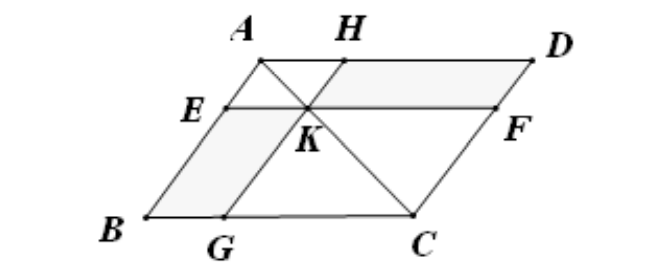

<h1 align="center">几何原本</h1>

$$
\renewcommand\parallel{\mathrel{/\mskip-2.5mu/}}
\newcommand{\vector}[1]{\overrightarrow{#1}}

\DeclareMathOperator{\Rt}{Rt}
\newcommand{\Rtt}{\Rt\triangle}

\newcommand{\qed}{\quad\square}

\newcommand{\ra}{\rightarrow}
\newcommand{\RA}{\Rightarrow}
\newcommand{\RLA}{\Leftrightarrow}

\newcommand{\QRA}{\quad\RA\quad}
\newcommand{\QRLA}{\quad\RLA\quad}
$$

[TOC]

# 第 1 章	平面基本图形

## 1.1	定义

## 1.2	公设

1. 过相异两点, 能且只能作一直线. (**直线公理**)

2. 两线段中小的线段重复有限次一定能超过长线段. (**欧多克斯-阿基米德公理**)

   即线段可以任意地延长.

3. 以一点为圆心, 任意长为半径, 可作一圆. (**圆公理**)

4. 凡直角都相等. (**角公理**)

5. 过直线外一点，可作且只可作一直线跟此直线平行. (**平行公理**)

   两直线被第三条直线所截, 如果同侧两内角和小于两个直角, 则两直线则会在该侧相交.

---

## 1.3	公理

1. $ a=c,\, b=c \QRA a=b $. (**等量代换公理**)
2. $ a=b,\, c=d \QRA a+c=b+d $. (**等量加法公理**)
3. $ a=b,\, c=d \QRA a-c=b-d $. (**等量减法公理**)
4. **移形重叠公理**.
5. **全量大于分量公理**.

- 连续性公理
  - 戴德金公理
  - 欧多克索斯-阿基米德命题、康托命题

---

## 1.4	命题

### 1.4.2	圆规工具

>  由一已知点 $A$ 为端点作一线段 (或圆) 等于已知线段.

**作图**	(五步即可)

1. 以 $AB$ 为半径作圆 $A$;
2. 以 $AB$ 为半径作圆 $B$, 交圆 $A$ 于点 $D$ 与 $E$;
3. 以 $DC$ 为半径作圆 $D$;
4. 以 $EC$ 为半径作圆 $E$, 交圆 $D$ 于点 $C$ 与 $F$;
5. 连接 $AF$.

由对称性知 $ AF = BC $ (严谨的证明可以使用全等). 作完.

---

### 1.4.12	作垂线

> 由已知无限直线外一已知点 $A$ 作该直线的垂线.

**作图**	(三步即可)

1. 以直线上一点 $B$ 为圆心, $BA$ 为半径作圆.
2. 以直线上另一点 $C$ 为圆心, $CA$ 为半径作圆.
3. 圆 $B$ 交圆 $C$ 于点 $A$ 与 $D$, 连接 $AD$.

由对称性知 $ AD \perp BC $ (严谨的证明可使用全等). 作完.

---

### 1.4.31	作平行线

> 过一已知点 $A$ 作一直线平行于已知直线.

**作图**	(四步即可)

法一

1. 以直线上一点 $B$ 为圆心, $AB$ 为半径作圆, 交直线于点 $C$;
2. 以 $C$ 为圆心 $CA$ 为半径作圆, 交圆 $B$ 于点 $A$ 与 $D$;
3. 连接 $DC$ 并延长, 交圆 $C$ 于点 $E$;
4. 连接 $AE$.

$ AD \perp BC,\, AD \perp AE \QRA AE \parallel BC $. 作完.

法二

1. 以直线上一点 $B$ 为圆心, $AB$ 为半径作圆, 交直线于点 $C$;
2. 以 $CB$ 为半径作圆 $C$;
3. 以 $AB$ 为半径作圆 $A$, 与 圆 $C$ 交于点 $B$ 与 $D$;
4. 连接 $AD$.

$ DC = AB = BC = CD \QRA AD \parallel BC $. 作完.

---

### 1.4.43	平行四边形补形

> 在任意平行四边形中, 对角线两边的平行四边形的补形彼此相等.

---

### 1.4.47	勾股定理及其推广

**全部最简勾股数**: $ (m^2-n^2)^2 + (2mn)^2 = (m^2+n^2)^2 $, 其中 $m$ 与 $n$ 互素且一奇一偶.

**勾股定理的推广**

---

## 1.5	补充

### 1.5.1	度量

> 设 $D$ 是非空集, 映射 $ \rho: D^2 \ra R $ 满足, $ \forall x, y \in D $, 有:
>
> 1. $ \rho(xy) \ge 0 $, 且 $ \rho(xy) = 0 \RLA x=y $; (非负性)
> 2. $ \rho(xy) = \rho(yx) $; (对称性)
> 3. $ \rho(xy) + \rho(yz) \ge \rho(xz) $. (三角不等式)
>
> 则称 $\rho$ 是 $D$ 上的 **度量** (仅满足前两条则称为 **半度量**). $ \rho(xy) $ 为 点 $x$ 与 $y$ 之间的 **距离**. 定义了度量的集 $D$ 称为 **度量空间** 或 **距离空间**.

---

### 1.5.2	公设【5】相关命题

用到【公设 5】的包括以下几类命题：

1. 平行线的性质命题、唯一性命题；
2. 三角 形及多边形的内角和、外角和命题；
3. 勾股定理相关命题；
4. 平行线截线段成比例命 题及三角形相似命题；
5. 建立在比例基础上的面积命题等。

没用到的【公设 5】包 括以下命题：

1. 平行线存在命题、判定命题；
2. 三角形全等命题；
3. 内角和小于二倍直角；
4. 外角大于不相邻内角；
5. 大边对大角、大角对大边等。

---

### 1.5.3	勒让德$-$萨开三大定理

**勒让德-萨开里第一定理**

>三角形内角和不能大于 $2$ 倍直角.

注: 无需平行公理, 在欧氏几何与罗氏几何 (双曲几何) 中均成立, 在黎曼几何 (椭圆几何) 中不成立.

**勒让德-萨开里第二定理**

> 如果在一已知的三角形中内角和等于 $2d$, 则在任意三角形中内角和也等于 $2d$.

**勒让德-萨开里第二定理**

> 如果某一三角形的内角和小于 $2$ 直角, 则任一三角形的内角和也小于 $2$ 直角.

**推论**

- 罗氏几何中所有三角形内角和小于 $2$ 直角.
- 黎曼几何中所有三角形内角和大于 $2$ 直角.

---

### 1.5.4	萨开里四边形

---

### 1.5.5	斯坦纳-雷米欧司定理

> 如果一个三角形的两个内角平分线相等, 则这个三角形是等腰三角形.

**证明**

如图, 作 $ CF \parallel DB $, $ BF // AC $ 两线交于 $F$.

则 $ EC = BD = FC,\, \angle 1 = \angle 2 $.

不妨令 $ \alpha > \beta $, 则在 $ \triangle BCE $ 和 $ \triangle BCF $ 中, 有 $ BF > BE $.

在 $ \triangle BEC $ 中, $ \angle BEF = 180^\circ - \angle1 - 2\alpha - \beta $,

在 $ \triangle BFC $ 中, $ \angle BFE = 180^\circ - \angle1 - \alpha - 2\beta $,

故在 $ \triangle BEF $ 中, $ BF < BE $, 矛盾,

故 $ \alpha \le \beta $, 同理 $ \alpha \ge \beta $, 即 $ \alpha=\beta $. 证毕.

---

### 1.5.6	三角形中线共点

---

### 1.5.7	同一性命题

> 条件和结论都唯一的命题如果成立, 则其逆命题亦成立.

---

# 第 2 章	几何式的代数

## 2.1	定义

柺尺形

## 2.2	命题

### 2.2.11	黄金分割点

> 给定已知线段, 作黄金分割点.

**作法**	(至多九步)

    
    

---

### 2.2.12	余弦定理的极简证明

> 钝角三角形的余弦定理. (锐角三角形同理)

$$
BC^2 = BD^2 + (DA+AC)^2 = AB^2 + AC^2 + 2 AD \cdot AC.
$$

---

### 2.2.14	四则运算与开根 :star:

> 作一个正方形等于已知直线形.

注意任意直线形可以转化成一个平行四边形, 从而转化成一个矩形. (这里的转化指的是, 可以通过尺规作图作出一个图形使之与原图形的面积相等)

- 不妨令 $BE=a$, $EF=ED=b$, 这里利用了射影定理 (或者说极化恒等式与勾股定理) 作出了 $ \sqrt{ab} $.

- 由此我们可以对任意长度进行开根, 即作出 $ \sqrt[2n]{a} $.

  如图, 取 $AB$ 为单位 $1$, 延长至 $C$ 使得 $BC=a$, 以 $AC$ 中点 $O$ 为圆心, $OA$ 长为半径作圆. 过 $B$ 作 $ BD \perp AC $, 交圆 $O$ 于点 $D$, 则 $ BD = \sqrt{a} $.

  

  以此类推, 给定 $AB$ 与 $BC$, 至多 $9n-1$ 步即可作出 $ \sqrt[2n]{a} $.

- 如果 $ a \in \Q^+ $, 则可以作出长为 $a$ 的线段. (并且可以仅由两次画圆工具和若干次直线工具作出.)

- 如果给出长为 $a,\,b\, (a,\, b \in \R^+)$ 的线段, 可以利用相似三角形作出长为 $ a^{-1},\, a^2,\, ab $ 的线段. (以上作图的唯一性由单位 $1$ 确定.)

---

## 2.3	补充

### 2.3.1	帕施公理

> 设 $A$, $B$, $C$ 是不共线的三点, $l$ 是平面 $ABC$ 上不通过 $A$, $B$, $C$ 中任一点的直线. 若 $l$ 上有一点介于 $A$, $B$ 之间, 则它必有另一点介于 $A$, $C$ 之间或 $B$, $C$ 之间.

---

# 第 3 章	圆与角

## 3.1	定义

弓形的角 (月牙角)

## 3.2	命题

### 3.2.17	作圆的切线

> 由已知点作直线切于已知圆.

    
    

- 左图为原本上的证法, 相较繁琐; 右图为现行中学教材的作法, 需要圆周角定理.

---

> 作两圆的内外公切线.

    
    

- 作图为外公切线, 先作出 $ O_2A = r_2-r_1 $; 右图为内公切线, 先作出 $ O_2A = r_2+r_1 $.

---

### 3.2.22	对角互补及其应用 :star:

> 由相交或相切的两圆, 仅用直尺作平行线.

    
    

    
    

- 以上四中情况本质上是相同的. 注意第四张图中 $ EC \parallel DF $, 不一定与 $BA$ 平行, 只是画的有点像而已. 两圆相切的情况时类似的.
- 给定两个相交或相切的圆, 仅用无刻度直尺即可作出两圆的圆心.

---

### 3.2.32	弦切角定理

---

### 3.2.35	圆幂定理及其逆定理

- 可以由勾股定理或相似证明圆幂定理.

---

## 3.3	补充

### 3.3.1	蝴蝶定理

> 已知 $M$ 是圆 $O$ 的弦 $AB$ 的中点, 过 $M$ 的两条弦分别为 $CD$ 和 $EF$, 又 $CD$ 和 $ED$ 分别与 $AB$ 交于点 $P$ 与 $Q$, 则 $PM=MQ$.

**证明**	作 $EE' \perp OM$ 交圆 $O$ 于点 $E'$,如图连接线段, 则 $ ME'=ME $.

$ \angle{5} = \angle{ME'E} = \angle{6} = \angle{4} $.

$ \angle{E'CP} + \angle{5} = \angle{E'CF} + \angle{6} = 180^\circ $, 故 $E', C, P, M$ 四点共圆.

$ \angle{2} = \angle{1} = \angle{3} $, 故 $ \triangle{E'MP} \cong \triangle{EMQ} $, $ PM = MQ $.

证毕.

---

# 第 4 章	圆与多边形

## 4.1	定义

## 4.2	命题

### 4.2.2	作内接三角形

> 在一个已知圆内作一个与已知三角形等角的内接三角形.

- 利用弦切角定理.

---

### 4.2.3	作外切三角形

> 在一个已知圆外作一个与已知三角形等角的外切三角形.

- 利用外角.

---

### 4.2.6	作内接正方形

> 在一个已知圆内过一点作圆的内接正方形.

- 最少步为 7E, 详见 Euclidea 第 1 章第七题.
- 可以依此作出正 $ 2^n\, (n>1) $ 边形.

---

### 4.2.7	作外切正方形

> 在一个已知圆外过一点作圆的外切正方形.

已知圆 $O$, 求过圆上一点 $A$ 作圆的外切正方形.

**作法**	(至多 10 步)

1. 连接 $AO$ 并延长, 交圆 $O$ 于点 $B$ (为下一步准备) ;
2. $ CD \perp AB $, 交圆 $O$ 于点 $C$ 与 $D$ (至少 3 步);
3. 以 $A$ 为圆心, $AO$ 为半径作圆;
4. 以 $C$ 为圆心, $CO$ 为半径作圆, 交圆 $A$ 于点 $O$ 与 $E$;
5. 连接 $ED$ 并延长, 交圆 $C$ 于点 $F$;
6. 连接 $FB$ 并延长;
7. 连接 $EA$ 并延长, 交圆 $A$ 于点 $G$;
8. 连接 $GD$ 并延长, 交 $FB$ 于点 $H$.

---

### 4.2.11	内接正五边形

> 求作已知圆的内接正五边形.

- 通过黄金分割比作出顶角为 $36^\circ$ 的等腰三角形, 利用命题 4.2.2 即得.

---

### 4.2.12	外切正五边形

> 求作已知圆的外切正五边形.

- 利用内接正五边形.

---

### 4.2.15	圆规等分圆周

> 仅用圆规六等分与四等分圆周.

- 见 Euclidea 第四章第 11 题.

---

### 4.2.16	内接正多边形 :star:

#### 1	正十五边形

> 求作已知圆的内接正十五边形.

- 利用正三角形与正五边形, 注意到 $ \gcd(3, 5) = 1 $.

#### 2	正十七边形

> 求作已知圆的内接正十七边形.

##### 2.1	理论基础

令 $ \alpha = \dfrac{2\pi}{17} $, 注意到 $ \cos{n\alpha} = \dfrac{\sin(n+\frac{1}{2})\alpha - \sin(n-\frac{1}{2})\alpha}{2\sin\frac{1}{2}\alpha} $, 故
$$
\sum_{n=1}^8 \cos{n\alpha} = \frac{\sin\frac{17}{2}\alpha - \sin\frac{1}{2}\alpha}{2\sin\frac{1}{2}\alpha} = -\frac{1}{2}
$$
设
$$
\left\{\begin{align}
& x = \cos\alpha + \cos2\alpha + \cos4\alpha + \cos8\alpha \\
& y = \cos3\alpha + \cos5\alpha + \cos6\alpha + \cos7\alpha \\
\end{align}\right.
$$
则经过积化和差剥蒜得
$$
\left\{\begin{align}
	& x+y = -\dfrac{1}{2} \\
	& xy = \frac{1}{2} \pqty{ 4\sum_{n=1}^8 \cos n\alpha } = -1
\end{align}\right.
\QRA
\begin{cases}
	x = \dfrac{-1+\sqrt{17}}{4} \\
	y = \dfrac{-1-\sqrt{17}}{4} \\
\end{cases}
$$
再设
$$
\left\{\begin{align}
	x_1 &= \cos\alpha + \cos4\alpha \\
	x_2 &= \cos2\alpha + \cos8\alpha \\
	y_1 &= \cos3\alpha + \cos5\alpha \\
	y_2 &= \cos6\alpha + \cos7\alpha \\
\end{align}\right.
$$
再次积化和差剥蒜得
$$
\begin{cases}
	x_1 + x_2 = \dfrac{-1+\sqrt{17}}{4} \\ \displaystyle
	x_1 x_2 = \dfrac{1}{2} \sum_{n=1}^8 \cos n\alpha = -\dfrac{1}{4}
\end{cases}
\QRA
\begin{cases}
	x_1 = \dfrac{\sqrt{17}-1+\sqrt{34-2\sqrt{17}}}{8} \\
	x_2 = \dfrac{\sqrt{17}-1-\sqrt{34-2\sqrt{17}}}{8} \\
\end{cases}
$$

$$
\begin{cases}
	y_1 + y_2 = \dfrac{-1-\sqrt{17}}{4} \\ \displaystyle
	y_1 y_2 = \dfrac{1}{2} \sum_{n=1}^8 \cos n\alpha = -\dfrac{1}{4}
\end{cases}
\QRA
\begin{cases}
	y_1 = \dfrac{-\sqrt{17}-1+\sqrt{34+2\sqrt{17}}}{8} \\
	y_2 = \dfrac{-\sqrt{17}-1-\sqrt{34+2\sqrt{17}}}{8} \\
\end{cases}
$$

联立含有 $\cos\alpha$ 的项得
$$
\begin{cases}
	\cos\alpha + \cos4\alpha = x_1 \\
	\cos\alpha \cdot \cos4\alpha = \dfrac{1}{2}y_1
\end{cases}
$$

$$
\cos\frac{2\pi}{17} = \frac{1}{16} \pqty{
	-1 + \sqrt{17} + \sqrt{2\pqty{17-\sqrt{17}}} + 2\sqrt{
		17 + 3\sqrt{17} - \sqrt{2\pqty{17-\sqrt{17}}} -
		2\sqrt{2\pqty{17-\sqrt{17}}}
	}
}
$$

故理论上可以作出正十七边形. 证毕.

---

##### 2.2	理奇蒙法

##### 2.3	欧阳琦法

##### 2.4	近似作法

#### 3	正多边形

费马数: $ F_n = 2^{2^n}+1 $.

形如 $ 2^m F_{i_1} F_{i_2} \cdots F_{i_n} $ 的正多边形可以用尺规作图作出, 其中 $F_{i_j}$ 是互不相同的费马素数.

---

## 4.3	补充

### 4.3.1	阿波罗尼斯问题 :star: $%p191$

> 作一圆与三个广义圆相切. (共十类情况)

---

### 4.3.2	分割三角形

> 钝角三角形 $ABC$ 中角 $B$ 为钝角, 且 $ B-A<90^\circ,\, B-C<90^\circ $, 取三角形的内心 $D$ 为圆心, $DB$ 为半径作圆, 如图连接线段, 则将原三角形分割成七个锐角三角形.

**证明**	注意到 $ \triangle{AHE} \cong \triangle{AHF} $,
$$
\begin{align}
\angle{BDE} &= 180^\circ - \angle{DEB} - \angle{DBE}
\\
&= 180^\circ - \angle{ABC} < 90^\circ
\\
\angle{AEF} &= \angle{AFE} < 90^\circ
\\
\angle{EDF} &= 180^\circ - 2\angle{DEF}
\\
&= 180^\circ - 2(180^\circ - \angle{AEF} - \angle{DEB})
\\
&= 2\angle{AEF} + 2\angle{DEB} - 180^\circ
\\
&= \angle{ABC} - \angle{BAC} < 90^\circ
\\
\angle{HDG} &= \angle{ABC} - \angle{BCA} < 90^\circ
\\
\angle{FDG} &=360^\circ - 2\angle{BDE} - \angle{EDF} - \angle{HDG}
\\
&=2\angle{ABC} - \angle{ABC} + \angle{BAC} - \angle{ABC} + \angle{BCA}
\\
&= \angle{BAC} + \angle{BCA} < 90^\circ
\end{align}
$$

---

### 4.3.3	平面鸡爪定理 :star:

> 设 $I$ 是 $ \triangle{ABC} $ 的内心, $J$ 是 $\angle{A}$ 内的旁心, $IJ$ 交 $\triangle{ABC}$ 的外接圆于点 $K$, 则 $ KB = KC = KI = KJ $.

**证明**	注意到 $ A, I, K, J $ 四点共线.

$ \zeta = \delta + \gamma = \varepsilon + \beta = \alpha + \beta \QRA KI = KB $, 同理 $ KI = KC $.

而 $ IB \perp BJ $, 故 $ KI = KB = KJ $. 证毕

---

### 4.3.4	等价关系

第五公设

$\RLA$ 平行公理

$\RLA$ 过不共线的三点恒有一圆

$\RLA$ 平面上一直线的垂线与斜线相交

---

### 4.3.5	三角形高线共点 $%p189$

---

### 4.3.6	九点圆定理 :star:

> 已知：三角形 ABC 的三条高线 AD、BE、CF 交于点 O，G、H、K 分别是边 BC、CA、BA 中点，L、M、N 分别是 AO、BO、CO 中点.
>
> 求证：D、E、F、G、H、K、L、M、N 九点共圆.

#### 1	证明

如上左图,

在 $ \Rtt{ADC} $ 中, $H$ 是 $AC$ 中点, 故 $ \angle{HDC} = \angle{HCD} $.

四边形 $ KHCG $ 是平行四边形, 故 $ \angle{HKG} = \angle{HCD} = \angle{HDC} $,

故中点 $ G $ 和点 $K, H, G$ 共圆.

如上右图,

四边形 $KGHA$ 是平行四边形, 故 $ \angle{KGH} = \angle{KAH} $,

$ LH \parallel FC,\, KL \parallel BE $, 故 $ \angle{KLH} = \angle{FOE} $,

点 $ A, F, O, E $ 四点共圆, 故 $ \angle{KGH} + \angle{KLH} = \angle{KAH} + \angle{FOE} = 180^\circ $,

故中点 $L$ 和点 $K, H, G$ 共圆.

其余同理, 证毕.

---

#### 2	性质

##### 2.1	外心在欧拉线

设 $ \triangle{ABC} $ 的外接圆圆心为 $O$, 九点圆圆心为 $O_1$, 垂心为 $H$, 重心为 $G$.

则 $O$ 为九点圆的垂心, $ \overrightarrow{HG} = 2\overrightarrow{GO}$, $ \overrightarrow{OG} = 2\overrightarrow{GO_1} $, 故 $ H, O_1, G, O $ 四点共线, 且 $O_1$ 是 $HO$ 的中点.

##### 2.2	位似于外接圆

$ \triangle{ABC} $ 与 $ \triangle{XYZ} $ 位似, 故圆 $O$ 与圆 $O_1$ 位似, 且两圆半径比为 $ 1:2 $.

$G$ 是内位似中心, $H$ 是外位似中心.

##### 2.3	分割线段比例

$ HD = DE,\, GF = 2GD $.

---

# 第 5 章	比例论

## 5.1	定义

**定义 5.5**	相同比

> 有四个量, 第一量比第二量与第三量比第四量叫做 **相同比**, 如果对第一与第三个量取任何同倍数, 又对第二与第四个量取任何同倍数, 而第一与第二倍量之间依次有大于、等于或小于的关系, 那么第三与第四倍量之间便有相应的关系.

设 $a, b$ 是同类量, $c, d$ 是同类量, 对于 $ \forall m, n \in \Z $, 若三个关系式 $ ma <=> nb $ 之一成立时, 必有 $ mc <=> nd $, 则称 $a, b$ 与 $c, d$ 有相同比, 记为 $ a:b=c:d $.

**定义 5.9**	二次比

> 若 $ a:b = b:c $, 则称 $a:c$ 为 $a:b$ 的 **二次比**.

注意到 $ a:c = (b:c)^2 = (a:b)^2 $.

**定义 5.10**	三次比

> 若 $ a:b = b:c = c:d $, 则称 $a:d$ 为 $a:b$ 的 **三次比**.

注意到 $ a:d = abc:bcd = (a:b)(b:c)(c:d) = (a:b)^3 $.

**定义 5.12**	更比例

> **更比例** 是前项比前项且后项比后项.

即 $ a:b = c:d $ 的更比例为 $ a:c = b:d $.

**定义 5.13**	逆比例

> **逆比例** 是后项作前项, 前项作后项.

即 $ a:b = c:d $ 的逆比例为 $ b:a = d:c $.

**定义 5.14**	合比例

> **合比例** 是前项与后项的和比后项.

即 $ a:b = c:d $ 的合比例为 $ (a+b):b = (c+d):d $.

**定义 5.15**	分比例

> **分比例** 是前项与后项的差比后项.

即 $ a:b = c:d $ 的分比例为 $ (a-b):b = (c-d):d $.

**定义 5.16**	换比例

> **换比例** 是前项比前项与后项的差.

即 $ a:b = c:d $ 的换比例为 $ a:(a-b) = c:(c-d) $.

**定义 5.17**	首末比例

> **首末比例** 指的是, 有一些量又有一些与它们个数相等的量, 若在各组每取二量作成相同的比例, 则第一组量中首量比末量如同第二组中首量比末量. 或者, 换言之, 这意思是取掉中间项, 保留两头的项.

即 $ \begin{cases} a:b=e:f \\ b:c=f:g \\ c:d=g:h \end{cases} $ 的首末比例为 $ a:d = e:h $.

**定义 5.18**	波动比例

> **波动比例** 是这样的, 有三个量, 又有另外与它们个数相等的三个量, 在第一组量里 前项比后项如同第二组量里中项比后项, 这时, 第一组量里的中项比后项如同第二组量里前项比中项.

即 $ \begin{cases} a:b=e:f \\ b:c=d:e \end{cases} $ 的波动比例为 $ a:c = d:f $.

## 5.2	命题

## 5.3	补充

# 第 6 章	相似形

## 6.1	定义

**定义 6.2**	互逆相似图形

> 在两个直线形中, 夹角的两边有如下的比例关系, 第一形的一边比第二形的一边如 同第二形的另一边比第一形的另一边, 则称这两个直线形为 **互逆相似图形**.

**定义 6.3**	中外比 (黄金分割比)

## 6.2	命题

### 6.2.3	角平分线定理

#### 1	内角平分线定理

> 在 $ \triangle{ABC} $ 中, $AD$ 平分 $\angle{BAC}$, 则 $ \dfrac{AB}{BD} = \dfrac{AC}{CD} $.

##### 1.1	证明

###### 1.1.1	法一 (相似法)

作 $ CF \parallel DA $ 交 $BA$ 延长线于点 $F$, 相似可证.

###### 1.1.2	法二 (相似法)

作 $ CF \parallel AB $ 交 $AD$ 延长线于点 $F$, 相似可证.

###### 1.1.3	法三 (面积法)

过 $D$ 作 $AB$ 和 $AC$ 的垂线, 面积法可证.

###### 1.1.4	法四 (正弦定理)

---

#### 2	外角平分线定理

> 在 $ \triangle{ABC} $ 中, $AE$ 平分 $\angle{BAC}$ 的外角, 则 $ \dfrac{AB}{BE} = \dfrac{AC}{CE} $.

**证明**	类似内角平分线定理的证明.

---

#### 3	内外角平分线性质

##### 3.1	距离相等

##### 3.2	相互垂直

##### 3.3	调和点列

---

#### 4	角平分线长定理 (1)

> 设 $ BC = a,\, CA = b,\, AB = c,\, AD = d,\, BD = e,\, DC = f $, 则 $ d^2 = bc - ef $.

- 此处及以下均为内角平分线. 外角平分线公式的推导是类似的.

##### 4.1	证明

###### 4.1.1	法一 (圆幂定理)

###### 4.1.2	法二 (斯特瓦尔特定理)

---

#### 5	角平分线角定理

> 设角平分线长为 $d$, 则 $ \cos\dfrac{A}{2} = \dfrac{b+c}{2bc}d $.

**证明**
$$
\begin{align}
S_{\triangle{ABC}} &= S_{\triangle{ABD}} + S_{\triangle{ACD}}
\\ \RA
bc\sin{A} &= bd\sin\dfrac{A}{2} + cd\sin\dfrac{A}{2}
\\ \RA
\cos\frac{A}{2} &= \dfrac{b+c}{2bc}d.
\end{align}
$$

---

#### 6	角平分线长定理 (2)

> $ d^2 = bc\pqty{ 1-\dfrac{a^2}{(b+c)^2} } $.

**证明**	将上述"角平分线角定理"与余弦定理代入 $ \cos{A} = 2\cos^2\dfrac{A}{2} - 1 $ 即得.

---

#### 7	角平分线分线段

> $ e = \dfrac{ab}{b+c},\, f = \dfrac{ac}{b+c} $.

**证明**	由内角平分线定理即得.

注: 此定理结合 角平分线长定理 (1) 亦可推出角平分线长定理 (2).

---

### 6.2.9	递推等分线段

#### 法一	作平行线

#### 法二	利用矩形

如图作图, 则 $ AF_n = \dfrac{1}{n} AB $.

---

#### 法三	圆的根轴

如图, 以 $A_n$ 为圆心, $ AA_n = \dfrac{n}{2} $为半径作圆, 交圆 $A$ 于点 $A_n',\,A_n''$, 连接 $ A_n',\, A_n'' $ 交 $AA_2$ 于点 $B_n$, 则 $ AB_n = \dfrac{1}{n}AB_2 $.

**证明**	$ AB_2^2-AB_n^2 = \pqty{\dfrac{n}{2}}^2 - \pqty{\dfrac{n}{2}-AB_n}^2 \QRA AB_n = \dfrac{1}{n}AB_2 $. 

---

### 6.2.11	比例关系

#### 1	两线段第三比例项

如图, $ BD = AC,\, BC \parallel DE $, 则 $ AB:AC = AC:CE $.

---

#### 2	三线段第四比例项

如图, $ DH = A,\, HF = B,\, DG = C $, 则 $ A:B = C:GE $.

注: 由此可以实现连乘与连除.

---

#### 3	作圆锥曲线上的点

如图, $l$ 为准线, $F$ 为焦点, $ m \perp x$, $ PF = e PM $.

---

#### 4	圆关于圆的反演线

如图, $ AC:R = R:AD $, $ \triangle{ACF} \backsim \triangle{AED} $, 故 $ AF \cdot AE = AD \cdot AD = R^2 $.

---

#### 5	三角形内接正方形

如图, 作任意正方形 $MNN'M'$, 作 $ DF \parallel AC,\, EF \parallel BC,\, DP = AC,\, P'M' \parallel PF $, 则 $ AK = DP' $.

---

#### 6	作两线段比例中项

如图, $ AB:DB = DB:BC $.

---

#### 7	三角形的比例关系

如图, $ \triangle{ABE} \backsim \triangle{AD} $, 故 $ AB \cdot AC = AD \cdot AE $.

---

#### 8	给定面积的相似形

如图, $ S_{BCEL} = S_{ABC},\, S_{CEMF} = S_D $, $ \triangle{ABC} \backsim \triangle{KGH},\, GH = CF $, 则 $ \triangle{KGH} $ 记为所求作直线形.

---

#### 9	分已知线段中外比

$ S_{AD} = S_{BF} $, 则 $ AB:AE=AE:EB $.

---

### 6.2.28	二次方程的根

---

## 6.3	补充

### 6.3.1	梅涅劳斯定理

> 一直线分别截 $ \triangle{ABC} $ 的三边 $ BC, CA, AB $ 及延长线于点 $D, E, F$, 则
> $$
> \frac{AF}{FB} \cdot \frac{BD}{DC} \cdot \frac{CE}{EA} = 1.
> $$

#### 1	证明

##### 1.1	法一

如图, 作 $ AG \parallel FD $, 交 $BC$ 延长线于点 $G$, 则
$$
\frac{AF}{FB} \cdot \frac{BD}{DC} \cdot \frac{CE}{EA}
= \frac{GD}{DB} \cdot \frac{BD}{DC} \cdot \frac{CD}{DG} = 1.\qed
$$

---

##### 1.2	法二

如图, 连接 $AD$, $CF$, 则
$$
\frac{AF}{FB} \cdot \frac{BD}{DC} \cdot \frac{CE}{EA}
= \frac{S_{\triangle{ADF}}}{S_{\triangle{BDF}}} \cdot
\frac{S_{\triangle{BDF}}}{S_{\triangle{CDF}}} \cdot
\frac{S_{\triangle{CDF}}}{S_{\triangle{ADF}}} = 1.\qed
$$

---

##### 1.3	法三

如图, 由点 $A, B, C$ 分别向 $DE$ 作垂线, 垂足分别为 $ A_1, B_1, C_1 $, 则
$$
\frac{AF}{FB} \cdot \frac{BD}{DC} \cdot \frac{CE}{EA}
= \frac{AA_1}{BB_1} \cdot \frac{BB_1}{CC_1} \cdot \frac{CC_1}{AA_1} = 1.\qed
$$

---

##### 1.4	法四

如图, 作 $ CG \parallel AB $ 交 $FD$ 于点 $G$, 则
$$
\frac{AF}{FB} \cdot \frac{BD}{DC} \cdot \frac{CE}{EA}
= \frac{AF}{FB} \cdot \frac{FB}{CG} \cdot \frac{CG}{AF} = 1.
$$

---

#### 2	逆定理

设 $DF$ 交 $AC$ 于点 $E'$, 由梅涅劳斯定理知 $E'$ 与 $E$ 重合, 故 $D, E, F$ 共线.

---

#### 3	第一角元形式

> $$
> \frac{\sin\angle{ACF}}{\sin\angle{FCB}} \cdot
> \frac{\sin\angle{BAD}}{\sin\angle{DAC}} \cdot
> \frac{\sin\angle{CBE}}{\sin\angle{ABE}} = 1.
> $$

**证明**	(面积法)
$$
\frac{\sin\angle{ACF}}{\sin\angle{FCB}} \cdot
\frac{\sin\angle{BAD}}{\sin\angle{DAC}} \cdot
\frac{\sin\angle{CBE}}{\sin\angle{ABE}}
= \frac{AF}{FB} \cdot \frac{BD}{DC} \cdot \frac{CE}{EA} = 1.
$$

---

#### 4	第二角元形式

> $$
> \frac{\sin\angle{AOF}}{\sin\angle{FOB}} \cdot
> \frac{\sin\angle{BOD}}{\sin\angle{DOC}} \cdot
> \frac{\sin\angle{COE}}{\sin\angle{AOE}} = 1.
> $$

**证明**	(面积法)
$$
\frac{\sin\angle{AOF}}{\sin\angle{FOB}} \cdot
\frac{\sin\angle{BOD}}{\sin\angle{DOC}} \cdot
\frac{\sin\angle{COE}}{\sin\angle{AOE}}
= \frac{AF}{FB} \cdot \frac{BD}{DC} \cdot \frac{CE}{EA} = 1.
$$

---

### 6.3.2	燕尾定理

> 在 $ \triangle{ABC} $ 中, $AD, BE, CF$ 相交于一点 $O$, 则
> $$
> \frac{S_{\triangle{AOB}}}{S_{\triangle{BOC}}} = \frac{AE}{EC}
> ,\quad
> \frac{S_{\triangle{BOC}}}{S_{\triangle{COA}}} = \frac{BF}{FA}
> ,\quad
> \frac{S_{\triangle{COA}}}{S_{\triangle{AOB}}} = \frac{CD}{DB}.
> $$

### 6.3.3	塞瓦定理

> 在 $\triangle{ABC}$ 中任取一点 $O$, 延长 $AO, BO, CO$ 分别交对边于点 $D, E, F$, 则
> $$
> \frac{BD}{DC} \cdot \frac{CE}{EA} \cdot \frac{AF}{FB} = 1.
> $$

本质上同梅涅劳斯定理, 且二者都是燕尾定理的推论.

#### 1	证明

在 $ \triangle{ABD} $ 中, $ \displaystyle \frac{CB}{BD} \cdot \frac{DO}{OA} \cdot \frac{AF}{FB} = 1 $,

在 $ \triangle{ADC} $ 中, $ \displaystyle \frac{BC}{CD} \cdot \frac{DO}{OA} \cdot \frac{AE}{EC} = 1 $,

二者相乘, 得 $ \displaystyle \frac{BD}{DC} \cdot \frac{CE}{EA} \cdot \frac{AF}{FB} = 1.\qed $

---

#### 2	逆定理

类似梅涅劳斯定理, 通过同一性定理可证.

---

#### 3	推论

##### 3.1	角元形式

> $$
> \frac{\sin\angle{ACF}}{\sin\angle{FCB}} \cdot
> \frac{\sin\angle{BAD}}{\sin\angle{DAC}} \cdot
> \frac{\sin\angle{CBE}}{\sin\angle{ABE}} = 1.
> $$

**证明**	参考梅涅劳斯定理角元形式.

---

##### 3.2	圆上三线共点

> 圆上顺次 6 点 $ A, B, C, D, E, F $, 则 $ AD, BE, CF $ 交于一点的充要条件是
> $$
> \frac{AB}{BC} \cdot \frac{CD}{DE} \cdot \frac{EF}{FA} = 1.
> $$

**证明**	利用正弦定理, 塞瓦定理可证.

---

#### 4	应用

##### 4.1	三角形高线共点

**证明**	通过高线表示各线段长, 塞瓦定理可证.

##### 4.2	三角形中线共点

**证明**	利用中线定义, 塞瓦定理可证. (或由燕尾定理可证)

##### 4.3	三角形角平分线共点

**证明**	利用角平分线定义, 角元塞瓦可证.

---

### 6.3.4	斯特瓦尔特定理

> 如图, $D$ 为 $ \triangle{ABC} $ 的 $BC$ 边上任意一点, 则 $ b^2e + c^2f - d^2a = aef $, 即
> $$
> AB^2 \cdot DC + AC^2 \cdot BD - AD^2 \cdot BC = BC \cdot BD \cdot DC.
> $$

#### 1	证明

由余弦定理知 $ \dfrac{d^2+e^2-c^2}{2de} + \dfrac{d^2+f^2-b^2}{2df} = 0 $, 化简即得上式.

---

#### 2	推论

##### 2.1	等腰三角形

> 若 $b=c$, 则 $ b^2 - d^2 = ef $, 或 $ d^2 = bc - ef $.

##### 2.2	中线定理

> 若 $ e=f $, 则 $ b^2+c^2 = 2d^2 + 2e^2 $.

##### 2.3	内角平分线长

> 若 $AD$ 平分 $ \angle{BAC} $, 则 $ d^2 = bc - ef $.

##### 2.4	外角平分线长

> 若 $AD$ 平分 $ \angle{BAC} $ 的外角, 则 $ d^2 = ef - bc $.

##### 2.5	比例形式

> 若 $ e = \lambda f $, 则 $ d^2 = \dfrac{\lambda b^2 + c^2}{\lambda + 1} - ef $.

##### 2.6	直角三角形

> 若 $ AB \perp AC $, 则 $ d^2 = \dfrac{\lambda^2b^2 + c^2}{(\lambda+1)^2} $.

---

### 6.3.5	调和点列

#### 1	定义

> 若同一直线上四点 $A, B, C, D$ 满足 $ AD \cdot BC = AC \cdot BD $, 则称 $ C, D $ **调和分割** 线段 $AB$, 或 $A, B$ 调和分割线段 $CD$, 且 $ A, B, C, D $ 称为 **调和点列**. $A, B$ 与 $C, D$ 称为 **调和共轭**.

#### 2	性质

1. $ \dfrac{AC}{AD} = \dfrac{BC}{BD},\quad \dfrac{DB}{DA} = \dfrac{CB}{CA} $.

2. $ \dfrac{1}{AC} + \dfrac{1}{AD} = \dfrac{2}{AB},\quad \dfrac{1}{DB} + \dfrac{1}{DA} = \dfrac{2}{DC} $.

3. $ AB = \dfrac{2AC \cdot AD}{AC + AD},\quad DC = \dfrac{2DB \cdot DA}{DB + DA} $.

4. $ AB \cdot CD = 2AD \cdot BC = 2AC \cdot BD $.

5. $ \dfrac{1}{BC} - \dfrac{1}{BD} = \dfrac{2}{BA},\quad \dfrac{1}{CB} - \dfrac{1}{CA} = \dfrac{2}{CD} $.

6. $ \dfrac{1}{CA} + \dfrac{1}{AD} + \dfrac{1}{DB} = \dfrac{1}{CB} $.

   

   若点 $M, N$ 分别是 $AB$ 和 $CD$ 的中点, 则

7. $ CA \cdot CB = CM \cdot CD,\quad BD \cdot BC = BN \cdot BA $.

8. $ MB^2 = MC \cdot MD,\quad NC^2 = NB \cdot NA $. (反演)

9. $ CA \cdot CN = CB \cdot AN, \quad ND \cdot NC = NB \cdot DC $.

#### 3	命题互推

若以下四个命题中任意两个为真, 则可以推得另外两个:

5. $ A, C, B, D $ 成调和点列.
6. $ PC \perp PD $.
7. $PC$ 平分 $ \angle{APB} $.
8. $PD$ 平分 $\angle{APB}$ 的外角.

#### 4	角元表示

> 由面积法知:
> $$
> \begin{align}
> & \sin\beta \cdot \sin(\alpha+\beta+\gamma) = \sin\alpha \cdot \sin\gamma
> \\
> \RLA\; & AD \cdot BD = AC \cdot BD.
> \end{align}
> $$

#### 5	三角形中

由梅涅劳斯定理、塞瓦定理以及调和点列的角元表示可知, 以下均为调和点列:

1. $G, C, D, B$.
2. $ G, J, H, I $.
3. $ G, E, K, F $.
4. $ A, F, I, B $.
5. $ A, K, H, D $.
6. $ A, E, J, C $.

#### 6	圆锥曲线

    
    

如左图,

1. 由高线共点知: $ AF \perp BC $, $AF$ 称为点 $K$ 关于圆 $O$ 的极线.

2. 由 6.3.5.5 知: $ B, G, C, K $ 为调和点列.

3. 由 6.3.5.5 知: 过点 $K$ 的直线与圆和极线形成的三个点与点 $K$ 成调和点列.

4. 由 6.3.5.2 知: $ OC^2 = OG \cdot OK $, 即 $G$ 与 $K$ 关于圆 $O$ 反演.

   (初等方法连用 5 次相似亦可证明.)

如右图,

1. 

---

### 6.3.6	四点共圆

#### 1	性质定理

1. 对角互补, 外角等于内对角.
2. $ \triangle{AED} \backsim \triangle{CEB} $.
3. 圆幂定理: $ AE \cdot EC = BE \cdot ED $.
4. 托勒密定理: $ AB \cdot CD + AD \cdot BC = AC \cdot BD $.

#### 2	判定定理

1. 四个端点与某顶点距离相等.
2. 四边形对角互补 (外角等于内对角).
3. $ \angle{ADB} = \angle{ACB} $.
4. 圆幂定理逆定理.
5. 托勒密定理逆定理.

#### 3	面积公式

令 $ AB = a,\, BC = b,\, CD = c,\, DA= d,\, AC = e,\, BD= f $.

##### 3.1	婆罗摩笈多公式

> 令 $ p = \dfrac{1}{2}(a+b+c+d) $, 则 $ S = \sqrt{ (p-a)(p-b)(p-c)(p-d) } $.

##### 3.2	拓展公式

> 令 $\theta$ 为四边形对角的均值, 则 $ S = \sqrt{(p-a)(p-b)(p-c)(p-d) - abcd \cos^2\theta} $.

**证明**
$$
\begin{align}
4S^2 &= \pqty{
	\dfrac{ad}{2}\sin{A} + \dfrac{bc}{2}\sin{C}
}^2
\\
&= a^2d^2 \sin^2{A} + b^2c^2 \sin^2{C} + 2abcd \sin{A}\sin{C}
\\
f^2 &= a^2 + d^2 - 2ad \cos{A}
\\
&= b^2 + c^2 - 2bc \cos{C}
\\
(b^2+c^2-a^2-d^2)^2 &= 4b^2c^2 \cos^2{C} + 4a^2d^2 \cos^2{A} - 8abcd \cos{A} \cos{C}
\\ \QRA
16S^2 &=4a^2d^2 + 4b^2c^2 - 8abcd \cos(A+C) - (b^2+c^2-a^2-d^2)^2
\\
&= 4(ad+bc)^2 - (b^2+c^2-a^2-d^2)^2 - 16abcd \cos^2\frac{A+C}{2}
\\ \QRA
S &= \sqrt{
	(p-a)(p-b)(p-c)(p-d) - abcd \cos^2\frac{A+C}{2}
}.
\end{align}
$$

---

### 6.3.7	牛顿定理

#### 1	牛顿定理 1

> 完全四边形三条对角线中点共线.

已知在四边形 $ABCD$ 中, $AB$ 交 $CD$ 于点 $E$, $AD$ 交 $BC$ 于点 $F$, $AC$ 中点为 $L$, $BD$ 中点为 $M$, $EF$ 中点为 $N$. 求证: $L, M, N$ 三点共线.

##### 1.1	证法一

取 $BE$ 中点 $P$, $BC$ 中点 $R$, 设 $NP$ 交 $CE$ 于点 $Q$.

则 $P, M, R$ 共线, $R, L, Q$ 共线, $Q$ 是 $EC$ 中点.

由梅涅劳斯定理及其逆定理:
$$
\frac{QL}{LR} \cdot \frac{RM}{MP} \cdot \frac{PN}{NQ}
= \frac{EA}{AB} \cdot \frac{CD}{DE} \cdot \frac{FB}{BC} = 1.
$$
证毕.

---

##### 1.2	证法二

如上左图, 当 $ AE \perp BF,\, AF \perp DE $ 时, $ BM = AM = MC = MD,\, BP = PE = PF = DP $, 故 $ \triangle{BMP} \cong \triangle{DMP} $, 故 $BD$ 中点 $N$ 在 $MP$ 上, 即三点共线. 仿射后得一般形式.

---

#### 2	牛顿定理 2

> 圆外切四边形的两条对角线的中点与圆心共线.

已知四边形 $ABCD$ 是圆 $O$ 的外切四边形, $E, F$ 分别是对角线 $AC$ 和 $BD$ 的中点. 求证: $ E, F,I $ 三点共线.

##### 2.1	证法一

连接 $IF$, 则只需证 $ S_{\triangle{BIE}} = S_{\triangle{DIE}} $.

$ S_{\triangle{BIE}} = S_{\triangle{BIC}} +S_{\triangle{EIC}} - S_{\triangle{BEC}} $,

$ S_{\triangle{DIE}} = S_{\triangle{DEA}} + S_{\triangle{IEA}} - S_{\triangle{AID}} $.

由外切知 $ AB + CD = AD + BC $,

$ S_{\triangle{BIC}} + S_{\triangle{AID}} = \dfrac{1}{2}S_{ABCD} = \dfrac{1}{2} \pqty{S_{\triangle{ACD}} + S_{\triangle{ACB}}} = S_{\triangle{DEA}} + S_{\triangle{BEC}} $.

$E$ 是 $AC$ 中点, 故 $ S_{\triangle{EIC}} = S_{\triangle{IEA}} $.

故 $ S_{\triangle{BIE}} = S_{\triangle{DIE}} $.

证毕.

---

##### 2.2	证法二

如图, 设 $AB$ 交 $DC$ 于点 $E$, 过 $O$ 作 $ XY \perp OE $ 分别交 $AB$ 和 $CD$ 于点 $X$ 与 $Y$.

$ \angle{AOD} = 90^\circ + \dfrac{1}{2} \angle{AED} = \angle{AXO} = \angle{AYO} $,

$ \triangle{AXO} \backsim \triangle{AOD} \backsim \triangle{AYD} \RA AX \cdot DY = OX \cdot OY $,

同理 $ BX \cdot CY = OX \cdot OY = AX \cdot DY $, 即 $ AXB \backsim CYD $.

而相似图形对应点连线的对应比例处点构成的图形与原图形相似,

故$ E, F,O $ 三点共线, 且 $ \dfrac{OM}{ON} = \dfrac{XA}{XB} = \dfrac{YC}{YD} $.

证毕.

---

#### 3	牛顿定理 3

> 圆的外切四边形的对角线的交点和以切点为顶点的四边形对角线交点重合.

已知四边形 $ABCD$ 的边 $AB, BC, CD, DA$ 与内切圆分别切于点 $ E, F, G, H $. 求证: $ AC, BD, EG, FH $ 共点.

**证明**

设 $EG, FH$ 分别交 $AC$ 于点 $I, I'$,

则 $ \angle{AHI'} = \angle{BFI'} $ (弦切角定理),

$ \dfrac{AI' \cdot HI'}{FI' \cdot CI'} = \dfrac{S_{\triangle{AI'H}}}{S_{\triangle{CI'F}}} = \dfrac{AH \cdot HI'}{CF \cdot FI'} \QRA \dfrac{AI'}{CI'} = \dfrac{AH}{CF} $.

同理 $ \dfrac{AI}{CI} = \dfrac{AE}{CG} = \dfrac{AH}{CF} = \dfrac{AI'}{CI'} $, 故 $I, I'$ 重合, 即直线 $AC, EG, FH$ 共点.

同理$ AC, BD, EG, FH $ 共点. 证毕.

---

### 6.3.8	阿波罗尼斯圆

> 已知线段 $AB$, 动点 $P$ 满足 $ PA:PB = m:n $, 则点 $P$ 的轨迹是圆, 称为阿波罗尼斯圆.

**作法**

在 $AB$ 上作点 $C$ 与 $D$, 使得 $ \dfrac{m}{n} = \dfrac{AC}{CB} = \dfrac{AD}{DB} $, 则 $A, C, B, D$ 成调和数列.

以 $CD$ 为直径作圆, 即为 $P$ 点轨迹. 作完.

---

### 6.3.9	西姆松定理

> 过三角形外接圆上异于三角形顶点的任意一点作三边上的垂线, 则三垂足共线, 称为 **西姆松线**.

#### 1	证明

##### 1.1	法一

如图, $ A, D, P, E $ 四点共圆, $ B, D, F, P $ 四点共圆, $ P, F, C, E $ 四点共圆.

$ \angle{DFP} + \angle{PFE} = \angle{DBP} + \angle{PCE} = \angle{ACP} + \angle{PCE} = 180^\circ $,

故 $ D, F, E $ 三点共线. 证毕.

##### 1.2	法二

$ \angle{PEF} = \angle{PCF} = \angle{PAD} = \angle{PED} $,

故 $ D, F, E $ 三点共线. 证毕.

#### 2	逆定理

> 若一点到三角形三边的垂足共线, 则这个点在三角形的外接圆上.

#### 3	性质

##### 3.1	垂心与西姆松线 (史坦纳定理)

> 三角形的垂心为 $H$, 则西姆松线平分 $PH$.

**证明**

如图作图.

$ \angle{FPR} = \angle{AGP} = \angle{ABP} = \angle{PCE} = \angle{PFE},\, PF \perp FQ$, 故 $RF = PR = RQ $.

$ \angle{HBC} = \angle{CAG} = \angle{CBG},\, AG \perp BC $, 故 $BC$ 垂直平分 $HG$, 则

$ \angle{QHG} = \angle{QGH} = \angle{RPF} = \angle{RFP} = \angle{RKG} $, 故 $ HQ \parallel KR $.

在 $ \triangle{HPQ} $ 中, $ MR $ 是中位线, 故 $ HM = MP $. 证毕.

---

##### 3.2	平分点在九点圆

> $HP$ 的中点在 $ \triangle{ABC} $ 的外接圆上.

由 4.3.6.2.3 九点圆的性质即得.

---

##### 3.3	垂心在镜像线上

> 设 $ X, Y, Z $ 分别是点 $D$ 关于 $ AB, BC, CA $ 的对称点, 则 $ X, Y, Z, H $ 四点共线.

**证明**	由西姆松定理及其性质 3.2 即得.

---

##### 3.4	两点一西姆松线

> 外接圆上 $ P_1, P_2 $ 对应的西姆松线的交角等于该两点的圆周角.

##### 3.5	一点两西姆松线

> 若两个三角形的外接圆相同, 则圆上一点 $P$ 对应二者的西姆松线的交角与 $P$ 的位置无关.

---

### 6.3.10	三角形六心

#### 1	重心

##### 1.1	基本性质

1. 重心定理: 三角形中线交于同一点.
2. 比例关系: $ OA = 2 OD $.
3. 面积关系: 分成的六个小三角形面积相等.
4. 子三角形: $\triangle{ABC}$ 与 $\triangle{DEF}$ 位似, 且位似中心为 $G$, 位似比为 $2:1$, $G$ 为二者共同的质心.

##### 1.2	极值点

1. 到三角形三个==顶点==距离的==平方和==最小的点是重心.

2. 到三角形==三边==距离之==积==最大的点是重心.

   注: 仿射可证.

3. 一个点将三角形分为三个三角形, 则使者三个三角形面积之积最大的点是重心.

   注: 即 2. 的另一种表达.

##### 1.3	恒等式

1. $ \vector{AG} + \vector{BG} + \vector{CG} = \vector{0} $.

   证明: 由奔驰定理即得.

2. $ \vector{OG} = \dfrac{1}{3}(\vector{OA} + \vector{OB} + \vector{OC}) $.

   证明: 由 1. 即得.

3. 若点 $P$ 是 $ \triangle{ABC} $ 平面上任意一点, 则

   $ PG^2 = \dfrac{1}{3}(AP^2+BP^2+CP^2) - \dfrac{1}{9}(AB^2+BC^2+CA^2) $.

   证明: 由 $ \vector{PG} = \dfrac{1}{3}(\vector{PA} + \vector{PB} + \vector{PC}) $ 和 $ 2\vec{a}\vec{b} = \vec{a}^2 + \vec{b}^2 - (\vec{a} + \vec{b})^2 $即得 .

4. $ 3(AG^2 + BG^2 + CG^2) = AB^2 + BC^2 + CA^2 $.

   证明: 由 1. 即得.

5. $ AP^2 + BP^2 + CP^2 = AG^2 + BG^2 + CG^2 + 3PG^2 $.

   证明: 由 3. 和 4. 即得.

6. 在 $\triangle{ABC}$ 中, 过重心 $G$ 的直线交 $AB$, $AC$ 所在直线分别于 $P$, $Q$, 则

   $ \dfrac{AB}{AP} + \dfrac{AC}{AQ} = 3 $.

   

   证明: 仿射可证.

7. 从 $ \triangle{ABC} $ 的三个顶点分别向以它们对边为直径的圆作切线, 所得的 6 个切点为 $P_i$, 则 $P_i$ 均在以重心 $G$ 为圆心, $ \dfrac{1}{18}(AB^2+BC^2+CA^2) $ 为半径的圆上.

   

   证明: 由比例形式的斯特瓦尔特定理与中线定理即得.

##### 1.4	作图法

1. 组合法: 将一个图形分为若干个子图形, 求出子图形的几何重心后求出这些几何重心的加权重心.
2. 负面积法: 类似于组合法.

---

#### 2	外心

##### 2.1	基本性质

1. 外心定理: 三角形三边的中垂线共点.
2. 外心位置: 锐角三角形的外心在三角形内, 直角三角形的在斜边上, 钝角三角形的在三角形外.
3. 距离相等: 外心到三角形三个顶点的距离相等.
4. 子三角形: $\triangle{ABC}$ 与 $\triangle{DEF}$ 位似关系同重心性质 1.1.4, 且 $\triangle{ABC}$ 的外心 $O$ 是 $\triangle{DEF}$ 的垂心,

##### 2.2	恒等式

1. $ (\vector{OA} + \vector{OB}) \cdot \vector{AB} = (\vector{OB} + \vector{OC}) \cdot \vector{BC} = (\vector{OC} + \vector{OA}) \cdot \vector{CA} = 0 $.
2. $ \sin\alpha\, \vector{OA} + \sin\beta\, \vector{OB} + \sin\gamma\, \vector{OC} = \vector{0} $.
3. $ \sin2A\, \vector{OA} + \sin2B\, \vector{OB} + \sin2C\, \vector{OC} = \vector{0} $.
4. $ \vector{O'O} = \dfrac{\sin2A\, \vector{O'A} + \sin2B\, \vector{O'B} + \sin2C\, \vector{O'C}}{\sin2A + \sin2B + \sin2C} $, 其中 $O'$ 为坐标原点.

##### 2.3	计算公式

1. $ OD = OB \cos{BOD} = R \cos{A} $.
2. $ S_{\triangle{ABC}} = \dfrac{R}{2}(a\cos{A} + b\cos{B} + c\cos{C}) $.
3. $ S_{\triangle{ABC}} = 2R^2\sin{A}\sin{B}\sin{C} = \dfrac{abc}{4R} $.

---

#### 3	内心

令 $ AY = AZ = x,\, BZ = BX = y,\, CX = CY = z,\, p = \dfrac{1}{2}(a+b+c) $.

##### 3.1	基本性质

1. 内心定理: 三角形的三个角平分线交于一点.

1. 子三角形 1: $\triangle{ABC}$ 的内心是 $\triangle{XYZ}$ 的外心.

1. 子三角形 2: 设 $AI$ 交内切圆于点 $P$ 和 $Q$, 则 $ \triangle{AEF} $ 的内心为 $P$, 旁心为 $Q$.

   证明: 由调和点列和直径对应的圆周角为直角即得.

##### 3.2	半径公式

1. $ r = \dfrac{S}{p} $.

2. 若 $ \angle{C} = 90^\circ $, 则 $ r = \dfrac{1}{2}(a+b-c) $.

3. $ r = \dfrac{b+c-a}{2} \tan\dfrac{A}{2} $.

   证明: 由 3.3.3 即得.

4. $ r = \dfrac{abc}{4pR} = 2R \dfrac{\sin{A}\sin{B}\sin{C}}{\sin{A} + \sin{B} + \sin{C}} = 4R\sin\dfrac{A}{2}\sin\dfrac{B}{2}\sin\dfrac{C}{2} $.

   证明: 注意到 $ 4\cos\dfrac{A}{2}\cos\dfrac{B}{2}\cos\dfrac{C}{2} = \dfrac{p}{R} = \sin{A} + \sin{B} + \sin{C} $.

5. $ r = \dfrac{a}{\cot\tfrac{B}{2} + \cot\tfrac{C}{2}} $.

   证明: 由 3.2.3 即得.

##### 3.3	恒等式

1. $ \angle{BIC} = 90^\circ + \dfrac{1}{2}\angle{A} $.

   证明: 由角平分线定义即得.

2. $ BD \cdot b = CD \cdot c $.

   证明: 由正弦定理即得.

3. $ x = p-a,\, y = p-b,\, z = p-c $.

   证明: 联立方程组即得.

4. $ AI : BI : CI = \csc\dfrac{A}{2} : \csc\dfrac{B}{2} : \csc\dfrac{C}{2} $.

   证明: 注意到 $ x_1:y_1:z_1 = x_2:y_2:z_2 \QRLA \dfrac{x_1}{x_2} = \dfrac{y_1}{y_2} = \dfrac{z_1}{z_2} $.

5. $ a \vector{IA} + b \vector{IB} + c \vector{IC} = \vector{0} $.

   证明: 由奔驰定理即得.

6. $ \vector{OI} = \dfrac{a \vector{OA} + b \vector{OB} + c \vector{OC}}{a+b+c} $.

   证明: 由 3.3.5 即得.

7. 过内心的直线交 $AB$, $AC$ 所在直线分别于点 $P$, $Q$, 则

   $ \dfrac{1}{AP} + \dfrac{1}{AQ} = \dfrac{2p}{bc} $.

   $ \dfrac{AB}{AP} \sin{B} + \dfrac{AC}{AQ} \sin{C} = \sin{A} + \sin{B} + \sin{C} $.

   证明: 第一式由仿射剥蒜不是补星. 第二式等价于第一式.

##### 3.4	欧拉定理

> 设三角形内心与外心的距离为 $d$, 内切圆半径为 $r$, 外接圆半径为 $R$, 则
> $$
> d^2 = R^2 - 2Rr.
> $$

###### 3.4.1	证明

如图作图

$ \angle{BAP} = \angle{PAC} = \angle{PQC},\, \angle{ATI} = \angle{QCP} = 90^\circ $, 故 $ \triangle{ATI} \backsim \triangle{QCP} $,

故 $ \dfrac{AI}{TI} = \dfrac{QP}{PC} $, 即 $ 2Rr = AI \cdot CP $.

$ \angle{PIC} = \angle{PAC} + \angle{ACI} = \angle{BAP} + \angle{ICB} = \angle{BCP} + \angle{ICB} = \angle{PCI} $,

故 $ 2Rr = AI \cdot CP = AI \cdot IP = (R-d)(R+d) $,

即 $ d^2 = R^2 - 2Rr $. 证毕.

---

###### 3.4.2	推论

1. $ \dfrac{1}{R+d} + \dfrac{1}{R-d} = \dfrac{1}{r} $.
2. $ d^2 = R^2 - 2Rr \ge 0 \QRA R \ge 2r $.

---

#### 4	垂心

##### 4.1	基本性质

1. 垂心定理: 三角形三条高线交于一点.

2. 垂心位置: 锐角三角形的垂心在三角形内, 直角三角形的垂心在直角顶点, 钝角三角形的垂心在三角形外.

3. 互为垂心: $H, A, B, C$ 中任一点是其余三点的垂心, 称为垂心组.

4. 四点共圆: $HFBD$, $DCEH$, $HFAE$ 四点共圆, $CEFB$, $ACDF$, $ABDE$ 四点共圆.

5. 子三角形: $CF$ 平分角 $\angle{EFD}$, $\triangle{ABC}$ 的垂心是 $\triangle{DEF}$ 的内心.

6. 相似图形 1: $ \triangle{CDH} \backsim \triangle{CFB} \backsim \triangle{ADB} \backsim \triangle{AFH} $.

7. 相似图形 2: $ \triangle{BFD} \backsim \triangle{ECD} \backsim \triangle{EFA} $.

   证明: $ \angle{BFD} = 90^\circ - \angle{DFC} = 90^\circ - \angle{DAC} = \angle{ECD},\, \angle{BDF} = \angle{EDC} $.

   

8. 垂心全等: 设 $ \triangle{AEF},\, \triangle{BFD},\, \triangle{CDE} $ 的垂心分别为 $ H_1, H_2, H_3 $, 则 $ \triangle{DEF} \cong \triangle{H_1H_2H_3} $.

   证明: $ FH_2 \parallel EH_3 $,
   $$
   \begin{align}
   \dfrac{FH_2}{EH_3} &= \dfrac{2R_2\cos{BFD}}{2R_3\cos{DEC}}
   = \dfrac{BF/\sin{BDF} \cdot \cos{BFD}}{CE/\sin{CDE} \cdot \cos{DEC}}
   \\
   &= \dfrac{BC\cos{B}\cos{BFD}}{BC\cos{C}\cos{DEC}}
   = \dfrac{\cos{B}}{\cos{DEC}} \cdot \dfrac{\cos{BFD}}{\cos{C}}
   = 1,
   \end{align}
   $$
   故四边形 $ EFH_2H_3 $ 是平行四边形, $ EF $ 平行且等于 $H_2H_3$. 同理可证全等.

9. 旁心关系: 一个三角形的三个顶点是其垂足三角形的旁心, 三角形的垂心是其垂足三角形的内心.

##### 4.2	外接圆

1. 垂心 $H$ 关于三边的对称点均在 $\triangle{ABC}$ 的外接圆上.

   证明: 见史坦纳定理的证明过程.

2. $ \triangle{ABC},\, \triangle{ABH},\, \triangle{BCH},\, \triangle{ACH} $ 的外接圆是等圆.

   证明: $ \angle{AHB} = 180^\circ - \angle{ACB} $, 由正弦定理即得.

3. $ \angle{BAO} = 90^\circ - \dfrac{1}{2} \angle{AOB} = 90^\circ - \angle{ACB} = \angle{HAC} $.

   $ \angle{BAH} = \angle{BAO} - \angle{HAO} = \angle{OAC} $.

   

4. $ OA \perp EF $, $EF$ 平行于点 $A$ 关于外切圆的切线.

   证明: $ HE \perp AE$ 且 $ \angle{OAE} = \angle{OCA} = \angle{BCF} = \angle{BEF} $.

5. 三角形任一顶点到垂心的距离等于外心到对边距离的 $2$ 倍.

   

   证明: 如图, $OL$ 是 $\triangle{AKH}$ 的中位线, 故 $ AH = 2OL $.

6. 三角形的垂心到三顶点的距离之和等于其内切圆与外接圆半径之和的两倍. (三角形外的线段长度记为负数.) 即 $ HA + HB + HC = 2(R + r) $.

   证明:
   $$
   \begin{align}
   S_{\triangle{ABC}} &= \dfrac{R}{2}(a\cos{A} + b\cos{B} + c\cos{C}) = \dfrac{r}{2}(a+b+c)
   \\ \RA
   R+r &= R \pqty{
   	1 + \dfrac{
   		\sin{A}\cos{A} + \sin{B}\cos{B} + \sin{C}\cos{C}
   	}{
   		\sin{A} + \sin{B} + \sin{C}
   	}
   } \\
   &= R \dfrac{
   	\displaystyle \sum\pqty{
   		\sin(B+C) + \sin{A}\cos{A}
   	}
   }{
   	\sin{A} + \sin{B} + \sin{C}
   } \\
   &= R (\cos{A} + \cos{B} + \cos{C}) \\
   &= OL + OM + ON \\
   &= \dfrac{1}{2} (HA + HB + HC).
   \end{align}
   $$

7. 西姆松线: 从一点向三角形三边所引垂线的垂足共线的充要条件是该点落在三角形的外接圆上.

   证明: 见西姆松定理的证明.

8. 施瓦茨三角形问题: 锐角三角形的内接三角形中, 以垂足三角形的周长为最短.

   

   证法一: 如图, 连续反射 $\triangle{ABC}$ 五次, 则 $AB$ 边逆时针旋转了 $ 2A + 2B -2A - 2B = 0^\circ $, 即 $ AB \parallel A_2B_2 $, 故 $ FF_2 \parallel RR_2 $.

   $ FE + ED_1 + D_1F_1 + F_1E_1 + E_1D_2 + D_2F_2 \le FF_2 $,

   且当且仅当内接三角形为垂足三角形时取等.

   

   证法二: 如图, 作 $D$ 关于 $AB$ 和 $AC$ 的对称点 $D_1, D_2$, 则 $ \angle{D_1AD_2} = 2\angle{A} $,
   $$
    DF + FE + ED \le D_1D_2 = \sqrt{AD_1^2 + AD_2^2 - 2AD_1 \cdot AD_2 \cos{2A}} = 2AD \sin{A},
   $$
   故当且仅当内接三角形为垂足三角形时周长最小.

##### 4.3	恒等式

1. $ AH \cdot HD = BH \cdot HE = CH \cdot HF $.

   证明: 由四点共圆与圆幂定理或相似三角形即得.

2. $ \vector{HA} \cdot \vector{HB} = \vector{HB} \cdot \vector{HC} = \vector{HC} \cdot \vector{HA} $.

   证明: 移项即得. 与 1. 等价.

3. $ \tan{A}\,\vector{HA} + \tan{B}\,\vector{HB} + \tan{C}\,\vector{HC} = \vector{0} $.

   证明: 由奔驰定理即得.

4. $ \vector{OH} = \dfrac{\tan{A}\,\vector{HA} + \tan{B}\,\vector{HB} + \tan{C}\,\vector{HC}}{\tan{A} + \tan{B} + \tan{C}} $.

   证明: 由 3. 即得.

5. 过 $H$ 的直线交 $AB$, $AC$ 于点 $P$, $Q$, 则

   $ \dfrac{AB}{AP} \tan{B} + \dfrac{AC}{AQ} \tan{C} = \tan{A} + \tan{B} + \tan{C} = \tan{A} \tan{B} \tan{C} $.

   证明: 剥蒜也不是补星.

   

6. 垂心余弦定理: $ \dfrac{AH}{\cos{A}} = \dfrac{BH}{\cos{B}} = \dfrac{CH}{\cos{C}} = 2R $.

   证明: 由 2.3.1 与 4.2.5 即得.

7. $ EF^2 = AH \cdot BC $.

   证明: 等价于 5.3.8.

---

#### 5	旁心

记点 $ A, B, C $ 对应的旁心分别为 $ I_1, I_2, I_3 $ 或 $ I_A, I_B, I_C $.

圆 $I_1$ 交 $ BC, CA, AB $ 分别于点 $ D_1, E_1, F_1 $,

$ AE_1 = AF_1 = x,\, BD_1 = BF_1 = y,\, CD_1 = CE_1 = z $.

##### 5.1	基本性质

1. 旁心定理:

   三角形的一个内角平分线和两个外角平分线交于一点.

2. 距离相等:

   每一个旁心到三角形三边的距离相等.

3. 面积关系: 

   一个旁心与三角形三条边的端点连结所组成的 3 个三角形面积之比等于原三角形三条边长之比;

   三个旁心与三角形的一条边的端点连结所组成的三角形面积之比等三个旁切圆半径之比.

4. 外三角形:

   一个三角形的内心是其旁心三角形的垂心, 即 $ AI_1 \perp BI_2 $.

5. 四点共圆:

   $ BCI_2I_3,\, CAI_3I_1,\, ABI_1I_2 $ 四点共圆,

   $ BICI_1,\, CIAI_2,\, AIBI_3 $ 四点共圆.

##### 5.2	半径公式

1. $ r_A = \dfrac{2S_{\triangle{ABC}}}{-a+b+c} $.

   证明: 由 5.4.1 即得.

2. $ r_A = p \tan\dfrac{A}{2} = (p-c)\cot\dfrac{B}{2} = (p-b)\cot\dfrac{C}{2} $.

   证明: 由 5.3.4 即得.

3. $ r_A = r \cot\dfrac{B}{2}\cot\dfrac{C}{2} $.

   证明: 由 5.2.2 和 5.3.5 即得.

4. $ r_A = 4R \sin\dfrac{A}{2} \cos\dfrac{B}{2} \cos\dfrac{C}{2} $.

   证明: 由 5.2.3 和 3.2.4 即得.

5. $ r_A = a \dfrac{\cot\tfrac{B}{2}\cot\tfrac{C}{2}}{\cot\tfrac{B}{2} + \cot\tfrac{C}{2}} $.

   证明: 由 5.2.3 和 3.2.5 即得.

##### 5.3	恒等式

1. $ \angle{BI_1C = 90^\circ - \dfrac{1}{2} \angle{A}},\, \angle{BI_2C} = \angle{BI_3C} = \dfrac{1}{2} \angle{A} $.

   $ \angle{I_2I_1I_3} = \dfrac{1}{2} (\angle{B} + \angle{C}) $.

   证明: 由角平分线定义即得.

2. $ a \vector{I_3A} + b \vector{I_3B} - c \vector{I_3C} = \vector{0} $.

   证明: 由奔驰定理即得.

3. $ \vector{OI_3} = \dfrac{a \vector{OA} + b \vector{OB} - c \vector{OC}}{a + b - c} $.

   证明: 由 5.3.2. 即得.

4. $ x = p,\, y = p-c,\, z = p-b $.

   证明: 解方程组即得. 注意到不要弄混 $y$ 和 $z$.

5. $ y = r\cot\dfrac{C}{2},\, z = r\cot\dfrac{B}{2} $.

   证明: 由 5.3.4 和 3.2.3 即得.

6. $ I_2I_3 = r\csc\dfrac{A}{2}\pqty{\cot\dfrac{B}{2} + \cot\dfrac{C}{2}} = a\csc\dfrac{A}{2} $.

   证明: 由 5.2.3 和 3.2.5 即得.

7. $ II_1 = r\csc\dfrac{B}{2}\csc\dfrac{C}{2} = a\sec\dfrac{A}{2} $.

   证明: 由 5.2.3 和 3.2.5 即得.

8. $ a^2 = II_1 \cdot I_2I_3 $.

   证明: 由5.3.6 和 5.3.7 即得.

9. 过旁心 $I_1$ 的直线交 $ AB, AC $ 所在直线分别于点 $ P, Q $, 则

   $ \dfrac{AB}{AP} \sin{B} + \dfrac{AC}{AQ} \sin{C} = -\sin{A} + \sin{B} + \sin{C} $.

   证明: 仿射剥蒜不是补星.

   如果有一个"三角形"内角分别为 $ 360^\circ - A,\, 180^\circ - B,\, 180^\circ - C $, 便可直接由 3.3.7 得到. (有丶疯狂的想法.)

##### 5.4	面积公式

1. $ S_{\triangle{ABC}} = pr = (p-a)r_A = (p-b)r_B = (p-c)r_C $.

   证明: 割补面积即得.

2. $ S_{\triangle{ABC}} = \dfrac{r_Ar_Br_C}{\sqrt{r_Ar_B + r_Br_C + r_Cr_A}} $.

   证明: 由 5.2.3 知
   $$
   \begin{align}
   右式 &= r^2 \dfrac{
   	\cot^2\dfrac{A}{2} \cot^2\dfrac{B}{2} \cot^2\dfrac{C}{2}
   }{\sqrt{
   	\cot\dfrac{A}{2} \cot\dfrac{B}{2} \cot\dfrac{C}{2} \pqty{
   		\cot\dfrac{A}{2} + \cot\dfrac{B}{2} + \cot\dfrac{C}{2}
   	}
   }} \\
   &= r^2 \dfrac{p^2/r^2}{\sqrt{p/r \cdot p/r}}
   = pr = S_{\triangle{ABC}}.
   \end{align}
   $$

3. $ \dfrac{\sqrt{3}r_Ar_Br_C}{r_A + r_B + r_C} \le S_{\triangle{ABC}} \le \dfrac{\sqrt{3}}{3}\pqty{r_Ar_Br_C}^\tfrac{2}{3} $.

   证明: 由 5.4.2 与 $ a+b+c \ge \sqrt{3(ab+bc+ca)} \ge 3\sqrt[3]{abc} $ 即得.

---

#### 6	界心

如果三角形一边上的一点和这边所对的顶点把三角形的**周界**分割为两条等长的折线, 那么就称这一点为三角形的**周界中点**. 其中**三角形的周界**是指有三角形的三边所组成的围线. 三角形的顶点与其对边的周界中点的连线叫做三角形的**周界中线**.

设 $ D, E, F $ 分别是 $\triangle{ABC}$ 的 $ BC, CA, AB $ 边上的周界中点, 周界中心为 $N$.

##### 6.1	基本性质

1. 周界中点 1: 三角形任意一边上的周界中点介于这边两端点之间.

   证明: 由三角形任意两边之和大于第三边即得.

2. 周界中点 2: 周界中点即旁切圆与三角形对应边的切点.

   证明: 由 5.3.4 即得.

3. 界心定理: 三角形三条周界中线交于一点.

   证明: 由梅涅劳斯定理即得.

##### 6.2	等式与不等式

1. $ \dfrac{S_a}{p-a} = \dfrac{S_b}{p-b} = \dfrac{S_c}{p-c} $.

   证明: 由燕尾定理即得.

2. $ (p-a) \vector{NA} + (p-b) \vector{NB} + (p-c) \vector{NC} = \vector{0} $.

   证明: 由奔驰定理和 6.2.1 即得.

3. $ \tan\dfrac{B}{2}\tan\dfrac{C}{2} \vector{NA} + \tan\dfrac{C}{2}\tan\dfrac{A}{2} \vector{NB} + \tan\dfrac{A}{2} \tan\dfrac{C}{2} \vector{NC} = \vector{0} $.

   证明: 由 $ \tan\dfrac{A}{2} = \sqrt{\dfrac{(p-b)(p-c)}{p(p-a)}} $ 和 6.2.3 即得.

4. $ \vector{ON} = (1-\dfrac{a}{p})\vector{OA} + (1-\dfrac{b}{p})\vector{OB} + (1-\dfrac{c}{p})\vector{OC} $.

   $ \vector{ON} = \tan\dfrac{B}{2}\tan\dfrac{C}{2} \vector{OA} + \tan\dfrac{C}{2}\tan\dfrac{A}{2} \vector{OB} + \tan\dfrac{A}{2}\tan\dfrac{B}{2} \vector{OC} $.

   证明: 注意到 $ \displaystyle \sum\tan\dfrac{B}{2}\tan\dfrac{C}{2} = 1 $, 由 6.2.1 和 6.2.3 即得.

5. $ AN:ND = (p-a):p $.

   证明: 由 6.2.1 即得.

6. $ \dfrac{S_{\triangle{DEF}}}{S_{\triangle{ABC}}} = \dfrac{r}{2R} $.

7. $ S_{\triangle{DEF}} = \dfrac{abcr}{8R^2} = \dfrac{pr^2}{2R} $.

   证明: 由 6.2.6 即得.

8. $ S_{\triangle{ABC}} \ge 4S_{\triangle{DEF}} $.

   证明: 由欧拉定理的推论即得.

##### 6.3	六心定理

###### 6.3.1	外心、重心、垂心 (欧拉线定理)

> $ \vector{OH} = 3\vector{OG} $.

**证明**	如图, 延长 $AO$ 交外接圆于点 $D$, 则四边形 $HBDC$ 是平行四边形.

即证 $ \vector{OH} = \vector{OA} + \vector{OB} + \vector{OC} $.

$ \vector{AO} = \vector{OD} = \vector{OC} + \vector{CD} = \vector{OC} + \vector{HB} $, 移项即得.

---

###### 6.3.2	内心、重心、界心

> $ \vector{NG} = 2 \vector{GI} $.

**证明**	由奔驰定理得

$ (p-a) \vector{NA} + (p-b) \vector{NB} + (p-c) \vector{NC} = \vector{0} $,

$ a \vector{IA} + b \vector{IB} + c\vector{IC} = \vector{0} $,

相减得 $ a(\vector{NA} + \vector{AI}) + b(\vector{NB} + \vector{BI}) + c(\vector{NC} + \vector{CI}) = p(\vector{NA} + \vector{NB} + \vector{NC}) $,

即 $ 2p \vector{NI} = 3p \vector{NG} $, 即 $ \vector{NG} = 2 \vector{GI} $.

---

###### 6.3.3	推论

- $NH$ 平行且等于 $2IO$.

- $AN$ 平行且等于 $2ID$.

---

#### 7	例题

**例 1**	如图, 四边形 $ABCD$ 四个顶点的内外角平分线交于点 $ M, N, P, Q $, 则 $ABMN$, $APCQ$ 四点共圆, $ M, N, P, Q $ 四点共线.

**证明**	如图作图. 由旁心定理即得.

---

**例 2**	如图, 圆 $I$ 是 $ \triangle{ABC} $ 的 $A$ 点的旁切圆, $ D, E, F $ 分别是相应切点. 若 $OD$ 交 $EF$ 于点 $K$, 求证: $AK$ 平分 $BC$.

**证明**	如图, 过点 $K$ 作 $ MN \parallel BC $, 交 $AB$, $AC$ 于点 $M$, $N$.

$ \angle{IEM} = \angle{IFN} = 90^\circ $, $ \angle{EIM} = \angle{EKM} = \angle{FKN} = \angle{FIN} $, $ IE = IF $,

故 $ \triangle{IEM} \cong \triangle{IFN} $, $ IN = IM $, $ NK = KM $,

故 $AK$ 平分 $BC$. 证毕.

---

### 6.3.11	奔驰定理

> 在 $ \triangle{ABC} $ 内有一点 $O$, 则
> $$
> S_a \vector{OA} + S_b \vector{OB} + S_c \vector{OC} = \vector{0}.
> $$

#### 1	证明

##### 1.1	法一

$$
\begin{align}
\vector{OD} &= \dfrac{DC}{BD+DC} \vector{OB} + \dfrac{BD}{BD+DC} \vector{OC}
= \dfrac{S_b}{S_b+S_c} \vector{OB} + \dfrac{S_c}{S_b+S_c} \vector{OC}
\\
&= - \dfrac{OD}{OA} \vector{OA}
= - \dfrac{S_a}{S_b+S_c} \vector{OA},
\end{align}
$$

整理即得上式. 证毕.

---

##### 1.2	法二

以 $O$ 为原点, 则即证
$$
\frac{1}{2} \begin{vmatrix}
	x_B & x_C \\
	y_B & y_C \\
\end{vmatrix} \begin{pmatrix}
	x_A \\
	y_A \\
\end{pmatrix} + \frac{1}{2} \begin{vmatrix}
	x_C & x_A \\
	y_C & y_A \\
\end{vmatrix} \begin{pmatrix}
	x_B \\
	y_B \\
\end{pmatrix} + \frac{1}{2} \begin{vmatrix}
	x_A & x_B \\
	y_A & y_B \\
\end{vmatrix} \begin{pmatrix}
	x_C \\
	y_C \\
\end{pmatrix}  = \begin{pmatrix}
	0 \\
	0 \\
\end{pmatrix},
$$
展开式成立, 故原式成立. 证毕.

注: 此式仅要求点 $O$ 在 $ \triangle{ABC} $ 所在的平面内, 即可以在 $ \triangle{ABC} $ 之外, 只需引入负面积即可.

---

##### 1.3	法三

以 $O$ 为原点, $OA$ 为 $x$ 轴, 设 $ \angle{BOC} = \alpha,\, \angle{COA} = \beta,\, \angle{AOB} = \gamma $, 则即证
$$
\sin\alpha \frac{\vector{OA}}{OA} + \sin\beta \frac{\vector{OB}}{OB} + \sin(\alpha + \beta) \frac{\vector{OC}}{OC} = \vector{0},
$$
代入
$$
\frac{\vector{OA}}{OA} = \vector{0},\,
\frac{\vector{OB}}{OB} = (\cos\beta, \sin\beta),\,
\frac{\vector{OC}}{OC} = (\cos(\alpha+\beta), \sin(\alpha+\beta)),
$$
左式等于右式, 故原式成立. 证毕.

---

#### 2	推论

##### 2.1	面积比例

> $$
> S_a : S_b : S_c = k_1 : k_2 : k_3 \QRLA
> k_1 \vector{OA} + k_2 \vector{OB} + k_3 \vector{OC} = \vector{0}.
> $$

**证明**

充分性: 即奔驰定理.

必要性: 与奔驰定理作差后即得.

---

##### 2.2	五心应用

1. **重心**

$ \vector{GA} + \vector{GB} + \vector{GC} = \vector{0} $.

2. **内心**

$ a \vector{IA} + b \vector{IB} + c \vector{IC} = \vector{0} $.

3. **外心**

$ \sin\alpha\, \vector{OA} + \sin\beta\, \vector{OB} + \sin\gamma\, \vector{OC} = \vector{0} $.

$ \sin2A\, \vector{OA} + \sin2B\, \vector{OB} + \sin2C\, \vector{OC} = \vector{0} $.

4. **垂心**

$ \tan{A}\,\vector{HA} + \tan{B}\,\vector{HB} + \tan{C}\,\vector{HC} = \vector{0} $.

5. **旁心**

$ a \vector{I_3A} + b \vector{I_3B} - c \vector{I_3C} = \vector{0} $.

---

### 6.3.12	共边定理

> 若 $AB$ 交 $CD$ 于点 $E$, 则 $ \dfrac{S_{\triangle{ABC}}}{S_{\triangle{ABD}}} = \dfrac{CE}{DE} $.

    
    

    
    

**证明**	由面积法即得.

**注**	左下图的情况即燕尾定理.

---

### 6.3.13	共角定理

> 在 $\triangle{ABC}$ 和 $\triangle{A'B'C'}$ 中, 若 $ \angle{A} = \angle{A'} $ 或 $ 180^\circ - \angle{A'} $, 则
> $$
> \dfrac{S_{\triangle{ABC}}}{S_{\triangle{A'B'C'}}} = \dfrac{AB \cdot AC}{A'B' \cdot A'C'}.
> $$

**证明**	由正弦定理即得.

---

**推论**	若四边形 $ABCD$ 和 $DEFG$ 都是正方形, 则 $ S_{\triangle{ADG}} = S_{\triangle{DCE}} $.

---

### 6.3.14	帕普斯定理

> 直线 $l_1$ 上有点 $A$, $B$, $C$, 直线 $l_2$ 上有点 $D$, $E$, $F$, 设 $ AE \cap BD = G $, $ BF \cap CE = H $, $ AF \cap CD = I $, 则 $G$, $H$, $I$ 三点共线.

**证明**

连接 $GH$, 设 $ AF \cap GH = I' $, $ CD \cap GH = I'' $, 则
$$
\begin{align}
\dfrac{GI'}{HI'} \cdot \dfrac{HI''}{GI''}
&= \dfrac{S_{\triangle{AFG}}}{S_{\triangle{AFH}}} \cdot \dfrac{S_{\triangle{CDH}}}{S_{\triangle{CDG}}}
\\
&= \dfrac{S_{\triangle{AFG}}}{S_{\triangle{ADG}}} \cdot \dfrac{S_{\triangle{CFH}}}{S_{\triangle{AFH}}} \cdot \dfrac{S_{\triangle{CDH}}}{S_{\triangle{CFH}}} \cdot \dfrac{S_{\triangle{ADG}}}{S_{\triangle{CDG}}}
\\
&= \dfrac{EF}{ED} \cdot \dfrac{BC}{BA} \cdot \dfrac{ED}{EF} \cdot \dfrac{BA}{BC} = 1,
\end{align}
$$
故 $I'$ 与 $I''$ 重合, 即 $ AF \cap CD = I'' = I' = I $, 即 $G$, $H$, $I$ 三点共线.

证毕.

---

### 6.3.15	帕斯卡定理

> 圆锥曲线内接六边形三对边的交点共线.

#### 1	证明

##### 1.1	面积法

设 $ AB \cap DE = G,\, BC \cap EF = I,\, CD \cap AF = H $,

$ AF \cap GI = H',\, CD \cap GI = H'' $, 则
$$
\begin{align}
\dfrac{GH'}{IH'} \cdot \dfrac{IH''}{GH''}
&= \dfrac{S_{\triangle{AGF}}}{S_{\triangle{AIF}}} \cdot
\dfrac{S_{\triangle{CID}}}{S_{\triangle{CGD}}}
\\
&= \dfrac{S_{\triangle{AGF}}}{S_{\triangle{CIF}}} \cdot
\dfrac{S_{\triangle{ADG}}}{S_{\triangle{AIF}}} \cdot
\dfrac{S_{\triangle{CID}}}{S_{\triangle{ADG}}} \cdot
\dfrac{S_{\triangle{CIF}}}{S_{\triangle{CGD}}}
\\
&= \dfrac{AG \cdot AF}{CI \cdot CF} \cdot
\dfrac{DG \cdot DA}{FI \cdot FA} \cdot
\dfrac{CI \cdot CD}{AG \cdot AD} \cdot
\dfrac{FI \cdot FC}{DG \cdot DC} = 1,
\end{align}
$$
故 $ I'' = I' = I $, 即 $G$, $H$, $I$ 三点共线.

证毕.

---

##### 1.2	位似法

作圆 $HCF$ 交 $BC$ 于点 $J$, 交 $EF$ 于点 $K$, 则

$ \angle{DEF} = \angle{DCF} = \angle{HKF} \QRA GE \parallel HK $,

$ \angle{ABC} = \angle{AFC} = \angle{HJC} \QRA GB \parallel HJ $,

$ \angle{BEF} = \angle{BCF} = \angle{JKF} \QRA BE \parallel JK $,

故 $\triangle{GBE}$ 与 $\triangle{HJK}$ 位似, $G$, $H$, $I$ 三点共线.

证毕.

---

##### 1.3	梅涅劳斯定理证法

##### 1.4	角元塞瓦定理证法

# 第 7 章	数论 1

## 7.1	定义

## 7.2	命题

## 7.3	补充

最小公倍数的混合求法

# 第 8 章	数论 2

## 8.1	定义

## 8.2	命题

## 8.3	补充

# 第 9 章	数论 3

## 9.1	定义

## 9.2	命题

### 9.2.35	等比数列求和

$ \dfrac{a_2}{a_1} = \dfrac{a_3}{a_2} = \cdots \dfrac{a_{n+1}}{a_n} $,

$ \dfrac{a_2-a_1}{a_1} = \cdots = \dfrac{a_{n+1}-a_n}{a_n} = \dfrac{a_{n+1}-a_n}{a_1+a_2+\cdots+a_n} $.

---

### 9.2.36	完全数的构造

**偶完全数的充分条件**

> 设 $ S_n = 1 + 2 + 2^2 + \cdots + 2^{n-1} $ 是一个素数, 则 $ S_n \cdot 2^{n-1} $ 是一个完全数.

$ 2^{n-1}S_n = S_n + 2S_n + 2^2S_n + \cdots + 2^{n-2}S_n + S_n $ 可被右式每一项整除, 且左式再无其它因子.

e.g. $ 6,\, 28,\, 496,\, 8128 $.

**注**	欧拉证明了这也是偶完全数的必要条件. 目前不清楚是否存在奇完全数.

---

## 9.3	补充

### 9.3.1	质因数分解

- 在 $ 1 + 4\N $ 中, $ 9, 21, 33, 77 $ 等是素数, 且唯一性分解命题不再成立, 如 $ 693 = 9 \times 77 = 21 \times 33 $.

- 在 $ 1 + 2\N $ 中, 唯一性分解命题成立.

- 在 $ \Z[\sqrt{5}\mathrm{i}] $ 中, 唯一性分解命题不成立, 如

  $ 21 = 3 \times 7 = (4+\sqrt{5}\mathrm{i})(4-\sqrt{5}\mathrm{i}) = (1+2\sqrt{5}\mathrm{i})(1-2\sqrt{5}\mathrm{i}) $.

- $ \lg2 $ 是无理数, 否则 $ 10^m = 2^n $, 而 $2^n$ 不能分解出因子 $5$.

---

### 9.3.2	素数有无穷个

#### 法一	欧几里得法 (存在性证明)

预先给定任意多个素数, 则它们之积加一要么是素数, 要么存在一个因数是素数, 且不在预先给定的素数中.

**注**	不需要是最小的若干个素数.

---

#### 法二	Filip Saidak 法

$ (n, n+1) = 1 \,(n>1)$, 故 $ n(n+1) $ 至少有两个质因数, $ n(n+1)(n(n+1)+1) $ 至少有三个质因数, 以此类推即得.

---

#### 素数定理

$ \lim\limits_{x\to\infty} \dfrac{\pi(x)\ln{x}}{x} = 1 $.

---

#### 狄利克雷定理

形如 $ an+b $ 的素数有无穷多个, 其中 $a$ 和 $b$ 是正整数且互素.

---

#### 乌勒姆现象

### 9.3.3	素数求法

#### 筛选法求素数

### 9.3.4	素数与自然数等势

素数是自然数的子集, 且不是有限集, 故为 $ \aleph_0 $.

---

# 第 10 章	不可公度量

## 10.1	定义

可公度 / 不可公度.

正方可公度 / 正方不可公度.

有理线段 / 无理线段.

二项线 / 余线.

## 10.2	命题

10.14

$ a:b = c:d \QRA a:\sqrt{a^2-b^2} = c:\sqrt{c^2-d^2} $. $%to 463.$

## 10.3	补充

# 第 11 章	立体几何

## 11.1	定义

## 11.2	命题

### 11.2.11	立体几何作图

#### 1	作图题

##### 1.1	基本作图题

1. 通过不共线的已知三点作一平面.

2. 求两已知相交平面的交线.

3. 在已知平面内, 用直尺和圆规作平面图形. 

4. 任意取一点在或不在已知直线上, 在或不在已知平面上;

   任意取一直线过或不过已知点, 在或不在已知平面内;

   任意取一平面过或不过已知点, 过或不过已知直线.

##### 1.2	作图题

1. 求作一平面, 通过一条直线及线外一点; 或通过两条相交直线; 或通过两 条平行直线.

2. 求作已知平面 $α$ 和不在这平面内的已知直线 $a$ 的公共点.

3. 过一点作直线垂直于已知平面. (利用三垂线定理) :crescent_moon:

4. 作异面直线公垂线. :crescent_moon:

   

5. 在已知平面内的已知点作一直线和该平面成直角. (利用 1.2.3)

6. 由三个平面角作出立体角. (命题 11.2.22 与 11.2.23) :crescent_moon:

---

## 11.3	补充

### 11.3.1	多面角

#### 1	基础概念

| 概念            | 解释                    | 类比       |
| --------------- | ----------------------- | ---------- |
| 多面角 (立体角) | 如三面角.               | 三角形     |
| 面角 (表面角)   | 多面角的直线的夹角.     | 边         |
| 二面角          | 不是多面角, 也不是面角. | 角         |
| 等腰三面角      | 有两个面角相等.         | 等腰三角形 |
| 等面三面角      | 三个面角皆相等.         | 等边三角形 |
| 直三面角        | 三个面角都是直角.       | 直角三角形 |
| 有向三面角      | 正向 / 负向三面角.      |            |

| 概念 | 解释                                                |
| ---- | --------------------------------------------------- |
| 全等 | 多面角的表面角和二面角两两相等, 且排列次序==相同==. |
| 对称 | 三面角的表面角和二面角两两相等, 且排列次序==不同==. |

---

#### 2	基本性质

1. 任意一个面角小于其它两个面角之和, 大于其它两个面角之差. (命题 11.2.20)

2. 三个面角之和属于 $ (0, 2\pi) $. (命题 11.2.21)

   注: 适用于任意凸多面角, 且与公设 5 无关.

3. 三个二面角之和属于 $ (\pi, 3\pi) $.

4. 多面角全等

   1. 三个面角两两相等, 且排列次序相同. ($FFF$)
   2. 三个二面角两两相等, 且排列次序相同. ($DDD$)
   3. 两个面角及其所夹二面角两两相等, 且排列次序相同. ($FDF$)
   4. 两个二面角及其所夹面角两两相等, 且排列次序相同. ($DFD$)

5. 等腰三面角

   两个面角相等 $ \RLA $ 两个二面角相等.

   一个三面角中, 对着大二面角的面角更大.

#### 3	三面角余弦定理

##### 3.1	证明

###### 证法一

$$
\begin{align}
\cos{OA} &= -\cos(\pi-OA)
= -\dfrac{
	(\vec{a} \cp \vec{b}) \cdot (\vec{c} \cp \vec{a})
}{
	\vqty{\vec{a} \cp \vec{b}} \cdot \vqty{\vec{c} \cp \vec{a}}
}
= \dfrac{
	(\vec{a} \cp \vec{b}) \cdot (\vec{a} \cp \vec{c})
}{
	\sin{AOB} \cdot \sin{AOC}
}
\\
&= \dfrac{
	[(\vec{a} \cp \vec{b}) \cp \vec{a}] \cdot \vec{c}
}{
	\sin{AOB} \cdot \sin{AOC}
}
= \dfrac{
	\vec{a}^2 (\vec{b} \cdot \vec{c}) -
	(\vec{a} \cdot \vec{b}) (\vec{a} \cdot \vec{c})
}{
	\sin{AOB} \cdot \sin{AOC}
}
\\\\
&= \dfrac{
	\cos{BOC} - \cos{AOB} \cdot \cos{AOC}
}{
	\sin{AOB} \cdot \sin{AOC}
}
\end{align}
$$

---

###### 证法二

$ DF \perp OA,\, DE \perp OA $.
$$
\begin{align}
& \cos{OA} = \dfrac{\vector{DE} \cdot \vector{DF}}{DE \cdot DF}
&& \cos{BOC} = \dfrac{\vector{OE} \cdot \vector{OF}}{OE \cdot OF}
= \dfrac{OD^2 + \vector{DE} \cdot \vector{DF}}{OE \cdot OF}
\\
& \sin{AOB} = \dfrac{DE}{OE}
&& \cos{AOB} = \dfrac{OD}{OE}
\\
& \sin{AOC} = \dfrac{DF}{OF}
&& \cos{AOC} = \dfrac{OD}{OF}
\end{align}
$$
联立得: $ \cos{BOC} = \cos{AOB} \cdot \cos{AOC} + \sin{AOB} \cdot \sin{AOC} \cdot \cos{OA} $.

---

###### 证法三

取 $OA=1$, $ OA \perp AB,\, OA \perp AC $,

在 $ \triangle{ABC} $ 中, $ BC^2 = \tan^2{b} + \tan^2c - 2\tan{b}\cdot\tan{c}\cdot\cos{A} $,

在 $ \triangle{OBC} $ 中, $ BC^2 = \sec^2b + \sec^2c - 2\sec{b}\cdot\sec{c}\cdot\cos{a} $,

联立, 得: $ \cos{a} = \cos{b}\cos{c} + \sin{b}\sin{c}\cos{A} $.

---

##### 3.2	第二形式

$ \cos{A} = -\cos{B}\cos{C} + \sin{B}\sin{C}\cos{a} $.

---

### 11.3.2	球面角

面积为半径平方的球表面对球心的张角等于 1 球面度 ($\text{sr}$), 即 $ \varphi = \dfrac{S'}{r^2} $.

若圆锥顶的平面角为 $\alpha$, 则其球面角 (立体角) 为 $ \varphi = 2\pi\pqty{1-\cos\dfrac{\alpha}{2}}\quad(\text{sr}) $.

---

### 11.3.3	四面体全等

1. ==两面==及其所夹==二面角==分别相等.
2. 有一==三面角==全等, 且夹着三面角的==棱==分别相等.
3. ==一面==全等, 且相邻的==三个二面角==分别相等.
4. ==一棱==相等, 且相邻的==两个三面角==全等.
5. ==六棱==分别相等.

### 11.3.4	一些定理

#### 1	三垂线定理

> 已知 $ AB, a \in \alpha $, 则
>
> 1. 若 $ AP \perp \alpha $, 则 $ AB \perp a \RLA PB \perp a $.
>
> 2. $ PB \perp a,\, a \perp AB,\, AB \perp PA \RA PA \perp \alpha $.

---

#### 2	三余弦定理

$ PO \perp $ 平面 $ABO$, $ OB \perp AB $.

> $ \cos{PAB} = \cos{PAO}\cos{OAB} $.

---

#### 3	三正弦定理

> $ \sin{PAO} = \sin{PAB} \sin{PBO} $.

---

#### 4	三维勾股定理

> $ S^2 = S_A^2 + S_B^2 + S_C^2 $.

**证明**

$ \begin{align} \\ S^2 &= \pqty{\dfrac{BC \cdot AD}{2}}^2 \\ &= \dfrac{1}{4} BC^2 (OA^2+OD^2) \\ &= \dfrac{1}{4} \pqty{OB^2 OA^2 + OC^2 OA^2 + BC^2 OD^2} \\ &= S_A^2 + S_B^2 + S_C^2. \\ \\ \\ \end{align} $

---

# 第 12 章	求积法

## 12.1	定义

## 12.2	命题

### 12.2.3	三棱锥的分割

> 任何一个以三角形为底的棱锥可以被分为两个相等且与原棱锥相似又以三角形为 底的三棱锥, 以及其和大于原棱锥一半的两个相等的棱柱.

## 12.3	补充

### 12.3.1	月牙定理

$ S_{ADBE} + S_{AFCG} = S_{ABC} $.

---

### 12.3.2	等周图形面积最值

周长一定的封闭图形 $\phi$ 中, 圆的面积最大.

1. $\phi$ 是凸的;
2. 平分周长的弦也平分面积.
3. 平分周长与面积的弦是直径. (即其所对周角是直角.)

于是给定 $\phi$ 的一个平分周长的弦 (直径), $\phi$ 上每一点与这条弦端点的连线垂直, 而这便是圆的一种定义.

---

### 12.3.3	体积公式

1. 圆台或棱台: $ V = \dfrac{h}{3}\pqty{ S_1 + \sqrt{S_1S_2} + S_2 } $.

---

# 第 13 章	正多边形、正多面体

## 13.1	定义

## 13.2	命题

### 13.2.13	作球的内接正多面体

设直径为 $\rho$, 正多面体棱长为 $a$.

#### 1	正四面体

$ \rho^2 = 3a^2/2 $.

#### 2	正六面体

$ \rho^2 = 3a^2 $.

#### 3	正八面体

$ \rho^2 = 2a^2 $.

#### 4	正十二面体

$ a = \dfrac{(\sqrt{15}-\sqrt{3})}{6} \rho $.

#### 5	正二十面体

$ a = \dfrac{\rho}{2}\sqrt{50-10\sqrt{5}} $.

## 13.3	补充

### 13.3.1	柏拉图多面体的理论基础

#### 1	直观理解

一个顶点至少连接三个面, 在平面展开这些面, 使之共点, 故内角小于 $120^\circ$.

而正多面体的内角为 $ \dfrac{n-2}{n}180^\circ $, 关于 $n$ 递增, 故只有边数为 3, 4, 5 的正多边形满足条件.

1. 对于等边三角形, 一个顶点可以连接 3 或 4 或 5 个面, 相应有正四面体, 正八面体, 正二十面体.
2. 对与正方形, 一个顶点可以连接 3 个面, 相应有正方体.
3. 对于正五边形, 一个顶点可以连接 3 个面, 相应有正十二面体.

#### 2	代数推导

设正多面体有 $V$ 个顶点, $E$ 条棱, $F$ 个面, 一个顶点有 $m$ 条棱, 一个面有 $n$ 条边, 则
$$
\begin{cases}
	E = \dfrac{mE}{2} = \dfrac{nF}{2} \\\\
	V - E + F = 2 \\
\end{cases}
\QRA
\begin{cases}
	V = \dfrac{4n}{2m+2n-mn} \\
	E = \dfrac{2mn}{2m+2n-mn} \\
	F = \dfrac{4m}{2m+2n-mn} \\
\end{cases}
$$
由 $ m\ge3,\, 2m+2n-mn>0 $ 得 $ \dfrac{1}{n} > \dfrac{1}{2} - \dfrac{1}{m} \ge \dfrac{1}{2} - \dfrac{1}{3} = \dfrac{1}{6} $.

同理知 $ 3 \le m, n < 6 $, 故有

| 正多面体   | $m$  | $n$  | $V$  | $E$  | $F$  |
| ---------- | ---- | ---- | ---- | ---- | ---- |
| 正四面体   | 3    | 3    | 4    | 6    | 4    |
| 正六面体   | 3    | 4    | 8    | 12   | 6    |
| 正八面体   | 4    | 3    | 6    | 12   | 8    |
| 正十二面体 | 3    | 5    | 20   | 30   | 12   |
| 正二十面体 | 5    | 3    | 12   | 30   | 20   |

### 13.3.2	柏拉图多面体的性质

设柏拉图多面体的边长为 $a=1$, 高为 $h$ (这里的高指一个面与对面或点的距离).

外接球半径为 $R$, 内切球半径为 $r$, 旁切球半径为 $R_E$, 中交球半径为 $R_M$.

一个面的面积为 $S_0$, 表面积为 $S$, 体积为 $V$.

两邻面夹角为 $\alpha$, 棱与邻面夹角为 $\beta$.

**注**	以下涉及角与长的一些结论可利用三面角余弦定理求解.

#### 1	正四面体

##### 1.1	基本性质

1. 唯一一个没有对称中心的正多面体, 且没有对称轴.
2. 可置于边长为 $\sqrt{2}a$ 的正方体中, 且正投影为正方形及其对角线.
3. 各棱中点连线是正八面体.

##### 1.2	代数性质

1. $ h = \dfrac{\sqrt6}{3},\, R = \dfrac{\sqrt6}{4},\, R_E = \dfrac{\sqrt6}{6},\, r = \dfrac{\sqrt6}{12} $.
2. $ S_0 = \dfrac{\sqrt3}{4},\, S = \sqrt3,\, V = \dfrac{\sqrt2}{12} $.
3. $ \cos\alpha = \dfrac{1}{3},\, \cos\beta = \dfrac{\sqrt3}{3} $.
4. 到四顶点距离和最小的点是外接球圆心.
5. 对于四个相异的平行平面, 总存在一个正四面体, 其顶点分别在四个平面上.
6. 正四面体内任意一点到各侧面的距离之和等于 $h$.
7. 旋转群 (四面体群) 同构于交错群 $A_4$;

---

#### 2	正六面体

##### 2.1	平面图形

1. 正 $n$ 边形 ($ n=2k $) 边长为 $a$, 以其中心为圆心的圆半径为 $r$, 则该圆上任意一点与正 $n$ 边形各顶点连线长度的平方和为 $ \dfrac{n}{2} \pqty{2r^2 + \dfrac{1}{2} \dfrac{a^2}{\sin^2\frac{\pi}{n}}} $.
2. 若 $n=4k$, 则上述四次方和为 $ \dfrac{n}{4} \pqty{4r^2 + 4\dfrac{a^2r^2}{\sin^2\frac{\pi}{n}} + \dfrac{1}{4} \dfrac{a^4}{\sin^4\frac{\pi}{n}}} $.

##### 2.2	代数性质

1. 若以正方体中心为球心的球半径为 $R$, 则球上任意一点与各顶点连线长度平方和为 $ 8R^2 + 6a^2$, 四次方和为 $ 8R^4 + \dfrac{9}{2}a^4 + 20R^2a^2 $.
   1. 若该球为外接球, 则平方和为 $ 9a^2 $, 四次方和为 $ 24a^4 $.
   2. 若该球为内切球, 则平方和为 $ 8a^2 $, 四次方和为 $ 10a^4 $.
2. 旋转群 (正六面体群) 同构于对称群 $S_4$.

---

#### 3	正八面体

##### 3.1	代数性质

1. $ R = \dfrac{\sqrt2}{2},\, r = \dfrac{\sqrt6}{6},\, R_E = \dfrac{\sqrt{3}}{6},\, R_M = \dfrac{1}{2} $.
2. $ S = 2\sqrt3,\, V = \dfrac{\sqrt2}{3} $.
3. $ \cos\alpha = -\dfrac{1}{3},\, \cos\beta = \dfrac{\sqrt2}{2} $.
4. 正八面体群同构于正六面体群 ($S_4$).

---

#### 4	正十二面体

##### 4.1	代数性质

1. $ R_M = \dfrac{3+\sqrt5}{4},\, r = \dfrac{1}{2}\sqrt{\dfrac{5}{2} + \dfrac{11}{10}\sqrt5},\, R = \dfrac{\sqrt3}{4}\pqty{1+\sqrt5} $. $%依此顺序计算.$
2. $ S = 3\sqrt{25+10\sqrt5},\, V = \dfrac{15+7\sqrt5}{4} $.
3. $ \cos\alpha = -\dfrac{\sqrt5}{5} $.
4. 正十二面体群同构于 $A_5$.

---

**注**	单位正 $n$ 边形的面积为 $ S_n = \dfrac{n}{4} \cot\dfrac{\pi}{n} $, 且有如下特殊三角函数值
$$
\begin{array}{llll}
\sin18^\circ = \dfrac{\sqrt5-1}{4}
& \cos18^\circ = \sqrt{\dfrac{5+\sqrt5}{8}}
& \tan18^\circ = \sqrt{1-\dfrac{2\sqrt5}{5}}
& \cot18^\circ = \sqrt{5+2\sqrt5}
\\
\sin36^\circ = \sqrt{\dfrac{5-\sqrt5}{8}}
& \cos36^\circ = \dfrac{\sqrt5+1}{4}
& \tan36^\circ = \sqrt{5-2\sqrt5}
& \cot36^\circ = \sqrt{1+\dfrac{2\sqrt5}{5}}
\end{array}
$$

---

#### 5	正二十面体

##### 5.1	基本性质

1. 各面中心构成正十二面体的顶点.

##### 5.2	代数性质

1. $ R = \dfrac{\sqrt{10+2\sqrt5}}{4},\, r = \dfrac{3\sqrt3+\sqrt{15}}{12},\, R_M = \dfrac{\sqrt5+1}{4} $.
2. $ S = 5\sqrt3,\, V = \dfrac{15+5\sqrt5}{12} $.
3. $ \cos\alpha = -\dfrac{\sqrt5}{3} $.
4. 正二十面体群同构于正十二面体群 $A_5$.

---

