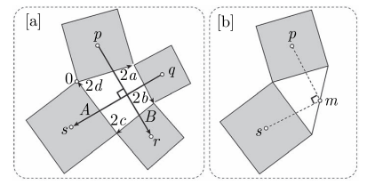

<h1 align="center">复分析-可视化方法</h1>

$$
% 设置
\newcommand{\aneg}[1]{\hspace{-0.75em}&#1&\hspace{-0.75em}}
\newcommand{\aneq}{\aneg{=}}
% 上述指令用于在使用 array 环境时调整等号左右间距
\newcommand{\eqs}{\quad\;}
% 上述指令用于 align 环境中, &= 的换行对齐时调整第二行位置
\renewcommand{\d}{\displaystyle}

% 字符
\renewcommand{\i}{\mathrm{i}}
\renewcommand{\j}{\mathrm{j}}
\renewcommand{\k}{\mathrm{k}}
\newcommand{\e}{\textup{e}}
\newcommand{\ve}{\varepsilon}
\newcommand{\Beta}{\mathit{B}}
\newcommand{\omicron}{\mathit{o}}
\newcommand{\Omicron}{\mathit{O}}

% 原本的定义为:
% \newcommand{\cal}[1]{\mathcal{#1}}
\renewcommand{\cal}[1]{\mathcal#1}
\renewcommand{\scr}[1]{\mathscr#1}
\renewcommand{\frak}[1]{\mathfrak#1}
\newcommand{\bb}[1]{\mathbb#1}

% 数集
\newcommand{\D}{\mathbb{D}}
\newcommand{\E}{\mathbb{E}}
\newcommand{\F}{\mathbb{F}}
\newcommand{\J}{\mathbb{J}}
\newcommand{\K}{\mathbb{K}}
\renewcommand{\L}{\mathbb{L}}

% 上下标
\newcommand{\trans}{^\mathrm{T}}
\newcommand{\inv}{^{-1}}
\newcommand{\madj}[1]{^{\pqty{#1^*}}}	% m 重伴随矩阵
\newcommand{\adj}{^*}
\newcommand{\vector}[1]{\overrightarrow{#1}}
% \newcommand{\wavy}[1]{\overset\sim#1}	% \tilde 或 \widetilde 不明显, 容易与 \bar 或 \overline 混淆
\newcommand{\wavy}[1]{\widetilde{#1}}

% 序列
\newcommand{\ccdots}{\cdot\cdots\cdot}
\newcommand{\oneton}{1,2,\cdots,n}
\newcommand{\oneto}[1]{1,2,\cdots,#1}

\newcommand{\ssto}[3]{#1_1 #3 #1_2 #3 \cdots #3 #1_{#2}}
\newcommand{\ssup}[3]{#1^1 #3 #1^2 #3 \cdots #3 #1^{#2}}
\newcommand{\soneto}[2]{\ssto{#1}{#2}{,}}
\newcommand{\splus}[2]{\ssto{#1}{#2}{+}}

% 括号
\newcommand{\aqty}[1]{\expval{#1}}
\newcommand{\pbqty}[1]{\left(#1\right]}
\newcommand{\bpqty}[1]{\left[#1\right)}
\newcommand{\floor}[1]{\left\lfloor#1\right\rfloor}
\newcommand{\ceil}[1]{\left\lceil#1\right\rceil}

% 矩阵宏简写
\newcommand{\bmatrix}[1]{\begin{bmatrix}#1\end{bmatrix}}
\newcommand{\Bmatrix}[1]{\begin{Bmatrix}#1\end{Bmatrix}}
\newcommand{\vmatrix}[1]{\begin{vmatrix}#1\end{vmatrix}}
\newcommand{\Vmatrix}[1]{\begin{Vmatrix}#1\end{Vmatrix}}

% 常用微分
\newcommand{\dx}{\dd{x}}
\newcommand{\dy}{\dd{y}}
\newcommand{\dz}{\dd{z}}
\newcommand{\dt}{\dd{t}}
\newcommand{\ds}{\dd{s}}
\newcommand{\dr}{\dd{r}}

% 一般的微分
% 如果只使用 \dd{x}\dd{y} 的话, 中间会有多余的间隔.
\newcommand{\df}{\dd}
\newcommand{\ddf}[2]{\,\mathrm{d}#1\mathrm{d}#2}	% 微分形式 differential form
\newcommand{\dddf}[3]{\,\mathrm{d}#1\mathrm{d}#2\mathrm{d}#3}

% 高阶微分
\newcommand{\dxdy}{\ddf{x}{y}}
\newcommand{\dydz}{\ddf{y}{z}}
\newcommand{\dzdx}{\ddf{z}{x}}
\newcommand{\dudv}{\ddf{u}{v}}
\newcommand{\drdt}{\ddf{r}{\theta}}
\newcommand{\dxdydz}{\dddf{x}{y}{z}}

% 矩阵的宏指令
\newcommand{\pmcmn}[3]{\begin{pmatrix}
	#1_{11} & #1_{12} & \cdots & #1_{1#3} \\
	#1_{21} & #1_{22} & \cdots & #1_{n#3} \\
	\vdots & \vdots && \vdots \\
	#1_{#2 1} & #1_{#2 2} & \cdots & #2_{n#3} \\
\end{pmatrix}}

\newcommand{\pmc}[1]{\pmcmn{#1}{n}{n}}
\newcommand{\pvcn}[2]{\begin{pmatrix}
	#1_1 \\ #1_2 \\ \vdots \\ #1_{#2}
\end{pmatrix}}

\newcommand{\pvc}[1]{\pvcn{#1}{n}}
\newcommand{\pto}{\overset{P}{\to}}

% 函数名
\renewcommand{\char}{\operatorname{char}}	% 由于已存在此命令, 不可使用 DeclareMathOperator
\renewcommand{\r}{\operatorname{r}}
\DeclareMathOperator{\st}{s.t.\,}	% 虽然不是函数名, 但用了这个指令就放这儿了.
\DeclareMathOperator{\diag}{diag}	% 不需要定义太多, 一个文件里用到什么定义什么,
\DeclareMathOperator{\Ker}{Ker}		% 毕竟特殊的函数名太多太多了.
\DeclareMathOperator{\Aut}{Aut}		% 便捷与效率的权衡.
\DeclareMathOperator{\Inn}{Inn}
\DeclareMathOperator{\GL}{GL}
\DeclareMathOperator{\SL}{SL}
\DeclareMathOperator{\stab}{stab}
\DeclareMathOperator{\orb}{orb}
\DeclareMathOperator{\lcm}{lcm}
\DeclareMathOperator{\Var}{Var}
\DeclareMathOperator{\Cov}{Cov}
\DeclareMathOperator{\Corr}{Corr}
\DeclareMathOperator{\rot}{rot}
\DeclareMathOperator{\sgn}{sgn}
\DeclareMathOperator{\Outer}{Outer}
\DeclareMathOperator{\Even}{Even}
\DeclareMathOperator{\Scalar}{Scalar}
\DeclareMathOperator{\Vector}{Vector}
\renewcommand{\Re}{\operatorname{Re}}	% 自带 \Re 的效果是 \mathrm{Re}, 前后无空格, 故重写
\renewcommand{\Im}{\operatorname{Im}}

\def\arsh{\ensuremath{\operatorname{arsh}}}
\def\arch{\ensuremath{\operatorname{arch}}}
\def\arth{\ensuremath{\operatorname{arth}}}

% 运算符
% 可以用 \bigcap, \bigcup, \bigoplus, \bigotimes 替代
\newcommand{\capop}{\displaystyle\mathop\cap\limits}
\newcommand{\cupop}{\displaystyle\mathop\cup\limits}
\newcommand{\oplusop}{\mathop\oplus\limits}
\newcommand{\otimesop}{\mathop\otimes\limits}
\newcommand{\bigoplusop}{\mathop\bigoplus\limits}
\newcommand{\bigotimesop}{\mathop\bigotimes\limits}

% 积分
\newcommand{\dint}{\displaystyle\int}
\newcommand{\inti}{\dint_{-\infty}^{+\infty}}
\newcommand{\intoi}{\dint_0^{+\infty}}

\newcommand{\intl}{\displaystyle\int\limits}
\newcommand{\iintl}{\displaystyle\iint\limits}
\newcommand{\iiintl}{\displaystyle\iiint\limits}

% 求和
\newcommand{\dsum}{\displaystyle\sum}
\newcommand{\csum}[1]{\dsum_{#1=1}^\infty}
\newcommand{\nsum}{\csum{n}}
\newcommand{\ksum}{\csum{k}}
\newcommand{\nosum}{\dsum_{n=0}^\infty}
\newcommand{\insum}{\dsum_{i=1}^n}
\newcommand{\knsum}{\dsum_{k=1}^n}

% 求积
\newcommand{\dprod}{\displaystyle\prod}
\newcommand{\nprod}{\dprod_{n=1}^\infty}
\newcommand{\noprod}{\dprod_{n=0}^\infty}
\newcommand{\inprod}{\dprod_{i=1}^n}

% 极限
\newcommand{\liml}{\lim\limits}
\newcommand{\ulim}{\overline\lim\limits_{n\to\infty}}
\newcommand{\dlim}{\underline\lim\limits_{n\to\infty}}
% 注意这里的 d 是 down, 而不是 displaystyle

\newcommand{\xlim}{\lim\limits_{x\to x_0}}
\newcommand{\nlim}{\lim\limits_{n\to\infty}}
\newcommand{\clim}[1]{\lim\limits_{#1\to\infty}}

% 差分
\newcommand{\DD}{\Delta}
\newcommand{\DV}[2]{\dfrac{\DD#1}{\DD#2}}
\newcommand{\nDV}[3]{\dfrac{\DD^{#1}#2}{\DD#3^{#1}}}

% 求导
\newcommand{\ddv}{\displaystyle\dv}
\newcommand{\dpdv}{\displaystyle\pdv}

% 缩写
\newcommand{\bm}[1]{\boldsymbol{#1}}
\newcommand{\LRA}{\Leftrightarrow}
\newcommand{\RLA}{\Leftrightarrow}
\newcommand{\LA}{\Leftarrow}
\newcommand{\RA}{\Rightarrow}

\newcommand{\lra}{\leftrightarrow}
\newcommand{\rla}{\leftrightarrow}
\newcommand{\la}{\leftarrow}
\newcommand{\ra}{\rightarrow}

\newcommand{\QRLA}{\quad\RLA\quad}
\newcommand{\QRA}{\quad\RA\quad}
\newcommand{\LLRA}{\Longleftrightarrow}

\newcommand{\QNRA}{\quad\nRightarrow\quad}
\newcommand{\qnra}{\quad\nrightarrow\quad}

\newcommand{\wt}{\widetilde}

% 图形符号
\newcommand{\qed}{\quad\square}
\renewcommand{\parallel}{\mathrel{/\mskip-2.5mu/}}
\newcommand{\paralleleq}{\hspace{0.5em}{^{^{\parallel}}}\hspace{-1.04em}=}
\newcommand{\rt}{\matrm{Rt}\triangle}
$$

[TOC]

## 第 1 章	几何和复算术

### 1.1	复数的性质

#### 1.1.1	复数的运算

见[复分析笔记](../复分析/复分析.html#11-复数代数).

##### 1	几何解释

- 复数加法: 平移变换.
- 复数乘法: 伸缩旋转.
  - 不用三角恒等式证明复数乘法的几何法则: 考虑变换 $ z \mapsto \i z $, 构造直角.

##### 2	指数加减

$$
\begin{align}
\e^{\i \theta} + \e^{\i \phi} &= 2 \cos \dfrac{\theta - \phi}{2} \cdot \e^{\tfrac{\i (\theta + \phi)}{2}}, \\
\e^{\i \theta} - \e^{\i \phi} &= 2\i \sin \dfrac{\theta - \phi}{2} \cdot \e^{\tfrac{\i (\theta + \phi)}{2}}.
\end{align}
$$

    

        
<b>证明</b>
        

        <iframe src="ifsrc\1.1.1 指数加减.html" height=225></iframe>
    

#### 1.1.2	本初单位根

    

        
<b>前置知识: 莫比乌斯反演公式</b>
        

        <iframe src="ifsrc\1.1.2 莫比乌斯反演公式.html" height=600></iframe>
    

记 $n$ 次单位根为 $ \omega_n = \e^{\tfrac{2\pi\i}{n}} $, 若其集合 $ S_n = \Bqty{\omega_n^k \mid k \in \Z_n} $ 可由 $ \omega_k $ 生成, 即 $ S_n = \aqty{\omega_k} $, 则称 $ \omega_n^k $ 为**本初 $\bm n$ 次单位根** (或 $n$ 次本原单位根).
- 当且仅当 $ \gcd(k, n) = 1 $ 时, $ \omega_n^k $ 为本初 $n$ 次单位根.

- 若 $ \omega $ 是一个本初 $n$ 次单位根, 则
  - 它的复共轭 $ \overline\omega $ 也是本初 $n$ 次单位根.
  - 当且仅当 $ \gcd(m, n) = 1, 1 \le m < n $ 时, $ \omega^m $ 也是本初 $n$ 次单位根.
  - $ \mathrm{Gal} (\Q(\omega) / \Q) \cong U(n) $.
  
- 本初 $n$ 次单位根的个数为欧拉函数 $ \varphi(n) $.

  - 将 $n$ 质因数分解为 $ p_1^{\alpha_{p_1}} p_2^{\alpha_{p_2}} \cdots p_k^{\alpha_{p_k}} $, 则

    $ \varphi(n) = \dprod_{p \mid n} p^{\alpha_p - 1} (p - 1) = n \dprod_{p \mid n} \pqty{1 - \dfrac{1}{p}} $.
    
  - 关于欧拉函数更多的性质可以参考[前置知识](https://sleepcloudmx.github.io/Math/%E6%95%B0%E8%AE%BA/%E8%8E%AB%E6%AF%94%E4%B9%8C%E6%96%AF%E5%8F%8D%E6%BC%94%E4%B8%8E%E7%8B%84%E5%88%A9%E5%85%8B%E9%9B%B7%E5%8D%B7%E7%A7%AF.pdf).

#### 1.1.3	分圆多项式

根为所有本初 $n$ 次单位根的最小多项式为 $ \varPhi_n(z) $, 称为 **$ \bm n $ 阶分圆多项式**.

- 例子
  - $ \varPhi_1(z) = z - 1 $.
  - $ \varPhi_2(z) = z + 1 $.
  - $ \varPhi_3(z) = z^2 + z + 1 $.
  - $ \varPhi_4(z) = z^2 + 1 $.
  - $ \varPhi_6(z) = z^2 - z + 1 $.
  - $ \varPhi_{8}(z) = (z^2 + \sqrt 2 z + 1)(z^2 - \sqrt 2 z + 1) = z^4 + 1 $.
  - $ \varPhi_{12}(z) = (z^2 + \sqrt 3 z + 1)(z^2 - \sqrt 3 z + 1) = z^4 - z^2 + 1 $.

- 次数与系数
  
  - 由本初单位根性质得, $ \varPhi_n(z)\ (n > 2) $ 次数必为偶数, 且有实系数.
  - 进一步, $ \varPhi_n(z) $ 是整系数不可约多项式, 且 $ \deg(\varPhi_n(z)) = \varphi(n) $.
  - 推论: $ \cos\dfrac{2\pi}{n} $ 是有理数, 当且仅当 $ n = 1, 2, 3, 4, 6 $.
  
- $ \dprod_{d \mid n} \varPhi_d(z) = z^n - 1 $.
  
  - 特殊值
  
    - 数归可得 $ \varPhi(0) = 1\ (n > 1) $.
  
    - 若 $ n = p^m $, 则 $ \varPhi_{n}(1) = p $.
  
      否则 $ \varPhi_{n}(1) = 1 $.
  
    - 由下文可知, $ \varPhi_n(-1) = \varphi_{2n}(1) $.
  
  - 欧拉函数
  
    - 比较两端次数可得 $ \dsum_{d \mid n} \varphi(d) = n $.

    - 由莫比乌斯反演公式得: $ \varphi(n) = n \dsum_{d \mid n} \dfrac{\mu(d)}{d} $.
  
      [前置知识](https://sleepcloudmx.github.io/Math/%E6%95%B0%E8%AE%BA/%E8%8E%AB%E6%AF%94%E4%B9%8C%E6%96%AF%E5%8F%8D%E6%BC%94%E4%B8%8E%E7%8B%84%E5%88%A9%E5%85%8B%E9%9B%B7%E5%8D%B7%E7%A7%AF.pdf)中提供了另一种证法.
  
  - 分圆多项式
  
    - 由莫比乌斯反演公式得 $ \varPhi_n(z) = \dprod_{d \mid n} (z^d - 1)^{\mu\pqty{\tfrac{n}{d}}} $.
    - 进一步, 质因数分解后有 $ \varPhi_n(z) = \dprod_{d \mid p_1p_2\cdots p_k} \pqty{z^{\tfrac{n}{d}} - 1}^{\mu(d)} $.
  
- 若 $ p $ 为素数, 则
  - $ \varPhi_p(z) = \dfrac{z^p - 1}{z - 1} = 1 + z + z^2 + \cdots + z^{p-1} $.

  - 比较次数与根, 得 $ \varPhi_{p^k}(z) = \varPhi_p(z^{p^{k-1}}) $.

  - 进一步, 若 $ p \nmid n $, 则
    - $ \varPhi_{pn}(z) = \varPhi_n(z^p) / \varPhi_n(z) $.
    - $ \varPhi_{p^k n}(z) = \varPhi_n(z^{p^k}) / \varPhi_n(z^{p^{k-1}}) $.

  - 由此可以由容斥原理同样推得 $ \varPhi_n(z) = \dprod_{d \mid p_1p_2\cdots p_k} \pqty{z^{\tfrac{n}{d}} - 1}^{\mu(d)} $.

- 设 $ d $ 是 $n$ 的真因子, $p$ 为素数, 若存在 $ x \ne \pm 1 $, 满足 $ p \mid (\varPhi_d(x), \varPhi_n(x)) $, 则 $ p \mid n $.

    

        
证明
        

        <iframe src="ifsrc\1.1.3 分圆多项式的一个定理.html" height=150></iframe>
    

- 若存在整数 $x$ 满足 $ (\varPhi_a(x), \varPhi_b(x)) > 1 $, 则 $ \dfrac{a}{b} $ 是一个素数幂.

### 1.2	复数的变换

#### 1.2.1	保向变换

- **恒等变换**: $ \mathcal{E} (z) = z $.

- **平移变换**: $ \mathcal{T}_v (z) = z + v $.

  - 复合: $ \mathcal{T}_w \circ \mathcal{T}_v = \mathcal{T}_{w + v} $.
  - 逆元: $ \mathcal{T}_v\inv = \mathcal{T}_{-v} $.

- **旋转变换**: $ \mathcal{R}_a^\theta $.

  - 复合: $ \mathcal{R}_a^\phi \circ \mathcal{R}_a^\theta = \mathcal{R}_a^{\phi + \theta} $.

  - 逆元: $ (\mathcal{R}_a^\theta)\inv = \mathcal{R}_a^{-\theta} $.

  - 分解:

    - $ \mathcal{R}_a^\theta(z)
      = (\mathcal{T}_a \circ \mathcal{R}_0^\theta \circ \mathcal{T}_a\inv)(z)
      = \e^{\i \theta} (z - a) + a $.
    - $ \mathcal{R}_a^\theta
      = \cal T_k \circ \cal R_0^\theta $, 其中  $ k = a (1 -\e^{\i\theta}) $.

  - 复合:

    - $ \cal T_v \circ \cal R_a^\theta = \cal R_c^\theta $, 其中 $ c = a + \dfrac{v}{1 - \e^{\i\theta}} $.

    - $ \cal R_a^\theta \circ \cal T_v = \cal R_c^\theta $, 其中 $ c = a + \dfrac{v \e^{\i\theta}}{1 - \e^{\i\theta}} $.

    - $ (\cal R_b^\beta \circ \cal R_a^\alpha)(z) = \e^{\i (\alpha + \beta)} z + a (1 - \e^{\i\alpha}) \e^{\i \beta} + b(1 - \e^{\i\beta}) $.

      - 当 $ \alpha + \beta \ne 2k\pi $ 时, $ \cal R_b^\beta \circ \cal R_a^\alpha = \cal R_c^{\alpha + \beta} $, 其中 $ c = \dfrac{a (1 - \e^{\i\alpha}) \e^{\i \beta} + b(1 - \e^{\i\beta})}{1 - \e^{\i (\alpha + \beta)}} $.
      - 当 $ \alpha + \beta = 2k\pi $ 时, $ \cal R_b^\beta \circ \cal R_a^\alpha = \cal T_k $. 其中 $ k = (b - a) (1 - \e^{\i\beta}) $.

      上式可推广至 n 次旋转的组合, 不再赘述.

#### 1.2.2	反向变换

- **反射变换**: $ \frak R_L $. (非分式线性变换)
  - 逆元: $ \frak R_L\inv = \frak R_L $.
  - 复合
    - 若 $ L_1 $ 与 $L_2$ 交于点 $O$, 夹角为 $ \phi $, 则 $ \frak R_{L_2} \circ \frak R_{L_1} = \cal R_o^{2\phi} $.
    - 若 $ L_1 $ 与 $L_2$ 平行, 由 $L_1$ 垂直连接到 $L_2$ 的向量为 $V$, 则 $ \frak R_{L_2} \circ \frak R_{L_1} = \cal T_{2V} $.
  - 对合 (自逆): $ \frak R_L \circ \frak R_L = \cal E $.
- **滑动反射**: $ \cal T_v \circ \frak R_L = \frak R_L \circ \cal T_v $.

#### 1.2.3	相似变换

- **中心伸缩 (位似变换)**: $ \cal D_a^r %= \cal D_a^{r, 0} $.

- **伸缩旋转 (相似变换)**: $ \cal D_a^{r, \theta} \equiv \cal R_a^\theta \circ \cal D_a^r \equiv \cal D_a^r \circ \cal R_a^\theta $.
  - 复合: $ \cal D_o^{R, \phi} \circ \cal D_o^{r, \theta} = \cal D_o^{r, \theta} \circ \cal D_o^{R, \phi} = \cal D_o^{Rr, \theta + \phi} $.
  - 逆元: $ (\cal D_a^{r, \theta})\inv = \cal D_a^{1 / r, -\theta} $.
  
  - 分解
    - $ \cal D_a^{r, \theta}(z) = (\cal T_a \circ \cal D_o^{r, \theta} \circ \cal T_a\inv) (z) = r\e^{\i\theta} (z - a) + a $.
    - $ \cal D_a^{r, \theta} = \cal T_k \circ \cal D_o^{r, \theta} $, 其中 $ k = a (1 - r\e^{\i\theta}) $.
  
  - 复合
    - $ (\cal D_b^{R, \beta} \circ \cal D_a^{r, \alpha})(z) = Rr \e^{\i(\alpha + \beta)} + a(1 - r\e^{\i\alpha}) \e^{\i\beta} + b(1 - R\e^{\i\beta}) $.
      - 当 $ r\e^{\i(\alpha + \beta)} \ne 0 $ 时, $ \cal D_b^{R, \beta} \circ \cal D_a^{r, \alpha} = \cal D_c^{Rr, \alpha + \beta} $, 其中 $ c = \dfrac{a (1 - r\e^{\i\alpha}) R\e^{\i \beta} + b(1 - R\e^{\i\beta})}{1 - Rr\e^{\i (\alpha + \beta)}} $.
      - 当 $ r\e^{\i(\alpha + \beta)} = 0 $ 时, $ \cal D_b^{R, \beta} \circ \cal D_a^{r, \alpha} = \cal T_k $, 其中 $ k = a(\e^{\i\beta} - r) + b(1 - R\e^{\i\beta}) $.
  
- [几何反演](# 3.2.2	几何反演)

### 1.3	复数的应用

#### 1.3.1	几何

##### 1	三角函数

- $ \cos n\theta = \Re{(\e^{\i \theta})^n} %,\, \sin n\theta = \Im{(\e^{\i \theta})^n} $, 从而可以用 $ \cos\theta,\, \sin\theta $ 表示.

- $ \cos^n \theta = \pqty{\dfrac{\e^{\i\theta} + \e^{-\i\theta}}{2}}^n $, 从而可以用 $ \cos k\theta,\, \sin k\theta $ 表示.

- $ \tan n\theta = \arg(1 + \i\tan\theta)^n % \dfrac{\Im{(1 + \i\tan\theta)^n}}{\Re{(1 + \i\tan\theta)^n}} $, 从而可以用 $ \tan\theta $ 表示.

  也可以用欧拉公式求出正余弦的 $ n $ 倍角公式, 再推得正切的.

---

$$
\insum \cos(an + b) = \dfrac{
	\sin\pqty{
		a_n + \cfrac{a}{2}
	} - \sin\pqty{
		\cfrac{a}{2} + b
	}
}{
	2 \sin\cfrac{a}{2}
} \\
\insum \sin(an + b) = \dfrac{
	\cos\pqty{
		a_n + \cfrac{a}{2}
	} - \cos\pqty{
		\cfrac{a}{2} + b
	}
}{
	-2 \sin\cfrac{a}{2}
}
$$

法一: 积化和差, 裂项相消.

法二: 化为复数, 等比求和.

##### 2	欧氏几何

**Thebault 第一问题**: 在任意一个四边形的四个边上各做一个正方形, 则连接相对的正方形中心的线段互相垂直等长.

    

        
证法一 (复数法)
        

        <iframe src="ifsrc\1.3.1 Thebault 第一问题-证法一.html" height=300></iframe>
    

    

        
证法二 (变换法)
        

        <iframe src="ifsrc\1.3.1 Thebault 第一问题-证法二.html" height=500></iframe>
    

---

对于任意三角形, 各边向外做一个等边三角形,则这些等边三角形重心成一等边三角形.

---

若 $ A, B, C, D $ 为单位圆上的四点, 且 $ A + B + C + D = 0 $, 则该四点必成一矩形.

    

        
证明
        

        <iframe src="ifsrc\1.3.1 四点成矩形.html" height=100></iframe>
    

##### 3	平面向量

- $ \bm a \cdot \bm b := \vqty{a} \cdot \vqty{b} \cos \theta $.
- $ \bm a \cp \bm b := \vqty{a} \cdot \vqty{b} \sin\theta = -(\bm b \cp \bm a) $.
- $ \overline a b = \bm a \cdot \bm b + \i (\bm a \cp \bm b) $.

#### 1.3.2	代数

##### 1	因式分解

    

        
实系数多项式可以分解为实线性因式和实二次因式.
        

        <iframe src="ifsrc\1.3.2 实系数多项式因式分解.html" height=270></iframe>
    

##### 2	恒等式

若两个整数可写成两个平方之和, 则其积亦然, 因为
$$
\vqty{(a + \i b) (c + \i d)}^2
% = (a^2 + b^2) (c^2 + d^2)
= \vqty{(ac - bd) + \i (ad + bc)}^2.
$$

##### 3	高斯系鞋带定理

记任意的 $n$ 边形各个顶点为 $ a_i,\, i = \oneton $, 并且令 $ a_{n+1} = a_1 $, 则其面积为
$$
\begin{align}
\cal A &= \sum_{i=1}^n \dfrac{\bm a_i \cp \bm a_{i+1}}{2}
= \Im \insum \dfrac{\overline a_i a_{i+1}}{2}
= \insum \dfrac{x_i y_{i+1} - x_{i+1} y_i}{2}.
\end{align}
$$

#### 1.3.3	分析

##### 1	求导

由 $ \ddv[n]{t} \e^{(a + \i b) t}
= (a + \i b)^n \e^{(a + \i b) t} $ 得,

- $ \ddv[n]{t} \pqty{
  	\e^{at} \sin bt
  } = (a^2 + b^2)^{\tfrac{n}{2}}
  \e^{at} \sin\pqty{
  	bt + n \arctan\dfrac{b}{a}
  } $.
- $ \ddv[n]{t} \pqty{
  	\e^{at} \cos bt
  } = (a^2 + b^2)^{\tfrac{n}{2}}
  \e^{at} \cos\pqty{
  	bt + n \arctan\dfrac{b}{a}
  }  $.

##### 2	积分

由 $ \dint \e^{(a + \i b) x} \dx = \dfrac{a - \i b}{a^2 + b^2} \e^{(a + \i b) x} + C $ 得,

- $ \dint \e^{ax} \cos ax \dx = \dfrac{a \cos bx + b \sin bx}{a^2 + b^2} \e^{ax} + C $.
- $ \dint \e^{ax} \sin ax \dx = \dfrac{a \sin bx - b \cos bx}{a^2 + b^2} \e^{ax} + C $.

#### 1.3.4	组合

由 $ (a + b)^n = \dsum_{r=0}^n \dbinom{n}{r} a^{n-r} b^r $ 代入 $ a = 1, b = \i, n = 2m $ 得

- $ \d \binom{2m}{1} - \binom{2m}{3} + \binom{2m}{5} - \cdots + (-1)^{m+1} \binom{2m}{2m-1} = 2^m \sin\dfrac{m\pi}{2} $.
- $ \d\binom{2m}{0} - \binom{2m}{2} + \binom{2m}{4} - \cdots + (-1)^{m} \binom{2m}{2m} = 2^m \cos\dfrac{m\pi}{2} $.

### 1.4	变换与几何

- **运动**: 运动就是平面到其自身的一个映射且使任两点 $ A, B $ 的距离与其象 $ A' = \cal M(A) $, $ B' = \cal M(B) $ 的距离相等.

  - 满足群的条件: 封闭性, 结合律, 幺元 (恒等变换), 逆元.
  - 分类: 保向运动, 反向运动.
  - 性质
    - 一个运动可以由它对任意三角形（即任意三个非共线的点）的 效果唯一确定.
    - 恰好存在一个保向运动 $ \cal M $（以及恰好一个反向运动 $ \widetilde {\cal M} $）将一 已给线段 $AB$ 映为另一个等长线段 $A'B'$. 此外, $ \widetilde {\cal M} $ 即（${\cal M}$ 再继以对 $A'B'$ 的一个反射）.
    - 每个保向运动都可以表示为 $ \cal M(z) = \e^{\i \theta} z + v $.

- **全等**: 如果存在一个运动 $ \cal M $, 使得 $ F' = \cal M(F) $, 就说 $ F $ 全等于 $ F' $, 记作 $ F \cong F' $.

  - 满足等价关系： 反身性, 对称性, 传递性.

- **三反射定理**

  - 每个保向运动均为两个反射的复合,
  - 每个反向运动均为三个反射的复合.
  - 推论: 每个运动都有一个逆, 因为一串反射的逆就是把这些反射以相反的次序再做一次.

- **相似**: 把一平面映至自身且保持距离之比的映射.

  几何学就是研究运动的集合的不变式 (不变量). ——克莱因

  - 任一相似必可分解为 $ \cal S^r = \cal M \circ \cal D_p^r $.

  - 分类: 保向相似, 反向相似.

  - 每个保向相似都是一个伸缩旋转, 其特例是平移 (以无穷远点为旋转中心).

    一组平行线交于同一无穷远点, 所有平行线对应的无穷远点构成无穷远线.

  - 每个保向的相似变换均可表示为 $ \cal{S}^r(z) = r\e^{\i\theta} z + v $, 或 $ \cal S^r(z) = A z + B $.

- **空间复数**

  - 空间中的每一个保向相似变换均为一伸缩旋转与沿旋转轴的平移的复合.
  - 空间中的旋转是非交换的.

### 1.5	多项式方程

#### 1.5.2	二次方程

**思路一**: 配方法

对于 $ ax^2 + bx + c = 0 $, 有 $ \pqty{x + \dfrac{b}{2a}}^2 = \dfrac{b^2 - 4ac}{4a} $, 于是 $ x_1, x_2 = \dfrac{-b \pm \sqrt{b^2 - 4ac}}{2a} $.

---

**思路二**: 韦达定理

对于 $ x^2 - \sigma_1 x + \sigma_2 = 0 $, 令 $ \delta = x_1 - x_2 $, 则有
$$
\begin{cases}
	x_1 + x_2 = \sigma_1, \\
	(x_1 - x_2)^2 = \sigma_1^2 - 4 \sigma_2.
\end{cases}
$$
解之即得 $ x_1, x_2 $.

---

**判别法则**

由思路一, 令 $ \Delta = b^2 - 4ac $, 则有

- 当 $ \Delta < 0 $ 时, 有两个共轭复根.
- 当 $ \Delta = 0 $ 时, 有一个二重实根.
- 当 $ \Delta > 0 $ 时, 有两个一重实根.

#### 1.5.3	三次方程

对于 $ ax^3 + bx^2 + cx + d = 0 $, 令 $ t = x + \dfrac{b}{3a} $ 即可化为 $ t^3 + Bt + C = 0 $.

方便起见, 下面只研究 $ x^3 = 3px + 2q $. 习惯上, 令 $ \omega_n = \e^\tfrac{2\pi\i}{n} $, $ \omega = \omega_3 $.

**思路一**: 变量代换

1. 令 $ x_0 = s + t $, 则当 $ st = p $ 且 $ s^3 + t^3 = 2q $ 时, 此 $x_0$ 为三次方程之根.
2. 解得 $ s^3, t^3 = q \pm \sqrt{q^2 - p^3} $, 从而求出三次方程的三根: $ \begin{cases}
   	x_0 = s + t, \\
   	x_1 = \omega s + \omega^2 t, \\
   	x_2 = \omega^2 s + \omega t.
   \end{cases} $ 

---

**思路二**: 三角换元

1. 代入 $ x = 2\sqrt p \cos\theta $, 即得 $ 4\cos^3\theta - 3 \cos\theta = \cos 3\theta = \dfrac{q}{p\sqrt p} $.
2. 于是 $ x = 2\sqrt p \cos\dfrac{\phi + 2k\pi}{3} $, 其中 $ \phi = \arccos\cfrac{q}{p\sqrt p} $.

**注**: 思路一和思路二的公式本质上是一样的, 其中 $ \arg s^3 = \phi,\, \vqty{s^3} = p \sqrt p $.

---

**思路三**: 减少对称 $ S_3 \to C_3 \to \Bqty{e} $ 

对于 $ x^3 - \sigma_1 x^3 + \sigma_2 x - \sigma_3 = 0 $, 其中 $ \sigma_k $ 为初等对称多项式, 令
$$
\begin{cases}
	X_1 = (x_1 + \omega x_2 + \omega^2 x_3)^3, \\
	X_2 = (x_1 + \omega^2 x_2 + \omega x_3)^3.
\end{cases}
$$
则 $ X_1 $ 和 $ X_2 $ 都是轮换对称多项式, 且
$$
\begin{cases}
	X_1 + X_2 = 2\sigma_1^3 - 9\sigma_1 \sigma_2 + 27\sigma_3, \\
	X_1 \cdot X_2 = (\sigma_1^2 - 3\sigma_2)^3
\end{cases}
\hspace{2em}
\begin{cases}
	x_1 + \omega x_2 + \omega^2 x_3 = \sqrt[3]{X_1}, \\
	x_1 + \omega^2 x_2 + \omega x_3 = \sqrt[3]{X_2}, \\
	x_1 + x_2 + x_3 = \sigma_1.
\end{cases}
$$
解之即得 $ x_1, x_2, x_3 $.

---

**判别法则**

结合思路一与思路二可得, 对于实系数三次方程,

- 当 $ 0 \le q^2 < p^3 $ 时, 有三个不等实根.
- 当 $ q^2 = p^3 \ne 0 $ 时, 有三个实根, 其中两个相等.
- 当 $ q = p = 0 $ 时, 有三个相等的实根.
- 当 $ 0 \le p^3 < q^2 $ 时, 有一个实根, 两个共轭虚根.

#### 1.5.3	四次方程

**思路一**: 费拉里法

对于 $ x^4 + bx^3 + cx^2 + dx + e = 0 $, 先消去三次项再配方, 则等价于
$$
\pqty{
	x^2 + \dfrac{1}{2} b x + y
}^2 = \pqty{
	\dfrac{1}{4} b^2 - c + 2y
} x^2 + \pqty{
	\dfrac{1}{2} by - d
} x + y^2 - e,
$$
令右式关于 $x$ 的判别式为零, 即解关于 $y$ 的三次方程, 即得关于 $x$ 的两个二次方程, 解之即得原方程的四个根.

---

**思路二**: 欧拉解法

消去三次项, 并将 $ x^4 + cx^2 + dx + e = 0 $ 因式分解为
$$
(x^2 + p_1 x + q_1) (x^2 + p_2 x + q_2) = 0,
$$
待定系数法解三次方程即得上述系数, 从而得四次方程的四根.

---

**思路三**: 变量代换

对于 $ x^4 + cx^2 + dx + e = 0 $, 作 $ x = u + v + w $, 则当
$$
\begin{cases}
	u^2 + v^2 + w^2 = -\dfrac{c}{2}, \\
	u^2 v^2 + v^2 w^2 + w^2 u^2 = \dfrac{c^2 - 4e}{16},
	\\
	uvw = -\dfrac{q}{8}.
\end{cases}
$$
时, 等式成立, 并且上述方程组的解即三次方程的解. 于是解 $ u, v, w $ 即得 $x$.

---

**思路四**: 减少对称 $ S_4 \to D_2 \to \Bqty{e} $ 

对于 $ x^4 - \sigma_1 x^3 + \sigma_2 x^2 - \sigma_3 x + \sigma_4 = 0 $, 其中 $ \sigma_k $ 为初等对称多项式,
$$
\begin{cases}
	W_1 := x_1 x_2 + x_3 x_4, \\
	W_2 := x_1 x_3 + x_2 x_4, \\
	W_3 := x_1 x_4 + x_2 x_3. \\
\end{cases}
\QRA
\begin{cases}
	h_1 := W_1 + W_2 + W_3 = \sigma_2, \\
	h_2 := W_1 W_2 + W_2 W_3 + W_3 W_1 = \sigma_1 \sigma_3 - 4\sigma_4, \\
	h_3 := W_1 W_2 W_3 = \sigma_1^2 \sigma_4 + \sigma_3^2 - 4 \sigma_2 \sigma_4.
\end{cases}
$$
$ W_1, W_2, W_3 $ 即为 $ W^3 - h_1 W^2 + h_2 W - h_3 = 0 $ 的解, 于是有
$$
\begin{array}{l}
	\begin{cases}
		(x_1 x_2) + (x_3 x_4) = W_1, \\
		(x_1 x_2) (x_3 x_4) = \sigma_4, \\
	\end{cases}
	\\
	\begin{cases}
		(x_1 + x_2) + (x_3 + x_4) = \sigma_1, \\
		(x_1 + x_2) (x_3 + x_4) = W_2 + W_3, \\
	\end{cases}
\end{array}
\QRA
\begin{array}{l}
	\begin{cases}
		x_1 x_2, \\
		x_1 + x_2.
	\end{cases}
	\\
	\begin{cases}
		x_3 x_4, \\
		x_3 + x_4.
	\end{cases}
\end{array}
\QRA
\begin{cases}
	x_1, \\ x_2, \\ x_3, \\ x_4.
\end{cases}
$$

---

**判别法则**

对于 $ ax^4 + 4bx^3 + 6cx^2 + 4dx + e = 0 $, 令:
$$
\begin{align}
& H=b^2-a c, I=a e-4 b d+3 c^2, \\
& G=a^2 d-3 a b c+2 b^3, J=\frac{4 H^3-a^2 H I-G^2}{a^3}, \\
& \Delta=I^3-27 J^2, \delta=12 H^2-a^2 I.
\end{align}
$$
那么有如下根的判别法则:

- 若 $\Delta<0$ ，则方程有两个互异实根和一对共轭虚根。
- 若 $\Delta>0, \delta>0, H>0$ ，则方程有四个互异实根。
- 若 $\Delta>0, H \leqslant 0$ 或 $\delta<0$ ，则方程有两对互异的共轭虚根。
- 若 $\Delta=0, I \cdot J \neq 0, \delta>0, H>0$ ，则方程有一个两重实根和两个单重实根。
- 若 $\Delta=0, I \cdot J \neq 0, H \leqslant 0$ 或 $\delta<0$ ，则方程有一个两重实根和一对共轭虚根。
- 若 $G \neq 0, I=J=0$ ，则方程有一个三重实根和一个单重实根。
- 若 $G=\delta=0, H>0$ ，则方程有两个互异的两重实根。
- 若 $G=\delta=0, H<0$ ，则方程有一对两重共轭虚根。
- 若 $H=I=G=0$ ，则方程有一个四重实根。

## 第 2 章	作为变换的复函数

- 图像的描述
  - 至象平面的几何变换.
  - 向量场.
  - 黎曼曲面.
  - 模曲面.
- **卡西尼曲线**: 到两点距离乘积为常数的曲线.
  - 映射 $ z \mapsto w = Q(z) = (z - a_1)(z - a_2) + c $ 将卡西尼曲线族映为同心圆.
  - 特例: **伯努利双纽线**: $ r^2 = 2\cos 2\theta $.
  - 与 **帕修斯螺旋截线** 相同.

    <button id="btn-k4kffjta">
        点击查看 Geogebra 图像
    </button>
    &emsp;或直接打开<a href="https://www.geogebra.org/calculator/k4kffjta">网页链接</a>
    <iframe src="" width="800" height="0" allowfullscreen style="border: 1px solid #e4e4e4;border-radius: 4px;" frameborder="0" id="ifm-k4kffjta"></iframe>
    

- 余弦函数的图像
  - $ y = -c $ 在映射 $ z \mapsto \cos z $ 下变成椭圆 $ (a\cos t, b \sin t) $, 其中 $ a = \cosh c,\, b = \sinh c $, 并且焦点的模 $ \sqrt{a^2 - b^2} = 1 $.
  - $ x = c $ 在映射 $ z \mapsto \cos z $ 下变成双曲线.
- 多值函数
  - 若 $z$ 至少绕 $q$ 转 $N$ 圈才能第一次重回 $ f(z) $, 则 $q$ 称为 $ n - 1 $ 阶**代数支点**. 一阶代数支点称为简单支点. 如果无论绕多少周, 也无法重回原来的值, 则称为**对数支点**.

---

- 概念
  - 质心 $ Z = \dfrac{\sum m_i z_i}{\sum m_i} $.
    - 若 $ Z $ 为 $ \Bqty{z_j} $ 的质心, 则 $ \Bqty{az_j + b} $ 的质心是 $ aZ + b $.
    - 质心 $Z$ 必位于凸包 $H$ 的内域.
  - 形心 $ Z = \dfrac{1}{n} \insum z_i $
    - $ \insum (z_i - Z) = 0 $.
  - 函数 $ f(z) $ 在 $n$ 个点的集合 $ \Bqty{z_i} $ 上的平均值记作 $ \aqty{f(z)}_n = \dfrac{1}{n} \insum f(z_i) $.
  
- **在正多边形上求平均**: 若 $ n > m > 0 $, 以 $k$ 为中心的正 $n$ 边形顶点为 $ \Bqty{z_i} $, 则 $ \aqty{P_m(z)}_n = P_m(k) $.

- **在圆周上平均值**: 一个任意次多项式在圆周 $C$ 上的平均值都等于它在 $C$ 的中心 处的值.

- **高斯平均值定理**: 若 $ f(z) $ 可表示为一幂级数, 且一个以 $k$ 为中心, $R$ 为半径的圆周 $C$ 位于次幂级数的收敛圆盘内, 则 $ \aqty{f(z)}_C = \dfrac{1}{2\pi} \dint_0^{2\pi} f(k + R\e^{\i\theta}) \dd{\theta} = f(k) $.
  - 令 $ f(z) = \e^z $, 则有
    $$
    \begin{align}
    & \dint_0^{2\pi} \e^{r\cos\theta} \cos (r\sin\theta) \dd{\theta} = 2\pi
    \\
    & \dint_0^{2\pi} \e^{r\cos\theta} \sin(r\sin\theta) \dd{\theta} = 0
    \end{align}
    $$
  
  - 令 $ f(z) = \cos z $, 则有
    $$
    \begin{align}
    & \dint_0^{2\pi} \cos(r\cos\theta) \cosh(r\sin\theta) \dd{\theta} = 2\pi,
    \\
    & \dint_0^{2\pi} \sin(r\cos\theta) \sinh(r\sin\theta) \dd{\theta} = 0.
    \end{align}
    $$

## 第 3 章	莫比乌斯变换和反演

### 3.2	反演

#### 3.2.1	复反演

- 复反演 $ w = 1 / z %\dfrac{1}{z} $ 的分解
  - 几何反演 (反演) $ \cal I_C(z) = 1 / \overline z %\dfrac{1}{\overline z} $.
  - 复共轭 (实轴反射) $ \frak R_L(z) = \overline z $.
- 分解与次序无关.

#### 3.2.2	几何反演

几何反演 $ \cal I_K $ 又简称反演.
- 反演公式
  - $ \mathcal{I}_K $ 表示对任意圆周 $ K: \vqty{z - q} = R $ 的反演.
  - 由定义, $ (\wavy z - q)\overline{(z - q)} = R^2 $.
  - 解之得, $ \mathcal{I}_K(z) = \dfrac{R^2}{\overline z- \overline q} + q $.

- 基本性质
  - 将平面分成两个分支.
  - 分支边界的点为不动点.
  - 对合性 (自逆性): $ \cal I_K \circ \cal I_K = \cal E $.
- 几何性质
  - 相似 $ \triangle aqb \sim \triangle \wavy b q \wavy a $.
  - 象距 $ \bqty{\wavy a \wavy b} = \dfrac{R^2 \bqty{ab}}{\bqty{qa}\bqty{qb}} $.

#### 3.2.3	保持圆周

记圆 $K$ 的半径为 $R$, 原圆的半径为 $r$, 其圆心与 $ q$ 的距离为 $d$, 象圆的半径为 $ \wavy r $.
当原圆退化为直线时, 半径变为 $ \infty $, 圆心距 $ d $ 表示 $q$ 到直线的距离.

- 保持圆周

  - 若直线 $L$ 不经过 $K$ 的中心 $q$, 则

    - 它的反演是一个经过 $q$ 的圆周,
    - 象圆在 $q$ 的切线平行于 $ L $.
    - 象圆半径 $ \wavy r = \dfrac{R^2}{2d} $.

    

  - 若圆 $C$ 不经过 $K$ 的中心 $q$, 则

    - 它的反演是一个不经过 $q$ 的圆周.
    - 象圆 -> 原圆
      - $ r = \dfrac{R^2 \wt r}{\vqty{\wt{d}^2 - \wt{r}^2}} $.
      - $ d = \dfrac{R^2 \wt{d}}{\vqty{\wt d^2 - \wt r^2}} $.
    - 原圆 -> 象圆
      - $ \wavy r = \dfrac{R^2r}{\vqty{d^2 - r^2}} $.
      - $ \wt d = \dfrac{R^2d}{\vqty{d^2 - r^2}} $.
    
    
    

- 映为自身
  - 若直线 $ L $ 经过 $K$ 的中心, 则 $ \cal I_K(L) = L $.
  - 若圆 $C$ 与 $K$ 正交, 则 $ \cal I_K(C) = C $.
  
- 注: 一个圆的圆心与其反演圆的圆心不反演.

---

- 复反演将直角双曲线映为双纽线.$ % 习题 22 $

#### 3.2.4	作反演点

**法一**	垂线与相似

**证明**	$ \triangle{OBC} \sim \triangle{OAB} \RA OC \cdot OA = OB^2 $.

**备注**	若点 $A$ 在圆内, 则先作垂线再作切线.

---

**法二**	作圆与相似

**证明**	$ \triangle{OBC} \sim \triangle{OAB} \RA OC \cdot OA = OB^2 $.

**备注**	若点 $A$ 在圆内, 则作两次中垂线.

---

**法三**	阿波罗尼斯圆

**证明**	$ \dfrac{CE}{CA} = \dfrac{BE}{BA} \RA OA \cdot OE = OB^2 $.

**备注**	若点 $A$ 在圆内则向外作等角.

---

**法四**	无刻度直尺

**证明**	$ \dfrac{OA - R}{OA + R}
= \dfrac{AB}{AC} = \dfrac{
	\cfrac{BE}{CF} \cdot AF
}{
	\cfrac{CE}{BF} \cdot AF
} = \dfrac{BE}{CE} \cdot \dfrac{BF}{CF}
= \dfrac{BH}{DH} \cdot \dfrac{DH}{CH}
= \dfrac{R - OH}{R + OH} $, 从而 $ OA \cdot OH = R^2 $.

**备注**	这也正是 (仿射变换后的) 20 年高考理科数学一卷的解析几何题 (的一般形式), 其中点 $D$ 在 $B$ 的左侧或是右侧, 圆内或是圆外, 都是一样的. 说来也怀念, 从这题开始, 凡是解析几何题, 我都会设法使用纯几何的方法求解, 甚至会一题多解. 几何法有时简单, 有时却不如解析; 即使是本题, 想要完善过程, 篇幅也是比较长的. 几何法有时还会遇到蝴蝶定理、帕斯卡定理、调和点列等, 其中反演居多, 我也因此而买了本《近代欧氏几何许学》, 可惜没看多少便搁置了, 甚至还没看到反演的章节. 不知道何时能再有闲心, 重拾欧氏几何.

**备注**	若点 $A$ 在圆内, 则先作垂线, 再类似作图.

---

**法五**	利用正交圆

- $z$ 对 $K$ 的反演 $ \wavy z $ 是任意两个过 $z$ 而正交于 $K$ 的圆周之另一交点.

- 上述一正交圆可退化为过 $q$ 的直线.

  反射可用相同的作法作出.

  

#### 3.2.5	保持角度

- **共形映射**: 保持每一点角度的大小和符号.
  - 对于 $ \omega = \omega(t) = f(z(t)) $, 只要 $ z'(t) \ne 0,\, f'(z) \ne 0 $, 就是共形映射.
  - 偶数个反射 (反演) 的复合是共形映射.
- **反共形映射**: 保持每一点角度的大小, 但符号相反.
  - 反射和反演都是反共形映射.
  - 奇数个反射 (反演) 的复合是反共形映射.
- **等角映射**: 保持每一点角度的大小, 但符号未知.

#### 3.2.6	保持对称性

- 对直线的反射能保持对直线的对称性.

- 对圆周的反射能保持对圆周的对称性.

  因为反演映任一对正交圆周为另一对正交圆周.

#### 3.2.7	球面反演

旋转 3.2.3 中的图像, 即得球面的结论:

- 球面反演具有对合性.
- 球面反演保持球面 (球面与平面).
- 球面反演保持圆周 (圆与线).
- 球面反演具有对称性 (反射反演与线性变换).
- 正交球面反演为正交球面.

### 3.3	反演的应用

#### 3.3.1	相切圆问题

如图, 由反演知:

- $ \Bqty{C_i} $ 的切点共圆, 且该圆与 $A$ 和 $B$ 切于点 $q$.
- 设 $ C_n $ 的半径为 $r_n$, 则其圆心离 $L$ 的高度为 $ 2nr_n $.

#### 3.3.2	正交对角线

如果一个四边形对角线正交于点 $q$, 并将 $q$ 对四边分别做反射, 则反射点四点共圆.

如图, 对角线正交, 故相邻蓝圆正交, 将被映为正交直线, 且平行于原四边形的对角线.

#### 3.3.3	托勒密定理

- 证法一: 构造相似.
- 证法二: 复数运算.
- 证法三: 利用交比.
- 证法四: 利用反演.

这里使用反演进行证明:

如图, 对以 $a$ 为中心的一圆周做反演, 则有
$$
\begin{align}
\bqty{\wavy b \wavy d}
&= \bqty{\wavy b \wavy c} + \bqty{\wavy c \wavy d}
\\
\dfrac{\bqty{bd}}{\bqty{ab} \bqty{ad}}
&= \dfrac{\bqty{bc}}{\bqty{ab} \bqty{ac}} +
\dfrac{\bqty{cd}}{\bqty{ac} \bqty{ad}}
\\
\bqty{ac} \bqty{bd}
&= \bqty{bc} \bqty{ad} +
\bqty{ab} \bqty{cd}
\end{align}
$$

---

**备注**	托勒密定理可以用来证明正余弦的加法公式. 实际上托勒密就是这么做的:

如左图, $ A = 2\sin\theta,\, B = 2\cos\theta $, 如右图
$$
2\sin(\theta + \phi) \cdot 2 = 2\sin\theta \cdot 2\cos\phi + 2\cos\theta \cdot 2\sin\phi.
$$
于是可得正余弦的加减法公式.

#### 3.3.4	阿波罗尼奥斯定理

> 对于给定的三个两两相切 (但不公切于一点) 的圆 $C_1, C_2, C_3$, 恰好存在两个圆与 $C_1, C_2, C_3$ 均相切.

**证明**	对以 $C_2$ 与 $C_3$ 的切点为圆心的一圆做反演, 则 $C_2$ 与 $C_3$ 变为平行线, 易找到两圆与之均相交, 从而得证.

#### 3.3.5	笛卡尔定理

> 假设四个两两相切的圆 $C_1,C_2,C_3,C_4$ 的有向曲率分别为 $k_1,k_2,k_3,k_4$, 则它们满足关系:
> $$
> (k_1 + k_2 + k_3 + k_4)^2 = 2(k_1^2 + k_2^2 + k_3^2 + k_4^2).
> $$

**备注**

- 曲率大小为曲率圆半径的倒数 $ \vqty{k} = \dfrac{1}{r} $.
- 如果两圆外切, 则二者曲率符号相同, 如果内切, 则相反.

**证明**	同阿波罗尼奥斯定理思路, 利用解析几何代入[反演圆的半径公式](# 3.2.3	保持圆周)即得.

#### 3.3.6	阿波罗尼奥斯垫

- *阿波罗尼奥斯垫*

  - 如给定圆 $ C_1, C_2, C_3 $ 及其曲率 $ k_1, k_2, k_3 $, 则可生成相切的序列
    $$
    \cdots, C_{-2}, C_{-1}, C_0, C_1, C_2, C_3, C_4, \cdots \\
    \cdots, k_{-2}, k_{-1}, k_0, k_1, k_2, k_3, k_4, \cdots \\
    $$

  - 其中由笛卡尔定理得
    $$
    x^2 - [2(k_{n+1} + k_{n+2} + k_{n+3})] x + [2(k_{n+1}^2 + k_{n+2}^2 + k_{n+3}^2) - (k_{n+1} + k_{n+2} + k_{n+3})^2] = 0
    $$

- *阿波罗尼奥斯整垫*

  - 由笛卡尔定理与韦达定理得
    $$
    k_{n} + k_{n+4} = 2(k_{n+1} + k_{n+2} + k_{n+3})
    $$

  - 若 $ k_1, k_2, k_3, k_4 $ 都是整数, 则<u>所有圆的曲率都是整数</u>, 此时称为阿波罗尼奥斯整垫 (Integral Apollonian Gasket).

- [相切圆问题](3.3.1	相切圆问题)

  - 若给定的 $ k_1, k_2, k_3 $ 使得 $k_4$ 的两根相等, 则退化为之前的相切圆问题.
  - 反之, 给定任意两个相切的圆, 可以作出其外公切圆, 使三圆直径共线, 从而得到相切圆问题.

- 黄金分割比

  - 由上述四阶线性递推公式知, 当 $ n \to \infty $ 或 $ -\infty $ 时 $ k_n $ 收敛.

  - 令 $ \varphi = \dfrac{\sqrt5-1}{2} $, 则由 $ 1 + \alpha^4 = 2(\alpha + \alpha^2 + \alpha^3) $ 得:
    $$
    \alpha_{1, 2} = \varphi \pm \sqrt \varphi,\quad
    \alpha_{3, 4} = -\dfrac{1}{\varphi} \pm \i \sqrt{\dfrac{1}{\varphi}}.
    $$
    其中前两根互为倒数, 后两根模为 1.

  - 于是得相邻两项之比为
    $$
    \liml_{n \to +\infty} \dfrac{k_{n+1}}{k_n} = \varphi + \sqrt \varphi,\quad
    \liml_{n \to -\infty} \dfrac{k_{n+1}}{k_n} = \varphi - \sqrt \varphi.
    $$

#### 3.3.7	复笛卡尔定理

> 若复平面内四个两两相切的圆 $C_1,C_2,C_3,C_4$ 的有向曲率分别为 $k_1,k_2,k_3,k_4$, 圆心分别为 $ z_1, z_2, z_3, z_4 $, 则它们满足关系
> $$
> (k_1 z_1 + k_2 z_2 + k_3 z_3 + k_4 z_4)^2
> = 2 (k_1^2 z_1^2 + k_2^2 z_2^2 + k_3^2 z_3^2 + k_4^2 z_4^2).
> $$

**证明**	与笛卡尔定理的思路相同, 解析剥蒜即可.

- 在莫比乌斯线性变换下, 上式仍然成立.

#### 3.3.8	Soddy-Gosset 定理

> 若在 $ n\ (\ge 2) $ 维欧氏空间中有 $ (n + 2) $ 个两两相切且切点各异的 $ (n - 1) $ 维球面, 则它们的有向曲率 $ k_1, k_2, \cdots, k_{n+2} $ 满足关系:
> $$
> \pqty{
> 	\dsum_{i=1}^{n+2} k_i
> }^2 = n \dsum_{i=1}^{n+2} k_i^2.
> $$

**证明**	与二维的笛卡尔定理的思路相同, 解析剥蒜即可.

#### 3.3.9	鲍塞里耶铰链

$ \wt p = \cal I_K(p) $, 其中 $K$ 是以 $o$ 为圆心, 半径为 $ \sqrt{l^2 - r^2} $ 的圆周.

### 3.4	黎曼球面

注意: 不同资料上的球极射影中心可能不同, 比如以图中的 $S$ 点而非 $N$ 点.

注: 若先由 $N$ 投影 $ \C $ 至 $ \Sigma $, 再由 $S$ 投影至 $ \C $, 则净效果为 $ z \mapsto z / \vqty{z}^2 $.

#### 3.4.1	基本性质

- 复平面上直线的球极象
  - 即黎曼球面 $ \sum $ 上经过 $ N = \infty $ 的圆周,
  - 并且此圆周在 $N$ 的切线与原直线平行.
  - 因此, 若从球内观察球面上角的方向, 那么球极射影是共形的.
- 黎曼球面与复平面是[球面反演](# 3.2.7	球面反演)的, 因此球极射影保持圆周.

#### 3.4.2	诱导映射

- 由 $ z \mapsto w $ **诱导**出 $\sum$ 上的映射 $ \hat z \mapsto \hat w $.
  - $ \C $ 上的复共轭 $ z \mapsto \overline z $ 诱导出黎曼球面上关于过实轴的纵向平面的反射.
  - $ \C $ 上的几何反演 $ z \mapsto 1 / \overline z $ 诱导出黎曼球面上关于赤道平面的反射.
  - $ \C $ 上的复反演 $ z \mapsto 1 / z $ 诱导出黎曼球面上绕实轴旋转 $ 180^\circ $ 的映射.
- $ z \mapsto w = z^n $ 是共形映射, 但有两个 **临界点** $ z = 0 $ 和 $ z = \infty $.

#### 3.4.3	球极射影公式

- 记号约定
- $ \Sigma = \Bqty{(X, Y, Z) \mid X^2 + Y^2 + Z^2 = 1, X, Y ,Z \in \R} $.
  
  - $ \C = \Bqty{z = x + \i y \mid \i^2 = -1, x, y \in \R} $.

- $ \Sigma \to \C $:
  - $ z = \dfrac{X + \i Y}{1 - Z} $.
  - $ \vqty{z}^2 = \dfrac{1+Z}{1-Z} $.

- $ \C \to \Sigma $:

  - $ X + \i Y = \dfrac{2z}{1 + \vqty{z}^2} $.
  - $ X = \dfrac{z + \overline z}{1 + \vqty{z}^2} = \dfrac{2x}{1 + \vqty{z}^2} $.

  - $ Y = \dfrac{z - \overline z}{\i (1 + \vqty{z}^2)} = \dfrac{2y}{1 + \vqty{z}^2} $.

  - $ Z = \dfrac{\vqty{z}^2 - 1}{\vqty{z}^2 + 1} $.

- 二维球坐标

  - $ z = \cot\dfrac{\varphi}{2} \cdot \e^{\i\theta} $.
  - 若 $ \hat p $ 与 $ \hat q $ 是 $ \sum $ 的*对径点*, 则 $ q = - 1 / \overline p = -\cal I_C(p) $.

### 3.5	莫比乌斯变换

$$
M(z) = \dfrac{az + b}{cz + d}
= - \dfrac{ad - bc}{c^2} \dfrac{1}{z + \cfrac{d}{c}} + \dfrac{a}{c}.
$$

当 $ ad - bc = 0 $ 时退化为常值映射, 此时称为*奇异* 的. 以下只讨论非奇异映射.

#### 3.5.1	保持性质

- 换将圆周映为圆周.
- 莫比乌斯变换是共形变换.
- 对称原理: 若两点关于一圆周对称, 则映象亦如此.
- 定向圆周: 映有定向的圆周 $C$ 为一有定向的圆周, 而且使 $C$ 左侧的区域被映到 $ \widetilde C $ 左侧的区域.

#### 3.5.2	系数特点

- 系数不唯一.
- 规范化: 即令 $ ad - bc = 1 $.
- 规范化的系数变为 $ a = \dfrac{a_0}{\sqrt{a_0 d_0 - b_0 c_0}} $.
- 存在唯一的莫比乌斯变换, 把任意 3 点变为任意 3 个其他点.

    

        
<b>证明</b>
        

        <iframe src="ifsrc\3.5.2 默比乌斯变换的存在性与唯一性.html" height=200></iframe>
    

#### 3.5.3	群性质

- 逆变换 $ {\cal M}\inv(z) = \dfrac{dz - b}{-cz + a} $.
- 若 ${\cal M}$ 规范化, 则由上式 $ {\cal M}\inv $ 也是规范化的.
- 非奇异莫比乌斯变换的集合在复合运算下构成一个群.

#### 3.5.4	不动点

- 即方程 $ z = \dfrac{az + b}{cz + d} $ 的解.
  - 上述方程的解为 $ \xi_\pm = \dfrac{(a - d) \pm \sqrt{(a - d)^2 + 4bc}}{2c} $.
  - <u>规范化系数</u>后为 $ \xi_\pm = \dfrac{(a - d) \pm \sqrt{(a + d)^2 - 4}}{2c} $.

- 非恒等映射的莫比乌斯变换最多有两个不动点.

#### 3.5.5	无穷远处的不动点

当 $ c = 0 $ 时, 至少有一个不动点在无穷远处, 并且莫比乌斯变换退化为相似变换 $ {\cal M}(z) = A z + B = \rho \e^{\i\alpha} z + B $.

- 椭圆型 (旋转变换): $ z \mapsto \e^{\i\alpha} z $.
- 双曲型 (伸缩变换): $ z \mapsto \rho z $.
- 斜驶型 (相似变换): $ z \mapsto \rho\e^{\i\alpha} z $.
- 抛物型 (平移变换): $ \xi_+ = \xi_- $.

#### 3.5.6	交比

- 交比

  - 将 $ q, r, s $ 变为 $ 0, 1, \infty $ 的变换记为 $ {\cal M}_{qrs}(z) = [z, q, r, s] $.

    有的资料上是分别映为 $ 1, 0, \infty $.

  - $ [z, q, r, s] = \dfrac{
    	(z - q) (r - s)
    }{
    	(z - s) (r - q)
    } $, 称为  $ z, q, r, s $ 的交比.

- 单比

  - $ [z, q, s] = \dfrac{z - q}{z - s} $.

  - $ [z, q, s] = [z, q, \infty, s] $.

  - $ [z, q, r, s] = \dfrac{[z, q, s]}{[r, q, s]} $.

- 变换

  - 将 $ q, r, s $ 变为 $ \tilde q, \tilde r, \tilde s $ 的唯一的莫比乌斯变换 $ z \mapsto w = {\cal M}(z) $ 由下式给出:
    $$
    \dfrac{
    	(w - \tilde q) (\tilde r - \tilde s)
    }{
    	(w - \tilde s) (\tilde r - \tilde q)
    } = [w, \tilde q, \tilde r, \tilde s]
    = [z, q, r, s] = \dfrac{
    	(z - q) (r - s)
    }{
    	(z - s) (r - q)
    }.
    $$

  - 若莫比乌斯变换将 $ p, q, r, s $ 变为 $ \tilde p, \tilde q, \tilde r, \tilde s $, 则交比不变:
    $$
    [\tilde p, \tilde q, \tilde r, \tilde s]
    = [p, q, r, s].
    $$

  - 若交比相等, 则四点可用一个莫比乌斯变换映为另四点.

- 点的交比的排列组合

  - 可以剥蒜, 如[复分析笔记](../复分析/复分析.html)中一样.
  - 也可以从变换的角度, 如可视化方法教材习题 16 中提供的思路.

- 圆周

  - 交比 $ w = [z, q, r, s] $ 作为 $z$ 的莫比乌斯变换, 将过 $ q, r, s $ 的有定向圆周映为实轴.

  - 圆周内域被映为实轴以上的半平面.

  - 该圆周的方程为 $ \Im[p, q, r, s] = 0 $, 其中 $p$ 为变量.

  - $ \arg[p, q, r,s] = \theta + \phi $, 由此可通过 $ \Im[p, q, r, s] $ 的符号判断内外域 (给定正定向).

    

- 共线交比

  - 共线四点 $ a, b, c, d $ 的交比可如此表示 (由面积法):
    $$
    [a, b, c, d] = -\dfrac{\sin\alpha \sin\gamma}{\sin\beta \sin\delta}.
    $$

  - 由此可见, 交比与四点所在共直线无关, 而由角度所唯一决定.

  - 当上式值为 -1 时, 四点构成调和点列.

    

- 对称

  - 若 $ a $ 和 $c$ 位于圆周 $K$ 上, $b$ 和 $d$ 关于 $K$ 对称, 则点 $ [a, b, c, d] $ 位于单位圆周上.
  - 证明: $ [z, b, c, d] $ 将 $ b $ 映到 0, $ c $ 映到 1, $d$ 映到 $ \infty $, 由对称知 $K$ 被映到以 0 为圆心的圆, 且过点 $c$, 故为单位圆周, 而 $a$ 在 $K$ 上, 故被映到单位圆周上.

#### 3.5.7	变换性质

- 任意两个不相交且不同心的圆周可以用适当的默比乌斯变换映为同心圆周.
  - 找到一对点 $ \xi_\pm $ 关于圆周 $A$ 和 $B$ 均对称.
  - 于是 $ F(z) = \dfrac{z - \xi_+}{z - \xi_-} $ 即为所求的同心圆周.

- 上述性质的应用:

  - 斯坦纳圆链

    

  - 索蒂六球链

    

- 对于<u>规范化</u>的 $ M(z) = \dfrac{az + b}{cz + d} $,

  - 同心圆周族当且仅当以 $ q = -\dfrac{d}{c} $ 为圆心时, 象圆周才是同心的,
  - 此时的象圆心为 $ \dfrac{a}{c} $, 而非 $ M(q) = \infty $.
  - 方程为 $ \vqty{cz + d} = 1 $ 的圆周 $I_M$ 被 $M$ 映为同样大小的圆周, 并且每一段弧被映为同样大小的象弧, 因此 $I_M$ 称为 $M$ 的 **等度圆周**.

### 3.6	莫比乌斯变换的矩阵

#### 3.6.1	矩阵与线性变换

- 习惯上, 用圆括号表示 $ \R^2 $ 或 $ \C $ 上的线性变换或坐标, 而方括号表示与 $ \C $ 上的莫比乌斯变换对应的复矩阵或坐标.

- 对于 $ {M}(z) = \dfrac{az + b}{cz + d} $, 定义 $ [{M}] = \bmatrix{a & b \\ c & d} $.

  - $ [{M}\inv] = [{M}]\inv $.
  - $ \bqty{{M}_2} \bqty{{M}_1} = \bqty{{M}_2 \circ {M}_1} $.

- 莫比乌斯变换是 $ \C^2 $ 上的线性变换:
  $$
  \begin{bmatrix}
  	\frak z_1 \\
  	\frak z_2
  \end{bmatrix}
  \mapsto \begin{bmatrix}
  	\frak w_1 \\
  	\frak w_2
  \end{bmatrix}
  = \begin{bmatrix}
  	a & b \\
  	c & d
  \end{bmatrix}
  \begin{bmatrix}
  	\frak z_1 \\
  	\frak z_2
  \end{bmatrix}
  = \begin{bmatrix}
  	a \frak z_1 + b \frak z_2 \\
  	c \frak z_1 + d \frak z_2
  \end{bmatrix}.
  $$

#### 3.6.2	特征值与特征向量

- $ z = \dfrac{\frak z_1}{\frak z_2} $ 是 $ {M}(z) $ 的不动点, 当且仅当 $ \frak z = \bmatrix{\frak z_1 \\ \frak z_2} $ 为 $ [{M}] $ 的特征向量.

- 特征方程

  - $ \det\Bqty{[{M}] - \lambda[\cal E]} = 0 $.

  - $ \lambda^2 - (a + d) \lambda + 1 = 0 $.

  - $ \lambda_1 \lambda_2 = 1,\, \lambda_1 + \lambda_2 = a + d $.

    前者为行列式的值, 后者为迹.

  - $ \tr(\bm N \bm P) = \tr(\bm P \bm N) $.

#### 3.6.3	厄米特内积与正交

- 内积 $ \aqty{\bm{\frak p}, \bm{\frak q}}
  = \aqty{
  	\bmatrix{\frak p_1 \\ \frak p_2},
  	\bmatrix{\frak q_1 \\ \frak q_2}
  } = \overline{\bm{\frak p}} \cdot \bm{\frak q}
  = \overline{\frak p}_1 \frak q_1 + \overline{\frak p}_2 \frak q_2 $.

  在 $ \R^n $ 中的内积称为欧几里得内积, $ \C^n $ 中的内积称为厄米特内积.

  - $ \aqty{\bm{\frak p}, \bm{\frak p}} \ge 0 $, 而 $ \aqty{\bm{\frak p}, \bm{\frak p}} = 0 $ 当且仅当 $ \bm{\frak p}_1 = \bm{\frak p}_2 = 0 $.
  - $ \aqty{\bm{\frak p} + \bm{\frak q}, \bm{\frak r}} = \aqty{\bm{\frak p}, \bm{\frak r}} + \aqty{\bm{\frak q}, \bm{\frak r}} $,
    $ \aqty{\bm{\frak r}, \bm{\frak p} + \bm{\frak q}} = \aqty{\bm{\frak r}, \bm{\frak p}} + \aqty{\bm{\frak r}, \bm{\frak q}} $.
  - $ \aqty{\bm{\frak q}, \bm{\frak p}} = \overline{\aqty{\bm{\frak p}, \bm{\frak q}}} $.

- 正交

  - 当且仅当 $ \aqty{\bm{\frak{p}}, \bm{\frak{q}}} = \overline{\frak p}_1 \frak q_1 + \overline{\frak p}_2 \frak q_2 = 0 $.
  - 记 $ p = \dfrac{\frak p_1}{\frak p_2}, q = \dfrac{\frak q_1}{\frak q_2} $, 则正交当且仅当 $ q = -1 / \overline p $.
  - $ \C^2 $ 中的两个向量正交, 当且仅当它们是黎曼球面的两个对径点的齐次坐标.

#### 3.6.4	酉矩阵与旋转

- 旋转: 使内积不变, 即 $ \aqty{\bqty{\cal{R}} \bm{\frak{p}}, \bqty{\cal{R}} \bm{\frak{q}}} = \aqty{\bm{\frak{p}}, \bm{\frak{q}}} $.
- 共轭转置 $ \bm{\frak{p}}^* $.
  - $ \aqty{\bm{\frak{p}}, \bm{\frak{q}}} = \bm{\frak{p}}^* \bm{\frak{q}} $.
  - $ \Bqty{\bqty{\cal R}\bm{\frak{p}}}\adj = \bm p\adj \bqty{\cal R}\adj $.
- **酉矩阵**: $ \bqty{\cal R}\adj \bqty{\cal R} = \bqty{\cal E} $.
  - 旋转矩阵等价于酉矩阵.
  - 即 $ \bqty{\cal R}\adj = \bqty{\cal R} \inv $, 故 $ \bqty{\cal R} = \bmatrix{a & b \\ -\overline b & \overline a} $.
  - 故黎曼球面的一般旋转可表示为 $ R(z) = \dfrac{az + b}{-\overline b z + \overline a} $,
  - 这些旋转及其对应的矩阵在复合运算下构成群.

### 3.7	可视化与分类

#### 3.7.1	变换的处理

- 施泰纳圆网

  - 设 ${\cal M}(z)$ 有两个不同的不动点 $ \xi_+ $ 和 $ \xi_- $, 经过这两点的圆族记为 $C_1$,

    则 $C_1$ 中的每一个圆被 ${\cal M}(z)$ 映成 $C_1$ 中的另一个圆.

  - 在过不动点的直线上, 取点 $p$ 位于连接不动点的线段之外的一点, 以 $ p $ 为中心, $ \sqrt{\bqty{p \xi_+} \bqty{p \xi_-}} $ 为半径作圆, 该圆族记为 $C_2$,

    则不动点关于 $C_2$ 反演, 因此 $C_2$ 中的每一个圆与 $C_1$ 中的每一个圆正交.

- 将施泰纳圆网通过 $ F(z) = k \dfrac{z - \xi_+}{z - \xi_-} $ 变为同心圆与直线的集合,

  - 则一个不动点被映到 $0$, 另一个不动点被映到 $ \infty $.
    $$
    \wavy z \mapsto \wavy w = \wavy {\cal M}(\wavy z)
    \\
    \wavy {\cal M} = F \circ {\cal M} \circ F\inv
    $$

  - 该莫比乌斯变换的不动点为 $ 0 $ 和 $ \infty $, 则只能为如下形式:
    $$
    \wavy {\cal M}(\wavy z) = \frak m \wavy z = \rho \e^{\i\alpha} \wavy z.
    $$
    其中 $ \frak m $ 称为 ${\cal M}(z)$ 的 **乘子**.
  

- 主要思想
  $$
  \begin{array}{c}
  两个不动点 \begin{cases}
  	椭圆型 \\ 双曲型 \\ 斜驶型
  \end{cases}
  & \hspace{3em} & 一个不动点: 抛物型 \\
  \xymatrix{
      z\ 平面 \ar[r]^{M} \ar[d]^{F}
      & w\ 平面 \\
      \widetilde z\ 平面 \ar[r]^{\widetilde M} &
      \widetilde w\ 平面 \ar[u]^{F\inv} \\
  }
  &  & \xymatrix{
      z\ 平面 \ar[r]^{M} \ar[d]^{G}
      & w\ 平面 \\
      \widetilde z\ 平面 \ar[r]^{\widetilde M} &
      \widetilde w\ 平面 \ar[u]^{G\inv} \\
  }
  \end{array}
  $$

#### 3.7.2	变换的分类

- 椭圆型莫比乌斯变换
  - $ \frak m = \e^{\i\alpha} $.
  - 恒等映射是椭圆型.
  - 只有椭圆型变换可能有有限周期.
- 双曲型莫比乌斯变换
  - $ \frak m = \rho \ne 1 $.
  - 排斥性不动点
  - 吸收性不动点
- 斜驶型莫比乌斯变换
  - $ \frak m = \rho \e^{\i\alpha}, \rho \ne 1 $.

    
    

#### 3.7.3	乘子的解释

记 $ w = {\cal M}(z) $, 由 $ (F \circ {\cal{M}}) = (\widetilde{\cal{M}} \circ F) $ 得
$$
\dfrac{w - \xi_+}{w - \xi_-} = \frak m \pqty{
	\dfrac{z - \xi_+}{z - \xi_-}
}.
$$
称为莫比乌斯变换的 **正规形式**. 上式也可以写为
$$
\dfrac{w - \xi_-}{w - \xi_+} = \dfrac{1}{\frak m} \pqty{
	\dfrac{z - \xi_-}{z - \xi_+}
}.
$$
为减少歧义, 可以记 $ \frak m_+ $ 为 $ \xi_+ $ 的乘子, $ \frak m_- $ 为 $ \xi_- $ 的乘子.

#### 3.7.4	抛物型变换

只有一个不动点的莫比乌斯变换称为抛物型变换, 此时 $ F(z) $ 不再适用, 改为 $ G(z) = \dfrac{1}{z - \xi} $, 将不动点 $ \xi $ 映至 $ \infty $, 于是正交圆族映为正交直线, 并且 $ \infty $ 是 $ \widetilde {M} $ 唯一的不动点, 因此它只能是一个平移.

- 如果 $ {\cal M}(z) = \dfrac{az + b}{cz + d} $ 是<u>规范化</u>的, 则当且仅当 $ a + d = \pm 2 $ 时, ${\cal M}$ 为抛物型的.

- 由于 $ G \circ {M} = \widetilde{M} \circ G $, $ {M} $ 的正规形式为
  $$
  \dfrac{1}{w - \xi} = \dfrac{1}{z - \xi} + T.
  $$

  - 其中不动点为 $ \xi = \dfrac{a - d}{2c} $.
  - 代入 $ z = \infty, w = \dfrac{a}{c} $, 得 $ T = \pm c $, 其中 $ \pm $ 号与 $ (a + d) $ 一致.

#### 3.7.5	乘子的计算

**法一** (利用正规形式)

将 $ z = \infty \mapsto w = \dfrac{a}{c} $ 代入正规形式, 得
$$
\frak m = \dfrac{a - c\, \xi_+}{a - c\, \xi_-}.
$$
---

**法二** (利用矩阵的迹)

由 $ \widetilde {\cal M} = F \circ {\cal M} \circ F\inv $, 当且仅当 $ \det[\wavy {M}] = 1 $ 时 $ \det [{\cal M}] = 1 $, 即规范化.

由 $ \wavy {\cal M}(z) = \frak m z $, 规范化矩阵为 $ \bqty{\wavy {M}} = \bmatrix{\sqrt{\frak m} & 0 \\ 0 & 1 / \sqrt{\frak m}} $, 因此有
$$
\sqrt{\frak m} + \dfrac{1}{\sqrt{\frak m}} = \tr\Bqty{
	\bqty{F} \bqty{M} \bqty{F}\inv
} = \tr\Bqty{
	\bqty{F} \bqty{F}\inv \bqty{M}
} = \tr\Bqty{M} = a + d.
$$

或者对于未规范化的矩阵,
$$
\sqrt{\frak m} + \dfrac{1}{\sqrt{\frak m}} = \dfrac{a + d}{\sqrt{ad - bc}}.
$$

---

**分类的判断**

对于<u>规范化</u>的莫比乌斯变换 $ M(z) = \dfrac{az + b}{cz + d} $,

- 当 $ a + d $ 为实数时:
  - 当 $ \vqty{a + d} < 2 $ 时, 为椭圆型.
  - 当 $ \vqty{a + d} = 2 $ 时, 为抛物型.
  - 当 $ \vqty{a + d} > 2 $ 时, 为双曲型.
- 当 $ a + d $ 非实数时, 为斜驶型.

#### 3.7.6	乘子的解释

若 $ M(z) $ 的一个不动点表示为规范化矩阵 $ \bqty{M} $ 的一个特征值为 $ \lambda $ 特征向量, 则相应于此不动点的乘子 $ \frak m = 1 / \lambda^2 $.

### 3.8	分解

- 对广义圆周 $K$ 的反射可写为 $ \cal I_K (z) = \dfrac{
  	A \overline z + B
  }{
  	C \overline z + D
  } $.
- 偶数个反射的复合是一个莫比乌斯变换.
  - 非斜驶型莫比乌斯变换可以表示为 2 个反射的复合.
  - 斜驶型莫比乌斯变换可以表示为 4 个反射的复合.
- 莫比乌斯变换
  - 椭圆型 $ \frak m = \e^{\i\alpha} $.
    - $ \widetilde{\cal M} = \frak R_{\widetilde B} \circ \frak R_{\widetilde A} $.
    - $ \cal M = \cal I_B \circ \cal I_A $.
    - 其中 $A$ 和 $B$ 是过两个不动点的圆弧, 且在 $ \xi_+ $ 处由 $A$ 到 $B$ 的角为 $ \alpha / 2 $.
  - 双曲型 $ \frak m = \rho $.
    - $ \widetilde{\cal M} = \cal I_{\widetilde B} \circ \cal I_{\widetilde A} $.
    - $ \cal M = \cal I_B \circ \cal I_A $.
    - 其中 $A$ 和 $B$ 是两个以 $ \xi_\pm $ 为极限点的阿波罗尼斯圆, 且 $ r_B / r_A = \sqrt\rho $.
  - 抛物型 $ \widetilde M(\widetilde z) = \widetilde z + T $.
    - $ \widetilde{\cal M} = \frak R_{\widetilde B} \circ \frak R_{\widetilde A} $.
    - $ \cal M = \cal I_B \circ \cal I_A $.
    - 其中 $A$ 和 $B$ 是两个切于 $ \xi $ 点的圆周.

### 3.9	单位圆盘的自同构

- $C$ 表示单位圆周, $D$ 表示单位闭圆盘.

- **自由度**
  - 一个复数变量最多有两个自由度.
  - 最一般的莫比乌斯变换的集合的自由度为 6.
  - $D$ 的莫比乌斯自同构的自由度为 3.

- $D$ 的最一般的莫比乌斯自同构是 $ M_a^\phi (z) = \e^{\i\phi} \pqty{\dfrac{z - a}{\overline a z - 1}} $.
  - $ M_0^\phi(z) = \e^{\i(\pi + \phi)} z $.
  - $ M_a := M_a^0 = \dfrac{z - a}{\overline a z - 1} $.
  - 可等价地表示为 $ M(z) = \dfrac{pz + q}{\overline q z + \overline p} $,
  - 这些莫比乌斯变换的集合在复合运算下构成群.

- $ M_a(z) $ 的几何解释.
  - $ M_a = \frak R_L \circ \cal I_J = \cal I_J \circ \frak R_L $.
    - 先对一个正交于 $C$ 的圆 $J$ 反演, 使得 $a$ 与 $0$ 交换位置.
    
      由于 $a$ 与 $ 1 / \overline a $ 关于 $C$ 对称, $C$ 被映为 $C$, 所以 $ 1 / \overline a $ 被映为 $ \infty $.
      因此圆 $J$ 的圆心 $ q = 1 / \overline a $.
    
    - 为使变换成为莫比乌斯变换, 需要偶数个反射.
      而只有关于过 $a$ 与 $0$ 的直线 $L$ 的反射, 才能保持该二点不动.
    
  - 不动点 $ \xi_\pm $ 是 $J$ 与 $L$ 的交点, 因此 $M_a$ 是椭圆型的, 且乘子均为 $ \frak m = \e^{\i\pi} = -1 $.

  - $M_a(z)$ 是对合的, 即 $ M_a \circ M_a = \cal E $, 因此是椭圆型的, 且乘子均为 -1.

- **分类**: 定义 $ \Phi := 2 \arccos \vqty{a} $, 则
  - 当 $ \vqty{\phi} < \Phi $ 时, $ M_a^\phi $ 是椭圆型的.
  - 当 $ \vqty{\phi} = \Phi $ 时, $ M_a^\phi $ 是抛物型的.
  - 当 $ \vqty{\phi} > \Phi $ 时, $ M_a^\phi $ 是双曲型的.

- **黎曼映射定理**:
  - 定理: 任意单连通区域 $R$ (除全平面外) 都可以一一共形映为另一单连通区域 $S$.
    - 即证 $S$ 为单位圆盘 $ D $ 的情况即可.
    - 存在一个 3 参数的由 $ R $ 到 $S$ 的一一共形映射之族.

- 其它例子

  - 将上半平面映为单位圆盘
    - 最一般的莫比乌斯变换形如 $ M(z) = \e^{\i\theta} \pqty{\dfrac{z-a}{z - \overline a}} $.
    - 其逆变换形如 $ N(z) = M\inv(z) = \dfrac{\overline a z - a\e^{\i\theta}}{z - \e^{\i\theta}} $.
  - 上半平面的自同构 $ M(z) $ (与上述变换不同)
    - 由于将实轴映为自身, 利用[交比](# 3.5.6	交比)求解变换, 可得 $ M $ 的系数均为实数.
    - 由 $ \Im[M(\i)] > 0 $, 可得 $ ad - bc > 0 $.
    - $ M $ 的自由度为 3.

## 第 4 章	微分学与伸扭

$$
\binom{\dx}{\dy} \mapsto \binom{\dd{u}}{\dd{v}}
= \bm J \binom{\dx}{\dy}
\\
\bm J = \begin{pmatrix}
	\partial_x u & \partial_y u \\
	\partial_x v & \partial_y v
\end{pmatrix}
% = 2r \begin{pmatrix}
% 	\cos\theta & -\sin\theta \\
% 	\sin\theta & \cos\theta
% \end{pmatrix}
$$

- 共形与解析
  - 共形: 保持每一点角度的大小与符号.
  - 解析: 每一点发出的无穷小复数都按同样的伸缩率和旋转度被伸扭.
  - 孤立点共形 $ \not\RA $ 映射解析;
    区域中共形 $ \RA $ 映射解析.
- 一个一定阶数的临界点被映到同阶的支点上.
- 一个保持方向的映射, 当且仅当它把无穷小圆周变为无穷小圆周时, 才是共形的.
- 复导数
  - 柯西 - 黎曼方程组 (CR 方程)
    - 利用对 x 与 y 的偏导相等.
    - 利用解析函数在一点的效果相当于乘上一个复数的性质.
  - $ f' = \partial_x f $.
  - $ f' = -\i \partial_y f $.

## 第 5 章	微分学的几何研究

### 5.1	CR 方程

- Cart-Cart.
  - $ f_x = -\i f_y $.
  - $ \cases{u_x = v_y, \\ u_y = -v_x.} $ 
- Cart-Polar.
  - $ f \equiv R\e^{\i\Psi} $.
  - $ \cases{R_x = R \Psi_y, \\ R_y = -R \Psi_x.} $ 
- Polar-Cart.
  - $ f_\theta = \i r f_r $.
  - $ \cases{v_\theta = r u_r, \\ u_\theta - -r v_r.} $ 
- Polar-Polar.
  - $ f \equiv R\e^{\i\Psi} $.
  - $ \cases{R_\theta = -rR \Psi_r, \\ R \Psi_\theta = r R_r.} $ 

### 5.2	曲率

- 曲率的解析变换 $ \widetilde \kappa = \dfrac{1}{
  	\vqty{f'(p)}
  } \pqty{
  	\Im \bqty{
  		\dfrac{f''(p) \hat \xi}{f'(p)}
  	} + \kappa
  } $.

- **复曲率** $ \cal K \equiv \dfrac{\i \overline{f''}}{\overline{f'} \vqty{f'}} $.

  注: 曲率 $ \kappa $ 是小写希腊字母 `\kappa`, 复曲率 $ \cal K $ 是大写英文字母 `K` 的手写体.
  $$
  \begin{align}
  \widetilde \kappa &= \dfrac{1}{
  	\vqty{f'(p)}
  } \pqty{
  	\Im \bqty{
  		\dfrac{f''(p) \hat \xi}{f'(p)}
  	} + \kappa
  } \\
  &= \Im \bqty{
  	\dfrac{f'' \hat \xi}{f' \vqty{f'}}
  } + \dfrac{\kappa}{\vqty{f'}}
  = k(\hat \xi) + \dfrac{\kappa}{\vqty{f'}}
  \\
  &= \cal K \cdot \hat \xi + \dfrac{\kappa}{\vqty{f'}}.
  \end{align}
  $$

- 令 $Q$ 为一无穷小图形而 $ \widetilde Q $ 是它在解析映射 $ f $ 下之象. 当 $ Q $ 沿 $ K $ 方向运动时 $ \widetilde Q $ 旋转得最快, 而其大小不变. 另一方面, 当 $Q$ 在正交于 $K$ 的方向 $−\i K$ 上运动时, $\widetilde Q$ 伸缩得最快, 但不旋转.

### 5.3	天体力学

- 有心力场

  - 定义
    - 力的中心 $o$ (定点).
    - 质点 $p$ 受到的力仅与半径 $op$ 有关.
  - 性质
    - 面积速度守恒 $ \cal A $.
    - 角动量守恒 $ 2 m \cal A $.

- 两类椭圆轨道

  当且仅当力场是线性的或服从平方反比律时, 才一定得到椭圆轨道.

  - 线性吸引力场

    - 引力中心位于椭圆中心.

    - 建立复平面, 则微分方程为 $ \ddot{z} = - z $.

    - $ z = p \e^{\i t} + q \e^{-\i t} = a \cos t + \i b \sin t $.

      其中 $ a = p + q $ 代表起动点位置,  $ b = p - q $ 代表起动速率.

    - 能量 $ E = \dfrac{v^2 + r^2}{2} = \dfrac{a^2 + b^2}{2} $.

  - 平方反比引力场

    - 引力中心位于椭圆焦点.

  - 相互转换

    - 每一个幂法则 $F \propto r^A$ 恒有恰好一个幂法则 $ \widetilde F \propto \widetilde r^{\widetilde A} $ 与之对应, 而称 它们在以下意义下为互相对偶：前者的轨道被 $ z \mapsto z^m $ 映为后者的轨道, 力与映射的关系为
      $$
      (A + 3) (\widetilde A + 3) = 4,\quad
      m = \dfrac{A+3}{2}.
      $$

    - 一般说来, 正能量轨道不论是对吸引的还是排斥的力场 $ F \propto r^A $ 都被 映为象场的吸引轨道, 而负能量轨道则被映为排斥轨道. 然而, 若 $−3 < A < −1$（例如万有引力）则吸引与排斥二者对调. 在一切情况下, 零能量 轨道被映为没有外力作用的直线轨道.

## 第 6 章	非欧几何学

### 6.1	基本概念与性质

#### 6.1.1	三种第五公理

- 平行公理: 过直线 $L$ 外任一点 $p$ 只有恰好一条直线 $L'$ 与 $L$ 不相交.
- 球面公理: 没有任何一条过 $p$ 的直线不与 $L$ 相交.

- 双曲公理: 至少有两条过 $p$ 的直线不与 $L$ 相交.

#### 6.1.2	内角和与面积

- $ \cal E(T) = \text k \cal A(T) $.
  - 概念
    - 记**角盈** $ \cal E(T) $ 为三角形 $T$ 的内角和减去 $\pi$.
    - 手写体 $ \cal A(T) $ 为三角形 $T$ 的面积.
    - 正体 $ \text k $ 决定了几何空间的性质.
  - 分类
    - 当 $ \text k > 0 $ 时, 为球面几何.
    - 当 $ \text k = 0 $ 时, 为欧氏几何.
    - 当 $ \text k < 0 $ 时, 为双曲几何.
  - 性质
    - 若 $ \Delta = \Delta_1 + \Delta_2 $, 则 $ \cal E(\Delta) = \cal E(\Delta_1) + \cal E(\Delta_2) $.
  - 结论
    - 在非欧几何中, 内角和完全由三角形的面积决定.
    - $ \cal E(T) \ge -\pi $, 所以双曲几何中 $ \cal A(T) \le \vqty{\pi / k} $.
    - 非欧几何中没有相似三角形, 有绝对的长度单位.

#### 6.1.3	弯曲面的几何学

- 测地线: 两点之间的最短路径.

- 于是线段, 距离, 圆, 三角形等可依此定义.

  线段上任意两点所连线段属于原线段.

#### 6.1.4	内蕴几何与外在几何

#### 6.1.5	高斯曲率

- 记号约定: 设曲面在点 $p$ 的法向量为 $ \bm n $, 作平面 $ \Pi \supset \bm n $, 其与曲面的交线在 $p$ 点的有向曲率记为 $ \kappa $.

- **主曲率**: $ \kappa_\min,\, \kappa_\max $.

  - 主曲率产生在两个相互垂直的方向上.

- **高斯曲率**: $ \text k := \kappa_\min \cdot \kappa_\max $.

  - 高斯曲率是内蕴的 (高斯绝妙定理), 因此又称内蕴曲率或全曲率.

  - 若 $ \Delta $ 是位于 $p$ 点的无穷小三角形, 其面积为 $ \dd{\cal A} $, 则
    $$
    \cal E(\Delta) = \text k(p) \dd{\cal A}.
    $$

  - 根据 $ \text k(p) $ 的符号, 可以将曲面分为三类:

    

  - 积分计算角盈: $ \cal E(T) = \d\iint_T \text k(p) \dd{\cal A} $.

#### 6.1.6	常曲率曲面

- 例子

  - 常正曲率: 球面等.
  - 常负曲率: 伪球等.

- 性质: $ \cal E(T) = \text k \cal{A}(T) $.

  
因此欧氏几何、球面几何与双曲几何都可以解释为具有常曲率的曲面的内蕴几何学。

- 单位长度

  - 欧氏几何: 无绝对的单位长度.
  - 球面几何: $ \text k \equiv \dfrac{1}{R^2} $, 其中单位长度 $R$ 即球面半径.
  - 双曲几何: $ \text k \equiv -\dfrac{1}{R^2} $, 其中单位长度 $R$ 即伪球底圆周的半径.

#### 6.1.7	与莫比乌斯变换

- 球面几何中的运动
  - 将黎曼球面映为 $ \C $ 平面.
  - 保向运动即绕球心的旋转.
  - 形如 $ M(z) = \dfrac{az + b}{-\overline b z + \overline a} $.
- 双曲几何中的运动
  - 伪球
    - $ \begin{cases}
      	x = \cos\phi \sin\theta, \\
      	y = \sin\phi \sin\theta, \\
      	z = \cos\phi + \ln\tan\dfrac{\phi}{2}.
      \end{cases} $ 
    - 单位伪球体积是单位球的一半.
  - 将伪球面映为 $ \C $ 内的单位圆盘.
  - 形如 $ M(z) = \dfrac{az + b}{\overline b z + \overline a} $.

### 6.2	球面几何

#### 6.2.1	球面运动

- 分类

  - 反射 $ \frak R_L $: 反向.
  - 旋转 $ \cal R_p^\theta $: 保向.

- 复合

  - 反射: $ \frak R_{L_2} \circ \frak R_{L_1} = \cal R_p^\theta $,
    其中 $ L_1 $ 和 $L_2$ 的夹角为 $ \theta / 2 $, 点 $p$ 为该二直线的交点.

  - 旋转: $ \cal R_q^\phi \circ \cal R_p^\theta = (\frak R_N \circ \frak R_M) \circ (\frak R_M \circ \frak R_L) = \frak R_N \circ \frak R_L = \cal R_r^{\psi} $,
    其中 $ \psi = \theta + \phi - 2\text k \cal A $.

    

        
        
    

- 结论

  - 恰有一条直线 $P$ 被 $ \cal R_p^\theta $ 映为自身, 直线 $P$ 与点 $p$ 分别称为极线与极点.
  - 恰有一个保向运动 $ M $ 和一个反向运动 $ \wt M $ 把一个直线段 $ab$ 映为另一个同样长度的直线段 $ a'b' $, 进一步还有 $ \wt M = \frak R_L \circ \cal M $, 其中 $L$ 是过 $a'$ 和 $b'$ 的直线.
  - 球面上每个保向运动都是一个旋转, 每个反向运动都是一个旋转和一个反射的复合.

#### 6.2.2	共形映射

- 从 $ \C $ 映到 $ \Sigma $: $ z \mapsto \hat z $, 此时象距为 $ \dd{\hat s} = \Lambda(z) \ds $, 其中 $ \dd{\hat s} = \vqty{\dd{\hat z}},\, \ds = \vqty{\dz} $.

  - 黎曼球面 $ \Sigma $ 上的大圆都被映为 $ \C $ 上与单位圆周交于一对对径点的圆周.

- $ \dd{\hat s} = \dfrac{2}{\bqty{Nz}^2} \ds = \dfrac{2}{1 + \vqty{z}^2} \ds $.
  - 法一: 由距离公式 $ \bqty{\wavy a \wavy b} = \dfrac{R^2 \bqty{ab}}{\bqty{qa}\bqty{qb}} $ 即得.
  - 法二: 由相似知 $ \displaystyle\dv{\hat s}{s} = \dfrac{N \hat z}{N z}
    = \dfrac{N \hat z}{\sqrt 2} \cdot
    \dfrac{\sqrt 2}{N z}
    = \dfrac{2}{Nz^2} $.

  

#### 6.2.3	空间旋转与莫比乌斯变换

##### 1	解析函数

若解析函数 $ z \mapsto \wt z = f(z) $ 是一个运动 (即黎曼球面上的旋转), 则
$$
\Lambda(\wt z) \dd{\wt s} = \Lambda(z) \ds
\\
\vqty{f'(z)} = \vqty{\dv{\wt z}{z}} = \dv{\wt s}{s}
= \dfrac{\Lambda(z)}{\Lambda[f(z)]}
% \\
% f'(z) = \dv{\wt z}{z}
% = \dfrac{\Lambda(z)}{\Lambda[f(z)]}
$$
对于 $ \k = 1 $ 的曲面上, 保向运动的集合为
$$
\vqty{f'(z)} = \dfrac{1 + \vqty{f(z)}^2}{1 + \vqty{z}^2}.
$$

---

##### 2	反射变换

黎曼球面上关于直线 $ \hat L $ 的反射 $ \frak R_{\hat L}(\hat z) $ 诱导出 $\C$ 上关于此直线的球极射影象的反演 $ \cal I_L(z) $.

##### 3	旋转变换

- 推导步骤

  1. 考虑 $ \Sigma $ 上的旋转 $ \cal R_{\hat a}^\psi $, 令 $ \hat b $ 为 $ \hat a $ 的对径点, 于是 $ b = -1 / \overline a $, 并且 $a$ 与 $b$ 是此旋转在 $\C$ 上诱导出变换的不动点.
  2. 令 $ \hat L_1 $ 和 $ \hat L_2 $ 是两条任意的过 $ \hat a $ (因此也过 $ \hat b $) 且交角为 $ \psi / 2 $ 的直线, 则 $ \cal R_\hat a^\psi = \frak R_{\hat L_2} \circ \frak R_{\hat L_1} $.
  3. 于是 $ L_1 $ 和 $ L_2 $ 是过 $a$ 与 $b$ 且成角 $ \psi / 2 $ 的圆, 因此 $ \cal R_\hat a^\psi $ 诱导变换 $ R_a^\psi = \cal I_{L_2} \circ \cal I_{L_1} $.

- 总结

  - $ \Sigma $ 上的旋转 $ \cal R_\hat a^\psi $ 经球极射影诱导出 $ \C $ 上的椭圆莫比乌斯变换 $ R_a^\psi $, 其不动点是 $ \xi_+ = a $ 和 $ \xi_- = -1 / \overline a $, 相应于 $a$ 的乘子为 $ \frak m = \e^{-\i\psi} $.

  - 为了建立空间旋转与莫比乌斯变换的联系并应用, 我们的思路是:
    $$
    \begin{array}{c}
    \Sigma \to \C &\hspace{3em}&
    \C \to \C \\
    \xymatrix{
    	\hat z\ 平面 \ar[r]^{\cal R_\hat a^\psi} \ar[d] &
    	\hat w\ 平面 \ar[d] \\
    	z\ 平面 \ar[r]^{R_a^\psi} &
    	w\ 平面
    } && \xymatrix{
    	z\ 平面 \ar[r]^M \ar[d]^F &
    	w\ 平面 \\
    	\wt z\ 平面 \ar[r]^{\wt M} &
    	\wt w\ 平面 \ar[u]^{F\inv}
    }
    \end{array}
    $$

  - :star: 于是可以得到 $ R_a^\psi $ 矩阵的显示表达式为
    $$
    \begin{align}
    \bqty{R_a^\psi} &= \begin{bmatrix}
    	1 & -\xi_+ \\
    	1 & -\xi_-
    \end{bmatrix}\inv \begin{bmatrix}
    	\sqrt{\frak m} & 0 \\
    	0 & 1 / \sqrt{\frak m}
    \end{bmatrix} \begin{bmatrix}
    	1 & -\xi_+ \\
    	1 & -\xi_-
    \end{bmatrix}
    \\
    &= \begin{bmatrix}
    	\vqty{a^2} \e^{\i\tfrac{\psi}{2}} + \e^{-\i\tfrac{\psi}{2}} &
    	2 \i a \sin \dfrac{\psi}{2} \\
    	2 \i \overline a \sin\frac{\psi}{2} &
    	\vqty{a^2} \e^{-\i\tfrac{\psi}{2}} + \e^{\i\tfrac{\psi}{2}}
    \end{bmatrix}
    \end{align}
    $$

##### 4	运动的一般形式

- 因此保向运动形如 $ R_a^\psi (z) = \dfrac{Az + B}{- \overline B z + \overline A} $.
- 注意到 $ z \mapsto \overline z $ 是一个反射, 最一般的反向运动为 $ z \mapsto \dfrac{
  	A \overline z + B
  }{
  	-\overline B \overline z + \overline A
  } $.

---

##### 5	绕单位向量旋转

将上述旋转改写为绕单位向量旋转的形式.

记<u>单位向量</u>为 $ \bm v = l \bm i + m \bm j + n \bm k $, 端点为 $ \hat a $, 球极射影象为 $ a $, 则
$$
a = \dfrac{l + \i m}{1 - n},\quad
\vqty{a}^2 = \dfrac{1 + n}{1 - n}.
$$
:star: 代入 $ [R_a^\psi] $ 的表达式即得:
$$
\bqty{R_\bm v^\psi} = \begin{bmatrix}
	\cos\dfrac{\psi}{2} + \i n\sin\dfrac{\psi}{2} &
	(-m + \i l) \sin \dfrac{\psi}{2} \\
	(m + \i l) \sin\dfrac{\psi}{2} &
	\cos\dfrac{\psi}{2} - \i n\sin\dfrac{\psi}{2}
\end{bmatrix}.
$$
该矩阵也是<u>规范化</u>的.

##### 6	应用与特例

- 欲求解旋转的复合, 只需将旋转表示为复平面上的莫比乌斯变换, 求其复合后再转为旋转的形式.

- 上述矩阵本质上代表莫比乌斯变换, 而与熟知的实平面上旋转的矩阵形式不同. 如下, 左式为莫比乌斯变换的形式在 $ \bm v = \bm k $ 的特例, 右式为线性变换的矩阵:
  $$
  R_\bm k^\psi = \begin{bmatrix}
  	\e^{\i\psi / 2} & 0 \\
  	0 & \e^{-\i\psi / 2}
  \end{bmatrix},
  \hspace{3em}
  \bm R_\varphi = \begin{bmatrix}
  	\cos\varphi & -\sin\varphi \\
  	\sin\varphi & \cos\varphi
  \end{bmatrix}
  $$

- 特殊的, 二元旋转的莫比乌斯变换为

$$
\bqty{R_\bm v^\pi} = \begin{bmatrix}
	\i n & -m + \i l \\
	m + \i l & -\i n
\end{bmatrix}
$$

#### 6.2.4	空间旋转与四元数

##### 1	四元数的概念

- 定义 $ \mathbb V $ 
  - $ \bm I^2 = \bm J^2 = \bm K^2 = \bm I\bm J\bm K = -1 $.
  - $ \mathbb{V} = v \bm 1 + v_1 \bm I + v_2 \bm J + v_3 \bm K $.
  - 群定义: $ Q_4 = \aqty{a, b \mid a^2 = b^2 = (ab)^2} $.
- 备注
  - 这里使用空心字母表示四元数元素, 而非集合, 以区分于标量和向量.
  - 这里四元数单位使用粗斜体, 表明它是 (四维实) 向量或 (二阶复) 矩阵.
  - 有的资料上使用正体表示四元数单位, 表明它是标量常数; 这里不建议如此表示.
- 概念
  - 数量部分: $ v = v \bm 1 $.
  - 向量部分: $ \bm V = v_1 \bm I + v_2 \bm J + v_3 \bm K $.
  - 纯四元数: $ \mathbb V = \bm V $.

##### 2	四元数的起源

首先澄清一点, 以下内容不一定是四元数真正的起源, 只是我根据已学知识推断出的一条比较合理的路.

从历史上来说, 我们知道复数的加法与乘法即复平面中的平移与旋转, 于是希望将其推广到三维空间, 并且存在某种运算可以对应空间旋转.

在 $ \i^2 = -1 $ 的基础上, 补充定义 $ \j^2 = -1, \i \ne \j $ 是很自然的想法, 于是三元数是 $ \R $ 上的线性空间. 但是 $ \i\j $ 应该等于多少呢? 由乘法的封闭性, 不妨令
$$
\i\j = x + y \i + z \j, x, y, z \in \R.
$$
首先我们看到, $ z \ne 0 $, 否则两端左乘 $ \i $ 得 $ \j = -y + x \i \in \C $, 本质上还是复数.

于是由上式可得
$$
\begin{align}
\j &= \dfrac{1}{z} (\i \j - x - y \i),
\\
\i\j &= \dfrac{1}{z} (-\j - x\i + y),
\end{align}
$$
比较系数可得 $ z^2 = -1, z \not\in \R $, 矛盾, 从而 $ \i \j $ 不能由上述三元数表示.

这个反证法的思路与 $ \sqrt 2 $ 不是有理数的证明类似. 不过 $ \sqrt2 $ 虽然不属于有理数, 但属于实数, 有没有可能寻找到更大的代数系统, 使得乘法的封闭性得以满足呢?

自然的想法是令 $ \k = \i\j \not\in \C $, 同样自然的, 我们令 $ \i\j = \j\i $, 即满足交换律, 于是 $ \k^2 = 1 $. 现在我们知道, 这样的代数系统称为双复数, 不过更常见的定义是令 $ \i^2 = -1, \j^2 = 1, \i\j = \j\i = \k $, 其子环 $ \R[\i] $ 称为圆复数 (即复数 $\C$), 而 $ \R[\j] $ 称为双曲复数. 顾名思义, 双曲复数与双曲线有着密不可分的联系, 不过不是这里讨论的重点.

旋转运动是可逆的, 因此我们希望四元数除零元外都可逆. 双复数不能作为我们理想的 "四元数", 因为双复数有零因子, 从而双复数的乘法未必可逆. 例如 $ (1 + \j)(1 - \j) = 0 $, 假设零因子 $ 1 + j $ 有逆元且为 $ a\inv $, 等式两端左乘 $ a\inv $, 得 $ \j = 1 $, 从而矛盾.

似乎又陷入了窘境, 而且这样构造出来的双复数在运算上不具有轮换对称性, 并不美观. 不过回过头来, 我们希望的是通过三元或四元的 "超复数" 来研究三维的空间旋转, 空间旋转又具有怎样的性质呢? 我们惊讶地发现, 空间旋转并不满足交换律! 随便拿起一支笔或一颗魔方, 便可以验证这一点.

如果让四元数也不满足交换律呢? 实数是满足交换律的, 因此我们令 $ \i\j \ne \j\i $, 但具体是怎样的关系呢? 互为相反数是最简单的, 即 $ \i\j = -\j\i $, 于是我们可以推得 $ \k^2 = -1, \j\k = -\k\j, \k\i = -\i\k $, 这些运算恰好也是轮换对称的.

进一步我们还可以得到这种定义的四元数的诸多良好性质, 其中就包括非零元必有逆, 并且可以利用四元数方便地求解空间旋转的复合和效果. 这些就是接下来要推导的了. 即使抛开实际应用, 四元数作为纯数学, 内容也是丰富而有趣的.

我们称呼这种超复数为四元数, 但是定义似乎与之前的 $ \bm I^2 = \bm J^2 = \bm K^2 = \bm I\bm J\bm K = -1 $ 有所不同, 实际上它们是等价的, 读者可自证.

以上我们探索了三种形式的超复数, 作为复数的 "扩展", 它们的定义分别是:

1. $ \i^2 = -1, \j^2 = -1, \i\j = \j\i = \k $. (双复数的等价超复数)
2. $ \i^2 = -1, \j^2 = 1, \i\j = \j\i = \k $. (双复数)
3. $ \i^2 = -1, \j^2 = -1, \i\j = -\j\i = \k $. (四元数)

形式上看, 只剩下一个有待研究:

4. $ \i^2 = -1, \j^2 = 1, \i\j = -\j\i = \k $. (反四元数)

这种超复数称为分裂四元数或反四元数, 与双复数一样, 它也有非零元无逆, 如 $ \dfrac{1 + \j}{2} $ 即为幂等的零因子, 因此反四元数的性质也没有四元数好.

最后, 我们之后使用的四元数单位的字体与前文不同, 不再是正体. 四元数单位之所以要使用大写的粗斜体, 是为了与复数单位区分. 由复数推广至四元数是自然的, 但是之后在研究四元数时, 常将其同构映射为复矩阵, 此时若不用粗斜体, 则容易混淆; 而小写的粗斜体常用于表示空间向量, 因此表示为 $ \bm I, \bm J, \bm K $ 是最为清晰的.

##### 3	基本代数性质

- 性质
  - $ \bm I \bm J = \bm K,\, \bm J \bm K = \bm I,\, \bm K \bm I = \bm J $.
  - $ \bm I \bm J = -\bm J \bm I,\, \bm J \bm K = -\bm K \bm J,\, \bm K \bm I = -\bm I \bm K $.
  - $ \bm I \bm J \bm K = \bm J \bm K \bm I = \bm K \bm I \bm J = -1 $.
- 乘法
  - $ \bm V \bm W = -\bm V \cdot \bm W + \bm V \cp \bm W $.
  - $ \bb V \bb W = (vw - \bm V \cdot \bm W) + (v\bm W + w \bm V + \bm V \cp \bm W) $.
- 备注
  - 将四元数集合视为 $ \R $ 上的线性空间, 加法与乘法都是通常意义下的.
  - 将纯四元数视为三维空间向量, 点积与叉积都是通常意义下的.
  - 四元数无乘法交换律, 不能成域, 而只能构成环, 称为哈密顿四元数除环 $ \bb H $.

##### 4	两种矩阵同构

注: $ \GL_n(\F) $ 表示域 $ \F $ 上由 $n$ 阶矩阵构成的一般线性群.

- 二阶复矩阵
  $$
  \begin{array}{crl}
  \phi_1: &
  Q_4 \hspace{-0.75em} &\to \GL_2(\C)
  \\
  & \bb V \hspace{-0.75em} &= a \bm 1 + b \bm I + c \bm J + d \bm K
  \\
  && \mapsto \begin{pmatrix}
  	a - d \i & -b + c \i \\
  	b + c \i & a + d \i
  \end{pmatrix}
  % \bb V &= v \bm 1 + v_1 \bm I + v_2 \bm J + v_3 \bm K
  % \\
  % & \mapsto \begin{pmatrix}
  % 	v - v_3 \i & -v_1 + v_2 \i \\
  % 	v_1 + v_2 \i & v + v_3 \i
  % \end{pmatrix}
  \end{array}
  $$
  
  - $ \bm 1 = \begin{bmatrix}
    	1 & 0 \\
    	0 & 1
    \end{bmatrix} $, 对应于 $ {\it 1}(z) = z $, 即恒等变换.
  - $ \bm I = \begin{bmatrix}
    	0 & \i \\
    	\i & 0
    \end{bmatrix} $, 对应于 $ I(z) = \dfrac{1}{z} $, 即黎曼球面绕 $ x_1 $ 轴旋转 $ 180^\circ $.
  - $ \bm J = \begin{bmatrix}
    	0 & -1 \\
    	1 & 0
    \end{bmatrix} $, 对应于 $ J(z) = - \dfrac{1}{z} $, 即黎曼球面绕 $ x_2 $ 轴旋转 $ 180^\circ $.
  - $ \bm K = \begin{bmatrix}
    	\i & 0 \\
    	0 & -\i
    \end{bmatrix} $, 对应于 $ K(z) = -z $, 即黎曼球面绕 $ x_3 $ 轴旋转 $ 180^\circ $.
  
- 四阶实矩阵
  $$
  \begin{array}{crl}
  \phi: & Q_4 \hspace{-0.75em} & \to \GL_4(\R)
  \\
  & \bb V \hspace{-0.75em} &= a \bm 1 + b \bm I + c \bm J + d \bm K
  \\
  && \mapsto \begin{pmatrix}
  	a & -b & d & -c \\
  	b & a & -c & -d \\
  	-d & c & a & -b \\
  	c & d & b & a
  \end{pmatrix}
  \end{array}
  $$
   其中四元数单位被映射为
  $$
  \begin{array}{c}
  \bm 1 \mapsto \begin{pmatrix}
  	1 \\
  	& 1 \\
  	&& 1 \\
  	&&& 1 \\
  \end{pmatrix},
  &
  \bm I \mapsto \begin{pmatrix}
  	& -1 \\
  	1 \\
  	&&& -1 \\
  	&& 1
  \end{pmatrix},
  \\
  \bm J \mapsto \begin{pmatrix}
  	&&& -1 \\
  	&& -1 \\
  	& 1 \\
  	1
  \end{pmatrix},
  &
  \bm K \mapsto \begin{pmatrix}
  	&& 1 \\
  	&&& -1 \\
  	-1 \\
  	& 1
  \end{pmatrix}.
  \end{array}
  $$

- 以下将 $ Q_4 $ 与 $ \GL_2(\C) $ 中的元素看成是相等的, 而不采用 $ \GL_4(\R) $ 的同构.

##### 5	旋转公式矩阵证法

- 旋转的矩阵 (可求复合) :star: 

  绕 $ \bm v = l \bm i + m \bm j + n \bm k $ 旋转 $ \psi $ 的矩阵 $ [R_\bm v^\psi] $.

  记 $ \bm V = l \bm I + m \bm J + n \bm K $, 则矩阵可表示为
  $$
  \R_\bm v^\psi = \cos \dfrac{\psi}{2} + \bm V \sin \dfrac{\psi}{2} \equiv \e^{\bm V \tfrac{\psi}{2}}.
  $$

- 旋转的效果 (可求象) :star: 

  一般的, $ \cal R_{\hat{\wt{p}}}^\theta = \cal R_\hat a^\psi \circ \cal R_\hat p^\theta \circ \cal R_\hat a^{-\psi} $, 即 $ \bb R_\wt{\bm P}^\theta = \bb R_\bm v^\psi \circ \bb R_\bm P^\theta \circ \bb R_\bm v^{-\psi} $.

  设 $ \cal R_\bm v^\psi $ 将 $ \bm P = x \bm i + y \bm j + z \bm k $ 旋转到 $ \wt{\bm P} $:

  在上式中令 $ \theta = \pi $, 则二元旋转 $ \R_\bm P^\theta $ 和 $ \R_{\wt{\bm P}}^\pi $ 正是纯四元数 $ \bb P $ 和 $ \wt{\bb{P}} $, 故有
  $$
  \wt{\bb{P}} = \bb{R}_\bm v^\psi \bb P \bb R_\bm v^{-\psi}.
  $$

- 伸缩旋转

  - $ \forall \bb Q, \exist  \bm v, \psi: \bb Q = \vqty{\bb Q} \bb R_\bm v^\psi $, 即伸缩旋转.

  - 由旋转的象的公式得, 伸缩旋转的效果为:
    $$
    \bb P \mapsto \wt{\bb P} = \bb Q \bb P \overline{\bb Q}.
    $$

##### 6	共轭的性质

共轭 $ \overline{\bb V} $ 是对于四元数而言的, 而非矩阵共轭.

- $ \overline{\bb V} := \bb V^* $ (相应矩阵的共轭转置).
- $ \overline{\bb V} = v - \bm V $.
- $ \overline{\bm V \bm W} = \bm W \bm V % \overline{\bm W}\ \overline{\bm V} $. (注意顺序)
- $ \overline{\bb V \bb W} = \overline{\bb W}\ \overline{\bb V} $. (注意顺序)

**证明**

(1) 式为矩阵共轭定义, (2) 式为向量共轭定义, 由矩阵表示可知二者等价.
$$
\newcommand{\bm}[1]{\boldsymbol{#1}}
\renewcommand{\cal}[1]{\mathcal#1}
\renewcommand{\scr}[1]{\mathscr#1}
\renewcommand{\frak}[1]{\mathfrak#1}
\newcommand{\bb}[1]{\mathbb#1}
\newcommand{\dsum}{\displaystyle\sum}

\begin{align}
\overline{\bm V \bm W} &= \overline{
	\dsum v_i w_i \bm I^2 + \dsum v_i w_j \bm I \bm J
} \\
&= - \dsum v_i w_i - \dsum v_i w_j \bm K
\\
&= - \dsum v_i w_i + \dsum v_i w_j \bm J \bm I
\\
&= \bm W \bm V = \overline{\bm W}\ \overline{\bm V}.
\end{align}
$$

$$
\begin{align}
\overline{\bb V \bb W} &= \overline{(v + \bm V)(w + \bm W)}
\\
&= \overline{vw + v \bm V + w \bm W + \bm V \bm W}
\\
&= vw - v \bm V - w \bm W + \bm W \bm V
\\
&= (w - \bm W)(v - \bm V) = \overline{\bb W}\ \overline{\bb V}.
\end{align}
$$

##### 7	长度的性质

长度 $ \vqty{\bb V} $ 又称为二范数.

- $ \vqty{\bb V}^2 := {\bb V \overline{\bb V}} = \overline{\bb V} \bb V = \vqty{\overline{\bb V}}^2 $.
- $ \vqty{\bm V}^2 = - \bm V^2 = - \bm V \bm V = \bm V \cdot \bm V $.
- $ \vqty{\bb V}^2 = v^2 + \vqty{\bm V}^2 = v^2 + v_1^2 + v_2^2 + v_3^3 $.
- $ \vqty{\bb V \bb W} = \vqty{\bb V} \vqty{\bb W} $.
- $ \vqty{\bb V}^2 = \det(\bb V) $.

**证明**
$$
\begin{align}
\vqty{\bm V}^2 &= -\bm V\bm V
= \sum v_i^2 + \sum v_i v_j (\bm I \bm J + \bm J \bm I)
= \sum v_i^2 = \bm V \cdot \bm V.
\\
\vqty{\bb V}^2 &= v^2 - \bm V^2 = v^2 + \vqty{\bm V}^2 = v^2 + v_1^2 + v_2^2 + v_3^2.
\\
\vqty{\overline{\bb V}}^2 &= v^2 + \vqty{-\bm V}^2 = \vqty{\bb V}^2.
\\
\vqty{\bb V \bb W}^2 &= \bb V \bb W \overline{\bb V \bb W}
= \bb V\ \bb W \overline{\bb W}\ \overline{\bb V}
= \bb V \overline{\bb V} \vqty{\bb W}^2 = \vqty{\bb V}^2 \vqty{\bb W}^2.
\\
\det(\bb V) &= (v - v_3\i)(v + v_3\i) - (-v_1 + v_2\i)(v_1 + v_2\i) = v^2 + \dsum v_i^2 .
\end{align}
$$

##### 8	单位四元数

单位四元数 ($ \vqty{\bb V} = 1 $) 不一定是四元数单位.

- $ \vqty{\bb R_\bm v^\psi} = 1 $.
- $ \overline{\bb R_\bm v^\psi} = \bb R_\bm v^{-\psi} $.
- 当且仅当 $ \bb A^2 = -1 $ 时, $ \bb A $ 是纯的单位四元数.
- $ \forall \bb Q, \exist  \bm v, \psi: \bb Q = \vqty{\bb Q} \bb R_\bm v^\psi $.

**证明**
$$
\begin{align}
\vqty{\R_\bm v^\psi} &= \vqty{
	\cos \dfrac{\psi}{2} + \bm V \sin \dfrac{\psi}{2}
} = \cos^2 \dfrac{\psi}{2} +
\vqty{\bm V}^2 \sin^2 \dfrac{\psi}{2} = 1.
\\
\overline{\R_\bm v^\psi}
&= \cos \dfrac{\psi}{2} + (- \bm V) \sin \dfrac{\psi}{2}
= \cos \dfrac{-\psi}{2} + \bm V \sin \dfrac{-\psi}{2}
= \R_\bm v^{-\psi}.
\\
\bb A^2 &= (a + \bm A)^2 = a^2 + 2a \bm A + \bm A^2 = -1
\RA a = 0.
\\
\bm A^2 &= -\vqty{\bm A}^2 = -1 \RLA \bm A\ 是纯的单位四元数.
\end{align}
$$
第四点解方程即得 (有两解).

##### 9	旋转公式反射证法

若 $ \bb P $ 与 $ \bb A $ 为<u>纯四元数</u>, 则

- 正交的充要条件: $ \bb P \bb A + \bb A \bb P = 0 $.

- 若 $\bb A$ 为单位纯四元数, 即 $ \bb A^2 = -1 $,

  - 则上述方程化为 $ \bb P = \bb A \bb P \bb A $.
  
  - 令 $ \Pi_\bm A $ 表示以 $ \bm A $ 为法向量的过原点的平面, 其方程为 $ \bm P \cdot \bm A = 0 $.
  
    :star: 考虑变换 $ \bb P \mapsto \bb P' = \bb A \bb P \bb A $,
    - $ \bb P' $ 为纯四元数, 并且 $ \vqty{\bb P'} = \vqty{\bb P} $, 于是该变换表示空间中的运动.
    - $ \Pi_\bm A $ 上的每点均不动, 且正交于 $ \Pi_\bm A $ 的向量均被反向, 于是该映射为**反射** $ \frak R_{\Pi_\bm A} $.
  
  - 若由 $ \Pi_\bm A $ 到 $ \Pi_\bm B $ 的角为 $ \psi / 2 $, 两平面交线的单位向量为 $ \bm V $, 则旋转 $ \cal R_\bm v^\psi = \frak R_{\Pi_\bm A} \circ \frak R_{\Pi_\bm B} $ 可表示为
    $$
    \bb P \mapsto \wt{\bb P} = (-\bb B \bb A) \bb P (-\overline{\bb B \bb A}).
    $$
  
  - 其中 $ \bb R_\bm v^\psi = -\bb B \bb A = \cos\dfrac{\psi}{2} + \bm V \sin\dfrac{\psi}{2} $. ($ \bb P $ 和 $ -\bb P $ 的效果是一样的)

**证明**

由于是纯四元数, $ \begin{align}
\bb P \bb A + \bb A \bb P = -2 \bm P \cdot \bm A
\end{align} $, 因此得到第一点.

当 $ \bb A^2 = -1 $, 第一点的两端同乘 $ \bb A $ 即得 $ \bb P = \bb A \bb P \bb A $.

$ \bb P' $ 为纯四元数的结论, 可以代入值后展开, 这里采用向量法另证:
$$
\begin{align}
\bb P' &= \bm A(-\bm P \cdot \bm A + \bm P \cp \bm A)
\\
&= -(\bm P \cdot \bm A) \bm A - \bm A \cdot (\bm P \cp \bm A) + \bm A \cp (\bm P \cp \bm A)
\\
&= -(\bm P \cdot \bm A) \bm A - \bm A \cdot (\bm P \cp \bm A) + (\bm A \cdot \bm A) \bm P - (\bm A \cdot \bm P) \bm A
\\
&= \bm P -2(\bm P \cdot \bm A) \bm A.
\\
\vqty{\bb P'} &= \vqty{\bb A \bb P \bb A}
= \vqty{\bb A} \vqty{\bb P} \vqty{\bb A} = \vqty{\bb P}.
\end{align}
$$
不动点可用正交的等价条件证明, 这里继续使用向量法:

当 $ \bm P \in \Pi_\bm A $ 时, $ \bm P \cdot \bm A = 0 $, 于是 $ \bb P' = \bm P $.

若 $ \bm P \perp \Pi_\bm A $, 则 $ \bb P' = \bm P - 2 \vqty{\bm P} \bm A = \bm P - 2\bm P = -\bm P $.
$$
\bb P \mapsto \wt{\bb P} = \bb B (\bb A \bb P \bb A) \bb B
= (-\bb B \bb A) \bb P (-\overline{\bb B \bb A}).
$$

$$
\begin{align}
-\bb B \bb A &= \bm B \cdot \bm A - \bm B \cp \bm A
= \cos\dfrac{\psi}{2} + \bm V \sin\dfrac{\psi}{2}.
\end{align}
$$

##### 10	旋转公式向量证法

将 $ \Sigma $ 和 $ \C $ 中的点用 $ \C^2 $ 中的齐次坐标向量表示, 如 $ \bm{\frak p} = [\frak p_1, \frak p_2]\trans, z = p = \dfrac{\frak p_1}{\frak p_2} $, 则
$$
\bm{\frak p} \mapsto \wt{\bm{\frak p}} = \bb R_\bm v^\psi \bm{\frak p}.
$$
取 $ \aqty{\bm{\frak p}, \bm{\frak p}} \equiv \vqty{\frak p_1}^2 + \vqty{\frak p_2}^2 = 2 $, 则 $ \Sigma $ 与 $ \C $ 中点的换算公式为
$$
\begin{cases}
    X + \i Y = \dfrac{2z}{1 + \vqty{z}^2} = \dfrac{
        2 \frak p_1 \overline{\frak p}_2
    }{
    	\vqty{\frak p_1}^2 + \vqty{\frak p_2}^2
    } = \frak p_1 \overline{\frak p}_2, \\
    Z = \dfrac{\vqty{z}^2 - 1}{\vqty{z}^2 + 1} = \dfrac{
        \vqty{\frak p_1}^2 - \vqty{\frak p_2}^2
    }{
        \vqty{\frak p_1}^2 + \vqty{\frak p_2}^2
    } = \vqty{\frak p_1}^2 - 1.
\end{cases}
$$
记 $p$ 的球极射影象 $ \hat p $ 对应的单位向量为 $ \bm P = (X, Y, Z) $, 则
$$
\begin{align}
\bb P &= X \bm I + Y \bm J + Z \bm K
= \begin{bmatrix}
	\i Z & -Y + \i X \\
	Y + \i X & -\i Z
\end{bmatrix}
\end{align}
$$
注意到
$$
1 - \i \bb P = \begin{bmatrix}
	1 + Z & X + \i Y \\
	X - \i Y & 1 - Z
\end{bmatrix} = \begin{bmatrix}
	\frak p_1 \overline{\frak p}_1 &
	\frak p_1 \overline{\frak p}_2 \\
	\frak p_2 \overline{\frak p}_1 &
	\frak p_2 \overline{\frak p}_2
\end{bmatrix} = \begin{bmatrix}
	\frak p_1 \\ \frak p_2
\end{bmatrix} \begin{bmatrix}
	\,\overline{\frak p}_1 & \overline{\frak p}_2 
\end{bmatrix} = \bm{\frak p} \bm{\frak p}\adj.
$$
于是有
$$
\begin{align}
1 - \i \wt{\bb P} &= \wt{\bm{\frak p}} \wt{\bm{\frak p}}\adj
= \pqty{
	\bb R_\bm v^\psi \bm{\frak p}
} \pqty{
	\bb R_\bm v^\psi \bm{\frak p}
}\adj = \bb R_\bm v^\psi
\bm{\frak p} \bm{\frak p}\adj
\pqty{\R_\bm v^\psi}\adj
\\
&= \bb R_\bm v^\psi \pqty{
	1 - \i \bb P
} \pqty{\R_\bm v^\psi}\adj
= 1 - \i {\bb R_\bm v^\psi} \bb P {\pqty{\R_\bm v^\psi}\adj}.
\end{align}
$$
从而得到 $ \wt{\bb{P}} = \bb{R}_\bm v^\psi \bb P \bb R_\bm v^{-\psi} $.

##### 11	旋转公式几何证法

##### 12	四元数的逆与伴随

- 定义: $ \bb V \bb V \inv = \bb V\inv \bb V = 1 $.
- 计算: $ \bb V\inv = \dfrac{\overline{\bb V}}{\vqty{\bb V}^2} = \dfrac{\bb V\adj}{\vqty{\bb V}^2} $. (向量形式和矩阵形式)
- 旋转: $ (\bb R_\bm v^\psi)\inv = (\bb R_\bm v^\psi)\adj = \overline{\bb R_\bm v^\psi} = \bb R_\bm v^{-\psi} = \bb R_{-\bm v}^\psi $.
- 共轭转置: $ \overline{\bb V} = \bb V^* = \mathrm{adj}(\bb V) $. (伴随矩阵)
- 模长: $ \vqty{\bb V\inv} = \vqty{\bb V}\inv $.
- 交换: $ \overline{\bb V\inv} = \overline{\bb V}\inv $.

**证明**
$$
\begin{align}
\bb V\inv &= \dfrac{\vqty{\bb V}^2 \bb V\inv}{\vqty{\bb V}^2}
= \dfrac{\bb V\adj \bb V\, \bb V\inv}{\vqty{\bb V}^2}
= \dfrac{\bb V\adj}{\vqty{\bb V}^2}.
\\
\mathrm{adj}(\bb V) &= \det(\bb V) \bb V\inv
= \vqty{\bb V}^2 \bb V\inv = \bb V\adj.
\\
\overline{\bb V\inv} &= \dfrac{\bb V}{\vqty{\bb V}^2}
= \dfrac{\bb V}{\vqty{\overline{\bb V}}^2}
= \overline{\bb V}\inv.
\end{align}
$$

##### 13	四元数的其它运算

- 点积 (内积)
  - $ \bb P \cdot \bb Q := pq + \bm P \cdot \bm Q $.
  - $ \bm P \cdot \bm Q = -\dfrac{\bm P \bm Q + \bm Q \bm P}{2} $.
  - $ \bb P \cdot \bb Q = \dfrac{\bb P\adj \bb Q + \bb Q\adj \bb P}{2} $.
- 叉积 (矢积, 向量积)
  - $ \bb P \cp \bb Q := \bm P \cp \bm Q $.
  - $ \bb P \cp \bb Q = \dfrac{\bb P \bb Q - \bb Q \bb P}{2} $.
- 外积
  - $ \Outer(\bb P, \bb Q) := \dfrac{\bb P\adj \bb Q - \bb Q\adj \bb P}{2} $.
  - $ \Outer(\bb P, \bb Q) = p \bm Q - q \bm P - \bm P \cp \bm Q $.
- 偶积
  - $ \Even(\bb P, \bb Q) := \dfrac{\bb P \bb Q + \bb Q \bb P}{2} $.
  - $ \Even(\bb P, \bb Q) = (pq - \bm P \cdot \bm Q) + (p \bm Q + q \bm P) $.
- 纯量部 (标量部)
  - $ \Scalar(\bb P) = p $.
  - $ \Scalar(\bb P) = 1 \cdot \bb P $.
  - $ \Scalar(\bb P) = \dfrac{\bb P + \bb P\adj}{2} $.
- 向量部
  - $ \Vector({\bb P}) = \bm P $.
  - $ \Vector(\bb P) = \Outer(1, \bb P) $.
  - $ \Vector(\bb P) = \dfrac{\bb P - \bb P\adj}{2} $.
- 模
  - $ \vqty{\bb P} := \sqrt{\bb P\adj \bb P} = \sqrt{\overline{\bb P} \bb P} $.
  - $ \vqty{\bb P} = \sqrt{\bb P \cdot \bb P} = \sqrt{p^2 - \bm P^2} $.
  - $ \vqty{\bb P} = \sqrt{p^2 + p_1^2 + p_2^2 + p_3^2} $.
- 角度的度量
  - 符号数: $ \sgn(\bb P) := \dfrac{\bb P}{\vqty{\bb P}} $.
  - 另一表示: $ \sgn(\bb P) = \dfrac{\overline{\bb P\inv}}{\vqty{\bb P\inv}} $.
  - 幅角: $ \arg(\bb ) := \arccos\dfrac{p}{\vqty{\bb P}} $.

**证明**

- 点积

$$
\begin{align}
\bm P \bm Q + \bm Q \bm P &= \dsum p_i q_i (\bm I^2 + \bm I^2) + \dsum p_i q_j (\bm I \bm J + \bm J \bm I)
\\
&= -2\dsum p_i q_i = -2 \bm P \cdot \bm Q.
\end{align}
$$

$$
\begin{align}
\overline{\bb P} \bb Q &= (p - \bm P) (q + \bm Q)
= pq + p \bm Q - q \bm P - \bm P \bm Q,
\\
\overline{\bb Q} \bb P &= (p + \bm P) (q - \bm Q)
= pq - p \bm Q + q \bm P - \bm Q \bm P,
\\
\overline{\bb P} \bb Q + \overline{\bb Q} \bb P
&= 2pq - \bm P \bm Q - \bm Q \bm P
= 2pq + 2\bm P \cdot \bm Q
= 2 \bb P \cdot \bb Q.
\end{align}
$$

- 叉积

$$
\begin{align}
\bb P \bb Q &= (pq - \bm P \cdot \bm Q) + (p \bm Q + q \bm P + \bm P \cp \bm Q),
\\
\bb Q \bb P &= (pq - \bm P \cdot \bm Q) + (p \bm Q + q \bm P - \bm P \cp \bm Q),
\\
\bb P \bb Q - \bb Q \bb P &= 2 \bm P \cp \bm Q
= 2 \bb P \cp \bb Q.
\end{align}
$$

- 外积

$$
\begin{align}
\bm P \bm Q &= - \bm P \cdot \bm Q + \bm P \cp \bm Q,
\\
\bm Q \bm P &= - \bm P \cdot \bm Q - \bm P \cp \bm Q,
\\
\Outer(\bb P, \bb Q) &= p \bm Q - q \bm P - \bm P \bm Q + \bm Q \bm P
\\
&= p \bm Q - q \bm P - \bm P \cp \bm Q.
\end{align}
$$

- 偶积: 由叉积证明过程即得.
- 纯量部与向量部: 由定义代入即得.
- 模: 即[长度](# 6	长度的性质), 这里仅作总结, 结论均已证过.
- 符号数: $ \sgn(\bb P) = \dfrac{\bb P}{\vqty{\bb P}} = \overline{\bb P}\inv \vqty{\bb P} = \dfrac{\overline{\bb P\inv}}{\vqty{\bb P\inv}} $.

