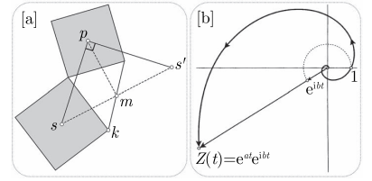

考虑平移变换 $ \mathcal{M} = \mathcal{R}_m^\pi \circ \mathcal{R}_p^{\pi / 2} \circ \mathcal{R}_s^{\pi / 2} $, 注意到 $ \mathcal{M}(k) = k $, 故 $ \mathcal{M} = \mathcal{E} $, 且
$$
\renewcommand{\cal}[1]{\mathcal#1}
\renewcommand{\scr}[1]{\mathscr#1}
\begin{align}
s' &:= \mathcal{R}_m^\pi (s)
= (\cal R_p^{\pi / 2} \circ \cal R_s^{\pi / 2}) (s)
= \cal R_p^{\pi / 2} (s),
\end{align}
$$
故 $m$ 是 $ ss' $ 的中点, 且 $ \triangle{sps'} $ 是以 $ ss' $ 为斜边的等腰直角三角形, 因此 $ sm = mp $.

