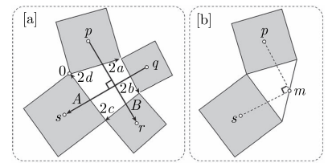

<h1 align="center">复分析-可视化方法</h1>

$$
% 设置
\newcommand{\aneg}[1]{\hspace{-0.75em}&#1&\hspace{-0.75em}}
\newcommand{\aneq}{\aneg{=}}
% 上述指令用于在使用 array 环境时调整等号左右间距
\newcommand{\eqs}{\quad\;}
% 上述指令用于 align 环境中, &= 的换行对齐时调整第二行位置
\renewcommand{\d}{\displaystyle}

% 字符
\renewcommand{\i}{\mathrm{i}}
\renewcommand{\j}{\mathrm{j}}
\newcommand{\e}{\textup{e}}
\newcommand{\ve}{\varepsilon}
\newcommand{\Beta}{\mathit{B}}
\newcommand{\omicron}{\mathit{o}}
\newcommand{\Omicron}{\mathit{O}}

\renewcommand{\cal}[1]{{\mathcal#1}}
\renewcommand{\scr}[1]{{\mathscr#1}}
\renewcommand{\frak}[1]{\mathfrak#1}

% 数集
\newcommand{\D}{\mathbb{D}}
\newcommand{\E}{\mathbb{E}}
\newcommand{\F}{\mathbb{F}}
\newcommand{\J}{\mathbb{J}}
\newcommand{\K}{\mathbb{K}}
\renewcommand{\L}{\mathbb{L}}

% 上下标
\newcommand{\trans}{^\mathrm{T}}
\newcommand{\inv}{^{-1}}
\newcommand{\madj}[1]{^{\pqty{#1^*}}}	% m 重伴随矩阵
\newcommand{\adj}{^*}
\newcommand{\vector}[1]{\overrightarrow{#1}}
\newcommand{\wavy}[1]{\overset\sim#1}	% \tilde 或 \widetilde 不明显, 容易与 \bar 或 \overline 混淆

% 序列
\newcommand{\ccdots}{\cdot\cdots\cdot}
\newcommand{\oneton}{1,2,\cdots,n}
\newcommand{\oneto}[1]{1,2,\cdots,#1}

\newcommand{\ssto}[3]{#1_1 #3 #1_2 #3 \cdots #3 #1_{#2}}
\newcommand{\ssup}[3]{#1^1 #3 #1^2 #3 \cdots #3 #1^{#2}}
\newcommand{\soneto}[2]{\ssto{#1}{#2}{,}}
\newcommand{\splus}[2]{\ssto{#1}{#2}{+}}

% 括号
\newcommand{\aqty}[1]{\expval{#1}}
\newcommand{\pbqty}[1]{\left(#1\right]}
\newcommand{\bpqty}[1]{\left[#1\right)}
\newcommand{\floor}[1]{\left\lfloor#1\right\rfloor}
\newcommand{\ceil}[1]{\left\lceil#1\right\rceil}

% 矩阵宏简写
\newcommand{\bmatrix}[1]{\begin{bmatrix}#1\end{bmatrix}}
\newcommand{\Bmatrix}[1]{\begin{Bmatrix}#1\end{Bmatrix}}
\newcommand{\vmatrix}[1]{\begin{vmatrix}#1\end{vmatrix}}
\newcommand{\Vmatrix}[1]{\begin{Vmatrix}#1\end{Vmatrix}}

% 常用微分
\newcommand{\dx}{\dd{x}}
\newcommand{\dy}{\dd{y}}
\newcommand{\dz}{\dd{z}}
\newcommand{\dt}{\dd{t}}
\newcommand{\ds}{\dd{s}}
\newcommand{\dr}{\dd{r}}

% 一般的微分
% 如果只使用 \dd{x}\dd{y} 的话, 中间会有多余的间隔.
\newcommand{\df}{\dd}
\newcommand{\ddf}[2]{\,\mathrm{d}#1\mathrm{d}#2}	% 微分形式 differential form
\newcommand{\dddf}[3]{\,\mathrm{d}#1\mathrm{d}#2\mathrm{d}#3}

% 高阶微分
\newcommand{\dxdy}{\ddf{x}{y}}
\newcommand{\dydz}{\ddf{y}{z}}
\newcommand{\dzdx}{\ddf{z}{x}}
\newcommand{\dudv}{\ddf{u}{v}}
\newcommand{\drdt}{\ddf{r}{\theta}}
\newcommand{\dxdydz}{\dddf{x}{y}{z}}

% 矩阵的宏指令
\newcommand{\pmcmn}[3]{\begin{pmatrix}
	#1_{11} & #1_{12} & \cdots & #1_{1#3} \\
	#1_{21} & #1_{22} & \cdots & #1_{n#3} \\
	\vdots & \vdots && \vdots \\
	#1_{#2 1} & #1_{#2 2} & \cdots & #2_{n#3} \\
\end{pmatrix}}

\newcommand{\pmc}[1]{\pmcmn{#1}{n}{n}}
\newcommand{\pvcn}[2]{\begin{pmatrix}
	#1_1 \\ #1_2 \\ \vdots \\ #1_{#2}
\end{pmatrix}}

\newcommand{\pvc}[1]{\pvcn{#1}{n}}
\newcommand{\pto}{\overset{P}{\to}}

% 函数名
\renewcommand{\char}{\operatorname{char}}	% 由于已存在此命令, 不可使用 DeclareMathOperator
\renewcommand{\r}{\operatorname{r}}
\DeclareMathOperator{\st}{s.t.\,}	% 虽然不是函数名, 但用了这个指令就放这儿了.
\DeclareMathOperator{\diag}{diag}	% 不需要定义太多, 一个文件里用到什么定义什么,
\DeclareMathOperator{\Ker}{Ker}		% 毕竟特殊的函数名太多太多了.
\DeclareMathOperator{\Aut}{Aut}		% 便捷与效率的权衡.
\DeclareMathOperator{\Inn}{Inn}
\DeclareMathOperator{\GL}{GL}
\DeclareMathOperator{\SL}{SL}
\DeclareMathOperator{\stab}{stab}
\DeclareMathOperator{\orb}{orb}
\DeclareMathOperator{\lcm}{lcm}
\DeclareMathOperator{\Var}{Var}
\DeclareMathOperator{\Cov}{Cov}
\DeclareMathOperator{\Corr}{Corr}
\DeclareMathOperator{\rot}{rot}
\DeclareMathOperator{\sgn}{sgn}
\renewcommand{\Re}{\operatorname{Re}}	% 自带 \Re 的效果是 \mathrm{Re}, 前后无空格, 故重写
\renewcommand{\Im}{\operatorname{Im}}

\def\arsh{\ensuremath{\operatorname{arsh}}}
\def\arch{\ensuremath{\operatorname{arch}}}
\def\arth{\ensuremath{\operatorname{arth}}}

% 运算符
% 可以用 \bigcap, \bigcup, \bigoplus, \bigotimes 替代
\newcommand{\capop}{\displaystyle\mathop\cap\limits}
\newcommand{\cupop}{\displaystyle\mathop\cup\limits}
\newcommand{\oplusop}{\mathop\oplus\limits}
\newcommand{\otimesop}{\mathop\otimes\limits}
\newcommand{\bigoplusop}{\mathop\bigoplus\limits}
\newcommand{\bigotimesop}{\mathop\bigotimes\limits}

% 积分
\newcommand{\dint}{\displaystyle\int}
\newcommand{\inti}{\dint_{-\infty}^{+\infty}}
\newcommand{\intoi}{\dint_0^{+\infty}}

\newcommand{\intl}{\displaystyle\int\limits}
\newcommand{\iintl}{\displaystyle\iint\limits}
\newcommand{\iiintl}{\displaystyle\iiint\limits}

% 求和
\newcommand{\dsum}{\displaystyle\sum}
\newcommand{\csum}[1]{\dsum_{#1=1}^\infty}
\newcommand{\nsum}{\csum{n}}
\newcommand{\ksum}{\csum{k}}
\newcommand{\nosum}{\dsum_{n=0}^\infty}
\newcommand{\insum}{\dsum_{i=1}^n}
\newcommand{\knsum}{\dsum_{k=1}^n}

% 求积
\newcommand{\dprod}{\displaystyle\prod}
\newcommand{\nprod}{\dprod_{n=1}^\infty}
\newcommand{\noprod}{\dprod_{n=0}^\infty}
\newcommand{\inprod}{\dprod_{i=1}^n}

% 极限
\newcommand{\liml}{\lim\limits}
\newcommand{\ulim}{\overline\lim\limits_{n\to\infty}}
\newcommand{\dlim}{\underline\lim\limits_{n\to\infty}}
% 注意这里的 d 是 down, 而不是 displaystyle

\newcommand{\xlim}{\lim\limits_{x\to x_0}}
\newcommand{\nlim}{\lim\limits_{n\to\infty}}
\newcommand{\clim}[1]{\lim\limits_{#1\to\infty}}

% 差分
\newcommand{\DD}{\Delta}
\newcommand{\DV}[2]{\dfrac{\DD#1}{\DD#2}}
\newcommand{\nDV}[3]{\dfrac{\DD^{#1}#2}{\DD#3^{#1}}}

% 求导
\newcommand{\ddv}{\displaystyle\dv}
\newcommand{\dpdv}{\displaystyle\pdv}

% 缩写
\newcommand{\bm}[1]{\boldsymbol{#1}}
\newcommand{\LRA}{\Leftrightarrow}
\newcommand{\RLA}{\Leftrightarrow}
\newcommand{\LA}{\Leftarrow}
\newcommand{\RA}{\Rightarrow}

\newcommand{\lra}{\leftrightarrow}
\newcommand{\rla}{\leftrightarrow}
\newcommand{\la}{\leftarrow}
\newcommand{\ra}{\rightarrow}

\newcommand{\QRLA}{\quad\RLA\quad}
\newcommand{\QRA}{\quad\RA\quad}
\newcommand{\LLRA}{\Longleftrightarrow}

\newcommand{\QNRA}{\quad\nRightarrow\quad}
\newcommand{\qnra}{\quad\nrightarrow\quad}

% 图形符号
\newcommand{\qed}{\quad\square}
\renewcommand{\parallel}{\mathrel{/\mskip-2.5mu/}}
\newcommand{\paralleleq}{\hspace{0.5em}{^{^{\parallel}}}\hspace{-1.04em}=}
\newcommand{\rt}{\matrm{Rt}\triangle}
$$

[TOC]

## 第 1 章	几何和复算术

### 1.1	复数的运算

- 复数加法: 平移变换.
- 复数乘法: 伸缩旋转.
  - 不用三角恒等式证明复数乘法的几何法则: 考虑变换 $ z \mapsto \i z $, 构造直角.

### 1.2	复数的变换

- **恒等变换**: $ \mathcal{E} (z) = z $.

- **平移变换**: $ \mathcal{T}_v (z) = z + v $.

  - 复合: $ \mathcal{T}_w \circ \mathcal{T}_v = \mathcal{T}_{w + v} $.
  - 逆元: $ \mathcal{T}_v\inv = \mathcal{T}_{-v} $.

- **旋转变换**: $ \mathcal{R}_a^\theta $.

  - 复合: $ \mathcal{R}_a^\phi \circ \mathcal{R}_a^\theta = \mathcal{R}_a^{\phi + \theta} $.

  - 逆元: $ (\mathcal{R}_a^\theta)\inv = \mathcal{R}_a^{-\theta} $.

  - 分解:

    - $ \mathcal{R}_a^\theta(z)
      = (\mathcal{T}_a \circ \mathcal{R}_0^\theta \circ \mathcal{T}_a\inv)(z)
      = \e^{\i \theta} (z - a) + a $.
    - $ \mathcal{R}_a^\theta
      = \cal T_k \circ \cal R_0^\theta $, 其中  $ k = a (1 -\e^{\i\theta}) $.

  - 复合:

    - $ \cal T_v \circ \cal R_a^\theta = \cal R_c^\theta $, 其中 $ c = a + \dfrac{v}{1 - \e^{\i\theta}} $.

    - $ \cal R_a^\theta \circ \cal T_v = \cal R_c^\theta $, 其中 $ c = a + \dfrac{v \e^{\i\theta}}{1 - \e^{\i\theta}} $.

    - $ (\cal R_b^\beta \circ \cal R_a^\alpha)(z) = \e^{\i (\alpha + \beta)} z + a (1 - \e^{\i\alpha}) \e^{\i \beta} + b(1 - \e^{\i\beta}) $.

      - 当 $ \alpha + \beta \ne 2k\pi $ 时, $ \cal R_b^\beta \circ \cal R_a^\alpha = \cal R_c^{\alpha + \beta} $, 其中 $ c = \dfrac{a (1 - \e^{\i\alpha}) \e^{\i \beta} + b(1 - \e^{\i\beta})}{1 - \e^{\i (\alpha + \beta)}} $.
      - 当 $ \alpha + \beta = 2k\pi $ 时, $ \cal R_b^\beta \circ \cal R_a^\alpha(z) = \cal T_k $. 其中 $ k = (b - a) (1 - \e^{\i\beta}) $.

      上式可推广至 n 次旋转的组合, 不再赘述.

- **反射变换**: $ \frak R_L $. (非分式线性变换)

  - 逆元: $ \frak R_L\inv = \frak R_L $.
  - 复合
    - 若 $ L_1 $ 与 $L_2$ 交于点 $O$, 夹角为 $ \phi $, 则 $ \frak R_{L_2} \circ \frak R_{L_1} = \cal R_o^{2\phi} $.
    - 若 $ L_1 $ 与 $L_2$ 平行, 由 $L_1$ 垂直连接到 $L_2$ 的向量为 $V$, 则 $ \frak R_{L_2} \circ \frak R_{L_1} = \cal T_{2V} $.
  - 对合 (自逆): $ \frak R_L \circ \frak R_L = \cal E $.

- **中心伸缩 (位似变换)**: $ \cal D_a^r %= \cal D_a^{r, 0} $.

- **伸缩旋转**: $ \cal D_a^{r, \theta} \equiv \cal R_a^\theta \circ \cal D_a^r \equiv \cal D_a^r \circ \cal R_a^\theta $.

  - 复合: $ \cal D_o^{R, \phi} \circ \cal D_o^{r, \theta} = \cal D_o^{r, \theta} \circ \cal D_o^{R, \phi} = \cal D_o^{Rr, \theta + \phi} $.
  - 逆元: $ (\cal D_a^{r, \theta})\inv = \cal D_a^{1 / r, -\theta} $.

  - 分解
    - $ \cal D_a^{r, \theta}(z) = (\cal T_a \circ \cal D_o^{r, \theta} \circ \cal T_a\inv) (z) = r\e^{\i\theta} (z - a) + a $.
    - $ \cal D_a^{r, \theta} = \cal T_k \circ \cal D_o^{r, \theta} $, 其中 $ k = a (1 - r\e^{\i\theta}) $.

  - 复合
    - $ (\cal D_b^{R, \beta} \circ \cal D_a^{r, \alpha})(z) = Rr \e^{\i(\alpha + \beta)} + a(1 - r\e^{\i\alpha}) \e^{\i\beta} + b(1 - R\e^{\i\beta}) $.
      - 当 $ r\e^{\i(\alpha + \beta)} \ne 0 $ 时, $ \cal D_b^{R, \beta} \circ \cal D_a^{r, \alpha} = \cal D_c^{Rr, \alpha + \beta} $, 其中 $ c = \dfrac{a (1 - r\e^{\i\alpha}) R\e^{\i \beta} + b(1 - R\e^{\i\beta})}{1 - Rr\e^{\i (\alpha + \beta)}} $.
      - 当 $ r\e^{\i(\alpha + \beta)} = 0 $ 时, $ \cal D_b^{R, \beta} \circ \cal D_a^{r, \alpha} = \cal T_k $, 其中 $ k = a(\e^{\i\beta} - r) + b(1 - R\e^{\i\beta}) $.

- [几何反演](# 3.2.2	几何反演)

### 1.3	复数的应用

#### 1.3.1	三角

- $ \cos n\theta = \Re{(\e^{\i \theta})^n} %,\, \sin n\theta = \Im{(\e^{\i \theta})^n} $, 从而可以用 $ \cos\theta,\, \sin\theta $ 表示.

- $ \cos^n \theta = \pqty{\dfrac{\e^{\i\theta} + \e^{-\i\theta}}{2}}^n $, 从而可以用 $ \cos k\theta,\, \sin k\theta $ 表示.

- $ \tan n\theta = \dfrac{\Im{(1 + \i\tan\theta)^n}}{\Re{(1 + \i\tan\theta)^n}} $, 从而可以用 $ \tan\theta $ 表示.

  也可以用欧拉公式求出正余弦的 $ n $ 倍角公式, 再推得正切的.

#### 1.3.2	几何

**Thebault 第一问题**: 在任意一个四边形的四个边上各做一个正方形, 则连接相对的正方形中心的线段互相垂直等长.

    

        
证法一 (复数法)
        

        <iframe src="ifsrc\1.3.3 证法一.html" height=300></iframe>
    

    

        
证法二 (变换法)
        

        <iframe src="ifsrc\1.3.3 证法二.html" height=600></iframe>
    

#### 1.3.3	求导

由 $ \ddv[n]{t} \e^{(a + \i b) t}
= (a + \i b)^n \e^{(a + \i b) t} $ 得,

- $ \ddv[n]{t} \pqty{
  	\e^{at} \sin bt
  } = (a^2 + b^2)^{\tfrac{n}{2}}
  \e^{at} \sin\pqty{
  	bt + n \arctan\dfrac{b}{a}
  } $.
- $ \ddv[n]{t} \pqty{
  	\e^{at} \cos bt
  } = (a^2 + b^2)^{\tfrac{n}{2}}
  \e^{at} \cos\pqty{
  	bt + n \arctan\dfrac{b}{a}
  }  $.

#### 1.3.4	代数

    

        
实系数多项式可以分解为实线性因式和实二次因式.
        

        <iframe src="ifsrc\1.3.4 实系数多项式因式分解.html" height=270></iframe>
    

若两个整数可写成两个平方之和, 则其积亦然, 因为
$$
\vqty{(a + \i b) (c + \i d)}^2
% = (a^2 + b^2) (c^2 + d^2)
= \vqty{(ac - bd) + \i (ad + bc)}.
$$

#### 1.3.5	向量

- $ \bm a \cdot \bm b := \vqty{a} \cdot \vqty{b} \cos \theta $.
- $ \bm a \cp \bm b := \vqty{a} \cdot \vqty{b} \sin\theta = -(\bm b \cp \bm a) $.
- $ \overline a b = \bm a \cdot \bm b + \i (\bm a \cp \bm b) $.

**高斯系鞋带定理**: 记任意的 $n$ 边形各个顶点为 $ a_i,\, i = \oneton $, 并且令 $ a_{n+1} = a_1 $, 则其面积为
$$
\begin{align}
\cal A &= \sum_{i=1}^n \dfrac{\bm a_i \cp \bm a_{i+1}}{2}
= \Im \insum \dfrac{\overline a_i a_{i+1}}{2}
= \insum \dfrac{x_i y_{i+1} - x_{i+1} y_i}{2}.
\end{align}
$$

### 1.4	变换与几何

- **运动**: 运动就是平面到其自身的一个映射且使任两点 $ A, B $ 的距离与其象 $ A' = \cal M(A) $, $ B' = \cal M(B) $ 的距离相等.

  - 满足群的条件: 封闭性, 结合律, 幺元 (恒等变换), 逆元.
  - 分类: 保向运动, 反向运动.
  - 性质
    - 一个运动可以由它对任意三角形（即任意三个非共线的点）的 效果唯一确定.
    - 恰好存在一个保向运动 $ M $（以及恰好一个反向运动 $ \widetilde M $）将一 已给线段 $AB$ 映为另一个等长线段 $A'B'$. 此外, $ \widetilde M $ 即（M 再继以对 $A'B'$ 的一个反射）.
    - 每个保向运动都可以表示为 $ \cal M(z) = \e^{\i \theta} z + v $.

- **全等**: 如果存在一个运动 $ \cal M $, 使得 $ F' = \cal M(F) $, 就说 $ F $ 全等于 $ F' $, 记作 $ F \cong F' $.

  - 满足等价关系： 反身性, 对称性, 传递性.

- **三反射定理**

  - 每个保向运动均为两个反射的复合,
  - 每个反向运动均为三个反射的复合.
  - 推论: 一串反射的逆就是把这些反射以相反的次序再做一次.

- **相似**: 把一平面映至自身且保持距离之比的映射.

  几何学就是研究运动的集合的不变式 (不变量). ——克莱因

  - 任一相似必可分解为 $ \cal S^r = \cal M \circ \cal D_p^r $.

  - 分类: 保向相似, 反向相似.

  - 每个保向相似都是一个伸缩旋转, 其特例是平移 (以无穷远点为旋转中心).

    一组平行线交于同一无穷远点, 所有平行线对应的无穷远点构成无穷远线.

  - 每个保向的相似变换均可表示为 $ \cal{S}^r(z) = r\e^{\i\theta} z + v $, 或 $ \cal S^r(z) = A z + B $.

- 空间复数

  - 空间中的每一个保向相似变换均为一伸缩旋转与沿旋转轴的平移的复合.
  - 空间中的旋转是非交换的.

### 1.5	多项式方程

#### 1.5.2	二次方程

**思路一**: 配方法

对于 $ ax^2 + bx + c = 0 $, 有 $ \pqty{x + \dfrac{b}{2a}}^2 = \dfrac{b^2 - 4ac}{4a} $, 于是 $ x_1, x_2 = \dfrac{-b \pm \sqrt{b^2 - 4ac}}{2a} $.

---

**思路二**: 韦达定理

对于 $ x^2 - \sigma_1 x + \sigma_2 = 0 $, 令 $ \delta = x_1 - x_2 $, 则有
$$
\begin{cases}
	x_1 + x_2 = \sigma_1, \\
	(x_1 - x_2)^2 = \sigma_1^2 - 4 \sigma_2.
\end{cases}
$$
解之即得 $ x_1, x_2 $.

---

**判别法则**

由思路一, 令 $ \Delta = b^2 - 4ac $, 则有

- 当 $ \Delta < 0 $ 时, 有两个共轭复根.
- 当 $ \Delta = 0 $ 时, 有一个二重实根.
- 当 $ \Delta > 0 $ 时, 有两个一重实根.

#### 1.5.3	三次方程

对于 $ ax^3 + bx^2 + cx + d = 0 $, 令 $ t = x + \dfrac{b}{3a} $ 即可化为 $ t^3 + Bt + C = 0 $.

方便起见, 下面只研究 $ x^3 = 3px + 2q $. 习惯上, 令 $ \omega_n = \e^\tfrac{2\pi\i}{n} $, $ \omega = \omega_3 $.

**思路一**: 变量代换

1. 令 $ x_0 = s + t $, 则当 $ st = p $ 且 $ s^3 + t^3 = 2q $ 时, 此 $x_0$ 为三次方程之根.
2. 解得 $ s^3, t^3 = q \pm \sqrt{q^2 - p^3} $, 从而求出三次方程的三根: $ \begin{cases}
   	x_0 = s + t, \\
   	x_1 = \omega s + \omega^2 t, \\
   	x_2 = \omega^2 s + \omega t.
   \end{cases} $ 

---

**思路二**: 三角换元

1. 代入 $ x = 2\sqrt p \cos\theta $, 即得 $ 4\cos^3\theta - 3 \cos\theta = \cos 3\theta = \dfrac{q}{p\sqrt p} $.
2. 于是 $ x = 2\sqrt p \cos\dfrac{\phi + 2k\pi}{3} $, 其中 $ \phi = \arccos\cfrac{q}{p\sqrt p} $.

**注**: 思路一和思路二的公式本质上是一样的, 其中 $ \arg s^3 = \phi,\, \vqty{s^3} = p \sqrt p $.

---

**思路三**: 减少对称 $ S_3 \to C_3 \to \Bqty{e} $ 

对于 $ x^3 - \sigma_1 x^3 + \sigma_2 x - \sigma_3 = 0 $, 其中 $ \sigma_k $ 为初等对称多项式, 令
$$
\begin{cases}
	X_1 = (x_1 + \omega x_2 + \omega^2 x_3)^3, \\
	X_2 = (x_1 + \omega^2 x_2 + \omega x_3)^3.
\end{cases}
$$
则 $ X_1 $ 和 $ X_2 $ 都是轮换对称多项式, 且
$$
\begin{cases}
	X_1 + X_2 = 2\sigma_1^3 - 9\sigma_1 \sigma_2 + 27\sigma_3, \\
	X_1 \cdot X_2 = (\sigma_1^2 - 3\sigma_2)^3
\end{cases}
\hspace{2em}
\begin{cases}
	x_1 + \omega x_2 + \omega^2 x_3 = \sqrt[3]{X_1}, \\
	x_1 + \omega^2 x_2 + \omega x_3 = \sqrt[3]{X_2}, \\
	x_1 + x_2 + x_3 = \sigma_1.
\end{cases}
$$
解之即得 $ x_1, x_2, x_3 $.

---

**判别法则**

结合思路一与思路二可得, 对于实系数三次方程,

- 当 $ 0 \le q^2 < p^3 $ 时, 有三个不等实根.
- 当 $ q^2 = p^3 \ne 0 $ 时, 有三个实根, 其中两个相等.
- 当 $ q = p = 0 $ 时, 有三个相等的实根.
- 当 $ 0 \le p^3 < q^2 $ 时, 有一个实根, 两个共轭虚根.

#### 1.5.3	四次方程

**思路一**: 费拉里法

对于 $ x^4 + bx^3 + cx^2 + dx + e = 0 $, 先消去三次项再配方, 则等价于
$$
\pqty{
	x^2 + \dfrac{1}{2} b x + y
}^2 = \pqty{
	\dfrac{1}{4} b^2 - c + 2y
} x^2 + \pqty{
	\dfrac{1}{2} by - d
} x + y^2 - e,
$$
令右式关于 $x$ 的判别式为零, 即解关于 $y$ 的三次方程, 即得关于 $x$ 的两个二次方程, 解之即得原方程的四个根.

---

**思路二**: 欧拉解法

消去三次项, 并将 $ x^4 + cx^2 + dx + e = 0 $ 因式分解为
$$
(x^2 + p_1 x + q_1) (x^2 + p_2 x + q_2) = 0,
$$
待定系数法解三次方程即得上述系数, 从而得四次方程的四根.

---

**思路三**: 变量代换

对于 $ x^4 + cx^2 + dx + e = 0 $, 作 $ x = u + v + w $, 则当
$$
\begin{cases}
	u^2 + v^2 + w^2 = -\dfrac{c}{2}, \\
	u^2 v^2 + v^2 w^2 + w^2 u^2 = \dfrac{c^2 - 4e}{16},
	\\
	uvw = -\dfrac{q}{8}.
\end{cases}
$$
时, 等式成立, 并且上述方程组的解即三次方程的解. 于是解 $ u, v, w $ 即得 $x$.

---

**思路四**: 减少对称 $ S_4 \to D_2 \to \Bqty{e} $ 

对于 $ x^4 - \sigma_1 x^3 + \sigma_2 x^2 - \sigma_3 x + \sigma_4 = 0 $, 其中 $ \sigma_k $ 为初等对称多项式,
$$
\begin{cases}
	W_1 := x_1 x_2 + x_3 x_4, \\
	W_2 := x_1 x_3 + x_2 x_4, \\
	W_3 := x_1 x_4 + x_2 x_3. \\
\end{cases}
\QRA
\begin{cases}
	h_1 := W_1 + W_2 + W_3 = \sigma_2, \\
	h_2 := W_1 W_2 + W_2 W_3 + W_3 W_1 = \sigma_1 \sigma_3 - 4\sigma_4, \\
	h_3 := W_1 W_2 W_3 = \sigma_1^2 \sigma_4 + \sigma_3^2 - 4 \sigma_2 \sigma_4.
\end{cases}
$$
$ W_1, W_2, W_3 $ 即为 $ W^3 - h_1 W^2 + h_2 W - h_3 = 0 $ 的解, 于是有
$$
\begin{array}{l}
	\begin{cases}
		(x_1 x_2) + (x_3 x_4) = W_1, \\
		(x_1 x_2) (x_3 x_4) = \sigma_4, \\
	\end{cases}
	\\
	\begin{cases}
		(x_1 + x_2) + (x_3 + x_4) = \sigma_1, \\
		(x_1 + x_2) (x_3 + x_4) = W_2 + W_3, \\
	\end{cases}
\end{array}
\QRA
\begin{array}{l}
	\begin{cases}
		x_1 x_2, \\
		x_1 + x_2.
	\end{cases}
	\\
	\begin{cases}
		x_3 x_4, \\
		x_3 + x_4.
	\end{cases}
\end{array}
\QRA
\begin{cases}
	x_1, \\ x_2, \\ x_3, \\ x_4.
\end{cases}
$$

---

**判别法则**

对于 $ ax^4 + 4bx^3 + 6cx^2 + 4dx + e = 0 $, 令:
$$
\begin{align}
& H=b^2-a c, I=a e-4 b d+3 c^2, \\
& G=a^2 d-3 a b c+2 b^3, J=\frac{4 H^3-a^2 H I-G^2}{a^3}, \\
& \Delta=I^3-27 J^2, \delta=12 H^2-a^2 I.
\end{align}
$$
那么有如下根的判别法则:

- 若 $\Delta<0$ ，则方程有两个互异实根和一对共轭虚根。
- 若 $\Delta>0, \delta>0, H>0$ ，则方程有四个互异实根。
- 若 $\Delta>0, H \leqslant 0$ 或 $\delta<0$ ，则方程有两对互异的共轭虚根。
- 若 $\Delta=0, I \cdot J \neq 0, \delta>0, H>0$ ，则方程有一个两重实根和两个单重实根。
- 若 $\Delta=0, I \cdot J \neq 0, H \leqslant 0$ 或 $\delta<0$ ，则方程有一个两重实根和一对共轭虚根。
- 若 $G \neq 0, I=J=0$ ，则方程有一个三重实根和一个单重实根。
- 若 $G=\delta=0, H>0$ ，则方程有两个互异的两重实根。
- 若 $G=\delta=0, H<0$ ，则方程有一对两重共轭虚根。
- 若 $H=I=G=0$ ，则方程有一个四重实根。

## 第 2 章	作为变换的复函数

- 图像的描述
  - 至象平面的几何变换.
  - 向量场.
  - 黎曼曲面.
  - 模曲面.
- **卡西尼曲线**: 到两点距离乘积为常数的曲线.
  - 映射 $ z \mapsto w = Q(z) = (z - a_1)(z - a_2) + c $ 将卡西尼曲线族映为同心圆.
  - 特例: **伯努利双纽线**: $ r^2 = 2\cos 2\theta $.
  - 与 **帕修斯螺旋截线** 相同.

    <button id="btn-k4kffjta">
        点击查看 Geogebra 图像
    </button>
    &emsp;或直接打开<a href="https://www.geogebra.org/calculator/k4kffjta">网页链接</a>
    <iframe src="" width="800" height="0" allowfullscreen style="border: 1px solid #e4e4e4;border-radius: 4px;" frameborder="0" id="ifm-k4kffjta"></iframe>
    

- 余弦函数的图像
  - $ y = -c $ 在映射 $ z \mapsto \cos z $ 下变成椭圆 $ (a\cos t, b \sin t) $, 其中 $ a = \cosh c,\, b = \sinh c $, 并且焦点的模 $ \sqrt{a^2 - b^2} = 1 $.
  - $ x = c $ 在映射 $ z \mapsto \cos z $ 下变成双曲线.
- 多值函数
  - 若 $z$ 至少绕 $q$ 转 $N$ 圈才能第一次重回 $ f(z) $, 则 $q$ 称为 $ n - 1 $ 阶**代数支点**. 一阶代数支点称为简单支点. 如果无论绕多少周, 也无法重回原来的值, 则称为**对数支点**.

---

- 概念
  - 质心 $ Z = \dfrac{\sum m_i z_i}{\sum m_i} $.
    - 若 $ Z $ 为 $ \Bqty{z_j} $ 的质心, 则 $ \Bqty{az_j + b} $ 的质心是 $ aZ + b $.
    - 质心 $Z$ 必位于凸包 $H$ 的内域.
  - 形心 $ Z = \dfrac{1}{n} \insum z_i $
    - $ \insum (z_i - Z) = 0 $.
  - 函数 $ f(z) $ 在 $n$ 个点的集合 $ \Bqty{z_i} $ 上的平均值记作 $ \aqty{f(z)}_n = \dfrac{1}{n} \insum f(z_i) $.
- **在正多边形上求平均**: 若 $ n > m > 0 $, 以 $k$ 为中心的正 $n$ 边形顶点为 $ \Bqty{z_i} $, 则 $ \aqty{P_m(z)}_n = P_m(k) $.
- **在圆周上平均值**: 一个任意次多项式在圆周 $C$ 上的平均值都等于它在 $C$ 的中心 处的值.
- **高斯平均值定理**: 若 $ f(z) $ 可表示为一幂级数, 且一个以 $k$ 为中心, $R$ 为半径的圆周 $C$ 位于次幂级数的收敛圆盘内, 则 $ \aqty{f(z)}_C = \dfrac{1}{2\pi} \dint_0^{2\pi} f(k + R\e^{\i\theta}) \dd{\theta} = f(k) $.
  - 例: $ \dint_0^{2\pi} \e^{\cos \theta} \cos\sin\theta \dd{\theta} = 2\pi $.

## 第 3 章	莫比乌斯变换和反演

### 3.2	反演

#### 3.2.1	复反演

- 复反演 $ w = 1 / z %\dfrac{1}{z} $ 的分解
  - 几何反演 (反演) $ \cal I_C(z) = 1 / \overline z %\dfrac{1}{\overline z} $.
  - 复共轭 (实轴反射) $ \frak R_L(z) = \overline z $.
- 分解与次序无关.

#### 3.2.2	几何反演

几何反演 $ \cal I_K $ 又简称反演.
- 反演公式
  - $ \mathcal{I}_K $ 表示对任意圆周 $ K: \vqty{z - q} = R $ 的反演.
  - 由定义, $ (\wavy z - q)\overline{(z - q)} = R^2 $.
  - 解之得, $ \mathcal{I}_K(z) = \dfrac{R^2}{\overline z- \overline q} + q $.

- 基本性质
  - 将平面分成两个分支.
  - 分支边界的点为不动点.
  - 对合性 (自逆性): $ \cal I_K \circ \cal I_K = \cal E $.
- 几何性质
  - 相似 $ \triangle aqb \sim \triangle \wavy b q \wavy a $.
  - 象距 $ \bqty{\wavy a \wavy b} = \dfrac{R^2 \bqty{ab}}{\bqty{qa}\bqty{qb}} $.

#### 3.2.3	保持圆周

记圆 $K$ 的半径为 $R$, 原圆的半径为 $r$, 其圆心与 $ q$ 的距离为 $d$, 象圆的半径为 $ \wavy r $.
当原圆退化为直线时, 半径变为 $ \infty $, 圆心距 $ d $ 表示 $q$ 到直线的距离.

- 保持圆周

  - 若直线 $L$ 不经过 $K$ 的中心 $q$, 则

    - 它的反演是一个经过 $q$ 的圆周,
    - 象圆在 $q$ 的切线平行于 $ L $.
    - 象圆半径 $ \wavy r = \dfrac{R^2}{2d} $.

    

  - 若圆 $C$ 不经过 $K$ 的中心 $q$, 则

    - 它的反演是一个不经过 $q$ 的圆周.
    - 象圆 -> 原圆
      - $ r = \dfrac{R^2}{\vqty{d^2 - \widetilde r^2}} $.
      - $ \vqty{OK} = \dfrac{R^2d}{\vqty{d^2 - \tilde r^2}} $.
    
    - 原圆 -> 象圆
      - $ \wavy r = \dfrac{R^2}{\vqty{d^2 - r^2}} $.
      - $ \vqty{\widetilde OK} = \dfrac{R^2d}{\vqty{d^2 - r^2}} $.
    
    
    

- 映为自身
  - 若直线 $ L $ 经过 $K$ 的中心, 则 $ \cal I_K(L) = L $.
  - 若圆 $C$ 与 $K$ 正交, 则 $ \cal I_K(C) = C $.
- 注: 一个圆的圆心与其反演圆的圆心不反演.

#### 3.2.4	作反演点

- 利用极点极线

- 利用正交圆

  - $z$ 对 $K$ 的反演 $ \wavy z $ 是任意两个过 $z$ 而正交于 $K$ 的圆周之另一交点.

  - 上述一正交圆可退化为过 $q$ 的直线.

    反射可用相同的作法作出.

    

#### 3.2.5	保持角度

- **共形映射**: 保持每一点角度的大小和符号.
  - 对于 $ \omega = \omega(t) = f(z(t)) $, 只要 $ z'(t) \ne 0,\, f'(z) \ne 0 $, 就是共形映射.
  - 偶数个反射 (反演) 的复合是共形映射.
- **反共形映射**: 保持每一点角度的大小, 但符号相反.
  - 反射和反演都是反共形映射.
  - 奇数个反射 (反演) 的复合是反共形映射.
- **等角映射**: 保持每一点角度的大小, 但符号未知.

#### 3.2.6	保持对称性

- 对直线的反射能保持对直线的对称性.

- 对圆周的反射能保持对圆周的对称性.

  因为反演映任一对正交圆周为另一对正交圆周.

#### 3.2.7	球面反演

旋转 3.2.3 中的图像, 即得球面的结论:

- 球面反演具有对合性.
- 球面反演保持球面 (球面与平面).
- 球面反演保持圆周 (圆与线).
- 球面反演具有对称性 (反射反演与线性变换).
- 正交球面反演为正交球面.

### 3.3	反演的应用

#### 3.3.1	相切圆问题

如图, 由反演知:

- $ \Bqty{C_i} $ 的切点共圆, 且该圆与 $A$ 和 $B$ 切于点 $q$.
- 设 $ C_n $ 的半径为 $r_n$, 则其圆心离 $L$ 的高度为 $ 2nr_n $.

#### 3.3.2	正交对角线

如果一个四边形对角线正交于点 $q$, 并将 $q$ 对四边分别做反射, 则反射点四点共圆.

如图, 对角线正交, 故相邻蓝圆正交, 将被映为正交直线, 且平行于原四边形的对角线.

#### 3.3.3	托勒密定理

证法一: 构造相似.

证法二: 复数运算.

证法三: 利用交比.

证法四: 利用反演.

这里使用反演进行证明:

如图, 对以 $a$ 为中心的一圆周做反演, 则有
$$
\begin{align}
\bqty{\wavy b \wavy d}
&= \bqty{\wavy b \wavy c} + \bqty{\wavy c \wavy d}
\\
\dfrac{\bqty{bd}}{\bqty{ab} \bqty{ad}}
&= \dfrac{\bqty{bc}}{\bqty{ab} \bqty{ac}} +
\dfrac{\bqty{cd}}{\bqty{ac} \bqty{ad}}
\\
\bqty{ac} \bqty{bd}
&= \bqty{bc} \bqty{ad} +
\bqty{ab} \bqty{cd}
\end{align}
$$

#### 3.3.4	阿波罗尼奥斯定理

> 对于给定的三个两两相切 (但不公切于一点) 的圆 $C_1, C_2, C_3$, 恰好存在两个圆与 $C_1, C_2, C_3$ 均相切.

**证明**	对以 $C_2$ 与 $C_3$ 的切点为圆心的一圆做反演, 则 $C_2$ 与 $C_3$ 变为平行线, 易找到两圆与之均相交, 从而得证.

#### 3.3.5	笛卡尔定理

> 假设四个两两相切的圆 $C_1,C_2,C_3,C_4$ 的有向曲率分别为 $k_1,k_2,k_3,k_4$, 则它们满足关系:
> $$
> (k_1 + k_2 + k_3 + k_4)^2 = 2(k_1^2 + k_2^2 + k_3^2 + k_4^2).
> $$

**备注**

- 曲率大小为曲率圆半径的倒数 $ \vqty{k} = \dfrac{1}{r} $.
- 如果两圆外切, 则二者曲率符号相同, 如果内切, 则相反.

**证明**	同阿波罗尼奥斯定理思路, 利用解析几何代入[反演圆的半径公式](# 3.2.3	保持圆周)即得.

#### 3.3.6	阿波罗尼奥斯垫

- *阿波罗尼奥斯垫*

  - 如给定圆 $ C_1, C_2, C_3 $ 及其曲率 $ k_1, k_2, k_3 $, 则可生成相切的序列
    $$
    \cdots, C_{-2}, C_{-1}, C_0, C_1, C_2, C_3, C_4, \cdots \\
    \cdots, k_{-2}, k_{-1}, k_0, k_1, k_2, k_3, k_4, \cdots \\
    $$

  - 其中由笛卡尔定理得
    $$
    x^2 - [2(k_{n+1} + k_{n+2} + k_{n+3})] x + [2(k_{n+1}^2 + k_{n+2}^2 + k_{n+3}^2) - (k_{n+1} + k_{n+2} + k_{n+3})^2] = 0
    $$

- *阿波罗尼奥斯整垫*

  - 由笛卡尔定理与韦达定理得
    $$
    k_{n} + k_{n+4} = 2(k_{n+1} + k_{n+2} + k_{n+3})
    $$

  - 若 $ k_1, k_2, k_3, k_4 $ 都是整数, 则<u>所有圆的曲率都是整数</u>, 此时称为阿波罗尼奥斯整垫 (Integral Apollonian Gasket).

- [相切圆问题](3.3.1	相切圆问题)

  - 若给定的 $ k_1, k_2, k_3 $ 使得 $k_4$ 的两根相等, 则退化为之前的相切圆问题.
  - 反之, 给定任意两个相切的圆, 可以作出其外公切圆, 使三圆直径共线, 从而得到相切圆问题.

- 黄金分割比

  - 由上述四阶线性递推公式知, 当 $ n \to \infty $ 或 $ -\infty $ 时 $ k_n $ 收敛.

  - 令 $ \varphi = \dfrac{\sqrt5-1}{2} $, 则由 $ 1 + \alpha^4 = 2(\alpha + \alpha^2 + \alpha^3) $ 得:
    $$
    \alpha_{1, 2} = \varphi \pm \sqrt \varphi,\quad
    \alpha_{3, 4} = -\dfrac{1}{\varphi} \pm \i \sqrt{\dfrac{1}{\varphi}}.
    $$
    其中前两根互为倒数, 后两根模为 1.

  - 于是得相邻两项之比为
    $$
    \liml_{n \to +\infty} \dfrac{k_{n+1}}{k_n} = \varphi + \sqrt \varphi,\quad
    \liml_{n \to -\infty} \dfrac{k_{n+1}}{k_n} = \varphi - \sqrt \varphi.
    $$

#### 3.3.7	复笛卡尔定理

> 若复平面内四个两两相切的圆 $C_1,C_2,C_3,C_4$ 的有向曲率分别为 $k_1,k_2,k_3,k_4$, 圆心分别为 $ z_1, z_2, z_3, z_4 $, 则它们满足关系
> $$
> (k_1 z_1 + k_2 z_2 + k_3 z_3 + k_4 z_4)^2
> = 2 (k_1^2 z_1^2 + k_2^2 z_2^2 + k_3^2 z_3^2 + k_4^2 z_4^2).
> $$

**证明**	与笛卡尔定理的思路相同, 解析剥蒜即可.

- 在莫比乌斯线性变换下, 上式仍然成立.

#### 3.3.8	Soddy-Gosset 定理

> 若在 $ n\ (\ge 2) $ 维欧氏空间中有 $ (n + 2) $ 个两两相切且切点各异的 $ (n - 1) $ 维球面, 则它们的有向曲率 $ k_1, k_2, \cdots, k_{n+2} $ 满足关系:
> $$
> \pqty{
> 	\dsum_{i=1}^{n+2} k_i
> }^2 = n \dsum_{i=1}^{n+2} k_i^2.
> $$

**证明**	与二维的笛卡尔定理的思路相同, 解析剥蒜即可.

### 3.4	黎曼球面

#### 3.4.1	基本性质

- 复平面上直线的球极象
  - 即黎曼球面 $ \sum $ 上经过 $ N = \infty $ 的圆周,
  - 并且此圆周在 $N$ 的切线与原直线平行.
  - 因此, 若从球内观察球面上角的方向, 那么球极射影是共形的.
- 黎曼球面与复平面是[球面反演](# 3.2.7	球面反演)的, 因此球极射影保持圆周.

#### 3.4.2	诱导映射

- 由 $ z \mapsto w $ **诱导**出 $\sum$ 上的映射 $ \hat z \mapsto \hat w $.
  - $ \C $ 上的复共轭 $ z \mapsto \overline z $ 诱导出黎曼球面上关于过实轴的纵向平面的反射.
  - $ \C $ 上的几何反演 $ z \mapsto 1 / \overline z $ 诱导出黎曼球面上关于赤道平面的反射.
  - $ \C $ 上的复反演 $ z \mapsto 1 / z $ 诱导出黎曼球面上绕实轴旋转 $ 180^\circ $ 的映射.
- $ z \mapsto w = z^n $ 是共形映射, 但有两个 **临界点** $ z = 0 $ 和 $ z = \infty $.

#### 3.4.3	球极射影公式

- $ \sum \to \C $:

  - $ z = \dfrac{X + \i Y}{1 - Z} $.
  - $ \vqty{z}^2 = \dfrac{1+Z}{1-Z} $.

- $ \C \to \sum $:

  - $ X + \i Y = \dfrac{2z}{1 + \vqty{z}^2} $.
  - $ X = \dfrac{z + \overline z}{1 + \vqty{z}^2} = \dfrac{2x}{1 + \vqty{z}^2} $.

  - $ Y = \dfrac{z - \overline z}{\i (1 + \vqty{z}^2)} = \dfrac{2y}{1 + \vqty{z}^2} $.

  - $ Z = \dfrac{\vqty{z}^2 - 1}{\vqty{z}^2 + 1} $.

- 二维球坐标

  - $ z = \cot\dfrac{\varphi}{2} \cdot \e^{\i\theta} $.
  - 若 $ \hat p $ 与 $ \hat q $ 是 $ \sum $ 的*对径点*, 则 $ q = - 1 / \overline p = -\cal I_C(p) $.

### 3.5	默比乌斯变换

$$
M(z) = \dfrac{az + b}{cz + d}
= - \dfrac{ad - bc}{c^2} \dfrac{1}{z + \cfrac{d}{c}} + \dfrac{a}{c}.
$$

当 $ ad - bc = 0 $ 时退化为常值映射, 此时称为*奇异* 的. 以下只讨论非奇异映射.

#### 3.5.1	保持性质

- 换将圆周映为圆周.
- 默比乌斯变换是共形变换.
- 对称原理: 若两点关于一圆周对称, 则映象亦如此.
- 定向圆周: 映有定向的圆周 $C$ 为一有定向的圆周, 而且使 $C$ 左侧的区域被映到 $ \widetilde C $ 左侧的区域.

#### 3.5.2	系数特点

- 系数不唯一.
- 规范化: 即令 $ ad - bc = 1 $.
- 存在唯一的默比乌斯变换, 把任意 3 点变为任意 3 个其他点.

    

        
<b>证明</b>
        

        <iframe src="ifsrc\3.5.2 默比乌斯变换的存在性与唯一性.html" height=200></iframe>
    

#### 3.5.3	群性质

- 逆变换 $ M\inv(z) = \dfrac{dz - b}{-cz + a} $.
- 若 $M$ 规范化, 则由上式 $ M\inv $ 也是规范化的.
- 非奇异莫比乌斯变换的集合在复合下构成一个群.

#### 3.5.4	不动点

- 即方程 $ z = \dfrac{az + b}{cz + d} $ 的解.
- 规范化系数后, 解为 $ \xi_\pm = \dfrac{(a - d) \pm \sqrt{(a + d)^2 - 4}}{2c} $.
- 非恒等映射的莫比乌斯变化最多有两个不动点.

#### 3.5.5	无穷远处的不动点

当 $ c = 0 $ 时, 至少有一个不动点在无穷远处, 并且莫比乌斯变换退化为相似变换 $ M(z) = A z + B = \rho \e^{\i\alpha} z + B $.

- 椭圆型: $ z \mapsto \e^{\i\alpha} z $.
- 双曲型: $ z \mapsto \rho z $.
- 斜驶型: $ z \mapsto \rho\e^{\i\alpha} z $.
- 抛物型: $ \xi_+ = \xi_- $.
  - 如平移 $ M(z) = (z + b) $.

#### 3.5.6	交比

- 交比

  - 将 $ q, r, s $ 变为 $ 0, 1, \infty $ 的变换记为 $ M_{qrs}(z) = [z, q, r, s] $.
  - $ [z, q, r, s] = \dfrac{
    	(z - q) (r - s)
    }{
    	(z - s) (r - q)
    } $, 称为  $ z, q, r, s $ 的交比.

- 单比

  - $ [z, q, s] = \dfrac{z - q}{z - s} $.

  - $ [z, q, s] = [z, q, \infty, s] $.

  - $ [z, q, r, s] = \dfrac{[z, q, s]}{[r, q, s]} $.

- 变换

  - 将 $ q, r, s $ 变为 $ \tilde q, \tilde r, \tilde s $ 的唯一的默比乌斯变换 $ z \mapsto w = M(z) $ 由下式给出:
    $$
    \dfrac{
    	(w - \tilde q) (\tilde r - \tilde s)
    }{
    	(w - \tilde s) (\tilde r - \tilde q)
    } = [w, \tilde q, \tilde r, \tilde s]
    = [z, q, r, s] = \dfrac{
    	(z - q) (r - s)
    }{
    	(z - s) (r - q)
    }.
    $$

  - 若默比乌斯变换将 $ p, q, r, s $ 变为 $ \tilde p, \tilde q, \tilde r, \tilde s $, 则交比不变:
    $$
    [\tilde p, \tilde q, \tilde r, \tilde s]
    = [p, q, r, s].
    $$

  - 若交比相等, 则四点可用一个莫比乌斯变换映为另四点.

- 圆周

  - 交比 $ w = [z, q, r, s] $ 作为 $z$ 的莫比乌斯变换, 将过 $ q, r, s $ 的有定向圆周映为实轴.
  - 圆周内域被映为实轴以上的半平面.
  - 该圆周的方程为 $ \Im[p, q, r, s] = 0 $, 其中 $p$ 为变量.

### 3.6	莫比乌斯变换的矩阵

#### 3.6.1	矩阵与线性变换

- 习惯上, 用圆括号表示 $ \R^2 $ 或 $ \C $ 上的线性变换或坐标, 而方括号表示与 $ \C $ 上的默比乌斯变换对应的复矩阵或坐标.

- 对于 $ M(z) = \dfrac{az + b}{cz + d} $, 定义 $ [M] = \bmatrix{a & b \\ c & d} $.

  - $ [M\inv] = [M]\inv $.
  - $ \bqty{M_2} \bqty{M_1} = \bqty{M_2 \circ M_1} $.

- 莫比乌斯变换是 $ \C^2 $ 上的线性变换:
  $$
  \begin{bmatrix}
  	\frak z_1 \\
  	\frak z_2
  \end{bmatrix}
  \mapsto \begin{bmatrix}
  	\frak w_1 \\
  	\frak w_2
  \end{bmatrix}
  = \begin{bmatrix}
  	a & b \\
  	c & d
  \end{bmatrix}
  \begin{bmatrix}
  	\frak z_1 \\
  	\frak z_2
  \end{bmatrix}
  = \begin{bmatrix}
  	a \frak z_1 + b \frak z_2 \\
  	c \frak z_1 + d \frak z_2
  \end{bmatrix}.
  $$

#### 3.6.2	特征值与特征向量

- $ z = \dfrac{\frak z_1}{\frak z_2} $ 是 $ M(z) $ 的不动点, 当且仅当 $ \frak z = \bmatrix{\frak z_1 \\ \frak z_2} $ 为 $ [M] $ 的特征向量.

- 特征方程

  - $ \det\Bqty{[M] - \lambda[\cal E]} = 0 $.

  - $ \lambda^2 - (a + d) \lambda + 1 = 0 $.

  - $ \lambda_1 \lambda_2 = 1,\, \lambda_1 + \lambda_2 = a + d $.

    前者为行列式的值, 后者为迹.

  - $ \tr(\bm N \bm P) = \tr(\bm P \bm N) $.

#### 3.6.3	厄米特内积与正交

- 内积 $ \aqty{\bm{\frak p}, \bm{\frak q}}
  = \aqty{
  	\bmatrix{p_1 \\ p_2},
  	\bmatrix{q_1 \\ q_2}
  } = \overline{\bm{\frak p}} \cdot \bm{\frak q}
  = \overline p_1 q_1 + \overline p_2 q_2 $.

  在 $ \R^n $ 中的内积称为欧几里得内积, $ \C^n $ 中的内积称为厄米特内积.

  - $ \aqty{\bm{\frak p}, \bm{\frak p}} \ge 0 $, 而 $ \aqty{\bm{\frak p}, \bm{\frak p}} = 0 $ 当且仅当 $ \bm{\frak p}_1 = \bm{\frak p}_2 = 0 $.
  - $ \aqty{\bm{\frak p} + \bm{\frak q}, \bm{\frak r}} = \aqty{\bm{\frak p}, \bm{\frak r}} + \aqty{\bm{\frak q}, \bm{\frak r}} $,
    $ \aqty{\bm{\frak r}, \bm{\frak p} + \bm{\frak q}} = \aqty{\bm{\frak r}, \bm{\frak p}} + \aqty{\bm{\frak r}, \bm{\frak q}} $.
  - $ \aqty{\bm{\frak q}, \bm{\frak p}} = \overline{\aqty{\bm{\frak p}, \bm{\frak q}}} $.

- 正交

  - 当且仅当 $ \aqty{\bm{\frak{p}}, \bm{\frak{q}}} = \overline p_1 q_1 + \overline p_2 q_2 = 0 $.
  - 记 $ p = \dfrac{\frak p_1}{\frak p_2}, q = \dfrac{\frak q_1}{\frak q_2} $, 则正交当且仅当 $ q = -1 / \overline p $.
  - $ \C^2 $ 中的两个向量正交, 当且仅当它们是黎曼球面的两个对径点的齐次坐标.

#### 3.6.4	酉矩阵与旋转

- 旋转: 使内积不变, 即 $ \aqty{\bqty{\cal{R}} \bm{\frak{p}}, \bqty{\cal{R}} \bm{\frak{q}}} = \aqty{\bm{\frak{p}}, \bm{\frak{q}}} $.
- 共轭转置 $ \bm{\frak{p}}^* $.
  - $ \aqty{\bm{\frak{p}}, \bm{\frak{q}}} = \bm{\frak{p}}^* \bm{\frak{q}} $.
  - $ \Bqty{\bqty{\cal R}\bm{\frak{p}}}\adj = \bm p\adj \bqty{\cal R}\adj $.
- **酉矩阵**: $ \bqty{\cal R}\adj \bqty{\cal R} = \bqty{\cal E} $.
  - 旋转矩阵等价于酉矩阵.
  - 即 $ \bqty{\cal R}\adj = \bqty{\cal R} \inv $, 故 $ \bqty{\cal R} = \bmatrix{a & b \\ -\overline b & \overline a} $.
  - 故黎曼球面的一般旋转可表示为 $ R(z) = \dfrac{az + b}{-\overline b z + \overline a} $.

### 3.7	可视化与分类

